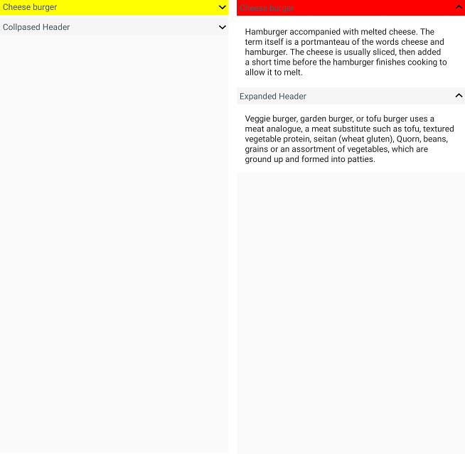

# Appearance

The Accordion allows customizing appearance of the Icon, and provides different functionalities to the end-user.

## Header icon position 

[SfAccordion](https://help.syncfusion.com/cr/cref_files/xamarin/Syncfusion.Expander.XForms~Syncfusion.XForms.Accordion.SfAccordion.html) allows to customize the position of the header icon in accordion item by using [HeaderIconPosition](https://help.syncfusion.com/cr/cref_files/xamarin/Syncfusion.Expander.XForms~Syncfusion.XForms.Accordion.SfAccordion~HeaderIconPosition.html) property. By default, the header Icon position is `End`.  



<syncfusion:SfAccordion x:Name="accordion" HeaderIconPosition="Start" />       


accordion.HeaderIconPosition = Syncfusion.XForms.Expander.IconPosition.Start;



## Header background color customization

[SfAccordion](https://help.syncfusion.com/cr/cref_files/xamarin/Syncfusion.Expander.XForms~Syncfusion.XForms.Accordion.SfAccordion.html) allows to customize the background color of the expander header by using [HeaderBackgroundColor](https://help.syncfusion.com/cr/cref_files/xamarin/Syncfusion.Expander.XForms~Syncfusion.XForms.Accordion.AccordionItem~HeaderBackgroundColor.html) property.



<syncfusion:SfAccordion x:Name="accordion">
    <syncfusion:SfAccordion.Items>
        <syncfusion:AccordionItem HeaderBackgroundColor="Pink"/>
    </syncfusion:SfAccordion.Items>
</syncfusion:SfAccordion>


SfAccordion accordion;
public MainPage()
{
    InitializeComponent();
    InitializeAccordionItems();
    this.Content = accordion;
}

private void InitializeAccordionItems()
{
    accordion = new SfAccordion();
    accordion.Items.Add(GenerateAccordionItem());
}

public AccordionItem GenerateAccordionItem()
{
    var item = new AccordionItem();
    item.HeaderBackgroundColor = Color.Pink;
    return item;
}



## Icon color customization

[SfAccordion](https://help.syncfusion.com/cr/cref_files/xamarin/Syncfusion.Expander.XForms~Syncfusion.XForms.Accordion.SfAccordion.html) allows to customize the color of the expander icon by using [IconColor](https://help.syncfusion.com/cr/cref_files/xamarin/Syncfusion.Expander.XForms~Syncfusion.XForms.Accordion.AccordionItem~IconColor.html) property. By default, `IconColor` is black.



<syncfusion:SfAccordion x:Name="accordion">
    <syncfusion:SfAccordion.Items>
        <syncfusion:AccordionItem IconColor="Accent"/>
    </syncfusion:SfAccordion.Items>
</syncfusion:SfAccordion>


SfAccordion accordion;
public MainPage()
{
    InitializeComponent();
    InitializeAccordionItems();
    this.Content = accordion;
}

private void InitializeAccordionItems()
{
    accordion = new SfAccordion();
    accordion.Items.Add(GenerateAccordionItem());
}

public AccordionItem GenerateAccordionItem()
{
    var item = new AccordionItem();
    item.IconColor = Color.Accent;
    return item;
}



## Visual State Manager

The appearance of the [SfAccordion](https://help.syncfusion.com/cr/cref_files/xamarin/Syncfusion.Expander.XForms~Syncfusion.XForms.Accordion.SfAccordion.html) can be customized using the following two `VisualStates`:

* Expanded
* Collapsed



<syncfusion:SfAccordion x:Name="accordion">
    <syncfusion:SfAccordion.Items>
        <syncfusion:AccordionItem IconColor="Accent">
            <syncfusion:AccordionItem.Header>
                <Label TextColor="#495F6E" Text="Cheese burger" HeightRequest="50" VerticalTextAlignment="Center"/>
            </syncfusion:AccordionItem.Header>
            <syncfusion:AccordionItem.Content>
                <Grid Padding="10,10,10,10" BackgroundColor="#FFFFFF">
                    <Label TextColor="#303030" Text="Hamburger accompanied with melted cheese. The term itself is a portmanteau of the words cheese and hamburger. The cheese is usually sliced, then added a short time before the hamburger finishes cooking to allow it to melt." HeightRequest="50" VerticalTextAlignment="Center"/>
                </Grid>
            </syncfusion:AccordionItem.Content>
            <VisualStateManager.VisualStateGroups>
                <VisualStateGroupList>
                    <VisualStateGroup>
                        <VisualState Name="Expanded">
                            <VisualState.Setters>
                                <Setter Property="HeaderBackgroundColor" Value="Red"/>
                            </VisualState.Setters>
                        </VisualState>
                        <VisualState Name="Collapsed">
                            <VisualState.Setters>
                                <Setter Property="HeaderBackgroundColor" Value="Green"/>
                            </VisualState.Setters>
                        </VisualState>
                    </VisualStateGroup>
                </VisualStateGroupList>
            </VisualStateManager.VisualStateGroups>
        </syncfusion:AccordionItem>
    </syncfusion:SfAccordion.Items>
</syncfusion:SfAccordion>


SfAccordion accordion;
public MainPage()
{
    InitializeComponent();
    InitializeAccordionItems();
    this.Content = accordion;
}

private void InitializeAccordionItems()
{
    accordion = new SfAccordion();
    accordion.Items.Add(GenerateAccordionItem());
}

public AccordionItem GenerateAccordionItem()
{
    var item = new AccordionItem();
    item.IconColor = Color.Accent;
    VisualStateGroupList visualStateGroupList = new VisualStateGroupList();
    VisualStateGroup commonStateGroup = new VisualStateGroup();

    VisualState expanded = new VisualState
    {
        Name = "Expanded"
    };
    expanded.Setters.Add(new Setter { Property = AccordionItem.HeaderBackgroundColorProperty, Value = Color.Red });
    expanded.Setters.Add(new Setter { Property = AccordionItem.HeaderBackgroundColorProperty, Value = Color.Red });

    VisualState collapsed = new VisualState
    {
        Name = "Collapsed"
    };
    collapsed.Setters.Add(new Setter { Property = AccordionItem.HeaderBackgroundColorProperty, Value = Color.Green });
    collapsed.Setters.Add(new Setter { Property = AccordionItem.HeaderBackgroundColorProperty, Value = Color.Green });

    commonStateGroup.States.Add(expanded);
    commonStateGroup.States.Add(collapsed);

    visualStateGroupList.Add(commonStateGroup);
    VisualStateManager.SetVisualStateGroups(item, visualStateGroupList);
    return item;
}



You can download the entire source of this demo from [here](https://github.com/SyncfusionExamples/Xamarin-Accordion-VisualStateManager).