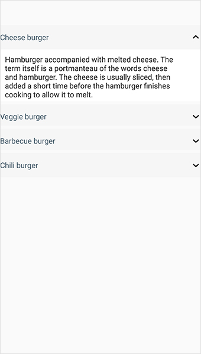

# Bindable Layout

The [SfAccordion](https://help.syncfusion.com/cr/cref_files/xamarin/Syncfusion.Expander.XForms~Syncfusion.XForms.Accordion.SfAccordion.html) allows to set a collection of items by setting `BindableLayout.ItemsSource` and `BindableLayout.ItemTemplate` properties. The Accordion supports Bindable Layout in Xamarin.Forms version 3.5 and above.

## Creating Data Model

Create a simple data model to bind the data for `SfAccordion` as shown in the following code example in a new class file, and save it as ItemInfo.cs file:



public class ItemInfo
{
    public string Name { get; set; }
    public string Description { get; set; }
}



Create a model repository class with ItemInfo collection property initialized with required number of data objects in a new class file as shown in the following code example, and save it as ItemInfoRepository.cs file:



public class ItemInfoRepository
{
    public ObservableCollection<ItemInfo> Info { get; set; }

    public ItemInfoRepository()
    {
        Info = new ObservableCollection<ItemInfo>();
        Info.Add(new ItemInfo() { Name = "Cheese burger", Description = "Hamburger accompanied with melted cheese. The term itself is a portmanteau of the words cheese and hamburger. The cheese is usually sliced, then added a short time before the hamburger finishes cooking to allow it to melt." });
        Info.Add(new ItemInfo() { Name = "Veggie burger", Description = "Veggie burger, garden burger, or tofu burger uses a meat analogue, a meat substitute such as tofu, textured vegetable protein, seitan (wheat gluten), Quorn, beans, grains or an assortment of vegetables, which are ground up and formed into patties." });
        Info.Add(new ItemInfo() { Name = "Barbecue burger", Description = "Prepared with ground beef, mixed with onions and barbecue sauce, and then grilled. Once the meat has been turned once, barbecue sauce is spread on top and grilled until the sauce caramelizes." });
        Info.Add(new ItemInfo() { Name = "Chili burger", Description = "Consists of a hamburger, with the patty topped with chili con carne."});
    }
}



Set the ViewModel instance as BindingContext of your page to bind properties of ViewModel to `SfAccordion`.

 

<ContentPage.BindingContext>
    <local:ItemInfoRepository/>
</ContentPage.BindingContext>


this.BindingContext = new ItemInfoRepository();      



## Binding data to SfAccordion

`SfAccordion` can be bounded with data by setting the ItemsSource property of BindableLayout.

The following code example binds the collection created in previous step to the `Bindable.ItemsSource` property:



<ContentPage xmlns="http://xamarin.com/schemas/2014/forms"
             xmlns:x="http://schemas.microsoft.com/winfx/2009/xaml"
             xmlns:syncfusion="clr-namespace:Syncfusion.XForms.Accordion;assembly=Syncfusion.Expander.XForms"
             xmlns:local="clr-namespace:AccordionBindableLayout"
             x:Class="AccordionBindableLayout.MainPage">
    <syncfusion:SfAccordion x:Name="Accordion" BindableLayout.ItemsSource="{Binding Info}"/>
</ContentPage>      


SfAccordion Accordion = new SfAccordion();
BindableLayout.SetItemsSource(Accordion, viewModel.Info);



## Defining the AccordionItem

The [SfAccordion](https://help.syncfusion.com/cr/cref_files/xamarin/Syncfusion.Expander.XForms~Syncfusion.XForms.Accordion.SfAccordion.html) accepts `AccordionItem` as its child element. The appearance of each `AccordionItem` can be defined by setting the `BindableLayout.ItemTemplate` property.



<syncfusion:SfAccordion x:Name="Accordion" BindableLayout.ItemsSource="{Binding Info}">
    <BindableLayout.ItemTemplate>
        <DataTemplate>
            <syncfusion:AccordionItem>
                <syncfusion:AccordionItem.Header>
                    <Label Text="{Binding Name}"/>
                </syncfusion:AccordionItem.Header>
                <syncfusion:AccordionItem.Content>
                    <Label Text="{Binding Description}"/>
                </syncfusion:AccordionItem.Content>
            </syncfusion:AccordionItem>
        </DataTemplate>
    </BindableLayout.ItemTemplate>
</syncfusion:SfAccordion>     


SfAccordion Accordion = new SfAccordion();
DataTemplate ItemTemplate = new DataTemplate(() =>
{
    AccordionItem accordionItem = new AccordionItem();
    var header = new Label();
    header.SetBinding(Label.TextProperty, new Binding("Name"));
    accordionItem.Header = header;
    var content = new Label();
    content.SetBinding(Label.TextProperty, new Binding("Description"));
    accordionItem.Content = content;
    return accordionItem;
});
BindableLayout.SetItemTemplate(Accordion, ItemTemplate);
BindableLayout.SetItemsSource(Accordion, viewModel.Info);



You can download the entire source of this demo from [here](https://github.com/SyncfusionExamples/Xamarin-Populate-Accordion-Items-using-Bindable-Layout).