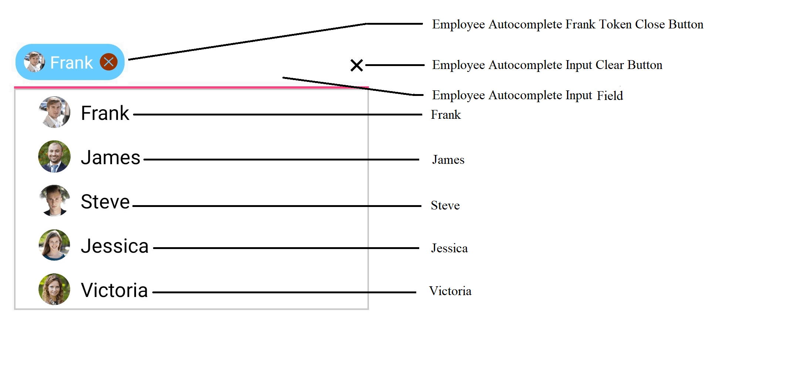

# Accessibility in Xamarin AutoComplete (SfAutoComplete)

## AutomationId

The SfAutoComplete control has built-in `AutomationId` for inner elements. The `AutomationId` API allows the automation framework to find and interact with the inner elements of the SfAutoComplete control. To keep unique AutomationId, these inner elements' AutomationIds are updated based on the control's `AutomationId`. 

For example, If you set SfAutoComplete's `AutomationId` as "Employee Autocomplete", then the Automation framework will interact with the Token Close Button as "Employee Autocomplete Frank Token Close Button". 

The following screenshot illustrates the AutomationIds of inner elements. The Automation framework will interact with the dropdown for scrolling the items as "Employee Autocomplete Dropdown". You can also interact with the elements inside the HeaderView and FooterView with the element's AutomationId. The Automation framework will not interact with the Input Clear Button when the [`MultiSelectMode`](https://help.syncfusion.com/cr/xamarin/Syncfusion.SfAutoComplete.XForms.SfAutoComplete.html#Syncfusion_SfAutoComplete_XForms_SfAutoComplete_MultiSelectMode) is None and Delimiter mode. 

N> You can refer to our [Xamarin AutoComplete](https://www.syncfusion.com/xamarin-ui-controls/xamarin-autocomplete) feature tour page for its groundbreaking feature representations. You can also explore our [Xamarin.Forms AutoComplete example](https://github.com/syncfusion/xamarin-demos/tree/master/Forms/AutoComplete) to knows the functionalities of each feature.