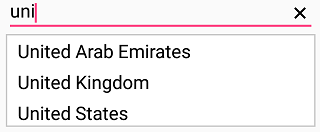
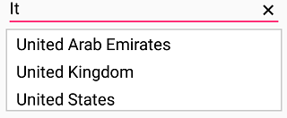

# AutoComplete Filtering Options in Xamarin AutoComplete

## AutoComplete filtering options in Xamarin SfAutoComplete

The phenomenon of string comparison for filtering suggestions can be changed using the `SuggestionMode` property. The default filtering strategy is “StartsWith” and it is case insensitive. The available filtering modes are

* StartsWith

* StartsWithCaseSensitive

* Contains

* ContainsWithCaseSensitive

* Equals

* EqualsWithCaseSensitive

* EndsWith

* EndsWithCaseSensitive

* Custom

## Filtering Words that Starts with Input Text

Displays all the matches that starts with the typed characters in control. This strategy is case in-sensitive.
	
	



<?xml version="1.0" encoding="utf-8" ?>
<ContentPage xmlns="http://xamarin.com/schemas/2014/forms"
             xmlns:x="http://schemas.microsoft.com/winfx/2009/xaml"
             xmlns:autocomplete="clr-namespace:Syncfusion.SfAutoComplete.XForms;assembly=Syncfusion.SfAutoComplete.XForms"
             xmlns:ListCollection="clr-namespace:System.Collections.Generic;assembly=netstandard"
             xmlns:local="clr-namespace:AutocompleteSample"
             x:Class="AutocompleteSample.MainPage">
    <StackLayout VerticalOptions="Start" 
                 HorizontalOptions="Start" 
                 Padding="30">
        <autocomplete:SfAutoComplete HeightRequest="40" 
                                     SuggestionMode="StartsWith">
            <autocomplete:SfAutoComplete.AutoCompleteSource>
                 <ListCollection:List x:TypeArguments="x:String">
                    <x:String>India</x:String>
                    <x:String>Uganda</x:String>
                    <x:String>Ukraine</x:String>
                    <x:String>Canada</x:String>
                    <x:String>United Arab Emirates</x:String>
                    <x:String>France</x:String>
                    <x:String>United Kingdom</x:String>
                    <x:String>China</x:String>
                    <x:String>United States</x:String>
                    <x:String>Japan</x:String>
                    <x:String>Angola</x:String>
                </ListCollection:List>
            </autocomplete:SfAutoComplete.AutoCompleteSource>
        </autocomplete:SfAutoComplete>
    </StackLayout>
</ContentPage>


	

	
using Syncfusion.SfAutoComplete.XForms;
using System.Collections.Generic;
using Xamarin.Forms;

namespace AutocompleteSample
{
    public partial class MainPage : ContentPage
    {
        public MainPage()
        {
            InitializeComponent();
            StackLayout stackLayout = new StackLayout()
            {
                VerticalOptions = LayoutOptions.Start,
                HorizontalOptions = LayoutOptions.Start,
                Padding = new Thickness(30)
            };

            SfAutoComplete autoComplete = new SfAutoComplete()
            {
                HeightRequest = 40,
                SuggestionMode = SuggestionMode.StartsWith,
                AutoCompleteSource = new List<string>()
                {
                    "India",
                    "Uganda",
                    "Ukraine",
                    "Canada",
                    "United Arab Emirates",
                    "France",
                    "United Kingdom",
                    "China",
                    "United States",
                    "Japan",
                    "Angola"
                }
            };

            stackLayout.Children.Add(autoComplete);
            this.Content = stackLayout;
        }
    }
}
	 




### Filtering Words that Starts with Input Text - CaseSensitive

Displays all the matches that starts with the typed characters in control. This strategy is case sensitive.





<?xml version="1.0" encoding="utf-8" ?>
<ContentPage xmlns="http://xamarin.com/schemas/2014/forms"
             xmlns:x="http://schemas.microsoft.com/winfx/2009/xaml"
             xmlns:autocomplete="clr-namespace:Syncfusion.SfAutoComplete.XForms;assembly=Syncfusion.SfAutoComplete.XForms"
             xmlns:ListCollection="clr-namespace:System.Collections.Generic;assembly=netstandard"
             xmlns:local="clr-namespace:AutocompleteSample"
             x:Class="AutocompleteSample.MainPage">
    <StackLayout VerticalOptions="Start" 
                 HorizontalOptions="Start" 
                 Padding="30">
        <autocomplete:SfAutoComplete HeightRequest="40" 
                                     SuggestionMode="StartsWithCaseSensitive">
            <autocomplete:SfAutoComplete.AutoCompleteSource>
                 <ListCollection:List x:TypeArguments="x:String">
                    <x:String>India</x:String>
                    <x:String>Uganda</x:String>
                    <x:String>Ukraine</x:String>
                    <x:String>Canada</x:String>
                    <x:String>United Arab Emirates</x:String>
                    <x:String>France</x:String>
                    <x:String>United Kingdom</x:String>
                    <x:String>China</x:String>
                    <x:String>United States</x:String>
                    <x:String>Japan</x:String>
                    <x:String>Angola</x:String>
                </ListCollection:List>
            </autocomplete:SfAutoComplete.AutoCompleteSource>
        </autocomplete:SfAutoComplete>
    </StackLayout>
</ContentPage>




	
using Syncfusion.SfAutoComplete.XForms;
using System.Collections.Generic;
using Xamarin.Forms;

namespace AutocompleteSample
{
    public partial class MainPage : ContentPage
    {
        public MainPage()
        {
            InitializeComponent();
            StackLayout stackLayout = new StackLayout()
            {
                VerticalOptions = LayoutOptions.Start,
                HorizontalOptions = LayoutOptions.Start,
                Padding = new Thickness(30)
            };

            SfAutoComplete autoComplete = new SfAutoComplete()
            {
                HeightRequest = 40,
                SuggestionMode = SuggestionMode.StartsWithCaseSensitive,
                AutoCompleteSource = new List<string>()
                {
                    "India",
                    "Uganda",
                    "Ukraine",
                    "Canada",
                    "United Arab Emirates",
                    "France",
                    "United Kingdom",
                    "China",
                    "United States",
                    "Japan",
                    "Angola"
                }
            };

            stackLayout.Children.Add(autoComplete);
            this.Content = stackLayout;
        }
    }
}





## Filtering Words that Contains the Input Text

Displays all the matches that contains the typed characters in control. This strategy is case in-sensitive.
	




<?xml version="1.0" encoding="utf-8" ?>
<ContentPage xmlns="http://xamarin.com/schemas/2014/forms"
             xmlns:x="http://schemas.microsoft.com/winfx/2009/xaml"
             xmlns:autocomplete="clr-namespace:Syncfusion.SfAutoComplete.XForms;assembly=Syncfusion.SfAutoComplete.XForms"
             xmlns:ListCollection="clr-namespace:System.Collections.Generic;assembly=netstandard"
             xmlns:local="clr-namespace:AutocompleteSample"
             x:Class="AutocompleteSample.MainPage">
    <StackLayout VerticalOptions="Start" 
                 HorizontalOptions="Start" 
                 Padding="30">
        <autocomplete:SfAutoComplete HeightRequest="40" 
                                     SuggestionMode="Contains">
            <autocomplete:SfAutoComplete.AutoCompleteSource>
                 <ListCollection:List x:TypeArguments="x:String">
                    <x:String>India</x:String>
                    <x:String>Uganda</x:String>
                    <x:String>Ukraine</x:String>
                    <x:String>Canada</x:String>
                    <x:String>United Arab Emirates</x:String>
                    <x:String>France</x:String>
                    <x:String>United Kingdom</x:String>
                    <x:String>China</x:String>
                    <x:String>United States</x:String>
                    <x:String>Japan</x:String>
                    <x:String>Angola</x:String>
                </ListCollection:List>
            </autocomplete:SfAutoComplete.AutoCompleteSource>
        </autocomplete:SfAutoComplete>
    </StackLayout>
</ContentPage>




	
using Syncfusion.SfAutoComplete.XForms;
using System.Collections.Generic;
using Xamarin.Forms;

namespace AutocompleteSample
{
    public partial class MainPage : ContentPage
    {
        public MainPage()
        {
            InitializeComponent();
            StackLayout stackLayout = new StackLayout()
            {
                VerticalOptions = LayoutOptions.Start,
                HorizontalOptions = LayoutOptions.Start,
                Padding = new Thickness(30)
            };

            SfAutoComplete autoComplete = new SfAutoComplete()
            {
                HeightRequest = 40,
                SuggestionMode = SuggestionMode.Contains,
                AutoCompleteSource = new List<string>()
                {
                    "India",
                    "Uganda",
                    "Ukraine",
                    "Canada",
                    "United Arab Emirates",
                    "France",
                    "United Kingdom",
                    "China",
                    "United States",
                    "Japan",
                    "Angola"
                }
            };

            stackLayout.Children.Add(autoComplete);
            this.Content = stackLayout;
        }
    }
}
	 




### Filtering Words that Contains the Input Text - CaseSensitive

Displays all the matches that contains the typed characters in control. This strategy is case sensitive.





<?xml version="1.0" encoding="utf-8" ?>
<ContentPage xmlns="http://xamarin.com/schemas/2014/forms"
             xmlns:x="http://schemas.microsoft.com/winfx/2009/xaml"
             xmlns:autocomplete="clr-namespace:Syncfusion.SfAutoComplete.XForms;assembly=Syncfusion.SfAutoComplete.XForms"
             xmlns:ListCollection="clr-namespace:System.Collections.Generic;assembly=netstandard"
             xmlns:local="clr-namespace:AutocompleteSample"
             x:Class="AutocompleteSample.MainPage">
    <StackLayout VerticalOptions="Start" 
                 HorizontalOptions="Start" 
                 Padding="30">
        <autocomplete:SfAutoComplete HeightRequest="40" 
                                     SuggestionMode="ContainsWithCaseSensitive">
            <autocomplete:SfAutoComplete.AutoCompleteSource>
                <ListCollection:List x:TypeArguments="x:String">
                    <x:String>India</x:String>
                    <x:String>Uganda</x:String>
                    <x:String>Ukraine</x:String>
                    <x:String>Canada</x:String>
                    <x:String>United Arab Emirates</x:String>
                    <x:String>France</x:String>
                    <x:String>United Kingdom</x:String>
                    <x:String>China</x:String>
                    <x:String>United States</x:String>
                    <x:String>Japan</x:String>
                    <x:String>Angola</x:String>
                </ListCollection:List>
            </autocomplete:SfAutoComplete.AutoCompleteSource>
        </autocomplete:SfAutoComplete>
    </StackLayout>
</ContentPage>





using Syncfusion.SfAutoComplete.XForms;
using System.Collections.Generic;
using Xamarin.Forms;

namespace AutocompleteSample
{
    public partial class MainPage : ContentPage
    {
        public MainPage()
        {
            InitializeComponent();
            StackLayout stackLayout = new StackLayout()
            {
                VerticalOptions = LayoutOptions.Start,
                HorizontalOptions = LayoutOptions.Start,
                Padding = new Thickness(30)
            };

            SfAutoComplete autoComplete = new SfAutoComplete()
            {
                HeightRequest = 40,
                SuggestionMode = SuggestionMode.ContainsWithCaseSensitive,
                AutoCompleteSource = new List<string>()
                {
                    "India",
                    "Uganda",
                    "Ukraine",
                    "Canada",
                    "United Arab Emirates",
                    "France",
                    "United Kingdom",
                    "China",
                    "United States",
                    "Japan",
                    "Angola"
                }
            };

            stackLayout.Children.Add(autoComplete);
            this.Content = stackLayout;
        }
    }
}





## Filtering Words that Equals the Input Text

Displays all the words that completely matches with the typed characters in control. This strategy is case in-sensitive.
	




<?xml version="1.0" encoding="utf-8" ?>
<ContentPage xmlns="http://xamarin.com/schemas/2014/forms"
             xmlns:x="http://schemas.microsoft.com/winfx/2009/xaml"
             xmlns:autocomplete="clr-namespace:Syncfusion.SfAutoComplete.XForms;assembly=Syncfusion.SfAutoComplete.XForms"
             xmlns:ListCollection="clr-namespace:System.Collections.Generic;assembly=netstandard"
             xmlns:local="clr-namespace:AutocompleteSample"
             x:Class="AutocompleteSample.MainPage">
    <StackLayout VerticalOptions="Start" 
                 HorizontalOptions="Start" 
                 Padding="30">
        <autocomplete:SfAutoComplete HeightRequest="40" 
                                     SuggestionMode="Equals">
            <autocomplete:SfAutoComplete.AutoCompleteSource>
                 <ListCollection:List x:TypeArguments="x:String">
                    <x:String>India</x:String>
                    <x:String>Uganda</x:String>
                    <x:String>Ukraine</x:String>
                    <x:String>Canada</x:String>
                    <x:String>United Arab Emirates</x:String>
                    <x:String>France</x:String>
                    <x:String>United Kingdom</x:String>
                    <x:String>China</x:String>
                    <x:String>United States</x:String>
                    <x:String>Japan</x:String>
                    <x:String>Angola</x:String>
                </ListCollection:List>
            </autocomplete:SfAutoComplete.AutoCompleteSource>
        </autocomplete:SfAutoComplete>
    </StackLayout>
</ContentPage>




	
using Syncfusion.SfAutoComplete.XForms;
using System.Collections.Generic;
using Xamarin.Forms;

namespace AutocompleteSample
{
    public partial class MainPage : ContentPage
    {
        public MainPage()
        {
            InitializeComponent();
            StackLayout stackLayout = new StackLayout()
            {
                VerticalOptions = LayoutOptions.Start,
                HorizontalOptions = LayoutOptions.Start,
                Padding = new Thickness(30)
            };

            SfAutoComplete autoComplete = new SfAutoComplete()
            {
                HeightRequest = 40,
                SuggestionMode = SuggestionMode.Equals,
                AutoCompleteSource = new List<string>()
                {
                    "India",
                    "Uganda",
                    "Ukraine",
                    "Canada",
                    "United Arab Emirates",
                    "France",
                    "United Kingdom",
                    "China",
                    "United States",
                    "Japan",
                    "Angola"
                }
            };

            stackLayout.Children.Add(autoComplete);
            this.Content = stackLayout;
        }
    }
}





### Filtering Words that Equals the Input Text - CaseSensitive

Displays all the words that completely matches with the typed characters in control. This strategy is case sensitive.
	




<?xml version="1.0" encoding="utf-8" ?>
<ContentPage xmlns="http://xamarin.com/schemas/2014/forms"
             xmlns:x="http://schemas.microsoft.com/winfx/2009/xaml"
             xmlns:autocomplete="clr-namespace:Syncfusion.SfAutoComplete.XForms;assembly=Syncfusion.SfAutoComplete.XForms"
             xmlns:ListCollection="clr-namespace:System.Collections.Generic;assembly=netstandard"
             xmlns:local="clr-namespace:AutocompleteSample"
             x:Class="AutocompleteSample.MainPage">
    <StackLayout VerticalOptions="Start" 
                 HorizontalOptions="Start" 
                 Padding="30">
        <autocomplete:SfAutoComplete HeightRequest="40" 
                                     SuggestionMode="EqualsWithCaseSensitive">
            <autocomplete:SfAutoComplete.AutoCompleteSource>
                 <ListCollection:List x:TypeArguments="x:String">
                    <x:String>India</x:String>
                    <x:String>Uganda</x:String>
                    <x:String>Ukraine</x:String>
                    <x:String>Canada</x:String>
                    <x:String>United Arab Emirates</x:String>
                    <x:String>France</x:String>
                    <x:String>United Kingdom</x:String>
                    <x:String>China</x:String>
                    <x:String>United States</x:String>
                    <x:String>Japan</x:String>
                    <x:String>Angola</x:String>
                </ListCollection:List>
            </autocomplete:SfAutoComplete.AutoCompleteSource>
        </autocomplete:SfAutoComplete>
    </StackLayout>
</ContentPage>




	
using Syncfusion.SfAutoComplete.XForms;
using System.Collections.Generic;
using Xamarin.Forms;

namespace AutocompleteSample
{
    public partial class MainPage : ContentPage
    {
        public MainPage()
        {
            InitializeComponent();
            StackLayout stackLayout = new StackLayout()
            {
                VerticalOptions = LayoutOptions.Start,
                HorizontalOptions = LayoutOptions.Start,
                Padding = new Thickness(30)
            };

            SfAutoComplete autoComplete = new SfAutoComplete()
            {
                HeightRequest = 40,
                SuggestionMode = SuggestionMode.EqualsWithCaseSensitive,
                AutoCompleteSource = new List<string>()
                {
                    "India",
                    "Uganda",
                    "Ukraine",
                    "Canada",
                    "United Arab Emirates",
                    "France",
                    "United Kingdom",
                    "China",
                    "United States",
                    "Japan",
                    "Angola"
                }
            };

            stackLayout.Children.Add(autoComplete);
            this.Content = stackLayout;
        }
    }
}





### Custom

Filter items in the suggestion list based on a custom search by the user. This will help to apply our typo toleration functionality to the control.





<?xml version="1.0" encoding="utf-8" ?>
<ContentPage xmlns="http://xamarin.com/schemas/2014/forms"
             xmlns:x="http://schemas.microsoft.com/winfx/2009/xaml"
             xmlns:autocomplete="clr-namespace:Syncfusion.SfAutoComplete.XForms;assembly=Syncfusion.SfAutoComplete.XForms"
             xmlns:ListCollection="clr-namespace:System.Collections.Generic;assembly=netstandard"
             xmlns:local="clr-namespace:AutocompleteSample"
             x:Class="AutocompleteSample.MainPage">
    <StackLayout VerticalOptions="Start" 
                 HorizontalOptions="Start" 
                 Padding="30">
        <autocomplete:SfAutoComplete x:Name="autoComplete"
                                     HeightRequest="40"
                                     DropDownTextSize="20"
                                     AutoCompleteMode="Suggest"
                                     MaximumDropDownHeight="200" 
                                     SuggestionMode="Custom"
                                     >
            <autocomplete:SfAutoComplete.AutoCompleteSource>
                 <ListCollection:List x:TypeArguments="x:String">
                    <x:String>Albania</x:String>
                    <x:String>Algeria</x:String>
                    <x:String>American Samoa</x:String>
                    <x:String>Andorra</x:String>
                    <x:String>Angola</x:String>
                    <x:String>Anguilla</x:String>
                </ListCollection:List>
            </autocomplete:SfAutoComplete.AutoCompleteSource>
        </autocomplete:SfAutoComplete>
    </StackLayout>
</ContentPage>





using Syncfusion.SfAutoComplete.XForms;
using System;
using System.Collections.Generic;
using Xamarin.Forms;

namespace AutocompleteSample
{
    public partial class MainPage : ContentPage
    {
        public MainPage()
        {
            InitializeComponent();
            StackLayout stackLayout = new StackLayout()
            {
                VerticalOptions = LayoutOptions.Start,
                HorizontalOptions = LayoutOptions.Start,
                Padding = new Thickness(30)
            };

            SfAutoComplete autoComplete = new SfAutoComplete()
            {
                HeightRequest = 40,
                DropDownTextSize = 20,
                AutoCompleteMode = AutoCompleteMode.Suggest,
                MaximumDropDownHeight = 200,
                SuggestionMode = SuggestionMode.Custom,
                Filter = ContainingSpaceFilter,
                AutoCompleteSource = new List<string>()
                {
                    "Albania",
                    "Algeria",
                    "American Samoa",
                    "Andorra",
                    "Angola",
                    "Anguilla"
                }
            };

            stackLayout.Children.Add(autoComplete);
            this.Content = stackLayout;
        }

        public bool ContainingSpaceFilter(string search, object item)
        {
            string text = item.ToString().ToLower();
            if (item != null)
            {
                try
                {
                    var split = search.Split(' ');
                    foreach (var results in split)
                    {
                        if (!text.Contains(results.ToLower()))
                        {
                            return true;
                        }
                        else
                            return false;
                    }
                    return true;
                }
                catch (Exception)
                {
                    return (text.Contains(search));
                }
            }
            else
                return false;
        }
    }
}

	

    

## Filtering Words that Ends with the Input Text

Displays all the matches that ends with the typed characters in control. This strategy is case in-sensitive.


	


<?xml version="1.0" encoding="utf-8" ?>
<ContentPage xmlns="http://xamarin.com/schemas/2014/forms"
             xmlns:x="http://schemas.microsoft.com/winfx/2009/xaml"
             xmlns:autocomplete="clr-namespace:Syncfusion.SfAutoComplete.XForms;assembly=Syncfusion.SfAutoComplete.XForms"
             xmlns:ListCollection="clr-namespace:System.Collections.Generic;assembly=netstandard"
             xmlns:local="clr-namespace:AutocompleteSample"
             x:Class="AutocompleteSample.MainPage">
    <StackLayout VerticalOptions="Start" 
                 HorizontalOptions="Start" 
                 Padding="30">
        <autocomplete:SfAutoComplete HeightRequest="40" 
                                     SuggestionMode="EndsWith">
            <autocomplete:SfAutoComplete.AutoCompleteSource>
                 <ListCollection:List x:TypeArguments="x:String">
                    <x:String>India</x:String>
                    <x:String>Uganda</x:String>
                    <x:String>Ukraine</x:String>
                    <x:String>Canada</x:String>
                    <x:String>United Arab Emirates</x:String>
                    <x:String>France</x:String>
                    <x:String>United Kingdom</x:String>
                    <x:String>China</x:String>
                    <x:String>United States</x:String>
                    <x:String>Japan</x:String>
                    <x:String>Angola</x:String>
                </ListCollection:List>
            </autocomplete:SfAutoComplete.AutoCompleteSource>
        </autocomplete:SfAutoComplete>
    </StackLayout>
</ContentPage>




	
using Syncfusion.SfAutoComplete.XForms;
using System.Collections.Generic;
using Xamarin.Forms;

namespace AutocompleteSample
{
    public partial class MainPage : ContentPage
    {
        public MainPage()
        {
            InitializeComponent();
            StackLayout stackLayout = new StackLayout()
            {
                VerticalOptions = LayoutOptions.Start,
                HorizontalOptions = LayoutOptions.Start,
                Padding = new Thickness(30)
            };

            SfAutoComplete autoComplete = new SfAutoComplete()
            {
                HeightRequest = 40,
                SuggestionMode = SuggestionMode.EndsWith,
                AutoCompleteSource = new List<string>()
                {
                    "India",
                    "Uganda",
                    "Ukraine",
                    "Canada",
                    "United Arab Emirates",
                    "France",
                    "United Kingdom",
                    "China",
                    "United States",
                    "Japan",
                    "Angola"
                }
            };

            stackLayout.Children.Add(autoComplete);
            this.Content = stackLayout;
        }
    }
}
 




### Filtering Words that Ends with the Input Text - CaseSensitive 

Displays all the matches that ends with the typed characters in control. This strategy is case sensitive.
	




<?xml version="1.0" encoding="utf-8" ?>
<ContentPage xmlns="http://xamarin.com/schemas/2014/forms"
             xmlns:x="http://schemas.microsoft.com/winfx/2009/xaml"
             xmlns:autocomplete="clr-namespace:Syncfusion.SfAutoComplete.XForms;assembly=Syncfusion.SfAutoComplete.XForms"
             xmlns:ListCollection="clr-namespace:System.Collections.Generic;assembly=netstandard"
             xmlns:local="clr-namespace:AutocompleteSample"
             x:Class="AutocompleteSample.MainPage">
    <StackLayout VerticalOptions="Start" 
                 HorizontalOptions="Start" 
                 Padding="30">
        <autocomplete:SfAutoComplete HeightRequest="40" 
                                     SuggestionMode="EndsWithCaseSensitive">
            <autocomplete:SfAutoComplete.AutoCompleteSource>
                 <ListCollection:List x:TypeArguments="x:String">
                    <x:String>India</x:String>
                    <x:String>Uganda</x:String>
                    <x:String>Ukraine</x:String>
                    <x:String>Canada</x:String>
                    <x:String>United Arab Emirates</x:String>
                    <x:String>France</x:String>
                    <x:String>United Kingdom</x:String>
                    <x:String>China</x:String>
                    <x:String>United States</x:String>
                    <x:String>Japan</x:String>
                    <x:String>Angola</x:String>
                </ListCollection:List>
            </autocomplete:SfAutoComplete.AutoCompleteSource>
        </autocomplete:SfAutoComplete>
    </StackLayout>
</ContentPage>




	
using Syncfusion.SfAutoComplete.XForms;
using System.Collections.Generic;
using Xamarin.Forms;

namespace AutocompleteSample
{
    public partial class MainPage : ContentPage
    {
        public MainPage()
        {
            InitializeComponent();
            StackLayout stackLayout = new StackLayout()
            {
                VerticalOptions = LayoutOptions.Start,
                HorizontalOptions = LayoutOptions.Start,
                Padding = new Thickness(30)
            };

            SfAutoComplete autoComplete = new SfAutoComplete()
            {
                HeightRequest = 40,
                SuggestionMode = SuggestionMode.EndsWithCaseSensitive,
                AutoCompleteSource = new List<string>()
                {
                    "India",
                    "Uganda",
                    "Ukraine",
                    "Canada",
                    "United Arab Emirates",
                    "France",
                    "United Kingdom",
                    "China",
                    "United States",
                    "Japan",
                    "Angola"
                }
            };

            stackLayout.Children.Add(autoComplete);
            this.Content = stackLayout;
        }
    }
}





N> You can refer to our [Xamarin AutoComplete](https://www.syncfusion.com/xamarin-ui-controls/xamarin-autocomplete) feature tour page for its groundbreaking feature representations. You can also explore our [Xamarin.Forms AutoComplete example](https://github.com/syncfusion/xamarin-demos/tree/master/Forms/AutoComplete) to knows the functionalities of each feature.
