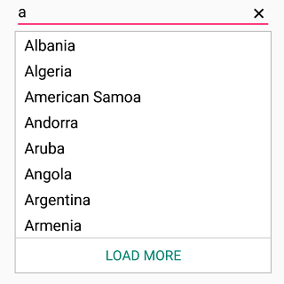

# Maximum Display Item with Expander

## Maximum display item with expander in Xamarin SfAutoComplete

Restrict the number of suggestions displayed and have the remaining items loaded by selecting LoadMore.We can restrict maximum suggestion to be displayed with the `MaximumSuggestion` property. We can set the desire text for the displaying the Load more text with the property `LoadMoreText`.





<?xml version="1.0" encoding="utf-8" ?>
<ContentPage xmlns="http://xamarin.com/schemas/2014/forms"
             xmlns:x="http://schemas.microsoft.com/winfx/2009/xaml"
             xmlns:autocomplete="clr-namespace:Syncfusion.SfAutoComplete.XForms;assembly=Syncfusion.SfAutoComplete.XForms"
             xmlns:ListCollection="clr-namespace:System.Collections.Generic;assembly=netstandard"
             xmlns:local="clr-namespace:AutocompleteSample"
             x:Class="AutocompleteSample.MainPage">
    <StackLayout VerticalOptions="Start" 
                 HorizontalOptions="Start" 
                 Padding="30">
        <autocomplete:SfAutoComplete HeightRequest="40"
                                     MultiSelectMode="Delimiter"
                                     Delimiter=","
                                     LoadMoreText="LOAD MORE"
                                     MaximumSuggestion="2">
            <autocomplete:SfAutoComplete.AutoCompleteSource>
               <ListCollection:List x:TypeArguments="x:String">
                    <x:String>Albania</x:String>
                    <x:String>Algeria</x:String>
                    <x:String>American Samoa</x:String>
                    <x:String>Andorra</x:String>
                    <x:String>Aruba</x:String>
                    <x:String>Angola</x:String>
                    <x:String>Argentina</x:String>
                    <x:String>Armenia</x:String>
                    <x:String>America</x:String>
                </ListCollection:List>
            </autocomplete:SfAutoComplete.AutoCompleteSource>
        </autocomplete:SfAutoComplete>
    </StackLayout>
</ContentPage>





using Syncfusion.SfAutoComplete.XForms;
using System.Collections.Generic;
using Xamarin.Forms;

namespace AutocompleteSample
{
    public partial class MainPage : ContentPage
    {
        public MainPage()
        {
            InitializeComponent();
            StackLayout stackLayout = new StackLayout()
            {
                VerticalOptions = LayoutOptions.Start,
                HorizontalOptions = LayoutOptions.Start,
                Padding = new Thickness(30)
            };

            SfAutoComplete autoComplete = new SfAutoComplete()
            {
                HeightRequest = 40,
                MultiSelectMode = MultiSelectMode.Delimiter,
                Delimiter = ",",
                LoadMoreText = "LOAD MORE",
                MaximumSuggestion = 2,
                AutoCompleteSource = new List<string>()
                {
                   "Albania",
                   "Algeria",
                   "American Samoa",
                   "Andorra",
                   "Aruba",
                   "Angola",
                   "Argentina",
                   "Armenia",
                   "America"
                }
            };

            stackLayout.Children.Add(autoComplete);
            this.Content = stackLayout;
        }
    }
}





## Restricting the maximum display of item dynamically

We can restrict the maximum display of items dynamically by calling `LoadMore` method. The user can dynamically change the maximum suggestion count by calling LoadMore method by giving the maximum suggestion as the argument inside.

N> LoadMore method has enhanced only on iOS and Android platform.




// without passing argument
autoComplete.LoadMore();

// with passing argument
autoComplete.LoadMore(5);




## Load More Button Tapped Event

The `LoadMoreButtonTapped` can be triggered only when you tap on the load more button.





 <autocomplete:SfAutoComplete HeightRequest="40"
                              LoadMoreButtonTapped="AutoComplete_LoadMoreButtonTapped"
                              LoadMoreText="LOAD MORE"
                              MaximumSuggestion="3"/>




namespace AutocompleteSample
{
    public partial class MainPage : ContentPage
    {
        SfAutoComplete autoComplete;
        public MainPage()
        {
          autoComplete = new SfAutoComplete();
          autoComplete.LoadMoreButtonTapped += AutoComplete_LoadMoreButtonTapped;
          autoComplete.HeightRequest = 40;
          autoComplete.LoadMoreText = "Load More";
        }

        private void AutoComplete_LoadMoreButtonTapped(object sender, EventArgs e)
        {
            // Trigger when tap the load more button
        }
    }
}





N> The `LoadMoreButtonTapped` event is supported only on the Android and iOS platforms.