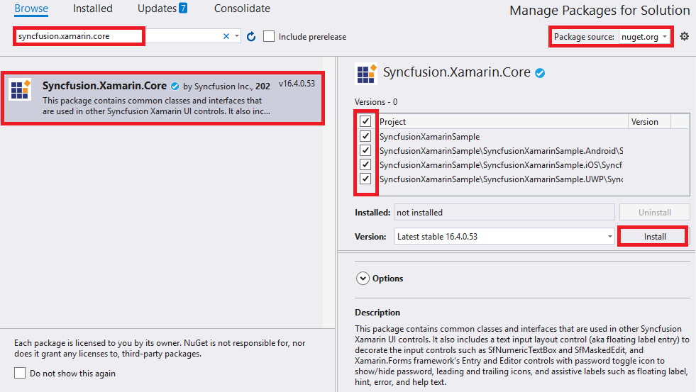

# Getting Started

## Getting started with Xamarin Avatar View (SfAvatarView)

This section explains the steps required to work with the SfAvatarView control for Xamarin.Forms.

## Adding SfAvatarView reference

You can add SfAvatarView reference using one of the following methods:

**Method 1: Adding SfAvatarView reference from nuget.org**

Syncfusion Xamarin components are available in [nuget.org](https://www.nuget.org/). To add SfAvatarView to your project, open the NuGet package manager in Visual Studio, search for [Syncfusion.Xamarin.Core](https://www.nuget.org/packages/Syncfusion.Xamarin.Core), and then install it.

N> Install the same version of SfAvatarView NuGet in all the projects.

**Method 2: Adding SfAvatarView reference from toolbox**

Syncfusion also provides Xamarin Toolbox. Using this toolbox, you can drag the SfAvatarView control to the XAML page. It will automatically install the required NuGet packages and add the namespace to the page. To install Syncfusion Xamarin Toolbox, refer to [Toolbox](https://help.syncfusion.com/xamarin/utility#toolbox).

**Method 3: Adding SfAvatarView assemblies manually from the installed location**

If you prefer to manually reference the assemblies instead of referencing from NuGet, add the following assemblies in respective projects.

Location: {Installed location}/{version}/Xamarin/lib

<table>
<tr>
<td>PCL</td>
<td>Syncfusion.Core.XForms.dll Syncfusion.Licensing.dll </td>
</tr>
<tr>
<td>Android</td>
<td>Syncfusion.Core.XForms.dll Syncfusion.Core.XForms.Android.dll Syncfusion.Licensing.dll </td>
</tr>
<tr>
<td>iOS</td>
<td>Syncfusion.Core.XForms.dll Syncfusion.Core.XForms.iOS.dll Syncfusion.Licensing.dll </td>
</tr>
<tr>
<td>UWP</td>
<td>Syncfusion.Core.XForms.dll Syncfusion.Core.XForms.UWP.dll Syncfusion.Licensing.dll </td>
</tr>
<tr>
<td>WPF</td>
<td>Syncfusion.Core.XForms.dll Syncfusion.Core.XForms.WPF.dll Syncfusion.Licensing.dll </td>
</tr>
</table>

N> To know more about obtaining our components, refer to these links for [Mac](https://help.syncfusion.com/xamarin/introduction/download-and-installation/mac/) and [Windows](https://help.syncfusion.com/xamarin/introduction/download-and-installation/windows/).

I> Starting with v16.2.0.x, if you reference Syncfusion assemblies from the trial setup or from the NuGet feed, you also have to include a license key in your projects. Please refer to [Syncfusion license key](https://help.syncfusion.com/common/essential-studio/licensing/license-key/) to know about registering Syncfusion license key in your Xamarin application to use our components.

## Launching an application on each platform with SfAvatarView

To use the SfAvatarView control inside an application, each platform application must initialize the SfAvatarView renderer. This initialization step varies from platform to platform and is discussed in the following sections:

N> If you are adding the references from toolbox, the following steps are not needed.

### Android and UWP

The Android and UWP launch the SfAvatarView without any initialization, and it is enough to only initialize the Xamarin.Forms Framework to launch the application.

### iOS

To launch the SfAvatarView in iOS, call the `SfAvatarView.Init()` in the `FinishedLaunching` overridden method of the AppDelegate class after the Xamarin.Forms Framework has been initialized and before the LoadApplication is called as demonstrated in the following code example.





public override bool FinishedLaunching(UIApplication app, NSDictionary options)
{
    …
    global::Xamarin.Forms.Forms.Init ();
    Syncfusion.XForms.iOS.Core.SfAvatarViewRenderer.Init();
    LoadApplication (new App ());
    …
}

 



### Release mode issue in UWP platform

The known Framework issue in UWP platform is that the custom controls will not be rendered when deploying an application in `Release Mode`. It can be resolved by initializing the SfBorder assemblies in the `App.xaml.cs` file in the UWP project as demonstrated in the following code example.




// In App.xaml.cs

protected override void OnLaunched(LaunchActivatedEventArgs e)
    {
        …
    	    rootFrame.NavigationFailed += OnNavigationFailed;
    
        // You will need to add `using System.Reflection;`
        List<Assembly> assembliesToInclude = new List<Assembly>();
    
        //Now, add all the assemblies your app uses                 
        assembliesToInclude.Add(typeof(SfBorderRenderer).GetTypeInfo().Assembly);
    
        // Replaces Xamarin.Forms.Forms.Init(e);        
        Xamarin.Forms.Forms.Init(e, assembliesToInclude);	
        …     
    }





### Windows Presentation Foundation (WPF)

To launch the border in WPF, call the SfBorderRenderer.Init() method in the MainWindow constructor of the MainWindow class after the Xamarin.Forms framework has been initialized and before the LoadApplication method is called as demonstrated in the following code sample.

 

public partial class MainWindow : FormsApplicationPage
{
     public MainWindow()
     { 
            InitializeComponent();

            Forms.Init();

            Syncfusion.XForms.WPF.Border.SfBorderRenderer.Init();

            LoadApplication(new App());
     }
}



## Creating an SfAvatarView control

The `SfAvatarView` control is configured entirely in C# or in XAML. The following steps explain how to create an `SfAvatarView` control and configure its elements.

### Adding namespace for referred assemblies

 
 
xmlns:sfavatar="clr-namespace:Syncfusion.XForms.AvatarView;assembly=Syncfusion.Core.XForms"

 
using Syncfusion.XForms.AvatarView;



### Adding the SfAvatarView control as the content of ContentPage

You can add a custom image for displaying in SfAvatarView using the `ImageSource` property.



<ContentPage.Content>
<Grid>
    <sfavatar:SfAvatarView ContentType="Custom"
                           ImageSource="alex.png"
                           VerticalOptions="Center"
                           HorizontalOptions="Center"   
                           HeightRequest="50"
                           CornerRadius="25"
                           WidthRequest="50" />
 </Grid>
 </ContentPage.Content>



using System;
using Syncfusion.XForms.AvatarView;
using Xamarin.Forms;

namespace AvatarViewGettingStarted
{
    public partial class MainPage : ContentPage
    {
        public MainPage()
        {
            InitializeComponent();
            
	        //main grid
            Grid mainGrid = new Grid();

            // Create an SfAvatarView control.
            SfAvatarView avatarview = new SfAvatarView();
            avatarview.VerticalOptions = LayoutOptions.Center;
            avatarview.HorizontalOptions = LayoutOptions.Center;
            avatarview.BackgroundColor = Color.FromHex("#ffb6c1");
            avatarview.ContentType = ContentType.Custom;
            avatarview.ImageSource = "alex.png";
            avatarview.WidthRequest = 50;
            avatarview.HeightRequest = 50;
            avatarview.CornerRadius = 25;

            mainGrid.Children.Add(avatarview);
            this.Content = mainGrid;
        }
    }
}
 



The Getting Started sample is available in this following link: [Getting Started](https://www.syncfusion.com/downloads/support/directtrac/general/ze/Getting_started-732039602).
