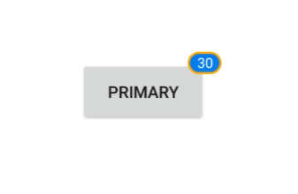
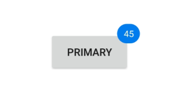
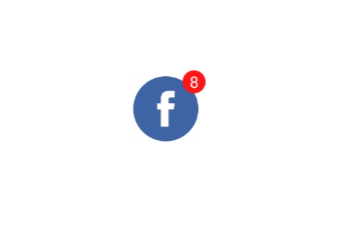
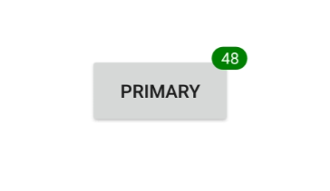

---

layout: post
title: Customization of Syncfusion Badge View control for Xamarin.Forms
description: Learn how to set Syncfusion badge view customization in Xamarin.Forms platform
platform: xamarin
control: SfBadgeView
documentation: ug

---

# Badge Settings

The [`BadgeSettings`](https://help.syncfusion.com/cr/xamarin/Syncfusion.XForms.BadgeView.SfBadgeView.html#Syncfusion_XForms_BadgeView_SfBadgeView_BadgeSettings) property helps you customize the basic look and feel of the badge view. 
[`BadgeSettings`](https://help.syncfusion.com/cr/xamarin/Syncfusion.XForms.BadgeView.SfBadgeView.html#Syncfusion_XForms_BadgeView_SfBadgeView_BadgeSettings) contains the sub elements such as badge types, positions, icons, colors, and alignments. You can customize the background color, text color, stroke color, width, offset, and font attributes.

## Font customization

The font can be customized using the [`FontSize`](https://help.syncfusion.com/cr/xamarin/Syncfusion.XForms.BadgeView.BadgeSetting.html#Syncfusion_XForms_BadgeView_BadgeSetting_FontSize), [`FontAttributes`](https://help.syncfusion.com/cr/xamarin/Syncfusion.XForms.BadgeView.BadgeSetting.html#Syncfusion_XForms_BadgeView_BadgeSetting_FontAttributes), and [`FontFamily`](https://help.syncfusion.com/cr/xamarin/Syncfusion.XForms.BadgeView.BadgeSetting.html#Syncfusion_XForms_BadgeView_BadgeSetting_FontFamily) properties.





<badge:SfBadgeView BadgeText="48" HorizontalOptions="Center" VerticalOptions="Center">
        <badge:SfBadgeView.Content>
            <Button Text ="Primary" WidthRequest="120" HeightRequest="60" />
        </badge:SfBadgeView.Content>
        <badge:SfBadgeView.BadgeSettings>
            <badge:BadgeSetting FontSize="15" FontAttributes="Bold">
                <badge:BadgeSetting.FontFamily>
                    <OnPlatform x:TypeArguments="x:String" iOS="Chalkduster" Android="serif" WinPhone="Chiller" />
                </badge:BadgeSetting.FontFamily>
            </badge:BadgeSetting>
        </badge:SfBadgeView.BadgeSettings>
</badge:SfBadgeView>





SfBadgeView sfBadgeView = new SfBadgeView();
sfBadgeView.HorizontalOptions = LayoutOptions.Center;
sfBadgeView.VerticalOptions = LayoutOptions.Center;
sfBadgeView.BadgeText = "48";
Button button = new Button();
button.Text = "Primary";
button.WidthRequest = 120;
button.HeightRequest = 60;
sfBadgeView.Content = button;
BadgeSetting badgeSetting = new BadgeSetting();
badgeSetting.FontAttributes = FontAttributes.Bold;
badgeSetting.FontSize = 15;
badgeSetting.FontFamily = Device.RuntimePlatform == Device.iOS ? "Chalkduster" : Device.RuntimePlatform == Device.Android ? "serif" : "Chiller";
sfBadgeView.BadgeSettings = badgeSetting;
Content = sfBadgeView;
    




## Stroke customization

The stroke color and stroke width of the badge view can be customized using the [`Stroke`](https://help.syncfusion.com/cr/xamarin/Syncfusion.XForms.BadgeView.BadgeSetting.html#Syncfusion_XForms_BadgeView_BadgeSetting_Stroke) and [`StrokeWidth`](https://help.syncfusion.com/cr/xamarin/Syncfusion.XForms.BadgeView.BadgeSetting.html#Syncfusion_XForms_BadgeView_BadgeSetting_StrokeWidth) properties, respectively.





<badge:SfBadgeView BadgeText="30" HorizontalOptions="Center" VerticalOptions="Center">
        <badge:SfBadgeView.Content>
            <Button Text ="Primary" WidthRequest="120" HeightRequest="60"/>
        </badge:SfBadgeView.Content>
        <badge:SfBadgeView.BadgeSettings>
            <badge:BadgeSetting Stroke="Orange" StrokeWidth="2" />
        </badge:SfBadgeView.BadgeSettings>
</badge:SfBadgeView>
              




SfBadgeView sfBadgeView = new SfBadgeView();
sfBadgeView.BadgeText = "30";
sfBadgeView.HorizontalOptions = LayoutOptions.Center;
sfBadgeView.VerticalOptions = LayoutOptions.Center;
Button button = new Button();
button.Text = "Primary";
button.WidthRequest = 120;
button.HeightRequest = 60;
sfBadgeView.Content = button;
BadgeSetting badgeSetting = new BadgeSetting();
badgeSetting.Stroke = Color.Orange;
badgeSetting.StrokeWidth = 2;
sfBadgeView.BadgeSettings = badgeSetting;
Content = sfBadgeView;
    




## Text customization

The text color and margin of badge view can be changed using the [`TextColor`](https://help.syncfusion.com/cr/xamarin/Syncfusion.XForms.BadgeView.BadgeSetting.html#Syncfusion_XForms_BadgeView_BadgeSetting_TextColor) and [`TextPadding`](https://help.syncfusion.com/cr/xamarin/Syncfusion.XForms.BadgeView.BadgeSetting.html#Syncfusion_XForms_BadgeView_BadgeSetting_TextPadding) properties, respectively.





<badge:SfBadgeView BadgeText="45" HorizontalOptions="Center" VerticalOptions="Center">
        <badge:SfBadgeView.Content>
            <Button Text ="Primary" WidthRequest="120" HeightRequest="60"/>
        </badge:SfBadgeView.Content>
        <badge:SfBadgeView.BadgeSettings>
            <badge:BadgeSetting TextColor="LightYellow" TextPadding="10"/>
        </badge:SfBadgeView.BadgeSettings>
</badge:SfBadgeView>    





SfBadgeView sfBadgeView = new SfBadgeView();
sfBadgeView.HorizontalOptions = LayoutOptions.Center;
sfBadgeView.VerticalOptions = LayoutOptions.Center;
sfBadgeView.BadgeText = "45";
Button button = new Button();
button.WidthRequest = 120;
button.HeightRequest = 60;
button.Text = "Primary";
sfBadgeView.Content = button;
BadgeSetting badgeSetting = new BadgeSetting();
badgeSetting.TextColor = Color.LightYellow;
badgeSetting.TextPadding = 10;
sfBadgeView.BadgeSettings = badgeSetting;
Content = sfBadgeView;
    




## Predefined styles

You can change the colors of the badge using the [`BadgeType`](https://help.syncfusion.com/cr/xamarin/Syncfusion.XForms.BadgeView.BadgeSetting.html#Syncfusion_XForms_BadgeView_BadgeSetting_BadgeType) property. The badge supports the following eight different essential colors for various situations:

 * Dark
 * Error
 * Info
 * Light
 * Primary
 * Secondary
 * Success
 * Warning





<badge:SfBadgeView BadgeText="8" HorizontalOptions="Center" VerticalOptions="Center">
        <badge:SfBadgeView.Content>
            <Image Source="BadgeFacebook.png" HeightRequest="70" WidthRequest="60"/>
        </badge:SfBadgeView.Content>
        <badge:SfBadgeView.BadgeSettings>
            <badge:BadgeSetting BadgeType="Error" Offset="-5,10"/>
        </badge:SfBadgeView.BadgeSettings>
</badge:SfBadgeView>





SfBadgeView sfBadgeView = new SfBadgeView();
sfBadgeView.HorizontalOptions = LayoutOptions.Center;
sfBadgeView.VerticalOptions = LayoutOptions.Center;
sfBadgeView.BadgeText = "8";
Image image = new Image();
image.Source = "BadgeFacebook.png";
image.HeightRequest = 70;
image.WidthRequest = 60;
sfBadgeView.Content = image;
BadgeSetting badgeSetting = new BadgeSetting();
badgeSetting.BadgeType = BadgeType.Error;
badgeSetting.Offset = new Point(-5, 10);
sfBadgeView.BadgeSettings = badgeSetting;
Content = sfBadgeView;
    




## Badge background customization

Set the [`BadgeType`](https://help.syncfusion.com/cr/xamarin/Syncfusion.XForms.BadgeView.BadgeSetting.html#Syncfusion_XForms_BadgeView_BadgeSetting_BadgeType) to `None`. You can customize the color of the badge view using the [`BackgroundColor`](https://help.syncfusion.com/cr/xamarin/Syncfusion.XForms.BadgeView.BadgeSetting.html#Syncfusion_XForms_BadgeView_BadgeSetting_BackgroundColor) property.





<badge:SfBadgeView BadgeText="48" HorizontalOptions="Center" VerticalOptions="Center" >
        <badge:SfBadgeView.Content>
            <Button Text ="Primary" WidthRequest="120" HeightRequest="60"/>
        </badge:SfBadgeView.Content>
        <badge:SfBadgeView.BadgeSettings>
            <badge:BadgeSetting BadgeType="None" BackgroundColor="Green" />
        </badge:SfBadgeView.BadgeSettings>
</badge:SfBadgeView>





SfBadgeView sfBadgeView = new SfBadgeView();
sfBadgeView.HorizontalOptions = LayoutOptions.Center;
sfBadgeView.VerticalOptions = LayoutOptions.Center;
sfBadgeView.BadgeText = "48";
Button button = new Button();
button.Text = "Primary";
button.HeightRequest = 60;
button.WidthRequest = 120;
sfBadgeView.Content = button;
BadgeSetting badgeSetting = new BadgeSetting();
badgeSetting.BadgeType = BadgeType.None;
badgeSetting.BackgroundColor = Color.Green;
sfBadgeView.BadgeSettings = badgeSetting;
Content = sfBadgeView;
    




## Setting corner radius of the badge

The [`CornerRadius`](https://help.syncfusion.com/cr/xamarin/Syncfusion.XForms.BadgeView.BadgeSetting.html#Syncfusion_XForms_BadgeView_BadgeSetting_CornerRadius) property is used to reduce the radius of the corners.





<badge:SfBadgeView BadgeText="100" HorizontalOptions="Center" VerticalOptions="Center" >
        <badge:SfBadgeView.Content>
            <Button Text ="Primary" WidthRequest="120" HeightRequest="60"/>
        </badge:SfBadgeView.Content>
        <badge:SfBadgeView.BadgeSettings>
            <badge:BadgeSetting CornerRadius="5"/>
        </badge:SfBadgeView.BadgeSettings>
</badge:SfBadgeView>





SfBadgeView sfBadgeView = new SfBadgeView();
sfBadgeView.HorizontalOptions = LayoutOptions.Center;
sfBadgeView.VerticalOptions = LayoutOptions.Center;
sfBadgeView.BadgeText = "100";
Button button = new Button();
button.Text = "Primary";
button.HeightRequest = 60;
button.WidthRequest = 120;
sfBadgeView.Content = button;
BadgeSetting badgeSetting = new BadgeSetting();
badgeSetting.CornerRadius = 5;
sfBadgeView.BadgeSettings = badgeSetting;
Content = sfBadgeView;
    




## Alignment of badge

You can align the badge view using the `Center`, `Start`, and `End` properties of [`BadgeAlignment`](https://help.syncfusion.com/cr/xamarin/Syncfusion.XForms.BadgeView.BadgeSetting.html#Syncfusion_XForms_BadgeView_BadgeSetting_BadgeAlignment) property.





<badge:SfBadgeView BadgeText="20" HorizontalOptions="Center" VerticalOptions="Center" >
        <badge:SfBadgeView.Content>
            <Label Text="START" BackgroundColor="LightGray" HorizontalTextAlignment="Center" VerticalTextAlignment="Center"
                   WidthRequest="100" HeightRequest="60" TextColor="Black" />
        </badge:SfBadgeView.Content>
        <badge:SfBadgeView.BadgeSettings>
            <badge:BadgeSetting BadgeAlignment="Center" CornerRadius="0"/>
        </badge:SfBadgeView.BadgeSettings>
</badge:SfBadgeView>    





SfBadgeView sfBadgeView = new SfBadgeView();
sfBadgeView.HorizontalOptions = LayoutOptions.Center;
sfBadgeView.VerticalOptions = LayoutOptions.Center;
sfBadgeView.BadgeText = "20";
Label label = new Label();
label.Text = "START";
label.HeightRequest = 60;
label.WidthRequest = 100;
label.BackgroundColor = Color.LightGray;
label.HorizontalTextAlignment = TextAlignment.Center;
label.VerticalTextAlignment = TextAlignment.Center;
label.TextColor = Color.Black;
sfBadgeView.Content = label;
BadgeSetting badgeSetting = new BadgeSetting();
badgeSetting.BadgeAlignment = BadgeAlignment.Start;
badgeSetting.CornerRadius = 0;
sfBadgeView.BadgeSettings = badgeSetting;
Content = sfBadgeView;
    




## See also

[How to add a custom icon to the badge in Xamarin.Forms badge view (SfBadgeView)](https://www.syncfusion.com/kb/11338/how-to-add-a-custom-icon-to-the-badge-in-xamarin-forms-badge-view-sfbadgeview)