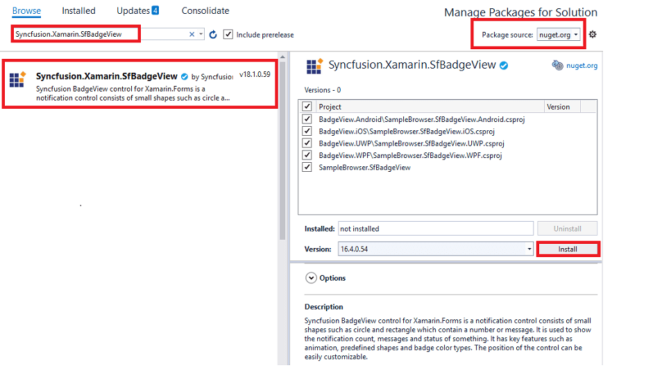
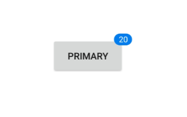

# SfBadgeView Getting Started

This section explains the steps required to configure the [`SfBadgeView`](https://help.syncfusion.com/cr/xamarin/Syncfusion.XForms.BadgeView.SfBadgeView.html) control and customize its elements.

## Assembly deployment

After installing [Essential Studio for Xamarin](https://www.syncfusion.com/downloads/xamarin), you can find all the required assemblies in the installation folders, {Syncfusion Essential Studio Installed location} \Essential Studio\{Version #}\Xamarin\lib.

E.g.: C:\Program Files (x86) \Syncfusion\Essential Studio\19.1.0.54\Xamarin\lib

N> Assemblies can be found in unzipped package location(Documents/Syncfusion/{Version #}/Xamarin/lib) in Mac.

## Adding SfBadgeView reference

You can add SfBadgeView reference using one of the following methods:

**Method 1: Adding SfBadgeView reference from nuget.org**

Syncfusion Xamarin components are available in [nuget.org](https://www.nuget.org/). To add SfBadgeView to your project, open the NuGet package manager in Visual Studio, search for [Syncfusion.Xamarin.SfBadgeView](https://www.nuget.org/packages/Syncfusion.Xamarin.SfBadgeView), and then install it.

 

N> Install the same version of SfBadgeView NuGet in all the projects.

**Method 2: Adding SfBadgeView reference from toolbox**

Syncfusion also provides Xamarin Toolbox. Using this toolbox, you can drag the SfBadgeView control to the XAML page. It will automatically install the required NuGet packages and add the namespace to the page. To install Syncfusion Xamarin Toolbox, refer to [Toolbox](https://help.syncfusion.com/xamarin/utility#toolbox).

**Method 3: Adding SfBadgeView assemblies manually from the installed location**

If you prefer to manually reference the assemblies instead referencing from NuGet, add the following assemblies in respective projects.

Location: {Installed location}/{version}/Xamarin/lib

<table>
<tr>
<td>PCL</td>
<td>Syncfusion.SfBadgeView.XForms.dll Syncfusion.Core.XForms.dll </td>
</tr>
<tr>
<td>Android</td>
<td>Syncfusion.SfBadgeView.XForms.dll Syncfusion.SfBadgeView.XForms.Android.dll Syncfusion.Core.XForms.dll
 Syncfusion.Core.XForms.Android.dll </td>
</tr>
<tr>
<td>iOS</td>
<td>Syncfusion.SfBadgeView.XForms.dll Syncfusion.SfBadgeView.XForms.iOS.dll Syncfusion.Core.XForms.dll Syncfusion.Core.XForms.iOS.dll </td>
</tr>
<tr>
<td>UWP</td>
<td>Syncfusion.SfBadgeView.XForms.dll Syncfusion.SfBadgeView.XForms.UWP.dll Syncfusion.Core.XForms.dll Syncfusion.Core.XForms.UWP.dll </td>
</tr>
<tr>
<td>WPF</td>
<td>Syncfusion.SfBadgeView.XForms.dll Syncfusion.SfBadgeView.XForms.WPF.dll Syncfusion.Core.XForms.dll Syncfusion.Core.XForms.WPF.dll </td>
</tr>
</table>

N> To know more about obtaining our components, refer to these links for [Mac](https://help.syncfusion.com/xamarin/introduction/download-and-installation/mac/) and [Windows](https://help.syncfusion.com/xamarin/introduction/download-and-installation/windows/).

I> Starting with v16.2.0.x, if you reference Syncfusion assemblies from the trial setup or from the NuGet feed, you also have to include a license key in your projects. Please refer to [Syncfusion license key](https://help.syncfusion.com/common/essential-studio/licensing/license-key/) to know about registering Syncfusion license key in your Xamarin application to use our components.

## Launching the application on each platform with badge view

To use the badge view in an application, each platform requires some additional configurations. The configurations vary from platform to platform and is discussed in the following sections:

N> If you are adding the references from toolbox, this step is not needed.

### iOS

To launch the badge view in iOS, call the SfBadgeViewRenderer.Init() in the FinishedLaunching overridden method of the AppDelegate class after the Xamarin.Forms framework has been initialized and before the LoadApplication is called as demonstrated in the following code sample.

 

public override bool FinishedLaunching(UIApplication app, NSDictionary options) 
{ 
    … 
    global::Xamarin.Forms.Forms.Init();

    // Add the below line if you are using SfBadgeView.
     Syncfusion.XForms.iOS.BadgeView.SfBadgeViewRenderer.Init();

    LoadApplication(new App()); 
    …
}



### Universal Windows Platform (UWP)

You need to initialize the badge view assemblies in App.xaml.cs in UWP project as demonstrated in the following code samples. This is required to deploy the application with badge view in `Release` mode in UWP platform.

 

// In App.xaml.cs 
protected override void OnLaunched(LaunchActivatedEventArgs e)
{ 
   … 
   if (rootFrame == null) 
   { 
      List<Assembly> assembliesToInclude = new List<Assembly>();

      // Add the below line if you are using SfBadgeView.
       assembliesToInclude.Add(typeof(Syncfusion.XForms.UWP.BadgeView.SfBadgeViewRenderer).GetTypeInfo().Assembly);

      Xamarin.Forms.Forms.Init(e, assembliesToInclude); 
   } 
  … 
}



### WPF

To launch the badge view in WPF, call the SfBadgeViewRenderer.Init() in the constructor of the MainWindow class after the Xamarin.Forms framework has been initialized and before the LoadApplication is called as demonstrated in the following code sample.

 

        public MainWindow()
        {
            InitializeComponent();
            
            Forms.Init();
            
            // Add the below line if you are using SfBadgeView.
            
            SfBadgeViewRenderer.Init();
            
            LoadApplication(new GettingStartedSample.App());
        }



### Android

The Android platform does not require any additional configuration to render the badge view.

## Adding namespace

Add the following namespace.





    xmlns:badge ="clr-namespace:Syncfusion.XForms.BadgeView;assembly=Syncfusion.SfBadgeView.XForms"





    using Syncfusion.XForms.BadgeView;





## Initializing badge view

Create an instance for the badge view control, and add it as content.





<badge:SfBadgeView>        
</badge:SfBadgeView>





//Initializing the badge view.
SfBadgeView sfBadgeView = new SfBadgeView();
Content = sfBadgeView;
	




## Adding badge text

You can add text to badge view using the [`BadgeText`](https://help.syncfusion.com/cr/xamarin/Syncfusion.XForms.BadgeView.SfBadgeView.html#Syncfusion_XForms_BadgeView_SfBadgeView_BadgeText) property.





<badge:SfBadgeView>        
    <badge:SfBadgeView BadgeText="20" />          
</badge:SfBadgeView>




   
SfBadgeView sfBadgeView = new SfBadgeView();
//Adding text to the badge view.
sfBadgeView.BadgeText = "20";
Content = sfBadgeView;





 

## Adding content

You can add an image, button, or label to the badge view using the [`Content`](https://help.syncfusion.com/cr/xamarin/Syncfusion.XForms.BadgeView.SfBadgeView.html) property.





 <badge:SfBadgeView HorizontalOptions="Center" VerticalOptions="Center" >
        <badge:SfBadgeView.Content>
            <Button Text="Primary" WidthRequest="120"  HeightRequest="60"/>
        </badge:SfBadgeView.Content>
</badge:SfBadgeView>   




	
SfBadgeView sfBadgeView = new SfBadgeView();
sfBadgeView.HorizontalOptions = LayoutOptions.Center;
sfBadgeView.VerticalOptions = LayoutOptions.Center;
//Adding image to the content of the badge view.
Button button = new Button();
button.Text = "Primary";
button.WidthRequest = 120;
button.HeightRequest = 60;
sfBadgeView.Content = button;
Content = sfBadgeView;


 


The following code sample gives you the complete code for badge view with badge types and text.





<?xml version="1.0" encoding="utf-8" ?>
<ContentPage xmlns="http://xamarin.com/schemas/2014/forms"
             xmlns:x="http://schemas.microsoft.com/winfx/2009/xaml"
             xmlns:local="clr-namespace:GettingStarted"
             x:Class="GettingStarted.MainPage"
             xmlns:badge ="clr-namespace:Syncfusion.XForms.BadgeView;assembly=Syncfusion.SfBadgeView.XForms">

    <badge:SfBadgeView HorizontalOptions="Center" VerticalOptions="Center" BadgeText="20">
        <badge:SfBadgeView.Content>
            <Button Text="Primary" WidthRequest="120"  HeightRequest="60"/>
        </badge:SfBadgeView.Content>
    </badge:SfBadgeView>
</ContentPage>





using Xamarin.Forms;
using Syncfusion.XForms.BadgeView;

namespace GettingStarted
{
    public partial class MainPage : ContentPage
    {
        public MainPage()
        {
            InitializeComponent();
            SfBadgeView sfBadgeView = new SfBadgeView();
            sfBadgeView.HorizontalOptions = LayoutOptions.Center;
            sfBadgeView.VerticalOptions = LayoutOptions.Center;
            sfBadgeView.BadgeText = "20";

            //Adding image to the content of the badge view.
            Button button = new Button();
            button.Text = "Primary";
            button.WidthRequest = 120;
            button.HeightRequest = 60;
            sfBadgeView.Content = button;
            Content = sfBadgeView;
        }
    }
}





The following screenshot illustrates the result of the above code sample.

 

You can find the complete getting started sample from this [`link`](https://github.com/SyncfusionExamples/Getting-started-xamarin-badge-view).

## See also

[How to add a custom icon to the badge in Xamarin.Forms badge view (SfBadgeView)](https://www.syncfusion.com/kb/11338/how-to-add-a-custom-icon-to-the-badge-in-xamarin-forms-badge-view-sfbadgeview)