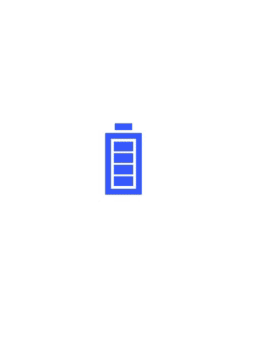

# Animation duration

The `Duration` property of SfBusyIndicator indicates timeline for completing one animation cycle. Setting smaller duration value accelerates animation speed.





<?xml version="1.0" encoding="utf-8" ?>
<ContentPage xmlns="http://xamarin.com/schemas/2014/forms"
             xmlns:x="http://schemas.microsoft.com/winfx/2009/xaml"
             xmlns:local="clr-namespace:GettingStarted"
             xmlns:busyindicator="clr-namespace:Syncfusion.SfBusyIndicator.XForms;assembly=Syncfusion.SfBusyIndicator.XForms"
             x:Class="GettingStarted.MainPage">
    <ContentPage.Content>
        <busyindicator:SfBusyIndicator x:Name="busyindicator" 
                                       AnimationType="Battery" 
                                       ViewBoxHeight="100"
                                       ViewBoxWidth="100"
                                       Duration="0.5"/>
    </ContentPage.Content>
</ContentPage>





using Syncfusion.SfBusyIndicator.XForms;
using Xamarin.Forms;

namespace GettingStarted
{
    public partial class MainPage : ContentPage
    {
        public MainPage()
        {
            InitializeComponent();
            SfBusyIndicator busyIndicator = new SfBusyIndicator()
            {
                AnimationType = AnimationTypes.Battery,
                ViewBoxWidth = 100,
                ViewBoxHeight = 100,
                Duration = 0.5f
            };

            this.Content = busyIndicator;
        }
    }
}
    




