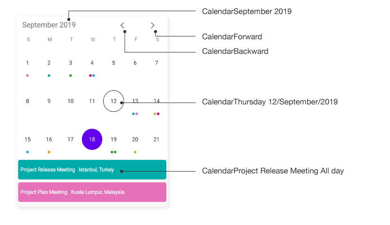
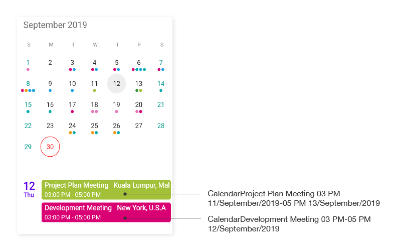
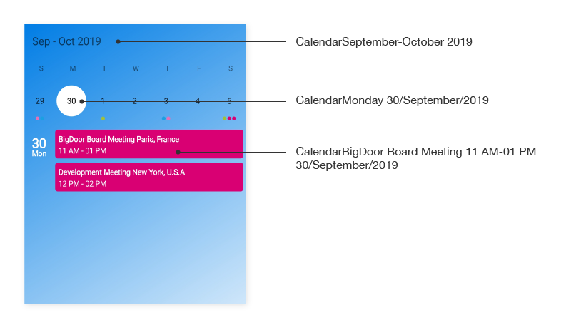
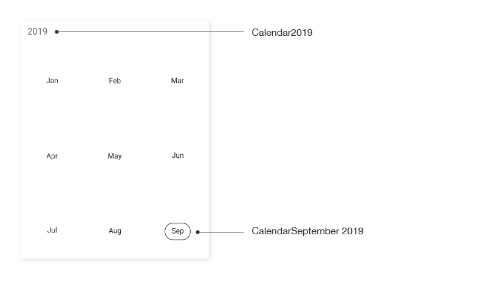
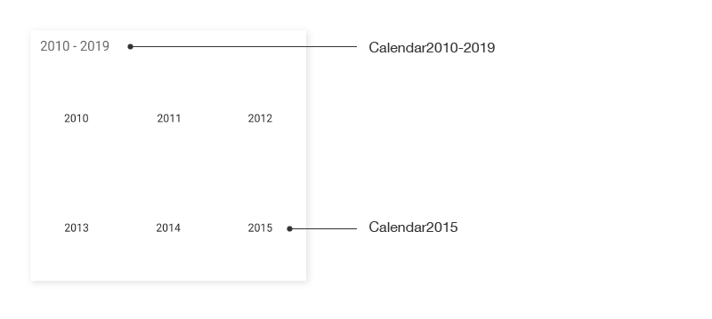
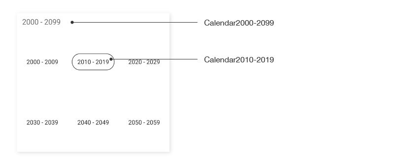

## AutomationId

The `SfCalendar` control has built-in `AutomationId` for inner elements. Please find the following table of Automation IDs for inner elements.

<table>
<tr>
<th align="center" >View</th>
<th align="center" >AutomationId Format</th>
<th align="center" >Example</th>
</tr>

<tr>
<td>MonthCell</td>
<td>dddd dd/MMMM/yyyy</td>
<td>Tuesday 27/May/2018   </td>
</tr>

<tr>
<td>Month Header - Month view</td>
<td>MMMM yyyy</td>
<td>May 2018</td>
</tr>

<tr>
<td>Month Header - Week view</td>
<td>MMMM – MMMM yyyy</td>
<td>November – December 2018 </td>
</tr>

<tr>
<td>Left Arrow</td>
<td>string</td>
<td>Backward</td>
</tr>

<tr>
<td>Right Arrow</td>
<td>string</td>
<td>Forward</td>
</tr>

<tr>
<td>Inline View , Agenda View appointment</td>
<td>Subject hh tt-hh tt dd/MMMM/yyyy</td>
<td>Consulting 10 AM-12 PM  01/July/2019</td>
</tr>

<tr>
<td>Inline View , Agenda View All day appointment</td>
<td>Subject All day</td>
<td>Consulting All day</td>
</tr>

<tr>
<td>Inline View , Agenda View Spanning appointment</td>
<td>Subject hh tt dd/MMMM/yyyy-hh tt dd/MMMM/yyyy</td>
<td>Planning 10 AM 12/August/2019-02 PM 18/August/2019</td>
</tr>

<tr>
<td>Year View - Header</td>
<td>yyyy</td>
<td>2018</td>
</tr>

<tr>
<td>Year View - Year Cell</td>
<td>MMMM yyyy</td>
<td>January 2018</td>
</tr>

<tr>
<td>Decade View - Header</td>
<td>yyyy - yyyy</td>
<td>2020 – 2029</td>
</tr>

<tr>
<td>Decade View - Year Cell</td>
<td>yyyy</td>
<td>2020</td>
</tr>

<tr>
<td>Century View - Header</td>
<td>yyyy - yyyy</td>
<td>2000 – 2099</td>
</tr>

<tr>
<td>Century View - Year Cell</td>
<td>yyyy</td>
<td>2070 – 2079</td>
</tr>

</table>

To keep unique `AutomationId`, these inner elements’ AutomationIds are updated based on the control’s `AutomationId`. For example, if you set `SfCalendar` AutomationId as `SfCalendar.AutomationId = Calendar`, then the Automation framework will interact with the `RightArrow` button as `CalendarForward`. The following screenshots denote the AutomationIds for inner elements.

### Month view

### Week view

### Year view

### Decade view

### Century view

## Keyboard
`SfCalendar` supports selection in `MonthView` using keyboard interactions. Keyboard interaction will not have any effect when the [SelectionMode](https://help.syncfusion.com/cr/xamarin/Syncfusion.SfCalendar.XForms~Syncfusion.SfCalendar.XForms.SfCalendar~SelectionMode.html) is set to `SelectionMode.MultiRangeSelection`.

>**NOTE**
Keyboard interaction is applicable only for UWP platform.

<table>
<tr>
<th>
Key
</th>
<th>
Description
</th>
</tr>
<tr>
<td>
DownArrow
</td>
<td>
Moves selection to the date directly below the currently selected date on next row.
</td>
</tr>
<tr>
<td>
UpArrow
</td>
<td>
Moves selection to the date directly above the currently selected date on previous row.
</td>
</tr>
<tr>
<td>
RightArrow
</td>
<td>
Moves the selection to the next date of the date currently selected.
</tr>
<tr>
<td>
LeftArrow
</td>
<td>
Moves the selection to the previous date of the date currently selected.
</td>
</tr>
</table>

### Shift key combinations
<table>
<tr>
<th>
Key combinations
</th>
<th>
Description
</th>
</tr>
<tr>
<td>
Shift + DownArrow
</td>
<td>
If the `SelectionMode` is `Multiple`, the date directly below the last selected date on the next row will be selected along with the currently selected dates. 
If the `SelectionMode` is `RangeSelection` and selecting dates using the keyboard, the range will be extended to the date directly below the last selected date.
</td>
</tr>
<tr>
<td>
Shift + UpArrow
</td>
<td>
If the `SelectionMode` is `Multiple`, the date directly above the last selected date on the previous row will be selected along with the currently selected dates.
If the `SelectionMode` is `RangeSelection` and selecting dates using the keyboard, the range will be extended to the date directly above the last selected date.
</td>
</tr>
<tr>
<td>
Shift + RightArrow
</td>
<td>
If the `SelectionMode` is `Multiple`, the next date of the last selected date will be selected along with the currently selected dates. 
If the `SelectionMode` is `RangeSelection` and selecting dates using the keyboard, the range will be extended to the next date of the last selected date.
</td>
</tr>
<tr>
<td>
Shift + LeftArrow
</td>
<td>
If the `SelectionMode` is `Multiple`, the previous date of the last selected date will be selected along with the currently selected dates.
If the `SelectionMode` is `RangeSelection` and selecting dates using the keyboard, the range will be extended to the previous date of the last selected date.
</td>
</tr>
</table>

### View navigations
<table>
<tr>
<th>
Key combinations
</th>
<th>
Description
</th>
</tr>
<tr>
<td>
Ctrl + Plus
</td>
<td>
`SfCalendar` `ViewMode` changes in the order of `MonthView`, `YearView`, `DecadeView`, and `CenturyView`.
</td>
</tr>
<tr>
<td>
Ctrl + Minus
</td>
<td>
`SfCalendar` `ViewMode` changes in the order of `MonthView`, `CenturyView`, `DecadeView`, and `YearView`.
</td>
</tr>
</table>