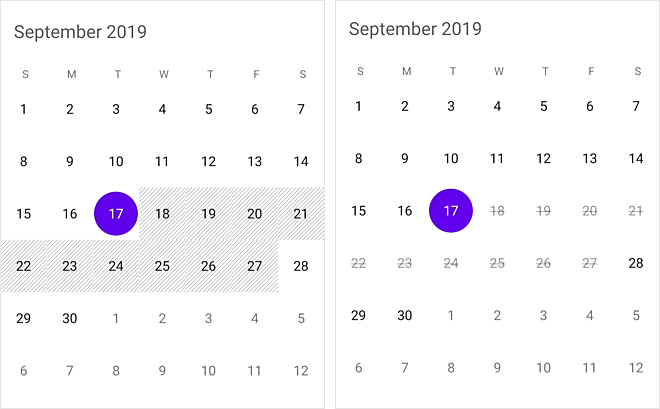
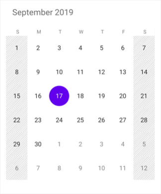
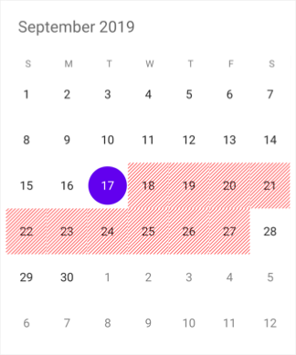

# Restrict Dates From Selection

Dates can be restricted or a collection of dates can be blacked out in `SfCalendar` Control.

## Range of Min / Max Dates

Visible dates can be restricted between certain range of dates using [MinDate](https://help.syncfusion.com/cr/xamarin/Syncfusion.SfCalendar.XForms~Syncfusion.SfCalendar.XForms.SfCalendar~MinDate.html) and [MaxDate](https://help.syncfusion.com/cr/xamarin/Syncfusion.SfCalendar.XForms~Syncfusion.SfCalendar.XForms.SfCalendar~MaxDate.html) properties available in `SfCalendar` control. It is applicable in all the calendar views.

The inline feature in month view will work only within the min max date range.

Beyond the min max date range, following restrictions will be applied.

* Date navigation features of move to date will be restricted.
* Cannot swipe the control using touch gesture.
* Selection does not work for month view.
* The tapped delegates will not be triggered while tapped on the MonthCell.
    


	
SfCalendar calendar = new SfCalendar();    
DateTime minDate=new DateTime(2015,1,1);
calendar.MinDate=minDate;
DateTime maxDate=new DateTime(2040,12,12);
calendar.MaxDate=maxDate;
this.Content = calendar;
	


## Blackout Dates

In `SfCalendar`, [BlackoutDates](https://help.syncfusion.com/cr/xamarin/Syncfusion.SfCalendar.XForms~Syncfusion.SfCalendar.XForms.SfCalendar~BlackoutDates.html) refers the disabled dates that restrict the user from selecting it. These dates will be marked with slanted `Stripes` and `Strikethrough`, by using the [BlackoutDatesViewMode](https://help.syncfusion.com/cr/xamarin/Syncfusion.SfCalendar.XForms~Syncfusion.SfCalendar.XForms.SfCalendar~BlackoutDatesViewMode.html) property. By default, the value of this property is set to `Strikethrough`.

The Blackout dates can be achieved in two ways.

A date collection can be provided to set the [BlackoutDates](https://help.syncfusion.com/cr/xamarin/Syncfusion.SfCalendar.XForms~Syncfusion.SfCalendar.XForms.SfCalendar~BlackoutDates.html). This is useful when one wants to block dates where holidays or any other events occur.

By invoking the [AddDatesInPast](https://help.syncfusion.com/cr/xamarin/Syncfusion.SfCalendar.XForms~Syncfusion.SfCalendar.XForms.SfCalendar~AddDatesInPast.html) method, all past dates will be blacked out till current date.


	
SfCalendar calendar = new SfCalendar(); 
calendar.BlackoutDatesViewMode = BlackoutDatesViewMode.Stripes;       
List<DateTime> black_Dates = new List<DateTime>();
black_Dates.Add(new DateTime(2019, 09, 18));
black_Dates.Add(new DateTime(2019, 09, 19));
black_Dates.Add(new DateTime(2019, 09, 20));
black_Dates.Add(new DateTime(2019, 09, 21));
black_Dates.Add(new DateTime(2019, 09, 22));
black_Dates.Add(new DateTime(2019, 09, 23));
black_Dates.Add(new DateTime(2019, 09, 24));
black_Dates.Add(new DateTime(2019, 09, 25));
black_Dates.Add(new DateTime(2019, 09, 26));
black_Dates.Add(new DateTime(2019, 09, 27));
calendar.BlackoutDates= black_Dates ;
this.Content = calendar;
	

	

### Dynamic Blackout dates rendering
Using[OnMonthCellLoaded](https://help.syncfusion.com/cr/cref_files/xamarin/sfcalendar/Syncfusion.SfCalendar.XForms~Syncfusion.SfCalendar.XForms.SfCalendar~OnMonthCellLoaded_EV.html) event you can render the black out dates.




private void Calendar_OnMonthCellLoaded(object sender, EventArgs e)
{
	List<DateTime> blackoutDates = new List<DateTime>();
	var dayOfWeek = e.Date.DayOfWeek;
    if(dayOfWeek==DayOfWeek.Saturday || dayOfWeek == DayOfWeek.Sunday)
    {
		blackoutDates.Add(e.Date);
		calendar.BlackoutDates = blackoutDates;
	}
}




### Customize the blackout dates Color
You can customize the color of [BlackoutDates](https://help.syncfusion.com/cr/xamarin/Syncfusion.SfCalendar.XForms~Syncfusion.SfCalendar.XForms.SfCalendar~BlackoutDates.html) in month view mode using the [BlackOutColor](https://help.syncfusion.com/cr/xamarin/Syncfusion.SfCalendar.XForms~Syncfusion.SfCalendar.XForms.MonthViewSettings~BlackoutColor.html) property of [MonthViewSettings](https://help.syncfusion.com/cr/xamarin/Syncfusion.SfCalendar.XForms~Syncfusion.SfCalendar.XForms.MonthViewSettings.html).



<syncfusion:SfCalendar x:Name="calendar">
<syncfusion:SfCalendar.MonthViewSettings>
<syncfusion:MonthViewSettings BlackOutColor="Red">
</syncfusion:SfCalendar.MonthViewSettings>
</syncfusion:SfCalendar>


SfCalendar calendar = new SfCalendar(); 
calendar.BlackoutDatesViewMode = BlackoutDatesViewMode.Stripes;  
MonthViewSettings monthViewSettings = new MonthViewSettings();
monthViewSettings.BlackOutColor = Color.Red;
calendar.MonthViewSettings = monthViewSettings;
this.Content = calendar;



