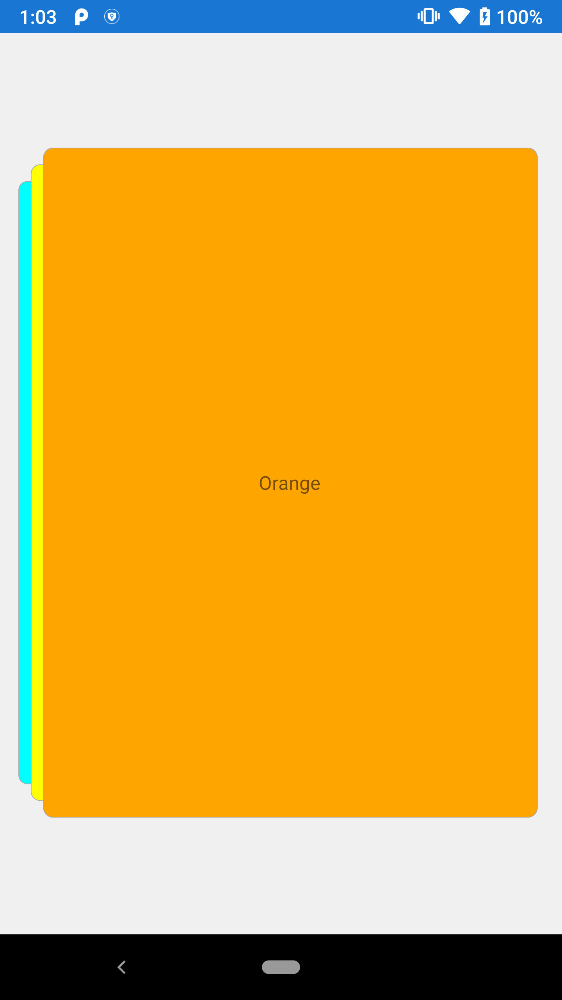

# Customization in CardLayout

### ShowSwipedCard

ShowSwipedCard can be enabled to show the swiped cards at the edge of card layout.

 



<cards:SfCardLayout ShowSwipedCard="true">
</cards:SfCardLayout>
 




SfCardLayout cardLayout = new SfCardLayout()
{
  ShowSwipedCard = true
};





### VisibleCardIndex

VisibleCardIndex is used when given index of the card to be displayed in front of the card layout.

 



<cards:SfCardLayout VisibleCardIndex="1">
</cards:SfCardLayout>
 




SfCardLayout cardLayout = new SfCardLayout()
{
  VisibleCardIndex = 1
};





### SwipeDirection

The SwipeDirection property indicates the swiping direction (left or right).

 



<cards:SfCardLayout SwipeDirection="Right">
</cards:SfCardLayout>
 




SfCardLayout cardLayout = new SfCardLayout()
{
    SwipeDirection = CardSwipeDirection.Right
};





You can find the complete getting started sample from this [link](https://github.com/SyncfusionExamples/xamarin.forms-cards).

## Customization in CardView

You can customize the border color, thickness, card corner radius by using following properties.

[BorderColor](https://help.syncfusion.com/cr/xamarin/Syncfusion.XForms.Cards.SfCardView.html#Syncfusion_XForms_Cards_SfCardView_BorderColor) - Used to customize the card view border color.

[BorderWidth](https://help.syncfusion.com/cr/xamarin/Syncfusion.XForms.Cards.SfCardView.html#Syncfusion_XForms_Cards_SfCardView_BorderWidth) - Used to customize the card view border thickness.

[CornerRadius](https://help.syncfusion.com/cr/xamarin/Syncfusion.XForms.Cards.SfCardView.html#Syncfusion_XForms_Cards_SfCardView_CornerRadius) - Used to customize the card view corner radius.

 



    <StackLayout  HorizontalOptions="Center" VerticalOptions="Center">
        <cards:SfCardView BorderColor="Black" BorderWidth="5" CornerRadius="30,0,30,0" BackgroundColor="LightPink"  >
            <StackLayout Padding="10, 10, 0, 0" >
             <Label  Text="New York" FontSize="25" />
            <Label Text="Mon 3.00PM, Sunny" TextColor="Gray"/>
            <StackLayout Orientation="Horizontal">
                <Label Text="31°" FontSize="70" Padding="0, 0, 10,0"/>
                <Image  Source="Sun.png" HeightRequest="100" WidthRequest="100"/>
            </StackLayout>
        </StackLayout>
     </cards:SfCardView>
  </StackLayout>





        StackLayout mainStack = new StackLayout()
            {
                HorizontalOptions = LayoutOptions.Center,
                VerticalOptions = LayoutOptions.Center,
                Children =
                {
                    new SfCardView(){
                    Content =  new StackLayout()
                    {
                        Padding = new Thickness(10, 10, 0, 0),
                        Children =
                        {
                            new Label(){Text = "New York" , FontSize = 25},
                            new Label(){Text = "Mon 3.00PM, Sunny" , TextColor = Color.Gray},
                            new StackLayout()
                            {
                                Orientation  = StackOrientation.Horizontal,
                                Children =
                                {
                                    new Label(){Text = "31°" , FontSize = 70, Padding = new Thickness(0,0,10,0) },
                                    new Image(){Source = "Sun.png", HeightRequest = 100, WidthRequest = 100}
                                }
                            }
                        }
                    },
                    BorderColor = Color.Black,
                    BorderWidth = 5,
                    CornerRadius = new Thickness(30, 0, 30, 0),
                    BackgroundColor = Color.LightPink
                    }
                }
            };
           




### Indicator customization

Indicators are used to indicate the state or level of something.

 



    <cards:SfCardView IndicatorColor="Cyan" HeightRequest="300" IndicatorThickness="12" IndicatorPosition="Left" >
            <Label  Text="SfCardView" VerticalTextAlignment="Center" HorizontalTextAlignment="Center"/>
        </cards:SfCardView>





SfCardView cardView = new SfCardView() 
{     
    Content = new Label() 
    { 
        Text = "SfCardView", 
        HorizontalTextAlignment = TextAlignment.Center, 
        VerticalTextAlignment =  TextAlignment.Center
    },
    IndicatorThickness = 12,
    HeightRequest = 300,
    IndicatorPosition = IndicatorPosition.Left,
    IndicatorColor = Color.Cyan
};
           





### FadeOutOnSwiping

FadeOutOnSwiping can be enabled when the card view needs to be faded with respect to swiping.

 



    <cards:SfCardView FadeOutOnSwiping="true"/>
 




SfCardView cardView = new SfCardView()
{
  FadeOutOnSwiping = true
};





N> This property won't work when adding the SfCardView as a child of SfCardLayout.

## Shadow Effect

The `CardView` control provides shadow effect support. To enable shadow effect, set the `HasShadow` property to `true`.

You can customize the color of shadow using the `ShadowColor` property.

 



<cards:SfCardView HeightRequest="300" HasShadow="True" ShadowColor="Red">
    <Label  Text="LightGray" BackgroundColor="LightGray"/>
</cards:SfCardView>





 SfCardView sfCardView = new SfCardView() 
 { 
   Content = new Label() { Text = "LightGray", BackgroundColor = Color.LightGray },
   HasShadow = true,
   ShadowColor = Color.Red
 };





N> This property will not work when adding the `SfCardView` as a child of `SfCardLayout`.

## See also

[How to remove cards from card view collection in Xamarin.Forms](https://www.syncfusion.com/kb/11655/how-to-remove-cards-from-card-view-collection-in-xamarin-forms)

[How to add multicolored stack of cards in Xamarin.Forms](https://www.syncfusion.com/kb/11660/how-to-add-multicolored-stack-of-cards-in-xamarin-forms)

[How to set shadow effect to the cards in Xamarin.Forms](https://www.syncfusion.com/kb/11651/how-to-set-shadow-effect-to-the-cards-in-xamarin-forms)

[How to add cards to the ListView in Xamarin.Forms](https://www.syncfusion.com/kb/11650/how-to-add-cards-to-the-listview-in-xamarin-forms)

[How to set the border color and width of a card within the SfCardLayout](https://www.syncfusion.com/kb/11634/how-to-set-the-border-color-and-width-of-a-card-within-the-cardlayout)

[How to reuse the dismissed cards in Xamarin.Forms SfCardView](https://www.syncfusion.com/kb/11648/how-to-reuse-the-dismissed-cards-in-xamarin-forms-sfcardview)
