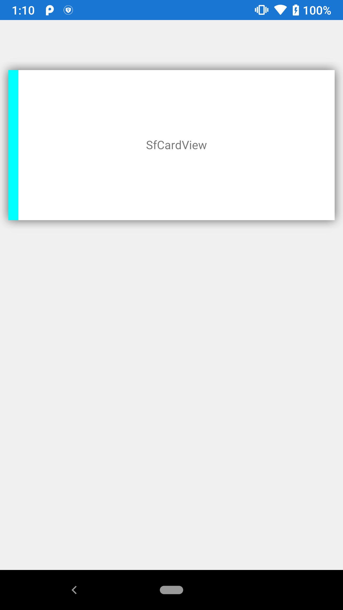

## ShowSwipedCard

ShowSwipedCard can be enabled to show the swiped cards at the edge of card layout.

 



<cards:SfCardLayout ShowSwipedCard="true">
</cards:SfCardLayout>
 




SfCardLayout cardLayout = new SfCardLayout();
cardlayout.ShowSwipedCard = true;

this.Content = cardLayout;





## VisibleCardIndex

VisibleCardIndex is used when given index of the card to be displayed in front of the card layout.

 



<cards:SfCardLayout VisibleCardIndex="1">
</cards:SfCardLayout>
 




SfCardLayout cardLayout = new SfCardLayout();
cardlayout.VisibleCardIndex = 1;

this.Content = cardLayout;





## SwipeDirection

The SwipeDirection property indicates the swiping direction (left or right).

 



<cards:SfCardLayout SwipeDirection="Right">
</cards:SfCardLayout>
 




SfCardLayout cardLayout = new SfCardLayout();
cardlayout.SwipeDirection = CardSwipeDirection.Right;

this.Content = cardLayout;





You can find the complete getting started sample from this [link](https://github.com/SyncfusionExamples/xamarin.forms-cards).

## Indicator customization

Indicators are used to indicate the state or level of something.

 



    <cards:SfCardView x:Name="cardView" IndicatorColor="Cyan" IndicatorThickness="12" IndicatorPosition="Left" />





SfCardView cardView = new SfCardView();
cardView.IndicatorThickness = 12;
cardView.IndicatorPosition = IndicatorPosition.Left;
cardView.IndicatorColor = Color.Cyan;





Refer to this [documentation](https://help.syncfusion.com/xamarin/cards/indicator) to learn more about the options available in [`Cards`](https://help.syncfusion.com/cr/cref_files/xamarin/Syncfusion.Cards.XForms~Syncfusion.Cards.XForms.SfCardView.html) to customize the indicator.

## FadeOutOnSwiping

FadeOutOnSwiping can be enabled when the card view needs to be faded with respect to swiping.

 



    <cards:SfCardView x:Name="cardView" FadeOutOnSwiping="true"/>
 




SfCardView cardView = new SfCardView(); 
cardView.FadeOutOnSwiping = true;





You can find the complete getting started sample from this [link](https://github.com/SyncfusionExamples/xamarin.forms-cards).

