# Annotation in Xamarin Charts (SfChart)

[`SfChart`](https://help.syncfusion.com/cr/xamarin/Syncfusion.SfChart.XForms.SfChart.html) supports annotations which allows you to mark the specific area of interest in the chart area. You can add text, images, and custom views. 

The following annotations are supported in [`SfChart`](https://help.syncfusion.com/cr/xamarin/Syncfusion.SfChart.XForms.SfChart.html):

*   Text annotation
*   Shape annotation
*   View annotation

## Adding Annotations

You can create an instance for any type of annotations and it can be added to [`ChartAnnotations`](https://help.syncfusion.com/cr/xamarin/Syncfusion.SfChart.XForms.SfChart.html#Syncfusion_SfChart_XForms_SfChart_ChartAnnotations) collection. Here for an instance, the [`EllipseAnnotation`](https://help.syncfusion.com/cr/xamarin/Syncfusion.SfChart.XForms.EllipseAnnotation.html) is added.

 



<chart:SfChart>
...

    <chart:SfChart.ChartAnnotations>

        <chart:EllipseAnnotation X1="2" Y1="35" X2="6" Y2="40" Text="Ellipse" />

    </chart:SfChart.ChartAnnotations>

</chart:SfChart>





SfChart chart = new SfChart();
...

EllipseAnnotation annotation = new EllipseAnnotation()
{
    X1 = 2,

    Y1 = 35,

    X2 = 6,

    Y2 = 40,

    Text = "Ellipse"
};

chart.ChartAnnotations.Add(annotation);





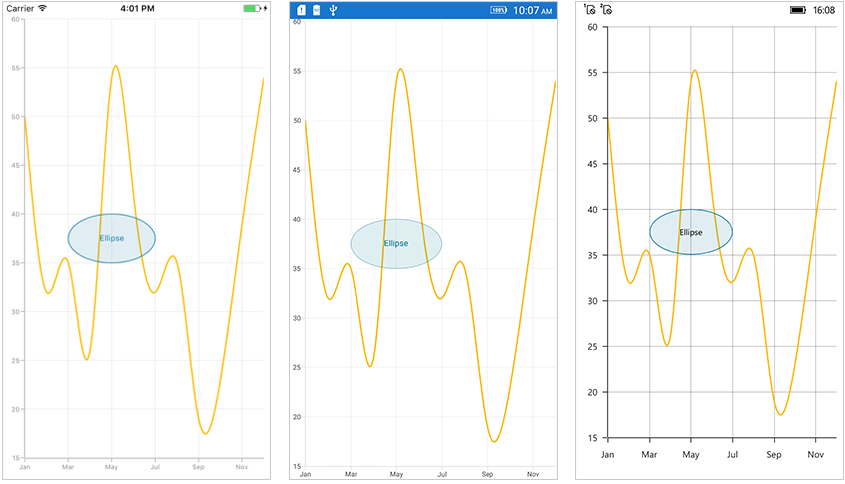

## Positioning the annotation

Annotations can be positioned in plot area based on [`X1`](https://help.syncfusion.com/cr/xamarin/Syncfusion.SfChart.XForms.ChartAnnotation.html#Syncfusion_SfChart_XForms_ChartAnnotation_X1) and [`Y1`](https://help.syncfusion.com/cr/xamarin/Syncfusion.SfChart.XForms.ChartAnnotation.html#Syncfusion_SfChart_XForms_ChartAnnotation_Y1) properties. For shape annotations, specify `X2` and `Y2` properties, if needed. The `X` and `Y` values can be specified with axis units or pixel units, and these can be identified by using [`CoordinateUnit`](https://help.syncfusion.com/cr/xamarin/Syncfusion.SfChart.XForms.ChartAnnotation.html#Syncfusion_SfChart_XForms_ChartAnnotation_CoordinateUnit) property.
 
### Positioning based on CoordinateUnit as axis

To position the annotation based on axis, set the [`X1`](https://help.syncfusion.com/cr/xamarin/Syncfusion.SfChart.XForms.ChartAnnotation.html#Syncfusion_SfChart_XForms_ChartAnnotation_X1) and [`Y1`](https://help.syncfusion.com/cr/xamarin/Syncfusion.SfChart.XForms.ChartAnnotation.html#Syncfusion_SfChart_XForms_ChartAnnotation_Y1), `X2` and `Y2` properties based on axis range values, if needed, set the [`CoordinateUnit`](https://help.syncfusion.com/cr/xamarin/Syncfusion.SfChart.XForms.ChartAnnotation.html#Syncfusion_SfChart_XForms_ChartAnnotation_CoordinateUnit) value as [`Axis`](https://help.syncfusion.com/cr/xamarin/Syncfusion.SfChart.XForms.ChartCoordinateUnit.html).

 



<chart:SfChart>
...

    <chart:SfChart.ChartAnnotations>

        <chart:RectangleAnnotation X1="4" Y1="40" X2="8" Y2="45" Text="Axis Value" CoordinateUnit="Axis" />

    </chart:SfChart.ChartAnnotations>

</chart:SfChart>





SfChart chart = new SfChart();
...

RectangleAnnotation annotation = new RectangleAnnotation()
{

    X1 = 4,

    Y1 = 40,

    X2 = 8,

    Y2 = 45,

    Text = "Axis Value",

    CoordinateUnit = ChartCoordinateUnit.Axis
};

chart.ChartAnnotations.Add(annotation);





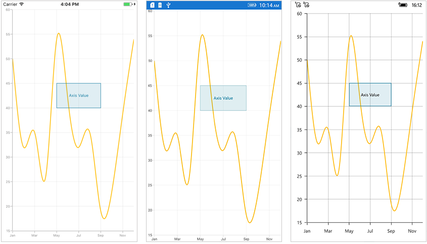

### Positioning based on CoordinateUnit as pixels

To position the annotation based on the pixel values, set the [`CoordinateUnit`](https://help.syncfusion.com/cr/xamarin/Syncfusion.SfChart.XForms.ChartAnnotation.html#Syncfusion_SfChart_XForms_ChartAnnotation_CoordinateUnit) value as [`Pixels`](https://help.syncfusion.com/cr/xamarin/Syncfusion.SfChart.XForms.ChartCoordinateUnit.html), and the pixel values in [`X1`](https://help.syncfusion.com/cr/xamarin/Syncfusion.SfChart.XForms.ChartAnnotation.html#Syncfusion_SfChart_XForms_ChartAnnotation_X1) and [`Y1`](https://help.syncfusion.com/cr/xamarin/Syncfusion.SfChart.XForms.ChartAnnotation.html#Syncfusion_SfChart_XForms_ChartAnnotation_Y1), `X2` and `Y2` properties of annotation are shown in the following code snippet,

 



<chart:SfChart>
...

    <chart:SfChart.ChartAnnotations>

        <chart:RectangleAnnotation X1="1" Y1="1" X2="150" Y2="150" Text="Pixel Value" CoordinateUnit="Pixels" />

    </chart:SfChart.ChartAnnotations>

</chart:SfChart>





SfChart chart = new SfChart();
...

RectangleAnnotation annotation = new RectangleAnnotation()
{

    X1 = 1,

    Y1 = 1,

    X2 = 150,

    Y2 = 150,

    Text = "Pixel Value",

    CoordinateUnit = ChartCoordinateUnit.Pixels
};

chart.ChartAnnotations.Add(annotation); 





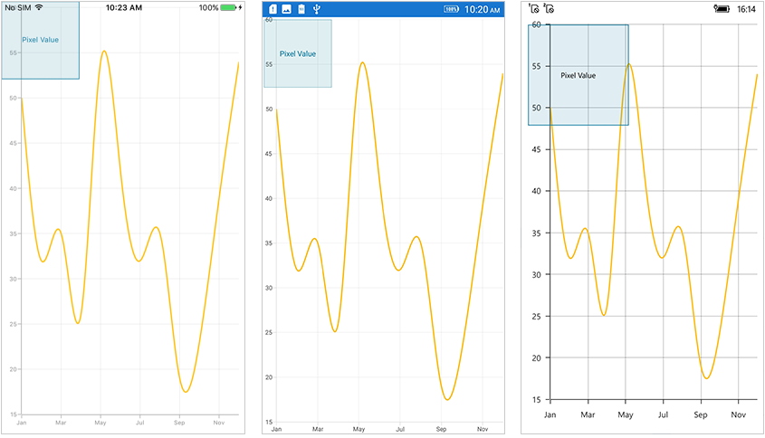

## Adding annotation for multiple axes

When there are multiple axes, annotation also can be added for a particular axis by using the [`XAxisName`](https://help.syncfusion.com/cr/xamarin/Syncfusion.SfChart.XForms.ChartAnnotation.html#Syncfusion_SfChart_XForms_ChartAnnotation_XAxisName) and [`YAxisName`](https://help.syncfusion.com/cr/xamarin/Syncfusion.SfChart.XForms.ChartAnnotation.html#Syncfusion_SfChart_XForms_ChartAnnotation_YAxisName) properties. It can be shown in the below code snippet,

 



<chart:SfChart>
...

    <chart:SfChart.ChartAnnotations>

        <chart:EllipseAnnotation X1="4" Y1="30" X2="8" Y2="35" YAxisName="Yaxis"/>

    </chart:SfChart.ChartAnnotations>

    <chart:SfChart.Series>

        <chart:SplineSeries ItemsSource="{Binding Data}" XBindingPath="Name" YBindingPath="Value">

            <chart:SplineSeries.YAxis>

                <chart:NumericalAxis Name="Yaxis" OpposedPosition="true"/>

            </chart:SplineSeries.YAxis>

        </chart:SplineSeries>

    </chart:SfChart.Series>

</chart:SfChart>





SfChart chart = new SfChart();
...

EllipseAnnotation annotation = new EllipseAnnotation()
{
    X1 = 4,

    Y1 = 30,

    X2 = 8,

    Y2 = 35,

    YAxisName = "YAxis"
};

chart.ChartAnnotations.Add(annotation);

SplineSeries series = new SplineSeries()
{
    ItemsSource = model.Data,

    XBindingPath = "Name",

    YBindingPath = "Value",

    YAxis = new NumericalAxis()
    {

        OpposedPosition = true,

        Name = "YAxis"
    }
};

chart.Series.Add(series);





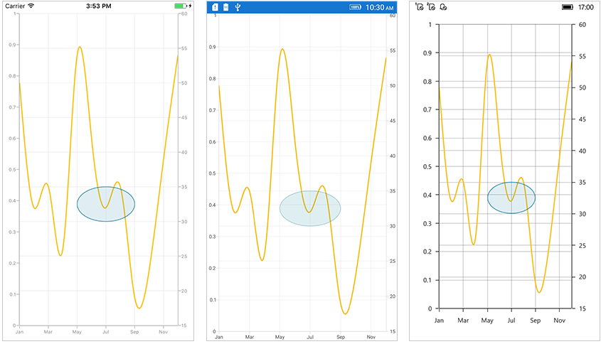

## Text annotation

The [`TextAnnotation`](https://help.syncfusion.com/cr/xamarin/Syncfusion.SfChart.XForms.TextAnnotation.html) is used to add simple text with the help of [`Text`](https://help.syncfusion.com/cr/xamarin/Syncfusion.SfChart.XForms.TextAnnotation.html#Syncfusion_SfChart_XForms_TextAnnotation_Text) property in specific points over the [`Chart`](https://help.syncfusion.com/cr/xamarin/Syncfusion.SfChart.XForms.ChartAnnotation.html#Syncfusion_SfChart_XForms_ChartAnnotation_Chart) area.

 



<chart:SfChart>
...

    <chart:SfChart.ChartAnnotations>

        <chart:TextAnnotation X1="7" Y1="35" Text="August" />

    </chart:SfChart.ChartAnnotations> 

</chart:SfChart>





SfChart chart = new SfChart();
...

TextAnnotation annotation = new TextAnnotation()
{
    X1 = 7,

    Y1 = 35,

    Text = "August"
};

chart.ChartAnnotations.Add(annotation);





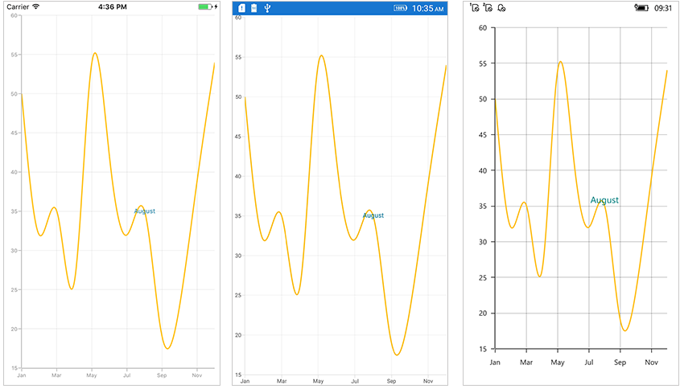

### Customizing text annotation

The [`TextAnnotation`](https://help.syncfusion.com/cr/xamarin/Syncfusion.SfChart.XForms.TextAnnotation.html) can be customized by using the [`LabelStyle`](https://help.syncfusion.com/cr/xamarin/Syncfusion.SfChart.XForms.TextAnnotation.html#Syncfusion_SfChart_XForms_TextAnnotation_LabelStyle) property. The following properties are used to customize the text:

*   [`TextColor`](https://help.syncfusion.com/cr/xamarin/Syncfusion.SfChart.XForms.ChartLabelStyle.html#Syncfusion_SfChart_XForms_ChartLabelStyle_TextColor) - Used to change the text color.
*   [`BackgroundColor`](https://help.syncfusion.com/cr/xamarin/Syncfusion.SfChart.XForms.ChartLabelStyle.html#Syncfusion_SfChart_XForms_ChartLabelStyle_BackgroundColor) - Used to change the background color of the text.
*   [`Margin`](https://help.syncfusion.com/cr/xamarin/Syncfusion.SfChart.XForms.ChartLabelStyle.html#Syncfusion_SfChart_XForms_ChartLabelStyle_Margin) - Used to set the margin for text.
*   [`BorderThickness`](https://help.syncfusion.com/cr/xamarin/Syncfusion.SfChart.XForms.ChartLabelStyle.html#Syncfusion_SfChart_XForms_ChartLabelStyle_BorderThickness) - Used to change the text border thickness.
*   [`BorderColor`](https://help.syncfusion.com/cr/xamarin/Syncfusion.SfChart.XForms.ChartLabelStyle.html#Syncfusion_SfChart_XForms_ChartLabelStyle_BorderColor) - Used to change the border color of the text.
* [`Font`](https://help.syncfusion.com/cr/xamarin/Syncfusion.SfChart.XForms.ChartLabelStyle.html#Syncfusion_SfChart_XForms_ChartLabelStyle_Font) – used to change the text size, font family, and font weight. (This is deprecated API. Use FontSize, FontFamily, and FontAttributes properties instead of this.)
* [`FontFamily`](https://help.syncfusion.com/cr/xamarin/Syncfusion.SfChart.XForms.ChartLabelStyle.html#Syncfusion_SfChart_XForms_ChartLabelStyle_FontFamily) - used to change the font family of the text.
* [`FontAttributes`](https://help.syncfusion.com/cr/xamarin/Syncfusion.SfChart.XForms.ChartLabelStyle.html#Syncfusion_SfChart_XForms_ChartLabelStyle_FontAttributes) - used to change the font style of the text.
* [`FontSize`](https://help.syncfusion.com/cr/xamarin/Syncfusion.SfChart.XForms.ChartLabelStyle.html#Syncfusion_SfChart_XForms_ChartLabelStyle_FontSize) - used to change the font size of the text.
*   [`HorizontalTextAlignment`](https://help.syncfusion.com/cr/xamarin/Syncfusion.SfChart.XForms.ChartAnnotationLabelStyle.html#Syncfusion_SfChart_XForms_ChartAnnotationLabelStyle_HorizontalTextAlignment) - Used to align the text horizontally at the [`Start`](https://help.syncfusion.com/cr/xamarin/Syncfusion.SfChart.XForms.ChartAnnotationAlignment.html), [`Center`](https://help.syncfusion.com/cr/xamarin/Syncfusion.SfChart.XForms.ChartAnnotationAlignment.html) and [`End`](https://help.syncfusion.com/cr/xamarin/Syncfusion.SfChart.XForms.ChartAnnotationAlignment.html).
*   [`VerticalTextAlignment`](https://help.syncfusion.com/cr/xamarin/Syncfusion.SfChart.XForms.ChartAnnotationLabelStyle.html#Syncfusion_SfChart_XForms_ChartAnnotationLabelStyle_VerticalTextAlignment) - Used to align the text vertically at the [`Start`](https://help.syncfusion.com/cr/xamarin/Syncfusion.SfChart.XForms.ChartAnnotationAlignment.html), [`Center`](https://help.syncfusion.com/cr/xamarin/Syncfusion.SfChart.XForms.ChartAnnotationAlignment.html) and [`End`](https://help.syncfusion.com/cr/xamarin/Syncfusion.SfChart.XForms.ChartAnnotationAlignment.html).

 



<chart:SfChart>
...

    <chart:SfChart.ChartAnnotations>

        <chart:TextAnnotation X1="7" Y1="35" Text="August">

            <chart:TextAnnotation.LabelStyle>

                <chart:ChartAnnotationLabelStyle Margin="5" FontSize="16" FontAttributes="Italic" BorderColor="Red" BorderThickness="2" BackgroundColor="Teal" TextColor="White" VerticalTextAlignment="Start"/>

            </chart:TextAnnotation.LabelStyle>

        </chart:TextAnnotation>

    </chart:SfChart.ChartAnnotations> 

</chart:SfChart>





SfChart chart = new SfChart();
...

TextAnnotation annotation = new TextAnnotation()
{
    X1 = 7,

    Y1 = 35,

    Text = "August"
};

annotation.LabelStyle = new ChartAnnotationLabelStyle()
{
    Margin = new Thickness(5),

    FontSize = 16,

    FontAttributes = FontAttributes.Italic,

    BorderColor = Color.Red,

    BorderThickness = new Thickness(2),

    BackgroundColor = Color.Teal,

    TextColor = Color.White,

    VerticalTextAlignment = ChartAnnotationAlignment.Start
}; 

chart.ChartAnnotations.Add(annotation); 





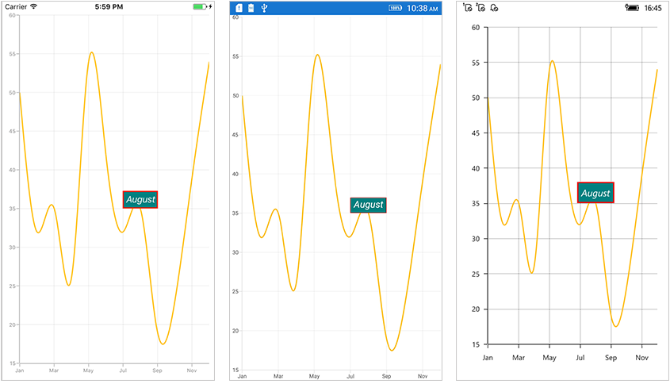

## Shape annotation

The [`ShapeAnnotation`](https://help.syncfusion.com/cr/xamarin/Syncfusion.SfChart.XForms.ShapeAnnotation.html) allows you to add annotations in the form of shapes such as rectangle, ellipse, horizontal line, vertical line, etc., at the specific area of interest in the chart area.

*   [`RectangleAnnotation`](https://help.syncfusion.com/cr/xamarin/Syncfusion.SfChart.XForms.RectangleAnnotation.html) - Used to draw a rectangle over the chart area.
*   [`EllipseAnnotation`](https://help.syncfusion.com/cr/xamarin/Syncfusion.SfChart.XForms.EllipseAnnotation.html) - Used to draw a circle or an ellipse over the chart area.
*   [`LineAnnotation`](https://help.syncfusion.com/cr/xamarin/Syncfusion.SfChart.XForms.LineAnnotation.html) - Used to draw a line over the chart area.
*   [`VerticalLineAnnotation`](https://help.syncfusion.com/cr/xamarin/Syncfusion.SfChart.XForms.VerticalLineAnnotation.html) - Used to draw a vertical line across the chart area.
*   [`HorizontalLineAnnotation`](https://help.syncfusion.com/cr/xamarin/Syncfusion.SfChart.XForms.HorizontalLineAnnotation.html) - Used to draw a horizontal line across the chart area.

The following APIs are commonly used in all [`ShapeAnnotation`](https://help.syncfusion.com/cr/xamarin/Syncfusion.SfChart.XForms.ShapeAnnotation.html):

*   [`X2`](https://help.syncfusion.com/cr/xamarin/Syncfusion.SfChart.XForms.ShapeAnnotation.html#Syncfusion_SfChart_XForms_ShapeAnnotation_X2) - Represents the X2 coordinate of the shape annotation.
*   [`Y2`](https://help.syncfusion.com/cr/xamarin/Syncfusion.SfChart.XForms.ShapeAnnotation.html#Syncfusion_SfChart_XForms_ShapeAnnotation_Y2) - Represents the Y2 coordinate of the shape annotation.
*   [`FillColor`](https://help.syncfusion.com/cr/xamarin/Syncfusion.SfChart.XForms.ShapeAnnotation.html#Syncfusion_SfChart_XForms_ShapeAnnotation_FillColor) - Represents the inside background color of the shape annotation.
*   [`StrokeColor`](https://help.syncfusion.com/cr/xamarin/Syncfusion.SfChart.XForms.ShapeAnnotation.html#Syncfusion_SfChart_XForms_ShapeAnnotation_StrokeColor) - Represents the stroke color of the shape annotation.
*   [`StrokeWidth`](https://help.syncfusion.com/cr/xamarin/Syncfusion.SfChart.XForms.ShapeAnnotation.html#Syncfusion_SfChart_XForms_ShapeAnnotation_StrokeWidth) - Represents the stroke width of the shape annotation.
*   [`StrokeDashArray`](https://help.syncfusion.com/cr/xamarin/Syncfusion.SfChart.XForms.ShapeAnnotation.html#Syncfusion_SfChart_XForms_ShapeAnnotation_StrokeDashArray) - Represents the stroke dashes of the shape annotation.
*   [`Text`](https://help.syncfusion.com/cr/xamarin/Syncfusion.SfChart.XForms.ShapeAnnotation.html#Syncfusion_SfChart_XForms_ShapeAnnotation_Text) - Represents the annotation text of the shape annotation.
*   [`LabelStyle`](https://help.syncfusion.com/cr/xamarin/Syncfusion.SfChart.XForms.ShapeAnnotation.html#Syncfusion_SfChart_XForms_ShapeAnnotation_LabelStyle) - Represents the style for customizing the annotation text of shape annotation.

### Rectangle annotation

The [`RectangleAnnotation`](https://help.syncfusion.com/cr/xamarin/Syncfusion.SfChart.XForms.RectangleAnnotation.html) is used to draw a rectangle or a square in specific points over the chart area.

 



<chart:SfChart>
...

    <chart:SfChart.ChartAnnotations>

        <chart:RectangleAnnotation X1="4" Y1="20" X2="6" Y2="55"/>

    </chart:SfChart.ChartAnnotations> 

</chart:SfChart>





SfChart chart = new SfChart();
...

RectangleAnnotation annotation = new RectangleAnnotation()
{
    X1 = 4,

    Y1 = 20,

    X2 = 6,

    Y2 = 55,
};

chart.ChartAnnotations.Add(annotation); 





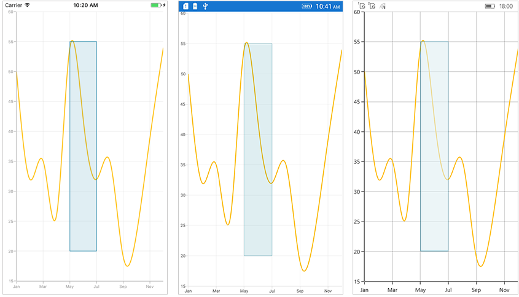

### Ellipse annotation

The [`EllipseAnnotation`](https://help.syncfusion.com/cr/xamarin/Syncfusion.SfChart.XForms.EllipseAnnotation.html) is used to draw an oval or a circle in specific points over the chart area. You can also specify the height and width of [`EllipseAnnotation`](https://help.syncfusion.com/cr/xamarin/Syncfusion.SfChart.XForms.EllipseAnnotation.html) by using the [`Height`](https://help.syncfusion.com/cr/xamarin/Syncfusion.SfChart.XForms.EllipseAnnotation.html#Syncfusion_SfChart_XForms_EllipseAnnotation_Height) and [`Width`](https://help.syncfusion.com/cr/xamarin/Syncfusion.SfChart.XForms.EllipseAnnotation.html#Syncfusion_SfChart_XForms_EllipseAnnotation_Width) properties respectively.

 



<chart:SfChart>
...

    <chart:SfChart.ChartAnnotations>

        <chart:EllipseAnnotation X1="6" Y1="32" Height="30" Width="30"/>

    </chart:SfChart.ChartAnnotations> 
     
</chart:SfChart>





SfChart chart = new SfChart();
...

EllipseAnnotation annotation = new EllipseAnnotation()
{
    X1 = 6,

    Y1 = 32,

    Height = 30,

    Width = 30
};

chart.ChartAnnotations.Add(annotation); 





N> When `X2` and `Y2` properties of `EllipseAnnotation` are set, the `Height` and `Width` properties do not work.

### Line annotation

The [`LineAnnotation`](https://help.syncfusion.com/cr/xamarin/Syncfusion.SfChart.XForms.LineAnnotation.html) is used to draw a line in specific points over the chart area. 

 



<chart:SfChart>
...

    <chart:SfChart.ChartAnnotations>

        <chart:LineAnnotation X1="2" Y1="35" X2="8" Y2="45" Text="Line"/>

    </chart:SfChart.ChartAnnotations>  
     
</chart:SfChart>





SfChart chart = new SfChart();
...

LineAnnotation annotation = new LineAnnotation()
{
    X1 = 2,

    Y1 = 35,

    X2 = 8,

    Y2 = 45,

    Text = "Line"
};

chart.ChartAnnotations.Add(annotation); 





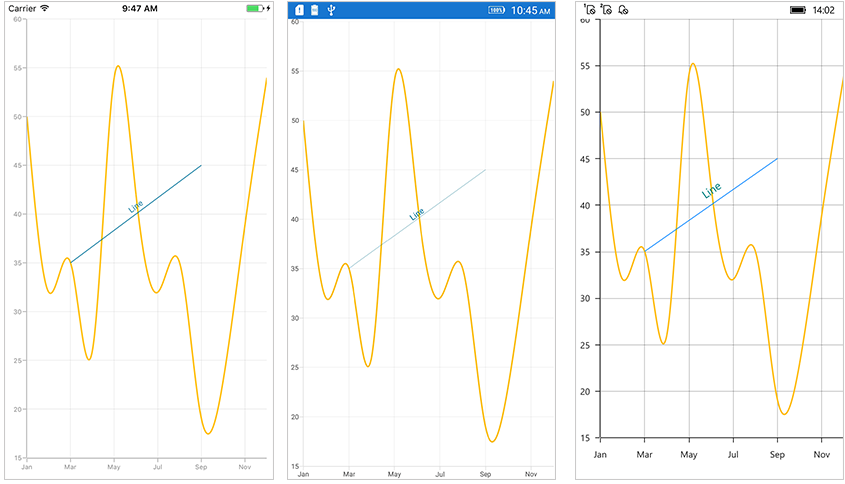

**Adding arrow to line annotation**

To display single headed arrow, set the [`LineCap`](https://help.syncfusion.com/cr/xamarin/Syncfusion.SfChart.XForms.LineAnnotation.html#Syncfusion_SfChart_XForms_LineAnnotation_LineCap) property to [`Arrow`](https://help.syncfusion.com/cr/xamarin/Syncfusion.SfChart.XForms.ChartLineCap.html). The default value of the [`LineCap`](https://help.syncfusion.com/cr/xamarin/Syncfusion.SfChart.XForms.LineAnnotation.html#Syncfusion_SfChart_XForms_LineAnnotation_LineCap) property is [`None`](https://help.syncfusion.com/cr/xamarin/Syncfusion.SfChart.XForms.ChartLineCap.html).

 



<chart:SfChart>
...

    <chart:SfChart.ChartAnnotations>

        <chart:LineAnnotation X1="2" Y1="40" X2="10" Y2="40" LineCap="Arrow"/>

    </chart:SfChart.ChartAnnotations> 
  
</chart:SfChart>





SfChart chart = new SfChart();
...

LineAnnotation annotation = new LineAnnotation()
{
    X1 = 2,

    Y1 = 40,

    X2 = 10,

    Y2 = 40,

    LineCap = ChartLineCap.Arrow
};

chart.ChartAnnotations.Add(annotation); 





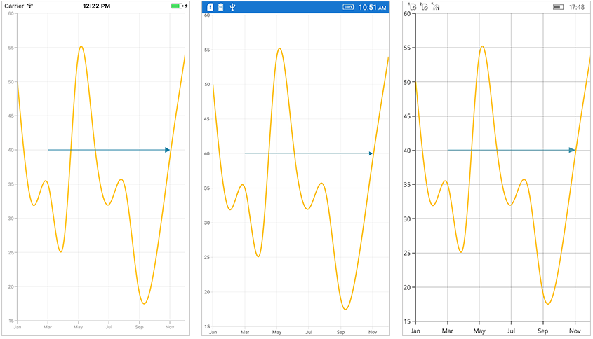

### Vertical and Horizontal line annotation

The [`VerticalLineAnnotation`](https://help.syncfusion.com/cr/xamarin/Syncfusion.SfChart.XForms.VerticalLineAnnotation.html) and [`HorizontalLineAnnotation`](https://help.syncfusion.com/cr/xamarin/Syncfusion.SfChart.XForms.HorizontalLineAnnotation.html) are used to draw vertical and horizontal lines in specific points over the chart area.

 



<chart:SfChart>
...

    <chart:SfChart.ChartAnnotations>

        <chart:VerticalLineAnnotation X1="6" />

        <chart:HorizontalLineAnnotation Y1="35" />

    </chart:SfChart.ChartAnnotations> 
  
</chart:SfChart>





SfChart chart = new SfChart();
...

VerticalLineAnnotation vertical = new VerticalLineAnnotation()
{
    X1 = 6,
};

chart.ChartAnnotations.Add(vertical);

HorizontalLineAnnotation horizontal = new HorizontalLineAnnotation()
{
    Y1 = 35
};

chart.ChartAnnotations.Add(horizontal);





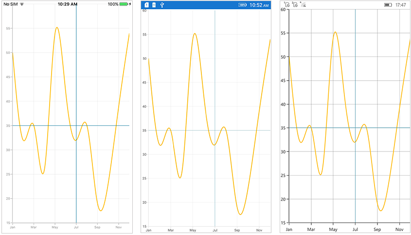

**Displaying axis label for vertical and horizontal line annotations**

The [`VerticalLineAnnotation`](https://help.syncfusion.com/cr/xamarin/Syncfusion.SfChart.XForms.VerticalLineAnnotation.html) and [`HorizontalLineAnnotation`](https://help.syncfusion.com/cr/xamarin/Syncfusion.SfChart.XForms.HorizontalLineAnnotation.html) display the axis labels in which the line is placed. This feature can be enabled by setting the [`ShowAxisLabel`](https://help.syncfusion.com/cr/xamarin/Syncfusion.SfChart.XForms.VerticalLineAnnotation.html#Syncfusion_SfChart_XForms_VerticalLineAnnotation_ShowAxisLabel) property to `true` as shown in the below code snippet,

 



<chart:SfChart>
...

    <chart:SfChart.ChartAnnotations>

        <chart:VerticalLineAnnotation X1="6" ShowAxisLabel="true"/>

        <chart:HorizontalLineAnnotation Y1="35" ShowAxisLabel="true"/>

    </chart:SfChart.ChartAnnotations> 
  
</chart:SfChart>





SfChart chart = new SfChart();
...

VerticalLineAnnotation vertical = new VerticalLineAnnotation()
{
    X1 = 6,

    ShowAxisLabel = true
};

chart.ChartAnnotations.Add(vertical );

HorizontalLineAnnotation horizontal = new HorizontalLineAnnotation()
{
    Y1 = 35,

    ShowAxisLabel = true
};

chart.ChartAnnotations.Add(horizontal);





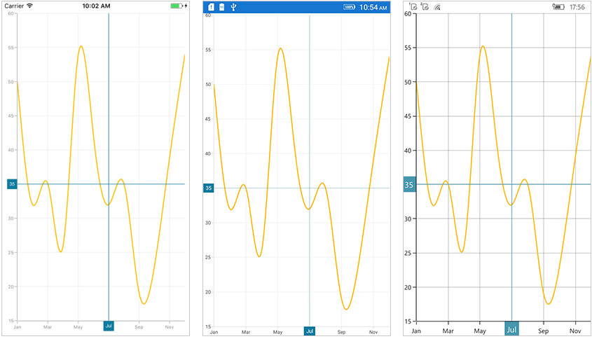

**Customizing axis label**

The default appearance of the axis label also can be customized by using the [`AxisLabelStyle`](https://help.syncfusion.com/cr/xamarin/Syncfusion.SfChart.XForms.VerticalLineAnnotation.html#Syncfusion_SfChart_XForms_VerticalLineAnnotation_AxisLabelStyle) property. The following 2 types of styles are used to customize the axis label.

The [`ChartLabelStyle`](https://help.syncfusion.com/cr/xamarin/Syncfusion.SfChart.XForms.ChartLabelStyle.html) property allows you to customize the axis labels by changing the font family, font size, font attributes, and text color. It is the [`AxisLabelStyle`](https://help.syncfusion.com/cr/xamarin/Syncfusion.SfChart.XForms.VerticalLineAnnotation.html#Syncfusion_SfChart_XForms_VerticalLineAnnotation_AxisLabelStyle) property's default style. The following properties can be used to customize the axis label:

*   [`TextColor`](https://help.syncfusion.com/cr/xamarin/Syncfusion.SfChart.XForms.ChartLabelStyle.html#Syncfusion_SfChart_XForms_ChartLabelStyle_TextColor) - Used to change the text color.
*   [`BackgroundColor`](https://help.syncfusion.com/cr/xamarin/Syncfusion.SfChart.XForms.ChartLabelStyle.html#Syncfusion_SfChart_XForms_ChartLabelStyle_BackgroundColor) - Used to change the background color of the text.
*   [`Margin`](https://help.syncfusion.com/cr/xamarin/Syncfusion.SfChart.XForms.ChartLabelStyle.html#Syncfusion_SfChart_XForms_ChartLabelStyle_Margin) - Used to set the margin for text.
*   [`BorderThickness`](https://help.syncfusion.com/cr/xamarin/Syncfusion.SfChart.XForms.ChartLabelStyle.html#Syncfusion_SfChart_XForms_ChartLabelStyle_BorderThickness) - Used to change the text border thickness.
*   [`BorderColor`](https://help.syncfusion.com/cr/xamarin/Syncfusion.SfChart.XForms.ChartLabelStyle.html#Syncfusion_SfChart_XForms_ChartLabelStyle_BorderColor) - Used to change the border color of the text.
* [`Font`](https://help.syncfusion.com/cr/xamarin/Syncfusion.SfChart.XForms.ChartLabelStyle.html#Syncfusion_SfChart_XForms_ChartLabelStyle_Font) – used to change the text size, font family, and font weight. (This is deprecated API. Use FontSize, FontFamily, and FontAttributes properties instead of this.)
* [`FontFamily`](https://help.syncfusion.com/cr/xamarin/Syncfusion.SfChart.XForms.ChartLabelStyle.html#Syncfusion_SfChart_XForms_ChartLabelStyle_FontFamily) - used to change the font family for the text.
* [`FontAttributes`](https://help.syncfusion.com/cr/xamarin/Syncfusion.SfChart.XForms.ChartLabelStyle.html#Syncfusion_SfChart_XForms_ChartLabelStyle_FontAttributes) - used to change the font style for the text.
* [`FontSize`](https://help.syncfusion.com/cr/xamarin/Syncfusion.SfChart.XForms.ChartLabelStyle.html#Syncfusion_SfChart_XForms_ChartLabelStyle_FontSize) - used to change the font size for the text.

 



<chart:SfChart>
...

    <chart:SfChart.ChartAnnotations>

        <chart:VerticalLineAnnotation X1="6" ShowAxisLabel="true">

            <chart:VerticalLineAnnotation.AxisLabelStyle>

                <chart:ChartLabelStyle Margin="5" FontSize="12" FontAttributes="Italic" BorderColor="Blue" BorderThickness="2" BackgroundColor="Red" TextColor="White"/>

            </chart:VerticalLineAnnotation.AxisLabelStyle>

        </chart:VerticalLineAnnotation>
                
        <chart:HorizontalLineAnnotation Y1="35" ShowAxisLabel="true">

            <chart:HorizontalLineAnnotation.AxisLabelStyle>

                <chart:ChartLabelStyle Margin="5" FontSize="12" FontAttributes="Italic" BorderColor="Blue" BorderThickness="2" BackgroundColor="Red" TextColor="White"/>

            </chart:HorizontalLineAnnotation.AxisLabelStyle>

        </chart:HorizontalLineAnnotation>

    </chart:SfChart.ChartAnnotations>
      
</chart:SfChart>





SfChart chart = new SfChart();
...

VerticalLineAnnotation vertical = new VerticalLineAnnotation()
{
    X1 = 6,

    ShowAxisLabel = true
};

vertical.AxisLabelStyle = new ChartLabelStyle()
{
    Margin = new Thickness(5),

     FontSize = 12,

    FontAttributes = FontAttributes.Italic,

    BorderColor = Color.Blue,

    BorderThickness = new Thickness(2),

    BackgroundColor = Color.Red,

    TextColor = Color.White
};

chart.ChartAnnotations.Add(vertical);

HorizontalLineAnnotation horizontal = new HorizontalLineAnnotation()
{
    Y1 = 35,

    ShowAxisLabel = true
};

horizontal.AxisLabelStyle = new ChartLabelStyle()
{
    Margin = new Thickness(5),

    FontSize = 12,

    FontAttributes = FontAttributes.Italic,

    BorderColor = Color.Blue,

    BorderThickness = new Thickness(2),

    BackgroundColor = Color.Red,

    TextColor = Color.White
};

chart.ChartAnnotations.Add(horizontal);





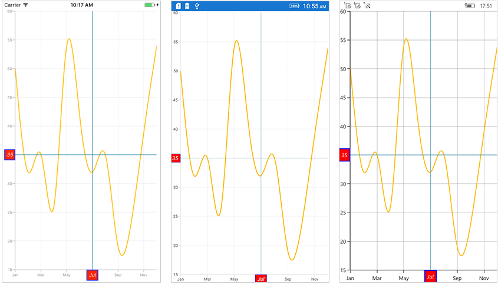

The [`ChartAxisLabelStyle`](https://help.syncfusion.com/cr/xamarin/Syncfusion.SfChart.XForms.ChartAxisLabelStyle.html) allows you to customize axis label by changing the label alignment, label position, corner radius, and max width. And also customize the Font family, font size, font attributes, and text color are all included in the ChartLabelStyle properties. The following properties can be used to customize the axis label:

* [`LabelAlignment`](https://help.syncfusion.com/cr/xamarin/Syncfusion.SfChart.XForms.ChartAxisLabelStyle.html#Syncfusion_SfChart_XForms_ChartAxisLabelStyle_LabelAlignment): Used to align the label at the [`Start`](https://help.syncfusion.com/cr/xamarin/Syncfusion.SfChart.XForms.ChartAxisLabelAlignment.html), [`Center`](https://help.syncfusion.com/cr/xamarin/Syncfusion.SfChart.XForms.ChartAxisLabelAlignment.html), or [`End`](https://help.syncfusion.com/cr/xamarin/Syncfusion.SfChart.XForms.ChartAxisLabelAlignment.html).
* [`LabelsPosition`](https://help.syncfusion.com/cr/xamarin/Syncfusion.SfChart.XForms.ChartAxisLabelStyle.html#Syncfusion_SfChart_XForms_ChartAxisLabelStyle_LabelsPosition): Used to position the text at [`Inside`](https://help.syncfusion.com/cr/xamarin/Syncfusion.SfChart.XForms.AxisElementPosition.html#Syncfusion_SfChart_XForms_AxisElementPosition_Inside) or [`outside`](https://help.syncfusion.com/cr/xamarin/Syncfusion.SfChart.XForms.AxisElementPosition.html#Syncfusion_SfChart_XForms_AxisElementPosition_Outside) of the chart axis. By default, the text will be positioned outside the chart axis.
* [`CornerRadius`](https://help.syncfusion.com/cr/xamarin/Syncfusion.SfChart.XForms.ChartAxisLabelStyle.html#Syncfusion_SfChart_XForms_ChartAxisLabelStyle_CornerRadius): Used to change the corner radius of the background of labels.
* [`MaxWidth`](https://help.syncfusion.com/cr/xamarin/Syncfusion.SfChart.XForms.ChartAxisLabelStyle.html#Syncfusion_SfChart_XForms_ChartAxisLabelStyle_MaxWidth): Provides the maximum text width of the axis label and wraps to the next line when exceeds the maximum width.
* [`WrappedLabelAlignment`](https://help.syncfusion.com/cr/xamarin/Syncfusion.SfChart.XForms.ChartAxisLabelStyle.html#Syncfusion_SfChart_XForms_ChartAxisLabelStyle_WrappedLabelAlignment): Positions the wrapped text at the start, center, or end. The default value of the [`WrappedLabelAlignment`](https://help.syncfusion.com/cr/xamarin/Syncfusion.SfChart.XForms.ChartAxisLabelStyle.html#Syncfusion_SfChart_XForms_ChartAxisLabelStyle_WrappedLabelAlignment) property is set to `Start.`

 



<chart:SfChart>
...

    <chart:SfChart.ChartAnnotations>

        <chart:VerticalLineAnnotation X1="6" ShowAxisLabel="true">

            <chart:VerticalLineAnnotation.AxisLabelStyle>

                <chart:ChartAxisLabelStyle Margin="5" FontSize="12" FontAttributes="Italic" BorderColor="Blue" BorderThickness="2" BackgroundColor="Red" TextColor="White" CornerRadius="5"/>

            </chart:VerticalLineAnnotation.AxisLabelStyle>

        </chart:VerticalLineAnnotation>
                
        <chart:HorizontalLineAnnotation Y1="35" ShowAxisLabel="true">

            <chart:HorizontalLineAnnotation.AxisLabelStyle>

                <chart:ChartAxisLabelStyle Margin="5" FontSize="12" FontAttributes="Italic" BorderColor="Blue" BorderThickness="2" BackgroundColor="Red" TextColor="White" LabelAlignment="Start"/>

            </chart:HorizontalLineAnnotation.AxisLabelStyle>

        </chart:HorizontalLineAnnotation>

    </chart:SfChart.ChartAnnotations>
      
</chart:SfChart>





SfChart chart = new SfChart();
...

VerticalLineAnnotation vertical = new VerticalLineAnnotation()
{
    X1 = 6,

    ShowAxisLabel = true
};

vertical.AxisLabelStyle = new ChartAxisLabelStyle()
{
    Margin = new Thickness(5),

     FontSize = 12,

    FontAttributes = FontAttributes.Italic,

    BorderColor = Color.Blue,

    BorderThickness = new Thickness(2),

    BackgroundColor = Color.Red,

    TextColor = Color.White,

    CornerRadius = new ChartCornerRadius(5) 
};

chart.ChartAnnotations.Add(vertical);

HorizontalLineAnnotation horizontal = new HorizontalLineAnnotation()
{
    Y1 = 35,

    ShowAxisLabel = true
};

horizontal.AxisLabelStyle = new ChartAxisLabelStyle()
{
    Margin = new Thickness(5),

    FontSize = 12,

    FontAttributes = FontAttributes.Italic,

    BorderColor = Color.Blue,

    BorderThickness = new Thickness(2),

    BackgroundColor = Color.Red,

    TextColor = Color.White,

    LabelAlignment = ChartAxisLabelAlignment.Start   
};

chart.ChartAnnotations.Add(horizontal);





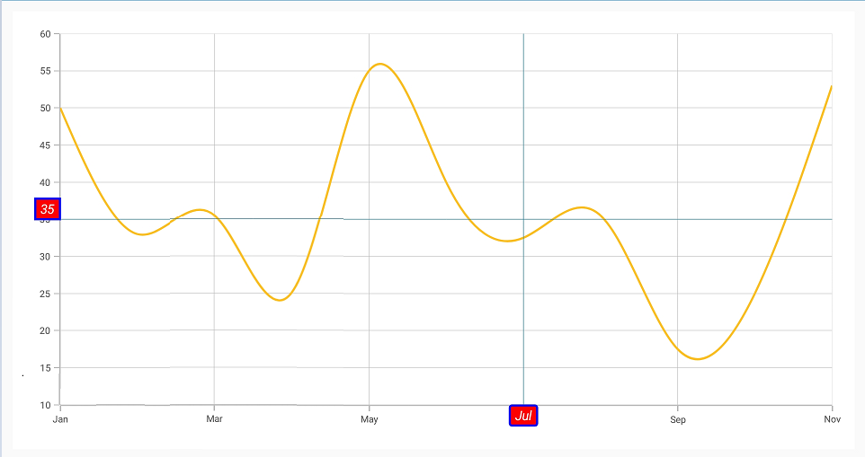

**Adding arrow to vertical and horizontal line annotations**

To display the single headed arrow, set the [`LineCap`](https://help.syncfusion.com/cr/xamarin/Syncfusion.SfChart.XForms.LineAnnotation.html#Syncfusion_SfChart_XForms_LineAnnotation_LineCap) property to `Arrow`. The default value of the [`LineCap`](https://help.syncfusion.com/cr/xamarin/Syncfusion.SfChart.XForms.LineAnnotation.html#Syncfusion_SfChart_XForms_LineAnnotation_LineCap) property is `None`.

 



<chart:SfChart>
...

    <chart:SfChart.ChartAnnotations>

        <chart: VerticalLineAnnotation X1="6" LineCap="Arrow"/>

        <chart:HorizontalLineAnnotation Y1="35" LineCap="Arrow"/>

    </chart:SfChart.ChartAnnotations> 
  
</chart:SfChart>





SfChart chart = new SfChart();
...

VerticalLineAnnotation vertical = new VerticalLineAnnotation()
{
    X1 = 6,

    LineCap = ChartLineCap.Arrow 
};

chart.ChartAnnotations.Add(vertical );

HorizontalLineAnnotation horizontal = new HorizontalLineAnnotation()
{
    Y1 = 35,

    LineCap = ChartLineCap.Arrow 
};

chart.ChartAnnotations.Add(horizontal);





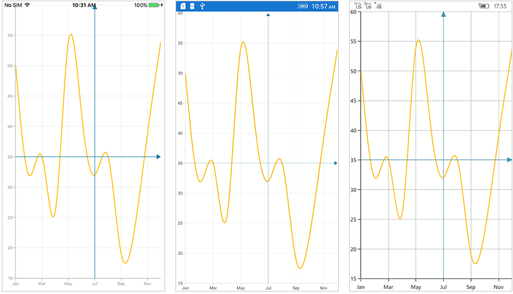

### Adding text in shape annotation 

For all the shape annotations, the text can be displayed by using the [`Text`](https://help.syncfusion.com/cr/xamarin/Syncfusion.SfChart.XForms.ShapeAnnotation.html#Syncfusion_SfChart_XForms_ShapeAnnotation_Text) property. 

**Customizing text in shape annotation**

The [`Text`](https://help.syncfusion.com/cr/xamarin/Syncfusion.SfChart.XForms.ShapeAnnotation.html#Syncfusion_SfChart_XForms_ShapeAnnotation_Text) in shape annotation also can be customized by using the [`LabelStyle`](https://help.syncfusion.com/cr/xamarin/Syncfusion.SfChart.XForms.ShapeAnnotation.html#Syncfusion_SfChart_XForms_ShapeAnnotation_LabelStyle) property. The following properties are used to customize the text:

*   [`TextColor`](https://help.syncfusion.com/cr/xamarin/Syncfusion.SfChart.XForms.ChartLabelStyle.html#Syncfusion_SfChart_XForms_ChartLabelStyle_TextColor) - Used to change the text color.
*   [`BackgroundColor`](https://help.syncfusion.com/cr/xamarin/Syncfusion.SfChart.XForms.ChartLabelStyle.html#Syncfusion_SfChart_XForms_ChartLabelStyle_BackgroundColor) - Used to change the background color of the text.
*   [`Margin`](https://help.syncfusion.com/cr/xamarin/Syncfusion.SfChart.XForms.ChartLabelStyle.html#Syncfusion_SfChart_XForms_ChartLabelStyle_Margin) - Used to set the margin for text.
*   [`BorderThickness`](https://help.syncfusion.com/cr/xamarin/Syncfusion.SfChart.XForms.ChartLabelStyle.html#Syncfusion_SfChart_XForms_ChartLabelStyle_BorderThickness) - Used to change the text border thickness.
*   [`BorderColor`](https://help.syncfusion.com/cr/xamarin/Syncfusion.SfChart.XForms.ChartLabelStyle.html#Syncfusion_SfChart_XForms_ChartLabelStyle_BorderColor) - Used to change the text border color.
* [`Font`](https://help.syncfusion.com/cr/xamarin/Syncfusion.SfChart.XForms.ChartLabelStyle.html#Syncfusion_SfChart_XForms_ChartLabelStyle_Font) – used to change the text size, font family, and font weight. (This is deprecated API. Use FontSize, FontFamily, and FontAttributes properties instead of this.)
* [`FontFamily`](https://help.syncfusion.com/cr/xamarin/Syncfusion.SfChart.XForms.ChartLabelStyle.html#Syncfusion_SfChart_XForms_ChartLabelStyle_FontFamily) - used to change the font family for the text.
* [`FontAttributes`](https://help.syncfusion.com/cr/xamarin/Syncfusion.SfChart.XForms.ChartLabelStyle.html#Syncfusion_SfChart_XForms_ChartLabelStyle_FontAttributes) - used to change the font style for the text.
* [`FontSize`](https://help.syncfusion.com/cr/xamarin/Syncfusion.SfChart.XForms.ChartLabelStyle.html#Syncfusion_SfChart_XForms_ChartLabelStyle_FontSize) - used to change the font size for the text.
*   [`HorizontalTextAlignment`](https://help.syncfusion.com/cr/xamarin/Syncfusion.SfChart.XForms.ChartAnnotationLabelStyle.html#Syncfusion_SfChart_XForms_ChartAnnotationLabelStyle_HorizontalTextAlignment) - Used to align the text horizontally.
*   [`VerticalTextAlignment`](https://help.syncfusion.com/cr/xamarin/Syncfusion.SfChart.XForms.ChartAnnotationLabelStyle.html#Syncfusion_SfChart_XForms_ChartAnnotationLabelStyle_VerticalTextAlignment) - Used to align the text vertically.

 



<chart:SfChart>
...

    <chart:SfChart.ChartAnnotations>

        <chart:EllipseAnnotation X1="2" Y1="30" X2="6" Y2="35" Text="Ellipse" >

            <chart:EllipseAnnotation.LabelStyle>

                <chart:ChartAnnotationLabelStyle Margin="5" FontSize="16" FontAttributes="Italic" BorderColor="Red" BorderThickness="2" BackgroundColor="Blue" TextColor="White"/>

            </chart:EllipseAnnotation.LabelStyle>

        </chart:EllipseAnnotation>

    </chart:SfChart.ChartAnnotations>
  
</chart:SfChart>





SfChart chart = new SfChart();
...

EllipseAnnotation annotation = new EllipseAnnotation()
{
    X1 = 2,

    Y1 = 30,

    X2 = 6,

    Y2 = 35,

    Text = "Ellipse"
};

annotation.LabelStyle = new ChartAnnotationLabelStyle()
{
    Margin = new Thickness(5),

    FontSize = 16,

    FontAttributes = FontAttributes.Italic,

    BorderColor = Color.Red,

    BorderThickness = new Thickness(2),

    BackgroundColor = Color.Blue,

    TextColor = Color.White,
}; 

chart.ChartAnnotations.Add(annotation); 





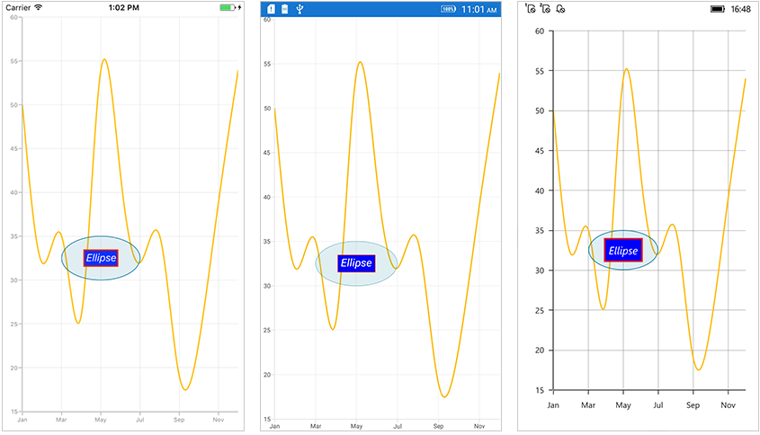

## View annotation

The [`ViewAnnotation`](https://help.syncfusion.com/cr/xamarin/Syncfusion.SfChart.XForms.ViewAnnotation.html) allows you to add annotations in the form of own custom view with the help of [`View`](https://help.syncfusion.com/cr/xamarin/Syncfusion.SfChart.XForms.ViewAnnotation.html#Syncfusion_SfChart_XForms_ViewAnnotation_View) property at the specific area of interest in the chart area. The [`ViewAnnotation`](https://help.syncfusion.com/cr/xamarin/Syncfusion.SfChart.XForms.ViewAnnotation.html) also can be aligned by using the [`VerticalAlignment`](https://help.syncfusion.com/cr/xamarin/Syncfusion.SfChart.XForms.ViewAnnotation.html#Syncfusion_SfChart_XForms_ViewAnnotation_VerticalAlignment) and [`HorizontalAlignment`](https://help.syncfusion.com/cr/xamarin/Syncfusion.SfChart.XForms.ViewAnnotation.html#Syncfusion_SfChart_XForms_ViewAnnotation_HorizontalAlignment) properties.

 



<chart:SfChart>
...

    <chart:SfChart.ChartAnnotations>

        <chart:ViewAnnotation X1="3" Y1="12" VerticalAlignment="Start" >

            <chart:ViewAnnotation.View>

                <StackLayout>

                    <Image Source="Graduate.png" WidthRequest="70" HeightRequest="70" />

                </StackLayout>

            </chart:ViewAnnotation.View>

        </chart:ViewAnnotation>

    </chart:SfChart.ChartAnnotations>
  
</chart:SfChart>





SfChart chart = new SfChart();
...

ViewAnnotation annotation = new ViewAnnotation()
{
    X1 = 3,

    Y1 = 12,

    VerticalAlignment = ChartAnnotationAlignment.Start
};

StackLayout layout = new StackLayout();

Image image = new Image();

image.Source = "Graduate.png";

image.HeightRequest = 70;

image.WidthRequest = 70;

layout.Children.Add(image);

annotation.View = layout;

chart.ChartAnnotations.Add(annotation); 





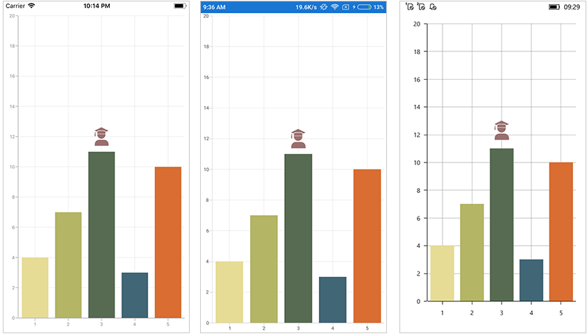

## Annotation Visibility

The [`IsVisible`](https://help.syncfusion.com/cr/xamarin/Syncfusion.SfChart.XForms.ChartAnnotation.html#Syncfusion_SfChart_XForms_ChartAnnotation_IsVisible) property of [`ChartAnnotation`](https://help.syncfusion.com/cr/xamarin/Syncfusion.SfChart.XForms.SfChart.html#Syncfusion_SfChart_XForms_SfChart_ChartAnnotations) is used to toggle the visibility of annotation.

 



<chart:SfChart.ChartAnnotations>
    <chart:VerticalLineAnnotation IsVisible="False" X1="2" LineCap="Arrow" ShowAxisLabel="true" Text="Vertical Line" x:Name="verticalLineAnnotation" />
</chart:SfChart.ChartAnnotations>





VerticalLineAnnotation verticalLineAnnotation = new VerticalLineAnnotation()
{
    IsVisible = false
};

chart.ChartAnnotations.Add(verticalLineAnnotation);





## Event

**AnnotationClicked**

The [`AnnotationClicked`](https://help.syncfusion.com/cr/xamarin/Syncfusion.SfChart.XForms.SfChart.html) event is triggered when the user has clicked the annotation. The argument contains the following information.

* [`Annotation`](https://help.syncfusion.com/cr/xamarin/Syncfusion.SfChart.XForms.ChartAnnotationClickedEventArgs.html#Syncfusion_SfChart_XForms_ChartAnnotationClickedEventArgs_Annotation) – used to get the instance of annotation which is clicked.
* [`X`](https://help.syncfusion.com/cr/xamarin/Syncfusion.SfChart.XForms.ChartAnnotationClickedEventArgs.html#Syncfusion_SfChart_XForms_ChartAnnotationClickedEventArgs_X) – used to get the x position of touch point on annotation.
* [`Y`](https://help.syncfusion.com/cr/xamarin/Syncfusion.SfChart.XForms.ChartAnnotationClickedEventArgs.html#Syncfusion_SfChart_XForms_ChartAnnotationClickedEventArgs_Y) – used to get the y position of touch point on annotation..

## Get the touch position in annotation

Following are the override methods that are available in annotation to send the information about touch interactions.

* [`OnTouchDown`](https://help.syncfusion.com/cr/xamarin/Syncfusion.SfChart.XForms.ChartAnnotation.html#Syncfusion_SfChart_XForms_ChartAnnotation_OnTouchDown_System_Single_System_Single_) – occurs when touch down inside the annotation.
* [`OnTouchMove`](https://help.syncfusion.com/cr/xamarin/Syncfusion.SfChart.XForms.ChartAnnotation.html#Syncfusion_SfChart_XForms_ChartAnnotation_OnTouchMove_System_Single_System_Single_) – occurs while moving the finger or mouse inside the annotation.
* [`OnTouchUp`](https://help.syncfusion.com/cr/xamarin/Syncfusion.SfChart.XForms.ChartAnnotation.html#Syncfusion_SfChart_XForms_ChartAnnotation_OnTouchUp_System_Single_System_Single_) – occurs when touch up inside the annotation.



public class TextAnnotationExt : TextAnnotation
{
    protected override void OnTouchDown(float pointX, float pointY)
    {
       base.OnTouchDown(pointX, pointY);
    }

    protected override void OnTouchMove(float pointX, float pointY)
    {
       base.OnTouchMove(pointX, pointY);
    }

    protected override void OnTouchUp(float pointX, float pointY)
    {
       base.OnTouchUp(pointX, pointY);
    }
}



## See also

[How to add benchmark line in Xamarin.Forms Chart](https://www.syncfusion.com/kb/9304/how-to-add-benchmark-line-in-xamarin-forms-chart)