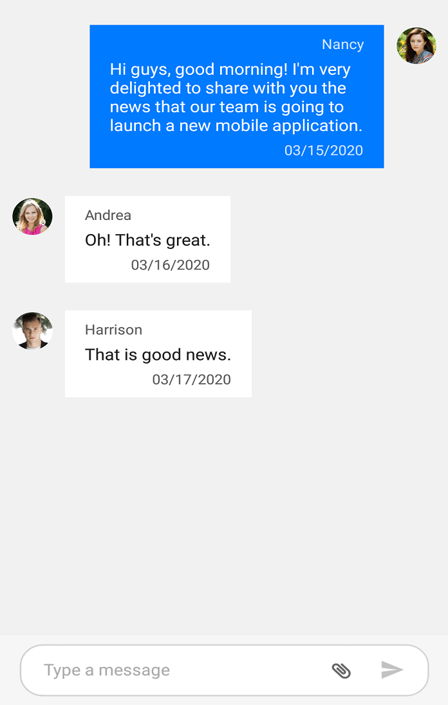
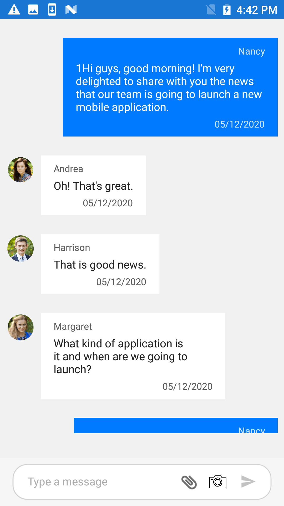
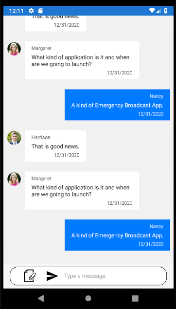

# Attachment Button in Xamarin.Forms Chat (SfChat)

You can show the attachment button in SfChat by setting the [SfChat.ShowAttachmentButton](https://help.syncfusion.com/cr/xamarin/Syncfusion.XForms.Chat.SfChat.html#Syncfusion_XForms_Chat_SfChat_ShowAttachmentButton) to `true`.





<?xml version="1.0" encoding="utf-8" ?>
<ContentPage xmlns="http://xamarin.com/schemas/2014/forms"
             xmlns:x="http://schemas.microsoft.com/winfx/2009/xaml"
             xmlns:sfChat="clr-namespace:Syncfusion.XForms.Chat;assembly=Syncfusion.SfChat.XForms"
             xmlns:local="clr-namespace:ChatSample"
             x:Class="ChatSample.MainPage">
    <ContentPage.BindingContext>
        <local:ViewModel/>
    </ContentPage.BindingContext>
    <ContentPage.Content>
            <sfChat:SfChat x:Name="chat" 
                           ShowAttachmentButton="True"
                           CurrentUser="{Binding CurrentUser}" 
                           Messages="{Binding Messages}"
                           ShowOutgoingMessageAvatar="True">
        </sfChat:SfChat>
    </ContentPage.Content>
</ContentPage>





//MainPage.cs

public partial class MainPage : ContentPage
{      
    SfChat sfChat;
    ViewModel viewModel = new ViewModel();
    public MainPage()
    {
        InitializeComponent();
        sfChat.Messages = viewModel.Messages;
        sfChat.CurrentUser = viewModel.CurrentUser;
        sfChat.ShowAttachmentButton = true;
        this.Content = sfChat;
    }
}





## Event and command

The [SfChat.AttachmentButtonClicked](https://help.syncfusion.com/cr/xamarin/Syncfusion.XForms.Chat.SfChat.html) event and [SfChat.AttachmentButtonCommand](https://help.syncfusion.com/cr/xamarin/Syncfusion.XForms.Chat.SfChat.html#Syncfusion_XForms_Chat_SfChat_AttachmentButtonCommand) will be executed upon tapping the attachment button. You can pass the desired object as parameter to the `SfChat.AttachmentButtonCommand` using the [SfChat.AttachmentButtonCommandParameter](https://help.syncfusion.com/cr/xamarin/Syncfusion.XForms.Chat.SfChat.html#Syncfusion_XForms_Chat_SfChat_AttachmentButtonCommandParameter). You can provide options for the users to upload files, images, pdf and other media as messages in SfChat from the event handler and action of the `SfChat.AttachmentButtonClicked` event and `SfChat.AttachmentButtonCommand` respectively.

**AttachmentButtonClicked Event**




<?xml version="1.0" encoding="utf-8" ?>
<ContentPage xmlns="http://xamarin.com/schemas/2014/forms"
             xmlns:x="http://schemas.microsoft.com/winfx/2009/xaml"
             xmlns:sfChat="clr-namespace:Syncfusion.XForms.Chat;assembly=Syncfusion.SfChat.XForms"
             xmlns:local="clr-namespace:ChatSample"
             x:Class="ChatSample.MainPage">
    <ContentPage.BindingContext>
        <local:ViewModel/>
    </ContentPage.BindingContext>
    <ContentPage.Content>
            <sfChat:SfChat x:Name="chat" 
                           Messages="{Binding Messages}"
                           CurrentUser="{Binding CurrentUser}"
                           ShowOutgoingMessageAvatar="True"
                           ShowAttachmentButton="True"
                           AttachmentButtonClicked="Chat_AttachmentButtonClicked">
        </sfChat:SfChat>
    </ContentPage.Content>
</ContentPage>




//MainPage.cs

public partial class MainPage : ContentPage
{
    public MainPage()
    {
        InitializeComponent();
    }
    private void Chat_AttachmentButtonClicked(object sender, EventArgs e)
    {
        //Adding an image message to the chat.
        this.Messages.Add(new ImageMessage()
        {
            Aspect = Xamarin.Forms.Aspect.AspectFill,
            Source = "Car1.jpeg",
            Author = new Author() { Name = "Andrea", Avatar = "People_Circle23.png" },
            Text = "Sports Car Type-1",
            DateTime = new DateTime(2020, 10, 02),
        });
    }
}




**AttachmentButtonCommand**




<?xml version="1.0" encoding="utf-8" ?>
<ContentPage xmlns="http://xamarin.com/schemas/2014/forms"
             xmlns:x="http://schemas.microsoft.com/winfx/2009/xaml"
             xmlns:sfChat="clr-namespace:Syncfusion.XForms.Chat;assembly=Syncfusion.SfChat.XForms"
             xmlns:local="clr-namespace:ChatSample"
             x:Class="ChatSample.MainPage">
    <ContentPage.BindingContext>
        <local:ViewModel/>
    </ContentPage.BindingContext>
    <ContentPage.Content>
            <sfChat:SfChat x:Name="chat"
                           Messages="{Binding Messages}"
                           CurrentUser="{Binding CurrentUser}"
                           ShowOutgoingMessageAvatar="True"
                           ShowAttachmentButton="True"
                           AttachmentButtonCommand="{Binding Command}"
                           AttachmentButtonCommandParameter="{x:Reference chat}">
        </sfChat:SfChat>
    </ContentPage.Content>
</ContentPage>



//ViewModel.cs
...
public ViewModel()
{
    this.messages = new ObservableCollection<object>();
    this.CurrentUser = new Author() { Name = "Nancy", Avatar = "Nancy.png" };
    Command = new Command(Tapped);
    this.GenerateMessages();
}

private void Tapped(object args)
{
    //Adding an image message to the chat.
    this.Messages.Add(new ImageMessage()
    {
        Aspect = Xamarin.Forms.Aspect.AspectFill,
        Source = "Car1.jpeg",
        Author = new Author() { Name = "Andrea", Avatar = "People_Circle23.png" },
        Text = "Sports Car Type-1",
        DateTime = new DateTime(2020, 10, 02),
    });
}
...



## Attachment button template 

You can load custom view/buttons as attachment button using [SfChat.AttachmentButtonTemplate](https://help.syncfusion.com/cr/xamarin/Syncfusion.XForms.Chat.SfChat.html#Syncfusion_XForms_Chat_SfChat_AttachmentButtonTemplate) property. You can also specify the width of your template view to load more than one button as shown below.




<?xml version="1.0" encoding="utf-8" ?>
<ContentPage xmlns="http://xamarin.com/schemas/2014/forms"
             xmlns:x="http://schemas.microsoft.com/winfx/2009/xaml"
             xmlns:sfChat="clr-namespace:Syncfusion.XForms.Chat;assembly=Syncfusion.SfChat.XForms"
             xmlns:local="clr-namespace:ChatSample"
             x:Class="ChatSample.MainPage">
    <ContentPage.BindingContext>
        <local:ViewModel/>
    </ContentPage.BindingContext>
    <ContentPage.Content>
            <sfChat:SfChat x:Name="chat" 
                           ShowAttachmentButton="True"
                           CurrentUser="{Binding CurrentUser}" 
                           Messages="{Binding Messages}"
                           ShowOutgoingMessageAvatar="True">
                <sfChat:SfChat.AttachmentButtonTemplate>
                    <DataTemplate>
                        <StackLayout WidthRequest="58" HeightRequest="17" Orientation="Horizontal">
                            <Image Source="AttachmentIcon.jpg" WidthRequest="22" HeightRequest="17" Rotation="225" Margin="0,0,8,0"/>
                            <Image Source="CameraIcon.jpg" WidthRequest="22" HeightRequest="17"/>
                        </StackLayout>
                    </DataTemplate>
                </sfChat:SfChat.AttachmentButtonTemplate>
        </sfChat:SfChat>
    </ContentPage.Content>
</ContentPage>




//MainPage.cs

public partial class MainPage : ContentPage
{
    DataTemplate attachmentDataTemplate;
    Image image = new Image();
    SfChat sfChat;
    ViewModel viewModel = new ViewModel();
    public MainPage()
    {
        InitializeComponent();
        sfChat.Messages = viewModel.Messages;
        sfChat.CurrentUser = viewModel.CurrentUser;
        sfChat.ShowAttachmentButton = true;
        attachmentDataTemplate = new DataTemplate(() =>
        {
            StackLayout layout = new StackLayout();
            
            Image cameraImage = new Image();
            cameraImage.Source = "CameraIcon.jpg";
            cameraImage.WidthRequest = 22;
            cameraImage.HeightRequest = 17;

            Image attachmentImage = new Image();
            attachmentImage.Source = AttachmentIcon.jpg;
            attachmentImage.WidthRequest = 22;
            attachmentImage.HeightRequest = 17;
            attachmentImage.Margin = new Thickness(0,0,8,0);
            attachmentImage.Rotation = 225;             

            layout.Orientation =StackOrientation.Horizontal;
            layout.HeightRequest = 17;
            layout.WidthRequest = 58;
            
            layout.Children.Add(attachmentImage);
            layout.Children.Add(cameraImage);
            return layout;
        });
        sfChat.AttachmentButtonTemplate = attachmentDataTemplate;
        this.Content = sfChat;
    }
}




## Attach image from gallery in Xamarin.Forms chat (SfChat)

You can add the desired image in to the chat by opening the device's gallery when `AttachmentButton` is tapped. You can download the entire project demo of adding an image from gallery in to SfChat from GitHub [here](https://github.com/SyncfusionExamples/How-to-attach-image-from-gallery-in-Xamarin.Forms-chat).

## Display attachments in left and editor in right like Facebook messenger

You can display attachments in left and editor in right like Facebook messenger by writing custom control template to MessageInputView using TargetStyle.

You can download the entire project demo of displaying attachments in left and editor in right like Facebook messenger in SfChat from GitHub [here](https://github.com/SyncfusionExamples/show-attachment-button-in-left-and-editor-in-right-like-facebook-messenger-in-Xamarin.Forms.Chat)