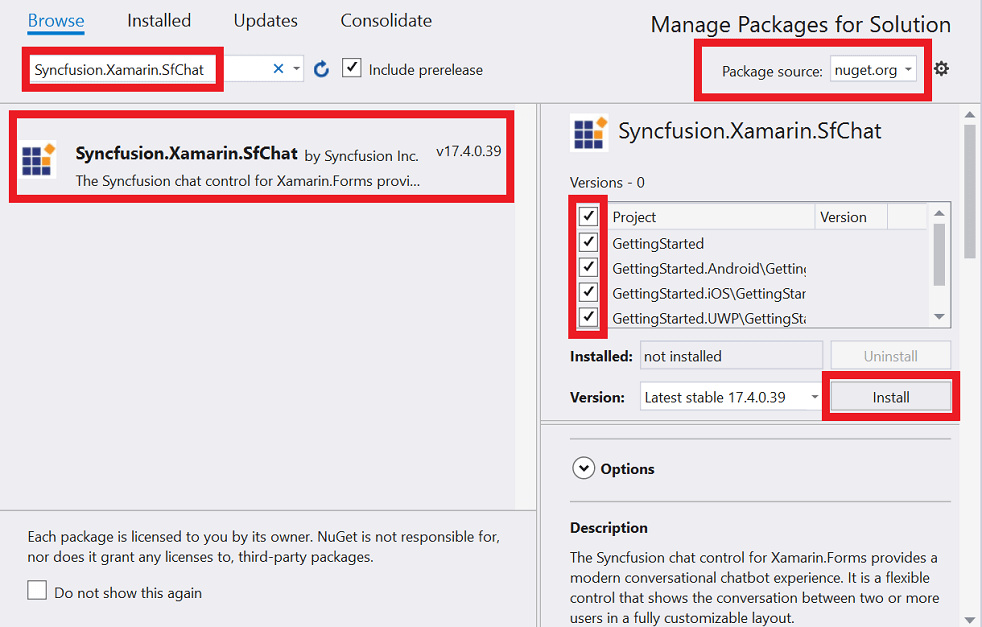
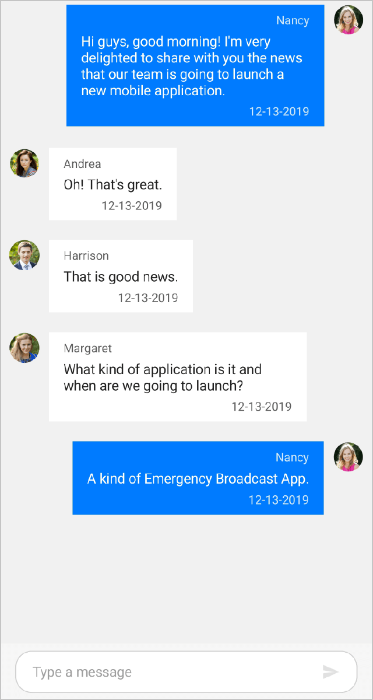
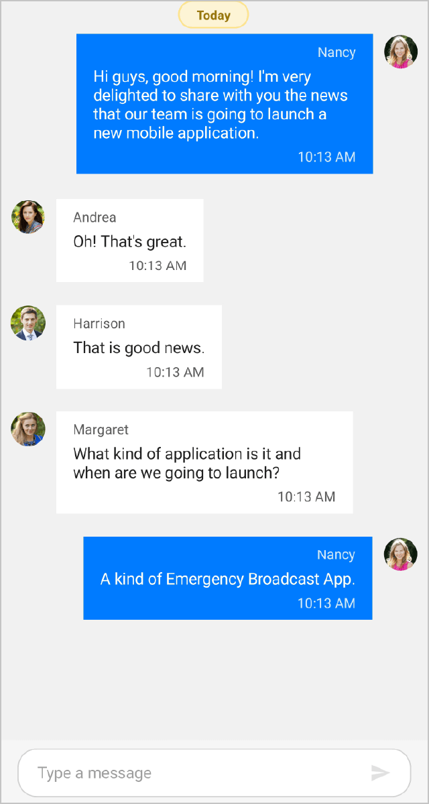

# Getting Started with Xamarin.Forms Chat (SfChat)      

## Assembly deployment

After installing Essential Studio for Xamarin, find all the required assemblies in the installation folders {Syncfusion Essential Studio Installed location}\Essential Studio\{{ site.releaseversion }}\Xamarin\lib.

Eg: C:\Program Files (x86)\Syncfusion\Essential Studio\{{ site.releaseversion }}\Xamarin\lib.

N> Assemblies can be found in an unzipped package location in Mac.

## NuGet configuration

To install the required NuGet for the SfChat control in the application, configure the NuGet packages of the Syncfusion components.

Refer to the following KB to configure the NuGet packages of the Syncfusion components:

[How to configure package source and install Syncfusion NuGet packages in an existing project?](https://www.syncfusion.com/kb/7441/how-to-configure-package-source-and-install-syncfusion-nuget-packages-in-an-existing-project)

The following NuGet package should be installed to use the SfChat control in the application.

<table>
<tr>
<th> Project </th>
<th> Required package </th>
</tr>
<tr>
<td> Xamarin.Forms </td>
<td> Syncfusion.Xamarin.SfChat</td>
</tr>
</table>

## Adding SfChat reference

You can add SfChat reference using one of the following methods:

**Method 1: Adding SfChat reference from nuget.org**

Syncfusion Xamarin components are available in [nuget.org](https://www.nuget.org/). To add SfChat to your project, open the NuGet package manager in Visual Studio, search for [Syncfusion.Xamarin.SfChat](https://www.nuget.org/packages/Syncfusion.Xamarin.SfChat), and then install it.

N> Install the same version of SfChat NuGet in all the projects.    

**Method 2: Adding SfChat reference from toolbox**

Syncfusion also provides Xamarin Toolbox. Using this toolbox, you can drag the SfChat control to the XAML page. It will automatically install the required NuGet packages and add the namespace to the page. To install Syncfusion Xamarin Toolbox, refer to [Toolbox](https://help.syncfusion.com/xamarin/utility#toolbox).

**Method 3: Adding SfChat assemblies manually from the installed location**

If you prefer to manually reference the assemblies instead referencing from NuGet, add the following assemblies in respective projects.

Location: {Installed location}/{version}/Xamarin/lib

<table>
<tr>
<td>PCL</td>
<td>Syncfusion.DataSource.Portable.dll Syncfusion.GridCommon.Portable.dll Syncfusion.Core.XForms.dll Syncfusion.SfCalendar.XForms.dll Syncfusion.Buttons.XForms.dll Syncfusion.SfListView.XForms.dll Syncfusion.SfChat.XForms.dll Syncfusion.Licensing.dll </td>
</tr>
<tr>
<td>Android</td>
<td>Syncfusion.DataSource.Portable.dll Syncfusion.GridCommon.Portable.dll Syncfusion.Core.XForms.dll Syncfusion.Core.XForms.Android.dll Syncfusion.SfCalendar.XForms.dll Syncfusion.SfCalendar.XForms.Android.dll Syncfusion.Buttons.XForms.dll Syncfusion.Buttons.XForms.Android.dll Syncfusion.SfListView.XForms.dll Syncfusion.SfListView.XForms.Android.dll Syncfusion.SfChat.XForms.dll Syncfusion.SfChat.XForms.Android.dll Syncfusion.Licensing.dll </td>
</tr>
<tr>
<td>iOS</td>
<td>Syncfusion.DataSource.Portable.dll Syncfusion.GridCommon.Portable.dll Syncfusion.Core.XForms.dll Syncfusion.Core.XForms.iOS.dll Syncfusion.SfCalendar.XForms.dll Syncfusion.SfCalendar.XForms.iOS.dll Syncfusion.Buttons.XForms.dll Syncfusion.Buttons.XForms.iOS.dll Syncfusion.SfListView.XForms.dll Syncfusion.SfListView.XForms.iOS.dll Syncfusion.SfChat.XForms.dll Syncfusion.SfChat.XForms.iOS.dll Syncfusion.Licensing.dll </td>
</tr>
<tr>
<td>UWP</td>
<td>Syncfusion.DataSource.Portable.dll Syncfusion.GridCommon.Portable.dll Syncfusion.Core.XForms.dll Syncfusion.Core.XForms.UWP.dll Syncfusion.SfInput.UWP.dll Syncfusion.SfShared.UWP.dll Syncfusion.SfCalendar.XForms.dll Syncfusion.SfCalendar.XForms.UWP.dll Syncfusion.Buttons.XForms.dll Syncfusion.Buttons.XForms.UWP.dll Syncfusion.SfListView.XForms.dll Syncfusion.SfListView.XForms.UWP.dll Syncfusion.SfChat.XForms.dll Syncfusion.SfChat.XForms.UWP.dll Syncfusion.Licensing.dll </td>
</tr>
</table>

N> To know more about obtaining our components, refer to these links for [Mac](https://help.syncfusion.com/xamarin/introduction/download-and-installation/mac/) and [Windows](https://help.syncfusion.com/xamarin/introduction/download-and-installation/windows/).

I> Starting with v16.2.0.x, if you reference Syncfusion assemblies from the trial setup or from the NuGet feed, you also have to include a license key in your projects. Please refer to [Syncfusion license key](https://help.syncfusion.com/common/essential-studio/licensing/license-key/) to know about registering Syncfusion license key in your Xamarin application to use our components.

## Launching the SfChat on each platform

To use the SfChat inside an application, each platform application must initialize the SfChat renderer. This initialization step varies from platform to platform and is discussed in the following sections:

### Android

The Android launches the SfChat without any initialization and is enough to only initialize the Xamarin.Forms Framework to launch the application.

N> If you are adding the references from toolbox, this step is not needed.

### iOS

To launch the SfChat in iOS, call the `SfChatRenderer.Init()` in the `FinishedLaunching` overridden method of the AppDelegate class after the Xamarin.Forms Framework initialization and before the LoadApplication is called as demonstrated in the following code example:


public override bool FinishedLaunching(UIApplication app, NSDictionary options)
{
    …
    global::Xamarin.Forms.Forms.Init ();
    Syncfusion.XForms.iOS.Chat.SfChatRenderer.Init();
    LoadApplication (new App ());
    …
}
 

### Universal Windows Platform (UWP)

To launch the SfChat in UWP, call the `SfChatRenderer.Init()` in the `MainPage` constructor before the LoadApplication is called as demonstrated in the following code example.


public MainPage()
{
    …
    Syncfusion.XForms.UWP.Chat.SfChatRenderer.Init();
    LoadApplication (new App ());
    …
}


### Release mode issue in UWP platform

The known Framework issue in UWP platform is that the custom controls will not render when deployed the application in `Release Mode`. It can be resolved by initializing the SfChat assemblies in `App.xaml.cs` in UWP project as in the following code snippet.


// In App.xaml.cs

protected override void OnLaunched(LaunchActivatedEventArgs e)
{
    …

    rootFrame.NavigationFailed += OnNavigationFailed;
        
    // you should add `using System.Reflection;`
    List<Assembly> assembliesToInclude = new List<Assembly>();

    //Now, add all the assemblies your app uses
    assembliesToInclude.Add(typeof(SfButtonRenderer).GetTypeInfo().Assembly);
    assembliesToInclude.Add(typeof(SfBorderRenderer).GetTypeInfo().Assembly);
    assembliesToInclude.Add(typeof(SfCalendarRenderer).GetTypeInfo().Assembly);
    assembliesToInclude.Add(typeof(SfListViewRenderer).GetTypeInfo().Assembly);
    assembliesToInclude.Add(typeof(SfChatRenderer).GetTypeInfo().Assembly);

    // replaces Xamarin.Forms.Forms.Init(e);        
    Xamarin.Forms.Forms.Init(e, assembliesToInclude);
        
    …     
}


## Create a simple SfChat 

This section explains how to create a SfChat and configure it. The SfChat control can be configured entirely in C# code or using XAML markup.

N> You can download the complete project of this demo from [GitHub](https://github.com/SyncfusionExamples/Chat-GettingStarted-in-Xamarin-Forms).

In this walk through, a new application can be created that contains the SfChat which includes the following topics:

 * [Creating the project](#creating-the-project) 
 * [Adding SfChat in Xamarin.Forms](#adding-sfchat-in-xamarinforms)     
 * [Creating the ViewModel for the SfChat](#create-viewmodel-for-the-sfchat)  
 * [Binding Messages to the SfChat](#binding-message-to-the-sfchat) 
 * [Showing time break between messages](#defining-time-break) 

## Creating the project

Create a new BlankApp (Xamarin.Forms.Portable) application in Xamarin Studio or Visual Studio for Xamarin.Forms.

## Adding SfChat in Xamarin.Forms 

1. Add the required assembly references to the pcl and renderer projects as discussed in the [Assembly deployment](#assembly-deployment) section.

2. Import the SfChat control namespace as `xmlns:sfChat="clr-namespace:Syncfusion.XForms.Chat;assembly=Syncfusion.SfChat.XForms"` in XAML Page.

3. Set the SfChat control as content to the ContentPage.



<?xml version="1.0" encoding="utf-8" ?>
<ContentPage xmlns="http://xamarin.com/schemas/2014/forms"
             xmlns:x="http://schemas.microsoft.com/winfx/2009/xaml"
             xmlns:local="clr-namespace:GettingStarted;assembly=GettingStarted"
             xmlns:sfChat="clr-namespace:Syncfusion.XForms.Chat;assembly=Syncfusion.SfChat.XForms"
             x:Class="GettingStarted.MainPage">

    <ContentPage.Content>
        <sfChat:SfChat x:Name="sfChat" />
    </ContentPage.Content>
</ContentPage> 



using Syncfusion.XForms.Chat;
using Xamarin.Forms;

namespace GettingStarted
{
    using Syncfusion.XForms.Chat;
    using Xamarin.Forms;

    public partial class MainPage : ContentPage
    {
        public MainPage()
        {
            InitializeComponent();
            SfChat sfchat = new SfChat();
            this.Content = sfchat;
        }
    }
}



## Creating the ViewModel for the SfChat

The SfChat is a data-bound control displaying a collection of messages between users. Hence, messages should be created and binded to the control. 

Create a simple message collection as shown in the following code example in a new class file. Save it as GettingStartedViewModel.cs file:



public class GettingStartedViewModel : INotifyPropertyChanged
    {
        /// 

        /// Collection of messages in a conversation.
        /// 

        private ObservableCollection<object> messages;

        /// 

        /// Current user of chat.
        /// 

        private Author currentUser;

        public GettingStartedViewModel()
        {
            this.messages = new ObservableCollection<object>();
            this.currentAuthor = new Author() { Name = "Nancy", Avatar = "Nancy.png" };
            this.GenerateMessages();
        }

        /// 

        /// Gets or sets the collection of messages of a conversation.
        /// 

        public ObservableCollection<object> Messages
        {
            get
            {
                return this.messages;
            }

            set
            {
                this.messages = value;
            }
        }

        /// 

        /// Gets or sets the current user of the message.
        /// 

        public Author CurrentUser
        {
            get
            {
                return this.currentAuthor;
            }
            set
            {
                this.currentAuthor = value;
                RaisePropertyChanged("CurrentAuthor");
            }
        }

        /// 

        /// Property changed handler.
        /// 

        public event PropertyChangedEventHandler PropertyChanged;

        /// 

        /// Occurs when property is changed.
        /// 

        /// <param name="propName">changed property name</param>
        public void RaisePropertyChanged(string propName)
        {
            if (this.PropertyChanged != null)
            {
                this.PropertyChanged(this, new PropertyChangedEventArgs(propName));
            }
        }

        private void GenerateMessages()
        {
            this.messages.Add(new TextMessage()
            {
                Author = currentAuthor,
                Text = "Hi guys, good morning! I'm very delighted to share with you the news that our team is going to launch a new mobile application.",
            });

            this.messages.Add(new TextMessage()
            {
                Author = new Author() { Name = "Andrea", Avatar = "Andrea.png" },
                Text = "Oh! That's great.",
            });

            this.messages.Add(new TextMessage()
            {
                Author = new Author() { Name = "Harrison", Avatar = "Harrison.png" },
                Text = "That is good news.",
            });

            this.messages.Add(new TextMessage()
            {
                Author = new Author() { Name = "Margaret", Avatar = "Margaret.png" },
                Text = "What kind of application is it and when are we going to launch?",
            });

            this.messages.Add(new TextMessage()
            {
                Author = currentAuthor,
                Text = "A kind of Emergency Broadcast App.",
            });
        }
    }



## Binding Messages to SfChat 

To bind the messages to SfChat, set the [SfChat.Messages](https://help.syncfusion.com/cr/xamarin/Syncfusion.SfChat.XForms~Syncfusion.XForms.Chat.SfChat~Messages.html) property as follows. You can bind the message collection of the SfChat either from XAML or in code. 

The following code example binds the collection created in previous step to `SfChat.Messages` property.



<?xml version="1.0" encoding="utf-8" ?>
<ContentPage xmlns="http://xamarin.com/schemas/2014/forms"
             xmlns:x="http://schemas.microsoft.com/winfx/2009/xaml"
             xmlns:sfChat="clr-namespace:Syncfusion.XForms.Chat;assembly=Syncfusion.SfChat.XForms"
             xmlns:local="clr-namespace:GettingStarted"
             x:Class="GettingStarted.MainPage">

    <ContentPage.BindingContext>
        <local:GettingStartedViewModel/>
    </ContentPage.BindingContext>
    
    <ContentPage.Content>
        <sfChat:SfChat x:Name="sfChat"
                       Messages="{Binding Messages}"
                       CurrentUser="{Binding CurrentUser}"
					   ShowOutgoingMessageAvatar="True" />
    </ContentPage.Content>
</ContentPage>



using Syncfusion.XForms.Chat;
using Xamarin.Forms;

namespace GettingStarted
{
    public partial class MainPage : ContentPage
    {
        SfChat sfChat;
        GettingStartedViewModel viewModel;
        public MainPage()
        {
            InitializeComponent();
            this.sfChat = new SfChat();
            this.viewModel = new GettingStartedViewModel();
            this.sfChat.Messages = viewModel.Messages;
            this.sfChat.CurrentUser = viewModel.CurrentUser;
			this.sfChat.ShowOutgoingMessageAvatar=true;
            this.Content = sfChat;
        }
    }
}




Run the application to render the following output.

## Showing time break between messages

Messages can be separated based on the date specified in the message and this can be achieved by setting the [SfChat.ShowTimeBreak](https://help.syncfusion.com/cr/xamarin/Syncfusion.SfChat.XForms~Syncfusion.XForms.Chat.SfChat~ShowTimeBreak.html) property to true. It can be done from both XAML and code. The following code example illustrates this:



<?xml version="1.0" encoding="utf-8" ?>
<ContentPage xmlns="http://xamarin.com/schemas/2014/forms"
             xmlns:x="http://schemas.microsoft.com/winfx/2009/xaml"
             xmlns:sfChat="clr-namespace:Syncfusion.XForms.Chat;assembly=Syncfusion.SfChat.XForms"
             xmlns:local="clr-namespace:GettingStarted"
             x:Class="GettingStarted.MainPage">

    <ContentPage.BindingContext>
        <local:GettingStartedViewModel/>
    </ContentPage.BindingContext>
    
    <ContentPage.Content>
        <sfChat:SfChat x:Name="sfChat"
                       Messages="{Binding Messages}"
                       ShowTimeBreak="True"
					   ShowIncomingMessageTimestamp="True"
					   ShowOutgoingMessageTimestamp="True"
					   IncomingMessageTimestampFormat="hh:mm tt"
					   OutgoingMessageTimestampFormat="hh:mm tt"
                       CurrentUser="{Binding CurrentUser}" />
    </ContentPage.Content>

</ContentPage>


using Syncfusion.XForms.Chat;
using Xamarin.Forms;

namespace GettingStarted
{
    public partial class MainPage : ContentPage
    {
        SfChat sfChat;
        GettingStartedViewModel viewModel;
        public MainPage()
        {
            InitializeComponent();
            sfChat = new SfChat();
            viewModel = new GettingStartedViewModel();
            this.sfChat.Messages = viewModel.Messages;
			this.sfChat.IncomingMessageTimestampFormat = "hh:mm tt";
			this.sfChat.OutgoingMessageTimestampFormat = "hh:mm tt";
			this.sfChat.ShowIncomingMessageTimestamp = true;
			this.sfChat.ShowOutgoingMessageTimestamp = true;
            this.sfChat.ShowTimeBreak = true;
            this.sfChat.CurrentUser = viewModel.CurrentUser;
            this.Content = sfChat;
        }
    }
}




Run the application to render the following output.

