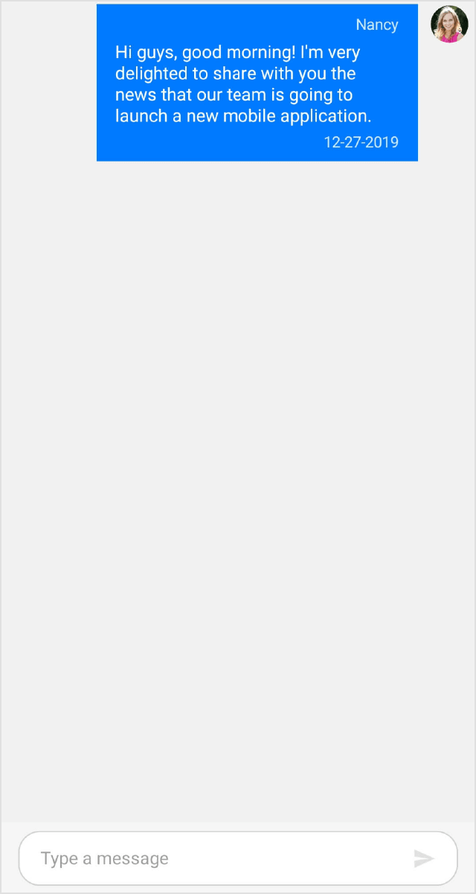
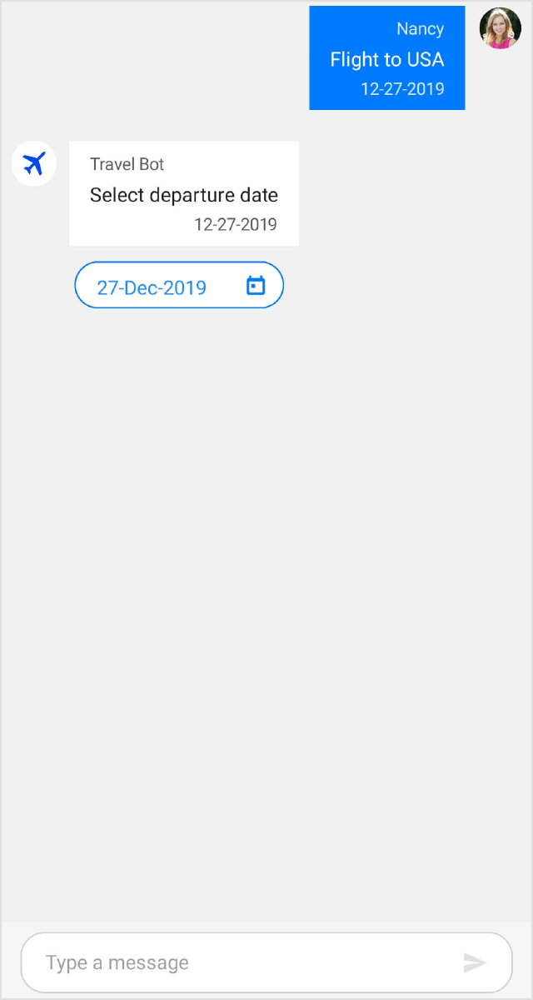
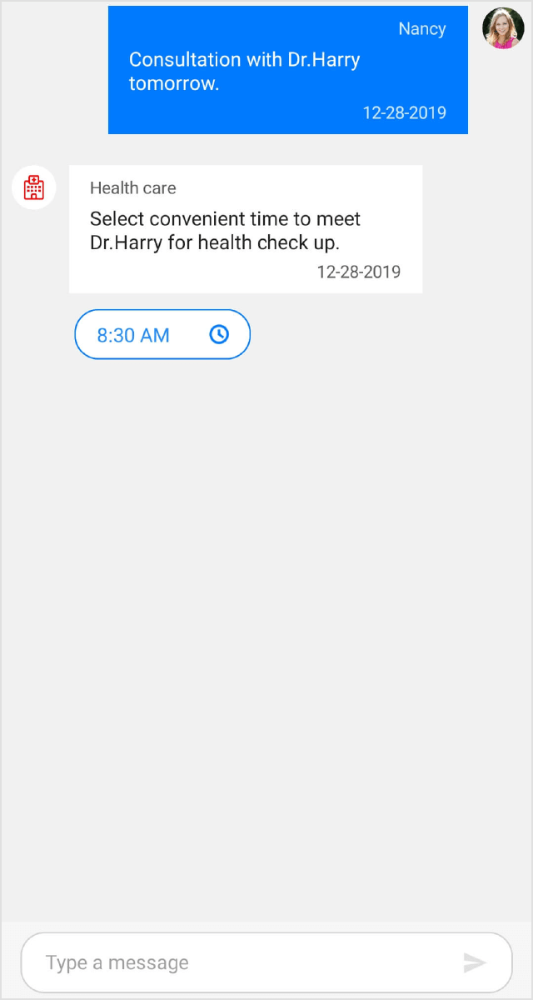
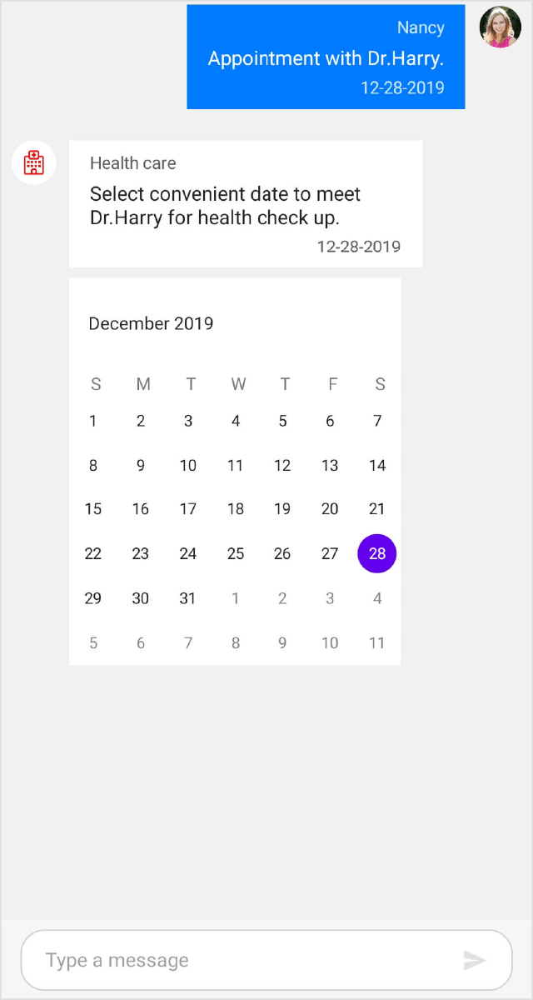
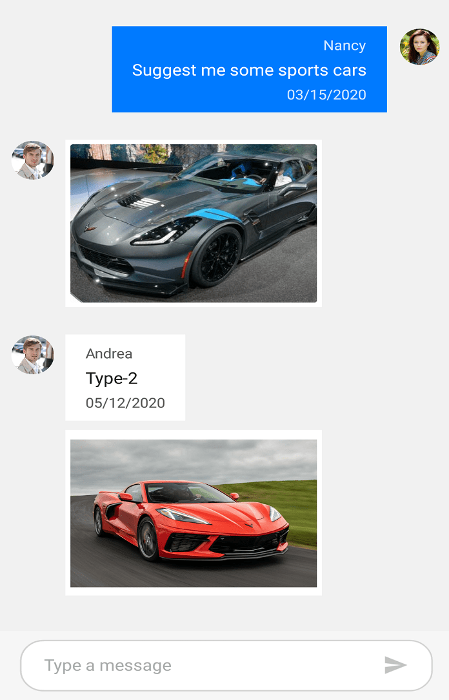
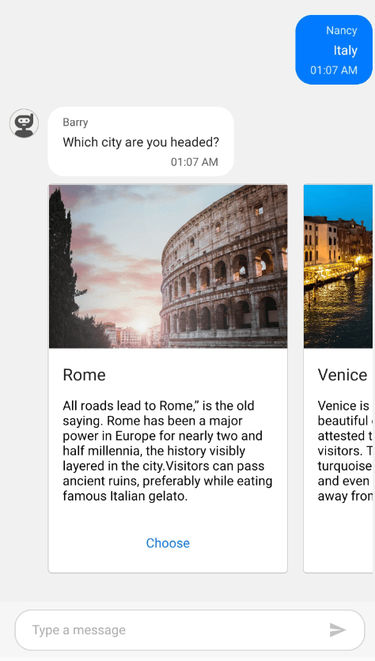
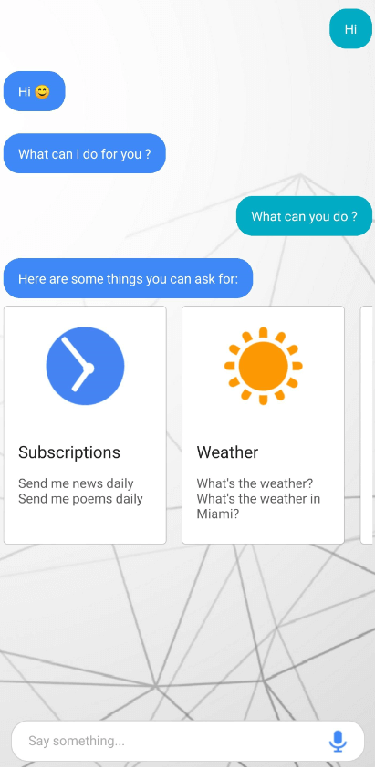
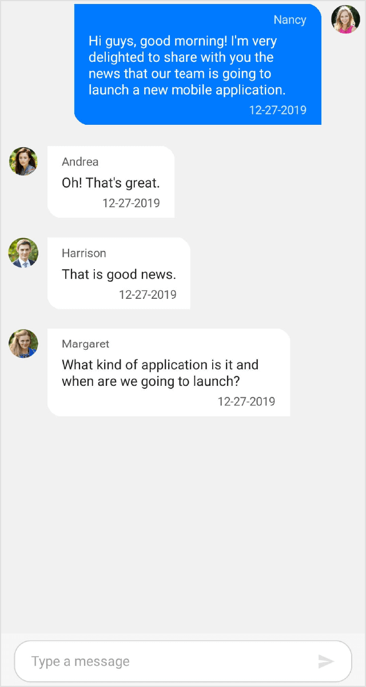
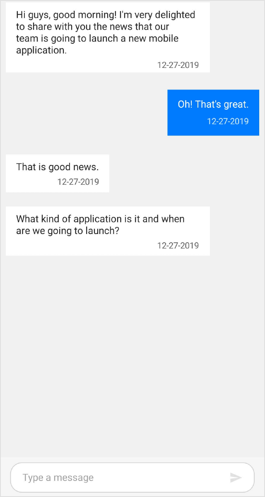

# Messages in Xamarin Chat (SfChat)

## Configuring common settings for the message

<table>
<tr>
<td>{{'[Message.Author](https://help.syncfusion.com/cr/xamarin/Syncfusion.SfChat.XForms~Syncfusion.XForms.Chat.MessageBase~Author.html)'| markdownify }}</td>
<td>Specify the avatar and name of the message sender using {{'[Author.Avatar](https://help.syncfusion.com/cr/xamarin/Syncfusion.SfChat.XForms~Syncfusion.XForms.Chat.Author~Avatar.html)'| markdownify }} and {{'[Author.Name](https://help.syncfusion.com/cr/xamarin/Syncfusion.SfChat.XForms~Syncfusion.XForms.Chat.Author~Name.html)'| markdownify }} properties respectively.</td>
</tr>
<tr>
<td>{{'[Message.DateTime](https://help.syncfusion.com/cr/xamarin/Syncfusion.SfChat.XForms~Syncfusion.XForms.Chat.MessageBase~DateTime.html)'| markdownify }}</td>
<td>To display message created or received time.</td>
</tr>
</table>

## Setting current user for conversation

The [SfChat.CurrentUser](https://help.syncfusion.com/cr/xamarin/Syncfusion.SfChat.XForms~Syncfusion.XForms.Chat.SfChat~CurrentUser.html) helps differentiate between the sender and receiver of the messages. On any given chat window, the `SfChat.CurrentUser` is meant to be the sender(author of outgoing messages). Refer the below code example to set up a current user in a chat.




<?xml version="1.0" encoding="utf-8" ?>
<ContentPage xmlns="http://xamarin.com/schemas/2014/forms"
             xmlns:x="http://schemas.microsoft.com/winfx/2009/xaml"
             xmlns:sfChat="clr-namespace:Syncfusion.XForms.Chat;assembly=Syncfusion.SfChat.XForms"
             xmlns:local="clr-namespace:GettingStarted"
             x:Class="GettingStarted.MainPage">

    <ContentPage.BindingContext>
        <local:GettingStartedViewModel/>
    </ContentPage.BindingContext>
    
    <ContentPage.Content>
                    <sfChat:SfChat x:Name="sfChat"
                           Messages="{Binding Messages}"
                           CurrentUser="{Binding CurrentUser}"
                           ShowOutgoingMessageAvatar="True" />
	<ContentPage.Content>	
</ContentPage>





using Syncfusion.XForms.Chat;
using Xamarin.Forms;

namespace GettingStarted
{
    public partial class MainPage : ContentPage
    {
        SfChat sfChat;
        GettingStartedViewModel viewModel;
        public MainPage()
        {
            InitializeComponent();
            this.sfChat = new SfChat();
            this.viewModel = new GettingStartedViewModel();
            this.sfChat.Messages = viewModel.Messages;
            this.sfChat.CurrentUser = viewModel.CurrentUser;
            this.sfChat.ShowOutgoingMessageAvatar = true;
            this.Content = sfChat;
        }
    }
}

/// 

/// View model class for chat view.
/// 

public class GettingStartedViewModel : INotifyPropertyChanged
{
    private ObservableCollection<object> messages;

    /// 

    /// current user of chat.
    /// 

    private Author currentUser;

    public GettingStartedViewModel()
    {
        this.Messages = new ObservableCollection<object>();
        this.CurrentUser = new Author() { Name = "Nancy" ,Avatar = "People_Circle16.png" };
        this.GenerateMessages();
    }

    /// 

    /// Gets or sets the current user.
    /// 

    public Author CurrentUser
    {
        get
        {
            return this.currentUser;
        }
        set
        {
            this.currentUser = value;
            RaisePropertyChanged("CurrentUser");
        }
    }

    /// 

    /// Gets or sets the message conversation.
    /// 

    public ObservableCollection<object> Messages
    {
        get
        {
            return this.messages;
        }
        set
        {
            this.messages = value;
        }
    }
        
    /// 

    /// Property changed handler.
    /// 

    public event PropertyChangedEventHandler PropertyChanged;

    /// 

    /// Occurs when property is changed.
    /// 

    /// <param name="propName">changed property name<param>
    public void RaisePropertyChanged(string propName)
    {
        if (this.PropertyChanged != null)
        {
            this.PropertyChanged(this, new PropertyChangedEventArgs(propName));
        }
    }

    private void GenerateMessages()
    {
        this.Messages.Add(new TextMessage()
        {
            Author = CurrentUser,
            Text = "Hi guys, good morning! I'm very delighted to share with you the news that our team is going to launch a new mobile application.",
        });
    }
}




## Text message

[TextMessage](https://help.syncfusion.com/cr/xamarin/Syncfusion.SfChat.XForms~Syncfusion.XForms.Chat.TextMessage.html) is used to display plain text as a message. The following code example explains how to add a simple text message.



<?xml version="1.0" encoding="utf-8" ?>
<ContentPage xmlns="http://xamarin.com/schemas/2014/forms"
             xmlns:x="http://schemas.microsoft.com/winfx/2009/xaml"
             xmlns:sfChat="clr-namespace:Syncfusion.XForms.Chat;assembly=Syncfusion.SfChat.XForms"
             xmlns:local="clr-namespace:GettingStarted"
             x:Class="GettingStarted.MainPage">

    <ContentPage.BindingContext>
        <local:GettingStartedViewModel/>
    </ContentPage.BindingContext>
    
    <ContentPage.Content>
                    <sfChat:SfChat x:Name="sfChat"
                           Messages="{Binding Messages}"
                           CurrentUser="{Binding CurrentUser}"
                           ShowOutgoingMessageAvatar="True" />
	<ContentPage.Content>	
</ContentPage>



using Syncfusion.XForms.Chat;
using Xamarin.Forms;

namespace GettingStarted
{
    public partial class MainPage : ContentPage
    {
        SfChat sfChat;
        GettingStartedViewModel viewModel;
        public MainPage()
        {
            InitializeComponent();
            this.sfChat = new SfChat();
            this.viewModel = new GettingStartedViewModel();
            this.sfChat.Messages = viewModel.Messages;
            this.sfChat.CurrentUser = viewModel.CurrentUser;
            this.sfChat.ShowOutgoingMessageAvatar = true;
            this.Content = sfChat;
        }
    }
}

/// 

/// View model class for chat view.
/// 

public class GettingStartedViewModel : INotifyPropertyChanged
{
    private ObservableCollection<object> messages;

    /// 

    /// current user of chat.
    /// 

    private Author currentUser;

    public GettingStartedViewModel()
    {
        this.Messages = new ObservableCollection<object>();
        this.CurrentUser = new Author() { Name = "Nancy",Avatar = "People_Circle16.png" };
        this.GenerateMessages();
    }

    /// 

    /// Gets or sets the current user.
    /// 

    public Author CurrentUser
    {
        get
        {
            return this.currentUser;
        }
        set
        {
            this.currentUser = value;
            RaisePropertyChanged("CurrentUser");
        }
    }

    /// 

    /// Gets or sets the message conversation.
    /// 

    public ObservableCollection<object> Messages
    {
        get
        {
            return this.messages;
        }
        set
        {
            this.messages = value;
        }
    }

    /// 

    /// Property changed handler.
    /// 

    public event PropertyChangedEventHandler PropertyChanged;

    /// 

    /// Occurs when property is changed.
    /// 

    /// <param name="propName">changed property name<param>
    public void RaisePropertyChanged(string propName)
    {
        if (this.PropertyChanged != null)
        {
            this.PropertyChanged(this, new PropertyChangedEventArgs(propName));
        }
    }

    private void GenerateMessages()
    {
        this.Messages.Add(new TextMessage()
        {
            Author = CurrentUser,
            Text = "Hi guys, good morning! I'm very delighted to share with you the news that our team is going to launch a new mobile application.",
        });
        this.Messages.Add(new TextMessage()
        {
            Author = new Author() { Name = "Andrea",Avatar = "People_Circle2.png" },
            Text = "Oh! That's great.",
        });
        this.Messages.Add(new TextMessage()
        {
            Author = new Author() { Name = "Harrison",Avatar = "People_Circle14.png" },
            Text = "That is good news.",
        });
        this.Messages.Add(new TextMessage()
        {
            Author = new Author() { Name = "Margaret",Avatar = "People_Circle7.png" },
            Text = "What kind of application is it and when are we going to launch?",
        });
    }
}




## Date picker message

[DatePickerMessage](https://help.syncfusion.com/cr/xamarin/Syncfusion.SfChat.XForms~Syncfusion.XForms.Chat.DatePickerMessage.html) is used to show a date picker as a message to let users select a date. Once a date is selected, the selected date will be added as a `TextMessage` in the chat window. The [SendMessage](https://help.syncfusion.com/cr/xamarin/Syncfusion.SfChat.XForms~Syncfusion.XForms.Chat.SfChat~SendMessage_EV.html) event and [SendMessageCommand](https://help.syncfusion.com/cr/xamarin/Syncfusion.SfChat.XForms~Syncfusion.XForms.Chat.SfChat~SendMessageCommand.html) will be executed upon selecting a date from the date picker.



<?xml version="1.0" encoding="utf-8" ?>
<ContentPage xmlns="http://xamarin.com/schemas/2014/forms"
             xmlns:x="http://schemas.microsoft.com/winfx/2009/xaml"
             xmlns:sfChat="clr-namespace:Syncfusion.XForms.Chat;assembly=Syncfusion.SfChat.XForms"
             xmlns:local="clr-namespace:GettingStarted"
             x:Class="GettingStarted.MainPage">

    <ContentPage.BindingContext>
        <local:GettingStartedViewModel/>
    </ContentPage.BindingContext>
    
    <ContentPage.Content>
        <sfChat:SfChat x:Name="sfChat"
                       Messages="{Binding Messages}"
                       SendMessage="SfChat_SendMessage"
                       CurrentUser="{Binding CurrentUser}"
                       ShowOutgoingMessageAvatar="True" />
    </ContentPage.Content>
</ContentPage>




using Syncfusion.XForms.Chat;
using Xamarin.Forms;

namespace GettingStarted
{
    public partial class MainPage : ContentPage
    {
        SfChat sfChat;
        GettingStartedViewModel viewModel;
        public MainPage()
        {
            InitializeComponent();
            sfChat = new SfChat();
            viewModel = new GettingStartedViewModel();
            this.sfChat.Messages = viewModel.Messages;
            this.sfChat.CurrentUser = viewModel.CurrentUser;
            this.sfChat.ShowOutgoingMessageAvatar = true;
            this.sfChat.SendMessage += this.SfChat_SendMessage;
            this.Content = sfChat;
        }

        /// 

        /// Raised when current user sends message to bot using Chat UI.
        /// 

        /// <param name="sender"><see cref="SfChat"/> as sender.</param>
        /// <param name="e"><see cref="SendMessageEventArgs"/> as parameter.</param>
        private void SfChat_SendMessage(object sender, SendMessageEventArgs e)
        {
            // Denotes the date selected from the date picker.
            var selectedDate = e.Message.Text;
        }
    }
}

/// 

/// View model class for chat view.
/// 

public class GettingStartedViewModel : INotifyPropertyChanged
{
    private ObservableCollection<object> messages;

    /// 

    /// current user of chat.
    /// 

    private Author currentUser;

    public GettingStartedViewModel()
    {
        this.Messages = new ObservableCollection<object>();
        this.CurrentUser = new Author() { Name = "Nancy", Avatar = "People_Circle16.png" };
        this.GenerateMessages();
    }

    /// 

    /// Gets or sets the current user.
    /// 

    public Author CurrentUser
    {
        get
        {
            return this.currentUser;
        }
        set
        {
            this.currentUser = value;
            RaisePropertyChanged("CurrentUser");
        }
    }

    /// 

    /// Gets or sets the message conversation.
    /// 

    public ObservableCollection<object> Messages
    {
        get
        {
            return this.messages;
        }
        set
        {
            this.messages = value;
        }
    }

    /// 

    /// Property changed handler.
    /// 

    public event PropertyChangedEventHandler PropertyChanged;

    /// 

    /// Occurs when property is changed.
    /// 

    /// <param name="propName">changed property name<param>
    public void RaisePropertyChanged(string propName)
    {
        if (this.PropertyChanged != null)
        {
            this.PropertyChanged(this, new PropertyChangedEventArgs(propName));
        }
    }

    private void GenerateMessages()
    {
        this.Messages.Add(new TextMessage()
        {
            Author = CurrentUser,
            Text = "Flight to USA",
        });
        this.Messages.Add(new DatePickerMessage()
        {
            Author = new Author() { Name = "Travel Bot",Avatar = "Aeroplane.png" },
            Text = "Select departure date",
            SelectedDate = DateTime.Now
        });
    }
}




## Time picker message

[TimePickerMessage](https://help.syncfusion.com/cr/xamarin/Syncfusion.SfChat.XForms~Syncfusion.XForms.Chat.TimePickerMessage.html) is used to show a time picker as a message to let users select time. Once time is selected, the selected time is added as a `TextMessage`. The [SfChat.SendMessage](https://help.syncfusion.com/cr/xamarin/Syncfusion.SfChat.XForms~Syncfusion.XForms.Chat.SfChat~SendMessage_EV.html) event and [SfChat.SendMessageCommand](https://help.syncfusion.com/cr/xamarin/Syncfusion.SfChat.XForms~Syncfusion.XForms.Chat.SfChat~SendMessageCommand.html) will be executed upon selecting a time from the time picker.



<?xml version="1.0" encoding="utf-8" ?>
<ContentPage xmlns="http://xamarin.com/schemas/2014/forms"
             xmlns:x="http://schemas.microsoft.com/winfx/2009/xaml"
             xmlns:sfChat="clr-namespace:Syncfusion.XForms.Chat;assembly=Syncfusion.SfChat.XForms"
             xmlns:local="clr-namespace:GettingStarted"
             x:Class="GettingStarted.MainPage">

    <ContentPage.BindingContext>
        <local:GettingStartedViewModel/>
    </ContentPage.BindingContext>
    
    <ContentPage.Content>
        <sfChat:SfChat x:Name="sfChat"
                       Messages="{Binding Messages}"
                       SendMessage="SfChat_SendMessage"
                       CurrentUser="{Binding CurrentUser}"
                       ShowOutgoingMessageAvatar="True" />
    </ContentPage.Content>
</ContentPage>



using Syncfusion.XForms.Chat;
using Xamarin.Forms;

namespace GettingStarted
{
    public partial class MainPage : ContentPage
    {
        SfChat sfChat;
        GettingStartedViewModel viewModel;
        public MainPage()
        {
            InitializeComponent();
            sfChat = new SfChat();
            viewModel = new GettingStartedViewModel();
            this.sfChat.Messages = viewModel.Messages;
            this.sfChat.CurrentUser = viewModel.CurrentUser;
            this.sfChat.ShowOutgoingMessageAvatar = true;
            this.sfChat.SendMessage += this.SfChat_SendMessage;
            this.Content = sfChat;
        }

        /// 

        /// Raised when current user sends message to bot using Chat UI.
        /// 

        /// <param name="sender"><see cref="SfChat"/> as sender.</param>
        /// <param name="e"><see cref="SendMessageEventArgs"/> as parameter.</param>
        private void SfChat_SendMessage(object sender, SendMessageEventArgs e)
        {
            // Denotes the time selected from the time picker.
            var selectedTime =  e.Message.Text;
        }
    }
}

/// 

/// View model class for chat view.
/// 

public class GettingStartedViewModel : INotifyPropertyChanged
{
    private ObservableCollection<object> messages;

    /// 

    /// current user of chat.
    /// 

    private Author currentUser;

    public GettingStartedViewModel()
    {
        this.Messages = new ObservableCollection<object>();
        this.CurrentUser = new Author() { Name = "Nancy",Avatar = "People_Circle16.png" };
        this.GenerateMessages();
    }

    /// 

    /// Gets or sets the current user.
    /// 

    public Author CurrentUser
    {
        get
        {
            return this.currentUser;
        }
        set
        {
            this.currentUser = value;
            RaisePropertyChanged("CurrentUser");
        }
    }

    /// 

    /// Gets or sets the message conversation.
    /// 

    public ObservableCollection<object> Messages
    {
        get
        {
            return this.messages;
        }
        set
        {
            this.messages = value;
        }
    }

    /// 

    /// Property changed handler.
    /// 

    public event PropertyChangedEventHandler PropertyChanged;

    /// 

    /// Occurs when property is changed.
    /// 

    /// <param name="propName">changed property name<param>
    public void RaisePropertyChanged(string propName)
    {
        if (this.PropertyChanged != null)
        {
            this.PropertyChanged(this, new PropertyChangedEventArgs(propName));
        }
    }

    private void GenerateMessages()
    {
        this.Messages.Add(new TextMessage()
        {
            Author = CurrentUser,
            Text = "Consultation with Dr.Harry tomorrow.",
        });

        this.Messages.Add(new TimePickerMessage()
        {
            Author = new Author() { Name = "Health care", Avatar = "Healthcare.png" },
            Text = "Select convenient time to meet Dr.Harry for health check up.",
            // Time picker display time.
            SelectedTime = new TimeSpan(8, 30, 00),
        });
    }
}




## Calendar message

[CalendarMessage](https://help.syncfusion.com/cr/xamarin/Syncfusion.SfChat.XForms~Syncfusion.XForms.Chat.CalendarMessage.html) is used to display a calendar as a message to let users select a date. The date selected from the calendar will be added as a `TextMessage`. The [SfChat.SendMessage](https://help.syncfusion.com/cr/xamarin/Syncfusion.SfChat.XForms~Syncfusion.XForms.Chat.SfChat~SendMessage_EV.html) event and [SfChat.SendMessageCommand](https://help.syncfusion.com/cr/xamarin/Syncfusion.SfChat.XForms~Syncfusion.XForms.Chat.SfChat~SendMessageCommand.html) will be executed upon selecting a date from the calendar.



<?xml version="1.0" encoding="utf-8" ?>
<ContentPage xmlns="http://xamarin.com/schemas/2014/forms"
             xmlns:x="http://schemas.microsoft.com/winfx/2009/xaml"
             xmlns:sfChat="clr-namespace:Syncfusion.XForms.Chat;assembly=Syncfusion.SfChat.XForms"
             xmlns:local="clr-namespace:GettingStarted"
             x:Class="GettingStarted.MainPage">

    <ContentPage.BindingContext>
        <local:GettingStartedViewModel/>
    </ContentPage.BindingContext>
    
    <ContentPage.Content>
        <sfChat:SfChat x:Name="sfChat"
                       Messages="{Binding Messages}"
                       SendMessage="SfChat_SendMessage"
                       CurrentUser="{Binding CurrentUser}"
                       ShowOutgoingMessageAvatar="True" />
    </ContentPage.Content>
</ContentPage>



using Syncfusion.XForms.Chat;
using Xamarin.Forms;

namespace GettingStarted
{
    public partial class MainPage : ContentPage
    {
        SfChat sfChat;
        GettingStartedViewModel viewModel;
        public MainPage()
        {
            InitializeComponent();
            sfChat = new SfChat();
            viewModel = new GettingStartedViewModel();
            this.sfChat.Messages = viewModel.Messages;
            this.sfChat.CurrentUser = viewModel.CurrentUser;
            this.sfChat.ShowOutgoingMessageAvatar = true;
            this.sfChat.SendMessage += this.SfChat_SendMessage;
            this.Content = sfChat;
        }

        /// 

        /// Raised when current user sends message to bot using Chat UI.
        /// 

        /// <param name="sender"><see cref="SfChat"/> as sender.</param>
        /// <param name="e"><see cref="SendMessageEventArgs"/> as parameter.</param>
        private void SfChat_SendMessage(object sender, SendMessageEventArgs e)
        {   
            // Denotes the date selected from the calendar.
            var selectedDate = e.Message.Text;
        }
    }
}

/// 

/// View model class for chat view.
/// 

public class GettingStartedViewModel : INotifyPropertyChanged
{
    private ObservableCollection<object> messages;

    /// 

    /// current user of chat.
    /// 

    private Author currentUser;

    public GettingStartedViewModel()
    {
        this.Messages = new ObservableCollection<object>();
        this.CurrentUser = new Author() { Name = "Nancy", Avatar ="People_Circle16.png" };
        this.GenerateMessages();
    }

    /// 

    /// Gets or sets the current user.
    /// 

    public Author CurrentUser
    {
        get
        {
            return this.currentUser;
        }
        set
        {
            this.currentUser = value;
            RaisePropertyChanged("CurrentUser");
        }
    }

    /// 

    /// Gets or sets the message conversation.
    /// 

    public ObservableCollection<object> Messages
    {
        get
        {
            return this.messages;
        }
        set
        {
            this.messages = value;
        }
    }

    /// 

    /// Property changed handler.
    /// 

    public event PropertyChangedEventHandler PropertyChanged;

    /// 

    /// Occurs when property is changed.
    /// 

    /// <param name="propName">changed property name</param>
    public void RaisePropertyChanged(string propName)
    {
        if (this.PropertyChanged != null)
        {
            this.PropertyChanged(this, new PropertyChangedEventArgs(propName));
        }
    }

    private void GenerateMessages()
    {
        this.Messages.Add(new TextMessage()
        {
            Author = CurrentUser,
            Text = "Appointment with Dr.Harry.",
        });

        this.Messages.Add(new CalendarMessage()
        {
            Author = new Author() { Name = "Health care", Avatar = "Healthcare.png" },
            Text = "Select convenient date to meet Dr.Harry for health check up.",
            SelectedDate = DateTime.Now,
        });
    }
}




## Hyperlink message

[HyperlinkMessage](https://help.syncfusion.com/cr/xamarin/Syncfusion.SfChat.XForms~Syncfusion.XForms.Chat.HyperlinkMessage.html) is used to share URL as a message. Along with the link, the thumbnail, title and description of the URL are automatically fetched and displayed. The following code example illustrates how to add a hyperlink message.



<?xml version="1.0" encoding="utf-8" ?>
<ContentPage xmlns="http://xamarin.com/schemas/2014/forms"
             xmlns:x="http://schemas.microsoft.com/winfx/2009/xaml"
             xmlns:sfChat="clr-namespace:Syncfusion.XForms.Chat;assembly=Syncfusion.SfChat.XForms"
             xmlns:local="clr-namespace:GettingStarted"
             x:Class="GettingStarted.MainPage">

    <ContentPage.BindingContext>
        <local:GettingStartedViewModel/>
    </ContentPage.BindingContext>
    
    <ContentPage.Content>
                    <sfChat:SfChat x:Name="sfChat"
                           Messages="{Binding Messages}"
                           CurrentUser="{Binding CurrentUser}"
                           ShowOutgoingMessageAvatar="True" />
	<ContentPage.Content>
</ContentPage>



using Syncfusion.XForms.Chat;
using Xamarin.Forms;

namespace GettingStarted
{
    public partial class MainPage : ContentPage
    {
        SfChat sfChat;
        GettingStartedViewModel viewModel;
        public MainPage()
        {
            InitializeComponent();
            this.sfChat = new SfChat();
            this.viewModel = new GettingStartedViewModel();
            this.sfChat.Messages = viewModel.Messages;
            this.sfChat.CurrentUser = viewModel.CurrentUser;
            this.sfChat.ShowOutgoingMessageAvatar = true;
            this.Content = sfChat;
        }
    }
}

/// 

/// View model class for chat view.
/// 

public class GettingStartedViewModel : INotifyPropertyChanged
{
    private ObservableCollection<object> messages;

    /// 

    /// current user of chat.
    /// 

    private Author currentUser;

    public GettingStartedViewModel()
    {
        this.Messages = new ObservableCollection<object>();
        this.CurrentUser = new Author() { Name = "Nancy", Avatar = "People_Circle16.png" };
        this.GenerateMessages();
    }

    /// 

    /// Gets or sets the current user.
    /// 

    public Author CurrentUser
    {
        get
        {
            return this.currentUser;
        }
        set
        {
            this.currentUser = value;
            RaisePropertyChanged("CurrentUser");
        }
    }

    /// 

    /// Gets or sets the message conversation.
    /// 

    public ObservableCollection<object> Messages
    {
        get
        {
            return this.messages;
        }
        set
        {
            this.messages = value;
        }
    }

    /// 

    /// Property changed handler.
    /// 

    public event PropertyChangedEventHandler PropertyChanged;

    /// 

    /// Occurs when property is changed.
    /// 

    /// <param name="propName">changed property name</param>
    public void RaisePropertyChanged(string propName)
    {
        if (this.PropertyChanged != null)
        {
            this.PropertyChanged(this, new PropertyChangedEventArgs(propName));
        }
    }

    private void GenerateMessages()
    {
        this.Messages.Add(new TextMessage()
        {
            Author = new Author() { Name = "Michale", Avatar = "People_Circle23.png" },
            Text = "We should develop this app in Xamarin, since it provides native experience and performance.",
        });

        this.Messages.Add(new TextMessage()
        {
            Author = CurrentUser,
            Text = "I haven't heard of Xamarin. What's Xamarin?",
        });

        this.Messages.Add(new HyperlinkMessage()
        {
            Author = new Author() { Name = "Michale", Avatar = "People_Circle23.png" },
            Text = "Refer the following documentation link to learn more about xamarin.",
            Url = "https://docs.microsoft.com/en-us/xamarin/get-started/what-is-xamarin",
        });
    }
}




### Adding hyperlink message as an outgoing message

Unlike the other messages, the `HyperlinkMessage` can also be shown as an outgoing message. To add an `HyperlinkMessage` as an outgoing message just set the [HyperlinkMessage.Author](https://help.syncfusion.com/cr/cref_files/xamarin/Syncfusion.SfChat.XForms~Syncfusion.XForms.Chat.MessageBase~Author.html) as [SfChat.CurrentUser](https://help.syncfusion.com/cr/cref_files/xamarin/Syncfusion.SfChat.XForms~Syncfusion.XForms.Chat.SfChat~CurrentUser.html).

## Image message

[ImageMessage](https://help.syncfusion.com/cr/cref_files/xamarin/Syncfusion.SfChat.XForms~Syncfusion.XForms.Chat.ImageMessage.html) is used to display an image as a message. Using the [ImageMessage.Source](https://help.syncfusion.com/cr/cref_files/xamarin/Syncfusion.SfChat.XForms~Syncfusion.XForms.Chat.ImageMessage~Source.html), [ImageMessage.Size](https://help.syncfusion.com/cr/cref_files/xamarin/Syncfusion.SfChat.XForms~Syncfusion.XForms.Chat.ImageMessage~Size.html) and [ImageMessage.Aspect](https://help.syncfusion.com/cr/cref_files/xamarin/Syncfusion.SfChat.XForms~Syncfusion.XForms.Chat.ImageMessage~Aspect.html) properties you can display the desired image in the desired height and width as a message in the chat control.



<?xml version="1.0" encoding="utf-8" ?>
<ContentPage xmlns="http://xamarin.com/schemas/2014/forms"
             xmlns:x="http://schemas.microsoft.com/winfx/2009/xaml"
             xmlns:sfChat="clr-namespace:Syncfusion.XForms.Chat;assembly=Syncfusion.SfChat.XForms"
             xmlns:local="clr-namespace:GettingStarted"
             x:Class="GettingStarted.MainPage">

    <ContentPage.BindingContext>
        <local:GettingStartedViewModel/>
    </ContentPage.BindingContext>
    
    <ContentPage.Content>
                    <sfChat:SfChat x:Name="sfChat"
                           Messages="{Binding Messages}"
                           CurrentUser="{Binding CurrentUser}"
                           ShowOutgoingMessageAvatar="True" />
	<ContentPage.Content>
</ContentPage>



using Syncfusion.XForms.Chat;
using Xamarin.Forms;

namespace GettingStarted
{
    public partial class MainPage : ContentPage
    {
        SfChat sfChat;
        GettingStartedViewModel viewModel;
        public MainPage()
        {
            InitializeComponent();
            this.sfChat = new SfChat();
            this.viewModel = new GettingStartedViewModel();
            this.sfChat.Messages = viewModel.Messages;
            this.sfChat.CurrentUser = viewModel.CurrentUser;
            this.sfChat.ShowOutgoingMessageAvatar = true;
            this.Content = sfChat;
        }
    }
}

/// 

/// View model class for chat view.
/// 

public class GettingStartedViewModel : INotifyPropertyChanged
{
    private ObservableCollection<object> messages;

    /// 

    /// current user of chat.
    /// 

    private Author currentUser;

    public GettingStartedViewModel()
    {
        this.Messages = new ObservableCollection<object>();
        this.CurrentUser = new Author() { Name = "Nancy", Avatar = "People_Circle16.png" };
        this.GenerateMessages();
    }

    private void GenerateMessages()
    {
        this.messages.Add(new TextMessage()
        {
            Author = CurrentUser,
            Text = "I was delight to buy some sport cars can you suggest some cars",
            DateTime = new DateTime(2020, 03, 15),
        });

        this.Messages.Add(new ImageMessage()
        {
            Aspect = Xamarin.Forms.Aspect.AspectFill,
            Source = "Car1.jpeg",
            Author = new Author() { Name = "Andrea", Avatar = "People_Circle23.png" },
            Text = "",
            DateTime = new DateTime(2020, 10, 02),
        });

        this.Messages.Add(new ImageMessage()
        {
            Aspect = Xamarin.Forms.Aspect.AspectFit,
            Source = "Car2.jpg",
            Text="LcMaren",
            Author = new Author() { Name = "Andrea", Avatar = "People_Circle23.png" },
        });

        this.Messages.Add(new ImageMessage()
        {
            Aspect = Xamarin.Forms.Aspect.Fill,
            Source = "Car3.jpg",
            Text="Bugatti",
            Author = new Author() { Name = "Andrea", Avatar = "People_Circle23.png" },
        });
    }

    /// 

    /// Gets or sets the current user.
    /// 

    public Author CurrentUser
    {
        get
        {
            return this.currentUser;
        }
        set
        {
            this.currentUser = value;
            RaisePropertyChanged("CurrentUser");
        }
    }

    /// 

    /// Gets or sets the message conversation.
    /// 

    public ObservableCollection<object> Messages
    {
        get
        {
            return this.messages;
        }
        set
        {
            this.messages = value;
        }
    }

    /// 

    /// Property changed handler.
    /// 

    public event PropertyChangedEventHandler PropertyChanged;

    /// 

    /// Occurs when property is changed.
    /// 

    /// <param name="propName">changed property name</param>
    public void RaisePropertyChanged(string propName)
    {
        if (this.PropertyChanged != null)
        {
            this.PropertyChanged(this, new PropertyChangedEventArgs(propName));
        }
    }
}




### Event and command

The `ImageMessage` comes with in-built [SfChat.ImageTapped](https://help.syncfusion.com/cr/cref_files/xamarin/Syncfusion.SfChat.XForms~Syncfusion.XForms.Chat.SfChat~ImageTapped_EV.html) event and [SfChat.ImageTappedCommand](https://help.syncfusion.com/cr/cref_files/xamarin/Syncfusion.SfChat.XForms~Syncfusion.XForms.Chat.SfChat~ImageTappedCommand.html) that will be fired upon tapping an image message. You can get the instance of the `ImageMessage` that was tapped in the [ImageTappedEventArgs](https://help.syncfusion.com/cr/cref_files/xamarin/Syncfusion.SfChat.XForms~Syncfusion.XForms.Chat.ImageTappedEventArgs.html) as `ImageTappedEventArgs.Message`. You can handle this event/command to achieve requirements like to show the image in full screen, or show options for sharing the image etc.

**ImageTapped event**




<?xml version="1.0" encoding="utf-8" ?>
<ContentPage xmlns="http://xamarin.com/schemas/2014/forms"
             xmlns:x="http://schemas.microsoft.com/winfx/2009/xaml"
             xmlns:sfChat="clr-namespace:Syncfusion.XForms.Chat;assembly=Syncfusion.SfChat.XForms"
             xmlns:local="clr-namespace:ChatSample"
             x:Class="ChatSample.MainPage">
    <ContentPage.BindingContext>
        <local:ViewModel/>
    </ContentPage.BindingContext>
    <ContentPage.Content>
            <sfChat:SfChat x:Name="chat" 
                           Messages="{Binding Messages}"
                           CurrentUser="{Binding CurrentUser}"
                           ShowOutgoingMessageAvatar="True"
                           ShowAttachmentButton="True"
                           ImageTapped="chat_ImageTapped">
        </sfChat:SfChat>
    </ContentPage.Content>
</ContentPage>




//MainPage.cs

public partial class MainPage : ContentPage
{
    public MainPage()
    {
        InitializeComponent();
    }

    private void sfChat_ImageTapped(object sender, ImageTappedEventArgs e)
    {
        // Check if a particular image message was tapped.
        if(args.Message.Source == ImageSource.FromFile("car1.png"))
        {
            // Do desired actions like displaying the image in full screen.
        }
    }
}




**ImageTappedCommand**




<?xml version="1.0" encoding="utf-8" ?>
<ContentPage xmlns="http://xamarin.com/schemas/2014/forms"
             xmlns:x="http://schemas.microsoft.com/winfx/2009/xaml"
             xmlns:sfChat="clr-namespace:Syncfusion.XForms.Chat;assembly=Syncfusion.SfChat.XForms"
             xmlns:local="clr-namespace:ChatSample"
             x:Class="ChatSample.MainPage">
    <ContentPage.BindingContext>
        <local:ViewModel/>
    </ContentPage.BindingContext>
    <ContentPage.Content>
            <sfChat:SfChat x:Name="chat"
                           Messages="{Binding Messages}"
                           CurrentUser="{Binding CurrentUser}"
                           ShowOutgoingMessageAvatar="True"
                           ImageTappedCommand="{Binding Command}">
        </sfChat:SfChat>
    </ContentPage.Content>
</ContentPage>



//ViewModel.cs
...
public ViewModel()
{
    this.messages = new ObservableCollection<object>();
    this.CurrentUser = new Author() { Name = "Nancy", Avatar = "Nancy.png" };
    Command = new Command(Tapped);
    this.GenerateMessages();
}

private void Tapped(object args)
{
    // Check if a particular image message was tapped.
    if((args as ImageTappedEventArgs).Message.Source == ImageSource.FromFile("car1.png"))
    {
        // Do desired actions like displaying the image in full screen.
    }
}
...



You can download the complete project demo to show the tapped image in full screen from [here](https://github.com/SyncfusionExamples/How-to-display-the-tapped-image-in-full-screen-in-Xamarin.Forms-chat).

### Adding image message as an outgoing message

Unlike the other messages, the `ImageMessage` can also be shown as an outgoing message. To add an `ImageMessage` as an outgoing message just set the [ImageMessage.Author](https://help.syncfusion.com/cr/cref_files/xamarin/Syncfusion.SfChat.XForms~Syncfusion.XForms.Chat.MessageBase~Author.html) as [SfChat.CurrentUser](https://help.syncfusion.com/cr/cref_files/xamarin/Syncfusion.SfChat.XForms~Syncfusion.XForms.Chat.SfChat~CurrentUser.html). You can also add an image message when clicking the attachment button as shown [here](https://help.syncfusion.com/xamarin/chat/attachment-button).

### Displaying a GIF as an image message

You can write style targeting the [ControlTemplate](https://help.syncfusion.com/cr/cref_files/xamarin/Syncfusion.SfChat.XForms~Syncfusion.XForms.Chat.SfChat~ControlTemplate.html) property of the [ChatImageView](https://help.syncfusion.com/cr/cref_files/xamarin/Syncfusion.SfChat.XForms~Syncfusion.XForms.Chat.ChatImageView.html) and add it to the application's resources as shown below. You can assign your custom template view that is capable of loading a GIF image as the `ControlTemplate` of `ChatImageView` using `Style.Setter`. Here in the below code example we have loaded our `CustomImageView` as `ControlTemplate` of the `ChatImageView`.




<?xml version="1.0" encoding="utf-8" ?>
<ContentPage xmlns="http://xamarin.com/schemas/2014/forms"
             xmlns:x="http://schemas.microsoft.com/winfx/2009/xaml"
             xmlns:d="http://xamarin.com/schemas/2014/forms/design"
             xmlns:mc="http://schemas.openxmlformats.org/markup-compatibility/2006"
             xmlns:local="clr-namespace:GettingStarted"
             xmlns:sfchat="clr-namespace:Syncfusion.XForms.Chat;assembly=Syncfusion.SfChat.XForms"
             mc:Ignorable="d"
             x:Class="GettingStarted.ImageMessageCustomTemplate">
    <ContentPage.BindingContext>
        <local:ImageMessageViewModel x:Name="viewModel" />
    </ContentPage.BindingContext>

    <ContentPage.Resources>
        <ResourceDictionary>
            
        </ResourceDictionary>
    </ContentPage.Resources>

    <ContentPage.Content>
        <sfchat:SfChat x:Name="sfChat" 
                           ShowOutgoingMessageAvatar="True"
                           Messages="{Binding Messages}"
                           CurrentUser="{Binding CurrentUser}">
        </sfchat:SfChat>
    </ContentPage.Content>
</ContentPage>




namespace GettingStarted
{
    [XamlCompilation(XamlCompilationOptions.Compile)]
    public partial class ImageMessageCustomTemplate : ContentPage
    {
        public ImageMessageCustomTemplate(bool HideAvatar = false)
        {
            InitializeComponent();
            this.viewModel.Messages.Clear();
            GenerateMessages();
        }

        private void GenerateMessages()
        {
            this.viewModel.Messages.Add(new ImageMessage()
            {
                Aspect = Xamarin.Forms.Aspect.AspectFill,
                Source = "resource://GettingStarted.bird.gif",
                Author = new Author() { Name = "Andrea", Avatar = "People_Circle2.png" },
            });

            this.viewModel.Messages.Add(new ImageMessage()
            {
                Aspect = Xamarin.Forms.Aspect.AspectFit,
                Source = "Image1.jpg",
                Author = new Author() { Name = "Andrea", Avatar = "People_Circle2.png" },
            });

            this.viewModel.Messages.Add(new ImageMessage()
            {
                Aspect = Xamarin.Forms.Aspect.Fill,
                Source = "resource://GettingStarted.bird.gif",
                Author = new Author() { Name = "Andrea", Avatar = "People_Circle2.png" },
            });
        }
    }
}



**CustomImageView created in the sample level with `FFImageLoading` control loaded as its content to host the GIF** 



<?xml version="1.0" encoding="UTF-8"?>
<ContentView xmlns="http://xamarin.com/schemas/2014/forms" 
             xmlns:x="http://schemas.microsoft.com/winfx/2009/xaml"
             xmlns:d="http://xamarin.com/schemas/2014/forms/design"
             xmlns:mc="http://schemas.openxmlformats.org/markup-compatibility/2006"
             xmlns:ffimageloading="clr-namespace:FFImageLoading.Svg.Forms;assembly=FFImageLoading.Svg.Forms"
             mc:Ignorable="d"
             x:Class="GettingStarted.CustomImageView">
    <ffimageloading:SvgCachedImage 
        HeightRequest="400"
        WidthRequest="2300"
        HorizontalOptions="StartAndExpand" 
        VerticalOptions="Center" 
        Aspect="AspectFit" 
        x:Name="imageWave" 
        Source="{TemplateBinding BindingContext.Source}"
        Margin="0"/>
</ContentView>




namespace GettingStarted
{
    [XamlCompilation(XamlCompilationOptions.Compile)]
    public partial class CustomImageView : ContentView
    {
        public CustomImageView()
        {
            InitializeComponent();
        }
    }
}



You can download the complete project of this demo from [here](https://github.com/SyncfusionExamples/How-to-display-a-GIF-in-Xamarin.Forms-Chat).

## Card Message

You can show a list of interactive cards with each card containing an image, list of buttons and text (title, subtitle and description) to tie in with the cards of popular bot frameworks. Use the [Card.Image](https://help.syncfusion.com/cr/cref_files/xamarin/Syncfusion.SfChat.XForms~Syncfusion.XForms.Chat.Card~Image.html), [Card.Title](https://help.syncfusion.com/cr/cref_files/xamarin/Syncfusion.SfChat.XForms~Syncfusion.XForms.Chat.Card~Title.html), [Card.Subtitle](https://help.syncfusion.com/cr/xamarin/Syncfusion.SfChat.XForms~Syncfusion.XForms.Chat.Card~Subtitle.html) and [Card.Description](https://help.syncfusion.com/cr/cref_files/xamarin/Syncfusion.SfChat.XForms~Syncfusion.XForms.Chat.Card~Description.html) properties to display image, title, subtitle and description in a card respectively.

You can also show one or more buttons in a card as options to choose from. Create the [CardButton](https://help.syncfusion.com/cr/xamarin/Syncfusion.SfChat.XForms~Syncfusion.XForms.Chat.Card~Buttons.html) with necessary [CardButton.Title](https://help.syncfusion.com/cr/xamarin/Syncfusion.SfChat.XForms~Syncfusion.XForms.Chat.CardButton~Title.html)(the text to be displayed in the button) and [CardButton.Value](https://help.syncfusion.com/cr/xamarin/Syncfusion.SfChat.XForms~Syncfusion.XForms.Chat.CardButton~Value.html)(the text value that should be added as response message when button is clicked, usually the title of the card) and add it to the [Card.Buttons](https://help.syncfusion.com/cr/xamarin/Syncfusion.SfChat.XForms~Syncfusion.XForms.Chat.Card~Buttons.html) collection.

Upon creating the individual cards, add them to a [Card](https://help.syncfusion.com/cr/xamarin/Syncfusion.SfChat.XForms~Syncfusion.XForms.Chat.Card.html) typed collection and assign this collection of cards to the [CardMessage.Cards](https://help.syncfusion.com/cr/xamarin/Syncfusion.SfChat.XForms~Syncfusion.XForms.Chat.CardMessage~Cards.html) property. The card message auto-sizes itself in height based on the card contents(the text and button count) of the largest card in the list of cards.

If you dont want to display images, buttons or text(title, subtitle, description) in a card simply do not set values to the required properties. For example if you dont want to display image in a card, do no set any value to the [Card.Image](https://help.syncfusion.com/cr/xamarin/Syncfusion.SfChat.XForms~Syncfusion.XForms.Chat.Card~Image.html) property.



<?xml version="1.0" encoding="utf-8" ?>
<ContentPage xmlns="http://xamarin.com/schemas/2014/forms"
             xmlns:x="http://schemas.microsoft.com/winfx/2009/xaml"
             xmlns:sfChat="clr-namespace:Syncfusion.XForms.Chat;assembly=Syncfusion.SfChat.XForms"
             xmlns:local="clr-namespace:GettingStarted"
             x:Class="GettingStarted.MainPage">

    <ContentPage.BindingContext>
        <local:GettingStartedViewModel/>
    </ContentPage.BindingContext>
    
    <ContentPage.Content>
                    <sfChat:SfChat x:Name="sfChat"
                           Messages="{Binding Messages}"
                           CurrentUser="{Binding CurrentUser}"
                           ShowOutgoingMessageAvatar="True" />
	<ContentPage.Content>
</ContentPage>



using Syncfusion.XForms.Chat;
using Xamarin.Forms;

namespace GettingStarted
{
    public partial class MainPage : ContentPage
    {
        SfChat sfChat;
        GettingStartedViewModel viewModel;
        public MainPage()
        {
            InitializeComponent();
            this.sfChat = new SfChat();
            this.viewModel = new GettingStartedViewModel();
            this.sfChat.Messages = viewModel.Messages;
            this.sfChat.CurrentUser = viewModel.CurrentUser;
            this.sfChat.ShowOutgoingMessageAvatar = true;
            this.Content = sfChat;
        }
    }
}

/// 

/// View model class for chat view.
/// 

public class GettingStartedViewModel : INotifyPropertyChanged
{
    private ObservableCollection<object> messages;
	private ObservableCollection<Card> cardsCollection;

    /// 

    /// current user of chat.
    /// 

    private Author currentUser;

    public GettingStartedViewModel()
    {
        this.Messages = new ObservableCollection<object>();
        this.CurrentUser = new Author() { Name = "Nancy", Avatar = "People_Circle16.png" };
		this.GenerateCards();
        this.GenerateMessages();
    }

	private void GenerateCards()
    {
		cardsCollection = new ObservableCollection<Card>();
		Card card1 = new Card()
		{
			Title = "San Francisco",
            Description = "A popular tourist destination, San Francisco is known for its cool summers, fog, steep rolling hills, eclectic mix of architecture, and landmarks, including the Golden Gate Bridge, cable cars, the former Alcatraz Federal Penitentiary, Fisherman's Wharf, and its Chinatown district.",
			Image = "SanFrancisco.png",
		};
		card1.Buttons.Add(new CardButton() { Title = "Choose", Value = "San Francisco" });

		Card card2 = new Card()
		{
			Title = "Miami",
			Description = " Miami, officially the City of Miami, is the seat of Miami-Dade County, and the cultural, economic and financial center of South Florida in the United States. The city covers an area of about 56 square miles between the Everglades to the west and Biscayne Bay to the east.",
			Image = "Miami.png",
		};
		card2.Buttons.Add(new CardButton() { Title = "Choose", Value = "Miammi" });

		Card card3 = new Card()
		{
			Title = "Las Vegas",
			Description = "Las Vegas is an internationally renowned major resort city, known primarily for its gambling, shopping, fine dining, entertainment, and nightlife. The Las Vegas Valley as a whole serves as the leading financial, commercial, and cultural center for Nevada.",
			Image = "LasVegas.png",
		};
		card3.Buttons.Add(new CardButton() { Title = "Choose", Value = "Las Vegas" });

		Card card4 = new Card()
		{
			Title = "Dallas",
			Description = "Dallas, a modern metropolis in north Texas, is a commercial and cultural hub of the region. Downtowns Sixth Floor Museum at Dealey Plaza commemorates the site of President John F. Kennedys assassination in 1963. In the Arts District, the Dallas Museum of Art and the Crow Collection of Asian Art cover thousands of years of art. The sleek Nasher Sculpture Center showcases contemporary sculpture.",
			Image = "Dallas.png",
		};
		card4.Buttons.Add(new CardButton() { Title = "Choose", Value = "Dallas" });

		this.CardsCollection.Add(card1);
		this.CardsCollection.Add(card2);
		this.CardsCollection.Add(card3);
		this.CardsCollection.Add(card4);
    }	
	
    private void GenerateMessages()
    {
        Messages.Add(new CardMessage()
        {
			Cards = CardsCollection,
            Author = new Author(){Name="Stacy", Avatar= ImageSource.FromResource("Stacy.png")}
		});
    }

    /// 

    /// Gets or sets the current user.
    /// 

    public Author CurrentUser
    {
        get
        {
            return this.currentUser;
        }
        set
        {
            this.currentUser = value;
            RaisePropertyChanged("CurrentUser");
        }
    }

    /// 

    /// Gets or sets the message conversation.
    /// 

    public ObservableCollection<object> Messages
    {
        get
        {
            return this.messages;
        }
        set
        {
            this.messages = value;
        }
    }
	
	/// 

    /// Gets or sets the Collection of type <see cref="Card"/>.
    // 

    public ObservableCollection<Card> CardsCollection
    {
		get
		{
			return cardsCollection;
		}
		set
		{
			cardsCollection = value;
			RaiseNotifyPropertyChanged(nameof(CardsCollection));
		}
	}

    /// 

    /// Property changed handler.
    /// 

    public event PropertyChangedEventHandler PropertyChanged;

    /// 

    /// Occurs when property is changed.
    /// 

    /// <param name="propName">changed property name</param>
    public void RaisePropertyChanged(string propName)
    {
        if (this.PropertyChanged != null)
        {
            this.PropertyChanged(this, new PropertyChangedEventArgs(propName));
        }
    }
}




**Card message with button**

**Card message without button**

### Event and Command

The CardMessage comes with built-in [SfChat.CardTapped](https://help.syncfusion.com/cr/xamarin/Syncfusion.SfChat.XForms~Syncfusion.XForms.Chat.SfChat~CardTapped_EV.html) event and [SfChat.CardCommand](https://help.syncfusion.com/cr/xamarin/Syncfusion.SfChat.XForms~Syncfusion.XForms.Chat.SfChat~CardCommand.html) that will be fired upon tapping a button in a card or tapping any card in the message . You can get the selected `Card`, the clicked `CardButton` and the actual [CardMessage](https://help.syncfusion.com/cr/xamarin/Syncfusion.SfChat.XForms~Syncfusion.XForms.Chat.CardMessage.html) via the [CardTappedEventArgs](https://help.syncfusion.com/cr/xamarin/Syncfusion.SfChat.XForms~Syncfusion.XForms.Chat.CardTappedEventArgs.html) as [CardTappedEventArgs.Card](https://help.syncfusion.com/cr/xamarin/Syncfusion.SfChat.XForms~Syncfusion.XForms.Chat.CardTappedEventArgs~Card.html), [CardTappedEventArgs.Action](https://help.syncfusion.com/cr/xamarin/Syncfusion.SfChat.XForms~Syncfusion.XForms.Chat.CardTappedEventArgs~Action.html) and [CardTappedEventArgs.Message](https://help.syncfusion.com/cr/xamarin/Syncfusion.SfChat.XForms~Syncfusion.XForms.Chat.CardTappedEventArgs~Message.html) respectively, in both the `CardTapped` event handler and action of `CardCommand`. Handling this event/command by setting [CardTappedEventArgs.Handled](https://help.syncfusion.com/cr/xamarin/Syncfusion.SfChat.XForms~Syncfusion.XForms.Chat.CardTappedEventArgs~Handled.html) prevents the `Card.Title` or `CardButton.Value` from getting added as a new message.

N> The `Action` argument in `CardTappedEventArgs` holds a valid value only only when clicking the `CardButton` in a card. Tapping elsewhere inside the card fires the `CardTapped` event and `CardCommand` with `Action` as null in the `CardTappedEventArgs`. If the `CardTappedEventArgs.Action` is null, the `CardTappedEventArgs.Card.Title is added as a new message, else the `CardTappedEventArgs.Action.Value` is added as a new message.

**Card Tapped Event**


<?xml version="1.0" encoding="utf-8" ?>
<ContentPage xmlns="http://xamarin.com/schemas/2014/forms"
             xmlns:x="http://schemas.microsoft.com/winfx/2009/xaml"
             xmlns:sfChat="clr-namespace:Syncfusion.XForms.Chat;assembly=Syncfusion.SfChat.XForms"
             xmlns:local="clr-namespace:GettingStarted"
             x:Class="GettingStarted.MainPage">

    <ContentPage.BindingContext>
        <local:GettingStartedViewModel/>
    </ContentPage.BindingContext>
    
    <ContentPage.Content>
                    <sfChat:SfChat x:Name="sfChat"
                           Messages="{Binding Messages}"
                           CurrentUser="{Binding CurrentUser}"
                           CardTapped="ChatCardTapped"/>
	<ContentPage.Content>
</ContentPage>



using Syncfusion.XForms.Chat;
using Xamarin.Forms;

namespace GettingStarted
{
    public partial class MainPage : ContentPage
    {
        SfChat sfChat;
        GettingStartedViewModel viewModel;
        public MainPage()
        {
            InitializeComponent();
            this.sfChat = new SfChat();
            this.viewModel = new GettingStartedViewModel();
            this.sfChat.Messages = viewModel.Messages;
            this.sfChat.CurrentUser = viewModel.CurrentUser;
            this.Content = sfChat;
        }
		
		private void ChatCardTapped(object sender, Syncfusion.XForms.Chat.CardTappedEventArgs e)
        {
             e.Message.HideAfterSelection = false;
        }
    }
}



**Card Command**


<?xml version="1.0" encoding="utf-8" ?>
<ContentPage xmlns="http://xamarin.com/schemas/2014/forms"
             xmlns:x="http://schemas.microsoft.com/winfx/2009/xaml"
             xmlns:sfChat="clr-namespace:Syncfusion.XForms.Chat;assembly=Syncfusion.SfChat.XForms"
             xmlns:local="clr-namespace:GettingStarted"
             x:Class="GettingStarted.MainPage">

    <ContentPage.BindingContext>
        <local:GettingStartedViewModel/>
    </ContentPage.BindingContext>
    
    <ContentPage.Content>
                    <sfChat:SfChat x:Name="sfChat"
                           Messages="{Binding Messages}"
                           CurrentUser="{Binding CurrentUser}"
                           CardCommand="{Binding CardTappedCommand}"/>
	<ContentPage.Content>
</ContentPage>



//ViewModel.cs
public class GettingStartedViewModel : INotifyPropertyChanged
...
public GettingStartedViewModel()
{
	this.Messages = new ObservableCollection<object>();
	this.CurrentUser = new Author() { Name = "Nancy", Avatar = "People_Circle16.png" };
	this.GenerateCards();
	this.GenerateMessages();
	this.CardTappedCommand = new Command(CardTapped);
}
private void CardTapped(object args)
{
	(args as CardTappedEventArgs).Handled = true;
}
...



## Template for message

SfChat allows to load custom templates for all incoming and outgoing message using [SfChat.MessageTemplate](https://help.syncfusion.com/cr/xamarin/Syncfusion.SfChat.XForms~Syncfusion.XForms.Chat.SfChat~MessageTemplate.html) property. You can customize the message views as per your liking with the support to load template for each individual message by using a custom template selector derived from [ChatMessageTemplateSelector](https://help.syncfusion.com/cr/xamarin/Syncfusion.SfChat.XForms~Syncfusion.XForms.Chat.ChatMessageTemplateSelector.html) and assigning it to [SfChat.MessageTemplate](https://help.syncfusion.com/cr/xamarin/Syncfusion.SfChat.XForms~Syncfusion.XForms.Chat.SfChat~MessageTemplate.html) as shown below. Load custom templates based on the message type, text, author, etc. The limits are endless.

We have loaded a custom template if the message's text contains a particular text value in the below code example.



using Syncfusion.XForms.Chat;
using Xamarin.Forms;

namespace GettingStarted
{
    public partial class MainPage : ContentPage
    {
        SfChat sfChat;
        GettingStartedViewModel viewModel;
        public MainPage()
        {
            InitializeComponent();
            sfChat = new SfChat();
            viewModel = new GettingStartedViewModel();
            this.sfChat.Messages = viewModel.Messages;
            this.sfChat.CurrentUser = viewModel.CurrentUser;
            this.sfChat.MessageTemplate = new MyCustomMessageTemplateSelector() { Chat = this.sfChat };
            this.Content = sfChat;
        }
    }
}

public class MyCustomMessageTemplateSelector : ChatMessageTemplateSelector
{
    private readonly DataTemplate ratingDataTemplate;
    public MyCustomMessageTemplateSelector(SfChat chat) : base(chat)
    {
        this.ratingDataTemplate = new DataTemplate(typeof(RatingTemplate));
    }

    protected override DataTemplate OnSelectTemplate(object item, BindableObject container)
    {
        if (item as ITextMessage != null && item as ITextMessage.Text == "How would you rate your interaction with our travel bot?")
        {
            // returns a custom rating template for this messages.
            return this.ratingDataTemplate; 
        }
        else
        {
            // returns default template for all other messages.
            return base.OnSelectTemplate(item, container);
        }
    }
}



You can also download the entire source code of this demo [here](https://github.com/SyncfusionExamples/Chat-Message-Template-Xamarin.Forms).

## Sending message

The [SfChat.CurrentUser](https://help.syncfusion.com/cr/xamarin/Syncfusion.SfChat.XForms~Syncfusion.XForms.Chat.SfChat~CurrentUser.html) can send messages using the send button in the message input area at the bottom of the chat control. Tapping the send button or pressing <kbd>Enter</kbd> key (in UWP) will create a new text message with the text in the editor and add it to the [SfChat.Messages] collection. The [SfChat.SendMessage](https://help.syncfusion.com/cr/xamarin/Syncfusion.SfChat.XForms~Syncfusion.XForms.Chat.SfChat~SendMessage_EV.html) event and [SfChat.SendMessageCommand](https://help.syncfusion.com/cr/xamarin/Syncfusion.SfChat.XForms~Syncfusion.XForms.Chat.SfChat~SendMessageCommand.html) will be executed upon tapping the send button.

**Cancel the message from sending**

The newly added message can be canceled from sending, in the `SendMessage` event handler and `SendMessageCommand` by setting the [Handled](https://help.syncfusion.com/cr/xamarin/Syncfusion.SfChat.XForms~Syncfusion.XForms.Chat.SendMessageEventArgs~Handled.html) value as `true` in the provided [SendMessageEventArgs](https://help.syncfusion.com/cr/xamarin/Syncfusion.SfChat.XForms~Syncfusion.XForms.Chat.SendMessageEventArgs.html).

**SendMessage Event handler**



 
this.sfChat.SendMessage += this.SfChat_SendMessage;

/// 

/// Raised when current user sends message to bot using Chat UI.
/// 

/// <param name="sender"><see cref="SfChat"/> as sender.</param>
/// <param name="e"><see cref="SendMessageEventArgs"/> as parameter.<param>
private void SfChat_SendMessage(object sender, SendMessageEventArgs e)
{
    e.Handled = true;
}




**SendMessage command**



<?xml version="1.0" encoding="utf-8" ?>
<ContentPage xmlns="http://xamarin.com/schemas/2014/forms"
             xmlns:x="http://schemas.microsoft.com/winfx/2009/xaml"
             xmlns:sfChat="clr-namespace:Syncfusion.XForms.Chat;assembly=Syncfusion.SfChat.XForms"
             xmlns:local="clr-namespace:GettingStarted"
             x:Class="GettingStarted.MainPage">

    <ContentPage.BindingContext>
        <local:GettingStartedViewModel/>
    </ContentPage.BindingContext>
    
    <ContentPage.Content>
        <sfChat:SfChat x:Name="sfChat"
                       Messages="{Binding Messages}"
                       SendMessageCommand="{Binding SendMessageCommand}"
                       CurrentUser="{Binding CurrentUser}" />
    </ContentPage.Content>
</ContentPage>




/// 

/// View model class for chat view.
/// 

public class GettingStartedViewModel : INotifyPropertyChanged
{
    private ICommand sendMessageCommand;

    /// 

    /// current user of chat.
    /// 

    private Author currentUser;
    
    public GettingStartedViewModel()
    {
        SendMessageCommand = new SendMessageCommandExt();
    }

    /// 

    /// Gets or sets the message conversation.
    /// 

    public ICommand SendMessageCommand
    {
        get
        {
            return this.sendMessageCommand;
        }
        set
        {
            this.sendMessageCommand = value;
            RaisePropertyChanged("SendMessageCommand")
        }
    }

    /// 

    /// Property changed handler.
    /// 

    public event PropertyChangedEventHandler PropertyChanged;

    /// 

    /// Occurs when property is changed.
    /// 

    /// <param name="propName">changed property name</param>
    public void RaisePropertyChanged(string propName)
    {
        if (this.PropertyChanged != null)
        {
            this.PropertyChanged(this, new PropertyChangedEventArgs(propName));
        }
    }
}

public class SendMessageCommandExt : ICommand
{
    public event EventHandler CanExecuteChanged;

    public bool CanExecute(object parameter)
    {
        return true;
    }

    public void Execute(object parameter)
    {
        (parameter as SendMessageEventArgs).Handled = true;
    }
}




## Show keyboard always

By default the keyboard will be open in view, even after a message is sent or focus is lost just like in most mainstream chat applications. To hide the keyboard after the message has been sent or lost focus set the `[SfChat.ShowKeyboardAlways](https://help.syncfusion.com/cr/xamarin/Syncfusion.SfChat.XForms~Syncfusion.XForms.Chat.SfChat~ShowKeyboardAlways.html) property to `false`.



<?xml version="1.0" encoding="utf-8" ?>
<ContentPage xmlns="http://xamarin.com/schemas/2014/forms"
             xmlns:x="http://schemas.microsoft.com/winfx/2009/xaml"
             xmlns:sfChat="clr-namespace:Syncfusion.XForms.Chat;assembly=Syncfusion.SfChat.XForms"
             xmlns:local="clr-namespace:GettingStarted"
             x:Class="GettingStarted.MainPage">

    <ContentPage.BindingContext>
        <local:GettingStartedViewModel/>
    </ContentPage.BindingContext>
    
       <ContentPage.Content>
        <sfChat:SfChat x:Name="sfChat"
                       Messages="{Binding Messages}"
                       ShowKeyboardAlways="False"/> />
    </ContentPage.Content>
</ContentPage>



N> This property is not applicable for Android platform and the keyboard will be hidden after a message is sent or when focus is lost. Refer the below work around to show the keyboard always in android platform.

In the MainActivity.cs of your Xamarin.Forms.Android project, override the `CurrentFocus` property and in its getter, if `SfChatRenderer.IsChatEditorFocused()` method returns true, then return null, else return `base.CurrentFocus` as shown below.



 public class MainActivity : global::Xamarin.Forms.Platform.Android.FormsAppCompatActivity
 {
   ...
   public override View CurrentFocus
        {
            get
            {
                if (SfChatRenderer.IsChatEditorFocused(base.CurrentFocus))
                {
                    return null;
                }

                return base.CurrentFocus;
            }
        }
	...
}



## Restricting multi-line input in editor (single line messages) in Xamarin.Forms chat

By default the user can type multi-line messages by inserting new lines using the editor in the chat control for outgoing messages. However, you can restrict multi-line input from the users and show a send button in the keyboard so that users can no longer insert a new line in messages by setting the [SfChat.AllowMultilineInput](https://help.syncfusion.com/cr/xamarin/Syncfusion.SfChat.XForms~Syncfusion.XForms.Chat.SfChat~AllowMultilineInput.html) property as false.




<?xml version="1.0" encoding="utf-8" ?>
<ContentPage xmlns = "http://xamarin.com/schemas/2014/forms"
            xmlns:x="http://schemas.microsoft.com/winfx/2009/xaml"
            xmlns:local="clr-namespace:Sample.AutoScroll_ToBottom.ViewModel"
            xmlns:sfChat="clr-namespace:Syncfusion.XForms.Chat;assembly=Syncfusion.SfChat.XForms"
            x:Class="MultilineMessages">
   <ContentPage.BindingContext>
       <local:ViewModel/>
   </ContentPage.BindingContext>
   <ContentPage.Content>
       <sfChat:SfChat x:Name="sfChat"                    
                      Messages="{Binding Messages}"
                      CurrentUser="{Binding CurrentUser}"
                      AllowMultilineInput="False"/>
   </ContentPage.Content>




N> In iOS you cannot scroll horizontally on the editor when `AllowMultilineInput` is set as `false`.

## Show avatar and author name for outgoing message

By default the author name and avatar are not displayed for the outgoing messages(messages sent by the [SfChat.CurrentUser](https://help.syncfusion.com/cr/xamarin/Syncfusion.SfChat.XForms~Syncfusion.XForms.Chat.SfChat~CurrentUser.html)). You can choose to either show or hide the avatar and name for all outgoing messages using the [SfChat.ShowOutgoingMessageAvatar](https://help.syncfusion.com/cr/cref_files/xamarin/Syncfusion.SfChat.XForms~Syncfusion.XForms.Chat.SfChat~ShowOutgoingMessageAvatar.html) and [SfChat.ShowOutgoingMessageAuthorName](https://help.syncfusion.com/cr/cref_files/xamarin/Syncfusion.SfChat.XForms~Syncfusion.XForms.Chat.SfChat~ShowOutgoingMessageAuthorName.html) properties respectively.



<?xml version="1.0" encoding="utf-8" ?>
<ContentPage xmlns="http://xamarin.com/schemas/2014/forms"
             xmlns:x="http://schemas.microsoft.com/winfx/2009/xaml"
             xmlns:sfChat="clr-namespace:Syncfusion.XForms.Chat;assembly=Syncfusion.SfChat.XForms"
             xmlns:local="clr-namespace:GettingStarted"
             x:Class="GettingStarted.MainPage">

    <ContentPage.BindingContext>
        <local:GettingStartedViewModel/>
    </ContentPage.BindingContext>
    
    <ContentPage.Content>
        <sfChat:SfChat x:Name="sfChat"
                       Messages="{Binding Messages}"
                       CurrentUser="{Binding CurrentUser}" 
                       ShowOutgoingMessageAvatar="True"
                       ShowOutgoingMessageAuthorName="True"/>
    </ContentPage.Content>
</ContentPage>



## Customize the shape of the message

The `SfChat` allows to change the shape of the messages by using the [SfChat.MessageShape](https://help.syncfusion.com/cr/xamarin/Syncfusion.SfChat.XForms~Syncfusion.XForms.Chat.SfChat~MessageShape.html) property.

To customize `MessageShape` in the SfChat, refer the below code example:



<?xml version="1.0" encoding="utf-8" ?>
<ContentPage xmlns="http://xamarin.com/schemas/2014/forms"
             xmlns:x="http://schemas.microsoft.com/winfx/2009/xaml"
             xmlns:sfChat="clr-namespace:Syncfusion.XForms.Chat;assembly=Syncfusion.SfChat.XForms"
             xmlns:local="clr-namespace:GettingStarted"
             x:Class="GettingStarted.MainPage">

    <ContentPage.BindingContext>
        <local:GettingStartedViewModel/>
    </ContentPage.BindingContext>
    
    <ContentPage.Content>
        <sfChat:SfChat x:Name="sfChat"
                       Messages="{Binding Messages}"
                       MessageShape="DualTearDrop"
                       CurrentUser="{Binding CurrentUser}" />
    </ContentPage.Content>
</ContentPage>



using Syncfusion.XForms.Chat;
using Xamarin.Forms;

namespace GettingStarted
{
    public partial class MainPage : ContentPage
    {
        SfChat sfChat;
        GettingStartedViewModel viewModel;
        public MainPage()
        {
            InitializeComponent();
            sfChat = new SfChat();
            viewModel = new GettingStartedViewModel();
            this.sfChat.Messages = viewModel.Messages;
            this.sfChat.CurrentUser = viewModel.CurrentUser;
            this.sfChat.MessageShape = MessageShape.DualTearDrop;
            this.Content = sfChat;
        }
    }
}




## Hide the message input view

The SfChat allows to hide the message input view(editor) by setting false to [SfChat.ShowMessageInputView](https://help.syncfusion.com/cr/xamarin/Syncfusion.SfChat.XForms~Syncfusion.XForms.Chat.SfChat~ShowMessageInputView.html) property.

To hide `ShowMessageInputView` in the SfChat, refer the below code example:



<?xml version="1.0" encoding="utf-8" ?>
<ContentPage xmlns="http://xamarin.com/schemas/2014/forms"
             xmlns:x="http://schemas.microsoft.com/winfx/2009/xaml"
             xmlns:sfChat="clr-namespace:Syncfusion.XForms.Chat;assembly=Syncfusion.SfChat.XForms"
             xmlns:local="clr-namespace:GettingStarted"
             x:Class="GettingStarted.MainPage">

    <ContentPage.BindingContext>
        <local:GettingStartedViewModel/>
    </ContentPage.BindingContext>
    
    <ContentPage.Content>
        <sfChat:SfChat x:Name="sfChat"
                       Messages="{Binding Messages}"
                       ShowMessageInputView="False"
                       CurrentUser="{Binding CurrentUser}" />
    </ContentPage.Content>
</ContentPage>



using Syncfusion.XForms.Chat;
using Xamarin.Forms;

namespace GettingStarted
{
    public partial class MainPage : ContentPage
    {
        SfChat sfChat;
        GettingStartedViewModel viewModel;
        public MainPage()
        {
            InitializeComponent();
            sfChat = new SfChat();
            viewModel = new GettingStartedViewModel();
            this.sfChat.Messages = viewModel.Messages;
            this.sfChat.CurrentUser = viewModel.CurrentUser;
            this.sfChat.ShowMessageInputView = false;
            this.Content = sfChat;
        }
    }
}




## Hide avatar and author name for incoming messages

By default the author name and avatar are displayed for the incoming messages(messages sent by users other than the [SfChat.CurrentUser](https://help.syncfusion.com/cr/xamarin/Syncfusion.SfChat.XForms~Syncfusion.XForms.Chat.SfChat~CurrentUser.html)). You can choose to either show or hide the avatar and name for all incoming messages using the [SfChat.ShowIncomingMessageAvatar](https://help.syncfusion.com/cr/cref_files/xamarin/Syncfusion.SfChat.XForms~Syncfusion.XForms.Chat.SfChat~ShowIncomingMessageAvatar.html) and [SfChat.ShowIncomingMessageAuthorName](https://help.syncfusion.com/cr/cref_files/xamarin/Syncfusion.SfChat.XForms~Syncfusion.XForms.Chat.SfChat~ShowIncomingMessageAuthorName.html) properties respectively.



<?xml version="1.0" encoding="utf-8" ?>
<ContentPage xmlns="http://xamarin.com/schemas/2014/forms"
             xmlns:x="http://schemas.microsoft.com/winfx/2009/xaml"
             xmlns:sfChat="clr-namespace:Syncfusion.XForms.Chat;assembly=Syncfusion.SfChat.XForms"
             xmlns:local="clr-namespace:GettingStarted"
             x:Class="GettingStarted.MainPage">

    <ContentPage.BindingContext>
        <local:GettingStartedViewModel/>
    </ContentPage.BindingContext>
    
    <ContentPage.Content>
        <sfChat:SfChat x:Name="sfChat"
                       Messages="{Binding Messages}"
                       CurrentUser="{Binding CurrentUser}" 
                       ShowIncomingMessageAvatar="False"
                       ShowIncomingMessageAuthorName="False"/>
    </ContentPage.Content>
</ContentPage>



## Messages without author (System Generated Messages / Admin messages) in Xamarin chat

With the help of templates, you can also display messages showing any piece of information, like the security messages in WhatsApp or any other admin messages. These messages can be added to the `SfChat.Messages` collection without any value for `Message.Author`.
In the below code example, we have loaded a custom template if the message's author is null to show a security message from admin.



using Syncfusion.XForms.Chat;
using Xamarin.Forms;

namespace GettingStarted
{
    public partial class MainPage : ContentPage
    {
        SfChat sfChat;
        GettingStartedViewModel viewModel;
        public MainPage()
        {
            InitializeComponent();
            sfChat = new SfChat();
            viewModel = new GettingStartedViewModel();
            this.sfChat.Messages = viewModel.Messages;
            this.sfChat.CurrentUser = viewModel.CurrentUser;
            this.sfChat.MessageTemplate = new CustomMessageTemplateSelector() { Chat = this.sfChat };
            this.Content = sfChat;
        }
    }
}

public class MessageTemplateSelector : ChatMessageTemplateSelector
{
	private readonly DataTemplate customMessageTemplate;
	public MessageTemplateSelector(SfChat sfChat):base(sfChat)
	{
		this.customMessageTemplate = new DataTemplate(typeof(CustomMessageTemplate));
	}

	protected override DataTemplate OnSelectTemplate(object item, BindableObject container)
	{
		var message = item as IMessage;
		if (message == null)
		return null;

		if (item as ITextMessage != null)
		{
			if ((item as ITextMessage).Author == null)
			{
				return customMessageTemplate;
			}
			else
			{
				return base.OnSelectTemplate(item,container);
			}
		}
		else
		{
			return null;
		}
	}
}



You can also download the entire source code of this demo [here](https://github.com/SyncfusionExamples/Chat-System-Generated-Message-Template)
