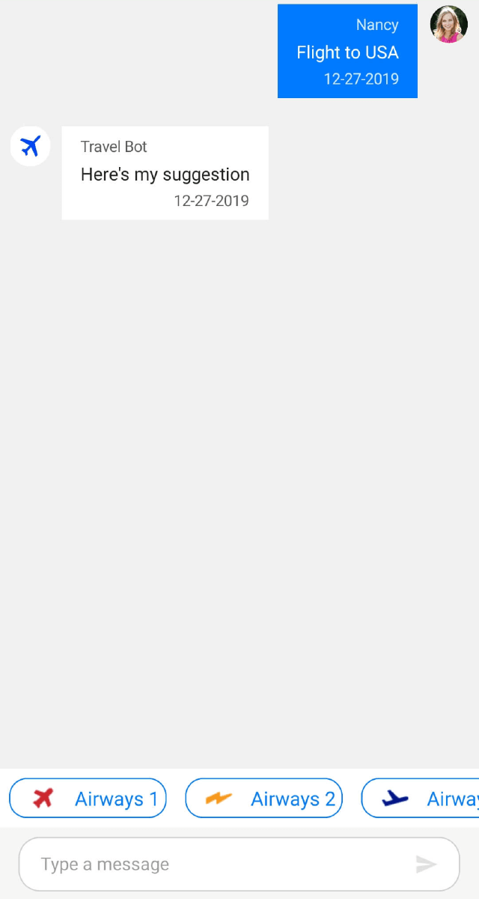

# Suggestions in Xamarin.Forms Chat (SfChat)

The `SfChat` control allows to show a list of options to choose from, as suggestions, below the actual message or at the bottom of the chat control. Suggestions can be shown for all the supported message types in `SfChat`. [SfChat.SuggestionItemSelected](https://help.syncfusion.com/cr/xamarin/Syncfusion.SfChat.XForms~Syncfusion.XForms.Chat.SfChat~SuggestionItemSelected_EV.html) event and [SfChat.SuggestionItemSelectedCommand](https://help.syncfusion.com/cr/xamarin/Syncfusion.SfChat.XForms~Syncfusion.XForms.Chat.SfChat~SuggestionItemSelectedCommand.html) will be executed when the user selects a suggestion item. Both the event and the command will provide the [SuggestionItemSelectedEventArgs](https://help.syncfusion.com/cr/xamarin/Syncfusion.SfChat.XForms~Syncfusion.XForms.Chat.SuggestionItemSelectedEventArgs.html) as arguments.

## Showing suggestions in message

Suggestions can be shown in a message by creating a [ChatSuggestion](https://help.syncfusion.com/cr/xamarin/Syncfusion.SfChat.XForms~Syncfusion.XForms.Chat.ChatSuggestions.html) instance and setting it to the desired message's [Message.Suggestions](https://help.syncfusion.com/cr/xamarin/Syncfusion.SfChat.XForms~Syncfusion.XForms.Chat.MessageBase~Suggestions.html) property.



<?xml version="1.0" encoding="utf-8" ?>
<ContentPage xmlns="http://xamarin.com/schemas/2014/forms"
             xmlns:x="http://schemas.microsoft.com/winfx/2009/xaml"
             xmlns:sfChat="clr-namespace:Syncfusion.XForms.Chat;assembly=Syncfusion.SfChat.XForms"
             xmlns:local="clr-namespace:GettingStarted"
             x:Class="GettingStarted.MainPage">

    <ContentPage.BindingContext>
        <local:GettingStartedViewModel/>
    </ContentPage.BindingContext>
    
    <ContentPage.Content>
                    <sfChat:SfChat x:Name="sfChat"
                           Messages="{Binding Messages}"
                           CurrentUser="{Binding CurrentUser}"
                           ShowOutgoingMessageAvatar="True" />
	<ContentPage.Content>	
</ContentPage>



using Syncfusion.XForms.Chat;
using Xamarin.Forms;

namespace GettingStarted
{
    public partial class MainPage : ContentPage
    {
        SfChat sfChat;
        GettingStartedViewModel viewModel;
        public MainPage()
        {
            InitializeComponent();
            this.sfChat = new SfChat();
            this.viewModel = new GettingStartedViewModel();
            this.sfChat.Messages = viewModel.Messages;
            this.sfChat.CurrentUser = viewModel.CurrentUser;
            this.sfChat.ShowOutgoingMessageAvatar = true;
            this.Content = sfChat;
        }
    }
}

public class GettingStartedViewModel : INotifyPropertyChanged
{
    private ObservableCollection<object> messages;

    /// 

    /// current user of chat.
    /// 

    private Author currentUser;

    /// 

    /// Chat suggestion
    /// 

    private ChatSuggestions chatSuggestions;

    /// 

    /// collection of suggestion items for chat suggestion.
    /// 

    private ObservableCollection<ISuggestion> suggestions;

    public GettingStartedViewModel()
    {
        this.Messages = new ObservableCollection<object>();
        this.CurrentUser = new Author() { Name = "Nancy", Avatar = "People_Circle16.png" };
        
        chatSuggestions = new ChatSuggestions();
        
        suggestions = new ObservableCollection<ISuggestion>();
        suggestions.Add(new Suggestion() { Text = "Airways 1" });
        suggestions.Add(new Suggestion() { Text = "Airways 2" });
        suggestions.Add(new Suggestion() { Text = "Airways 3" });
        suggestions.Add(new Suggestion() { Text = "Airways 4" });
        suggestions.Add(new Suggestion() { Text = "Airways 5" });
        suggestions.Add(new Suggestion() { Text = "Airways 6" });
        chatSuggestions.Items = suggestions;
        this.GenerateMessages();
    }

    /// 

    /// Gets or sets the message conversation.
    /// 

    public ObservableCollection<object> Messages
    {
        get
        {
            return this.messages;
        }
        set
        {
            this.messages = value;
        }
    }

    /// 

    /// Gets or sets the current user.
    /// 

    public Author CurrentUser
    {
        get
        {
            return this.currentUser;
        }
        set
        {
            this.currentUser = value;
            RaisePropertyChanged("CurrentUser");
        }
    }

    /// 

    /// Property changed handler.
    /// 

    public event PropertyChangedEventHandler PropertyChanged;

    /// 

    /// Occurs when property is changed.
    /// 

    /// <param name="propName">changed property name</param>
    public void RaisePropertyChanged(string propName)
    {
        if (this.PropertyChanged != null)
        {
            this.PropertyChanged(this, new PropertyChangedEventArgs (propName));
        }
    }

    private void GenerateMessages()
    {
        this.Messages.Add(new TextMessage()
        {
            Author = CurrentUser,
            Text = "Flight to USA",
        });

        this.Messages.Add(new TextMessage()
        {
            Author = new Author() { Avatar = "Aeroplane.png", Name = "Travel Bot" },
            Text = "Here's my suggestion",
            Suggestions = chatSuggestions,
        });   
    }
}




### Add an image in suggestion item

`SfChat` allows to add image in suggestion list by setting image source to the [Suggestion.Image](https://help.syncfusion.com/cr/xamarin/Syncfusion.SfChat.XForms~Syncfusion.XForms.Chat.Suggestion~Image.html) property.

To add image in suggestion list in message, refer the below the code example:



<?xml version="1.0" encoding="utf-8" ?>
<ContentPage xmlns="http://xamarin.com/schemas/2014/forms"
             xmlns:x="http://schemas.microsoft.com/winfx/2009/xaml"
             xmlns:sfChat="clr-namespace:Syncfusion.XForms.Chat;assembly=Syncfusion.SfChat.XForms"
             xmlns:local="clr-namespace:GettingStarted"
             x:Class="GettingStarted.MainPage">

    <ContentPage.BindingContext>
        <local:GettingStartedViewModel/>
    </ContentPage.BindingContext>
    
    <ContentPage.Content>
                    <sfChat:SfChat x:Name="sfChat"
                           Messages="{Binding Messages}"
                           CurrentUser="{Binding CurrentUser}"
                           ShowOutgoingMessageAvatar="True" />
	<ContentPage.Content>
</ContentPage>



using Syncfusion.XForms.Chat;
using Xamarin.Forms;

namespace GettingStarted
{
    public partial class MainPage : ContentPage
    {
        SfChat sfChat;
        GettingStartedViewModel viewModel;
        public MainPage()
        {
            InitializeComponent();
            this.sfChat = new SfChat();
            this.viewModel = new GettingStartedViewModel();
            this.sfChat.Messages = viewModel.Messages;
            this.sfChat.CurrentUser = viewModel.CurrentUser;
            this.sfChat.ShowOutgoingMessageAvatar = true;
            this.Content = sfChat;
        }
    }
}

public class GettingStartedViewModel :INotifyPropertyChanged
{
    private ObservableCollection<object> messages;

    /// 

    /// current user of chat.
    /// 

    private Author currentUser;

    /// 

    /// Chat suggestion
    /// 

    private ChatSuggestions chatSuggestions;

    /// 

    /// collection of suggestion items for chat suggestion.
    /// 

    private ObservableCollection<ISuggestion> suggestions;

    public GettingStartedViewModel()
    {
        this.messages = new ObservableCollection<object>();
        this.currentUser = new Author() { Name = "Nancy",Avatar = "People_Circle16.png" };
        
        chatSuggestions = new ChatSuggestions();
        
        suggestions = new ObservableCollection<ISuggestion>();
        suggestions.Add(new Suggestion("Airways 1", "Flight1.png"));
        suggestions.Add(new Suggestion("Airways 2", "Flight2.png"));
        suggestions.Add(new Suggestion("Airways 3", "Flight3.png"));
        suggestions.Add(new Suggestion("Airways 4", "Flight4.png"));
        suggestions.Add(new Suggestion("Airways 5", "Flight5.png"));
        suggestions.Add(new Suggestion("Airways 6", "Flight6.png"));
        chatSuggestions.Items = suggestions;
        this.GenerateMessages();
    }

    /// 

    /// Gets or sets the message conversation.
    /// 

    public ObservableCollection<object> Messages
    {
        get
        {
            return this.messages;
        }
        set
        {
            this.messages = value;
        }
    }

    /// 

    /// Gets or sets the current user.
    /// 

    public Author CurrentUser
    {
        get
        {
            return this.currentUser;
        }
        set
        {
            this.currentUser = value;
            RaisePropertyChanged("CurrentUser");
        }
    }

    /// 

    /// Property changed handler.
    /// 

    public event PropertyChangedEventHandler PropertyChanged;

    /// 

    /// Occurs when property is changed.
    /// 

    /// <param name="propName">changed property name<param>
    public void RaisePropertyChanged(string propName)
    {
        if (this.PropertyChanged != null)
        {
            this.PropertyChanged(this, new PropertyChangedEventArgs(propName));
        }
    }

    private void GenerateMessages()
    {
        this.Messages.Add(new TextMessage()
        {
            Author = CurrentUser,
            Text = "Flight to USA",
        });

        this.messages.Add(new TextMessage()
        {
            Author = new Author() { Avatar ="Aeroplane.png", Name = "Travel Bot" },
            Text = "Here's my suggestion",
            Suggestions = chatSuggestions,
        });   
    }
}




### Change the orientation of suggestions

You can choose to show the suggestion items in horizontal or vertical orientation using the [ChatSuggestions.Orientation](https://help.syncfusion.com/cr/xamarin/Syncfusion.SfChat.XForms~Syncfusion.XForms.Chat.ChatSuggestions~Orientation.html) property.

To change suggestion `ChatSuggestions.Orientation`, refer the below code example:



<?xml version="1.0" encoding="utf-8" ?>
<ContentPage xmlns="http://xamarin.com/schemas/2014/forms"
             xmlns:x="http://schemas.microsoft.com/winfx/2009/xaml"
             xmlns:sfChat="clr-namespace:Syncfusion.XForms.Chat;assembly=Syncfusion.SfChat.XForms"
             xmlns:local="clr-namespace:GettingStarted"
             x:Class="GettingStarted.MainPage">

    <ContentPage.BindingContext>
        <local:GettingStartedViewModel/>
    </ContentPage.BindingContext>
    
    <ContentPage.Content>
                    <sfChat:SfChat x:Name="sfChat"
                           Messages="{Binding Messages}"
                           CurrentUser="{Binding CurrentUser}"
                           ShowOutgoingMessageAvatar="True" />
	<ContentPage.Content>
</ContentPage>



using Syncfusion.XForms.Chat;
using Xamarin.Forms;

namespace GettingStarted
{
    public partial class MainPage : ContentPage
    {
        SfChat sfChat;
        GettingStartedViewModel viewModel;
        public MainPage()
        {
            InitializeComponent();
            this.sfChat = new SfChat();
            this.viewModel = new GettingStartedViewModel();
            this.sfChat.Messages = viewModel.Messages;
            this.sfChat.CurrentUser = viewModel.CurrentUser;
            this.sfChat.ShowOutgoingMessageAvatar = true;
            this.Content = sfChat;
        }
    }
}

public class GettingStartedViewModel : INotifyPropertyChanged
{
    private ObservableCollection<object> messages;
    /// 

    /// current user of chat.
    /// 

    private Author currentUser;

    /// 

    /// Chat suggestion
    /// 

    private ChatSuggestions chatSuggestions;

    /// 

    /// collection of suggestion items for chat suggestion.
    /// 

    private ObservableCollection<ISuggestion> suggestions;

    public GettingStartedViewModel()
    {
        this.messages = new ObservableCollection<object>();
        this.currentUser = new Author() { Name = "Nancy", Avatar ="People_Circle16.png" };
        
        chatSuggestions = new ChatSuggestions();
        
        suggestions = new ObservableCollection<ISuggestion>();
        suggestions.Add(new Suggestion("Airways 1", "Flight1.png"));
        suggestions.Add(new Suggestion("Airways 2", "Flight2.png"));
        suggestions.Add(new Suggestion("Airways 3", "Flight3.png"));
        suggestions.Add(new Suggestion("Airways 4", "Flight4.png"));
        suggestions.Add(new Suggestion("Airways 5", "Flight5.png"));
        suggestions.Add(new Suggestion("Airways 6", "Flight6.png"));

        chatSuggestions.Orientation =SuggestionsOrientation.Vertical;

        chatSuggestions.Items = suggestions;
        this.GenerateMessages();
    }

    /// 

    /// Gets or sets the message conversation.
    /// 

    public ObservableCollection<object> Messages
    {
        get
        {
            return this.messages;
        }
        set
        {
            this.messages = value;
        }
    }

    /// 

    /// Gets or sets the current user.
    /// 

    public Author CurrentUser
    {
        get
        {
            return this.currentUser;
        }
        set
        {
            this.currentUser = value;
            RaisePropertyChanged("CurrentUser");
        }
    }

    /// 

    /// Property changed handler.
    /// 

    public event PropertyChangedEventHandler PropertyChanged;

    /// 

    /// Occurs when property is changed.
    /// 

    /// <param name="propName">changed property name</param>
    public void RaisePropertyChanged(string propName)
    {
        if (this.PropertyChanged != null)
        {
            this.PropertyChanged(this, new PropertyChangedEventArgs(propName));
        }
    }

    private void GenerateMessages()
    {
        this.Messages.Add(new TextMessage()
        {
            Author = CurrentUser,
            Text = "Flight to USA",
        });

        this.Messages.Add(new TextMessage()
        {
            Author = new Author() { Avatar = "Aeroplane.png", Name = "Travel Bot" },
            Text = "Here's my suggestion",
            Suggestions = chatSuggestions,
        });   
    }
}




## Showing suggestions at bottom of chat control

The SfChat allows to show a list of options as suggestions at the bottom of chat control by creating a [ChatSuggestion](https://help.syncfusion.com/cr/xamarin/Syncfusion.SfChat.XForms~Syncfusion.XForms.Chat.ChatSuggestions.html) instance and setting it to the [SfChat.Suggestions](https://help.syncfusion.com/cr/xamarin/Syncfusion.SfChat.XForms~Syncfusion.XForms.Chat.SfChat~Suggestions.html) property.



<?xml version="1.0" encoding="utf-8" ?>
<ContentPage xmlns="http://xamarin.com/schemas/2014/forms"
             xmlns:x="http://schemas.microsoft.com/winfx/2009/xaml"
             xmlns:sfChat="clr-namespace:Syncfusion.XForms.Chat;assembly=Syncfusion.SfChat.XForms"
             xmlns:local="clr-namespace:GettingStarted"
             x:Class="GettingStarted.MainPage">

    <ContentPage.BindingContext>
        <local:GettingStartedViewModel/>
    </ContentPage.BindingContext>
    
    <ContentPage.Content>
                    <sfChat:SfChat x:Name="sfChat"
                           Messages="{Binding Messages}"
                           CurrentUser="{Binding CurrentUser}"
                           ShowOutgoingMessageAvatar="True" />
	<ContentPage.Content>
</ContentPage>



using Syncfusion.XForms.Chat;
using Xamarin.Forms;

namespace GettingStarted
{
    public partial class MainPage : ContentPage
    {
        SfChat sfChat;
        GettingStartedViewModel viewModel;
        public MainPage()
        {
            InitializeComponent();
            this.sfChat = new SfChat();
            this.viewModel = new GettingStartedViewModel();
            this.sfChat.Messages = viewModel.Messages;
            this.sfChat.CurrentUser = viewModel.CurrentUser;
            this.sfChat.ShowOutgoingMessageAvatar = true;
            this.Content = sfChat;
        }
    }
}

public class GettingStartedViewModel : INotifyPropertyChanged
{
    private ObservableCollection<object> messages;
    
    /// 

    /// current user of chat.
    /// 

    private Author currentUser;

    /// 

    /// Chat suggestion
    /// 

    private ChatSuggestions chatSuggestions;

    /// 

    /// collection of suggestion items for chat suggestion.
    /// 

    private ObservableCollection<ISuggestion> suggestions;

    public GettingStartedViewModel()
    {
        this.messages = new ObservableCollection<object>();
        this.currentUser = new Author() { Name = "Nancy", Avatar = "People_Circle16.png" };

        ChatSuggestions = new ChatSuggestions();

        suggestions = new ObservableCollection<ISuggestion>();
        suggestions.Add(new Suggestion("Airways 1", "Flight1.png"));
        suggestions.Add(new Suggestion("Airways 2", "Flight2.png"));
        suggestions.Add(new Suggestion("Airways 3", "Flight3.png"));
        suggestions.Add(new Suggestion("Airways 4", "Flight4.png"));
        suggestions.Add(new Suggestion("Airways 5", "Flight5.png"));
        suggestions.Add(new Suggestion("Airways 6", "Flight6.png"));

        ChatSuggestions.Orientation = SuggestionsOrientation.Vertical;

        ChatSuggestions.Items = suggestions;
        this.GenerateMessages();
    }

    /// 

    /// Gets or sets the message conversation.
    /// 

    public ObservableCollection<object> Messages
    {
        get
        {
            return this.messages;
        }
        set
        {
            this.messages = value;
        }
    }

    /// 

    /// Gets or sets the chat suggestion.
    /// 

    public ChatSuggestions ChatSuggestions
    {
        get
        {
            return this.chatSuggestions;
        }
        set
        {
            this.chatSuggestions = value;
        }
    }

    /// 

    /// Gets or sets the current user.
    /// 

    public Author CurrentUser
    {
        get
        {
            return this.currentUser;
        }
        set
        {
            this.currentUser = value;
            RaisePropertyChanged("CurrentUser");
        }
    }

    /// 

    /// Property changed handler.
    /// 

    public event PropertyChangedEventHandler PropertyChanged;

    /// 

    /// Occurs when property is changed.
    /// 

    /// <param name="propName">changed property name</param>
    public void RaisePropertyChanged(string propName)
    {
        if (this.PropertyChanged != null)
        {
            this.PropertyChanged(this, new PropertyChangedEventArgs(propName));
        }
    }

    private void GenerateMessages()
    {
        this.Messages.Add(new TextMessage()
        {
            Author = CurrentUser,
            Text = "Flight to USA",
        });

        this.Messages.Add(new TextMessage()
        {
            Author = new Author() { Avatar = "Aeroplane.png", Name = "Travel Bot" },
            Text = "Here's my suggestion",
            Suggestions = chatSuggestions,
        });   
    }
}




## Cancel the suggestions from closing

The suggestions list will be closed by default after the user has selected an option from the list. To prevent it from closing set the [SuggestionItemSelectedEventArgs.HideAfterSelection](https://help.syncfusion.com/cr/xamarin/Syncfusion.SfChat.XForms~Syncfusion.XForms.Chat.SuggestionItemSelectedEventArgs~HideAfterSelection.html) as false in the [SfChat.SuggestionItemSelected](https://help.syncfusion.com/cr/xamarin/Syncfusion.SfChat.XForms~Syncfusion.XForms.Chat.SfChat~SuggestionItemSelected_EV.html) event handler or in the [SfChat.SuggestionItemSelectedCommand](https://help.syncfusion.com/cr/xamarin/Syncfusion.SfChat.XForms~Syncfusion.XForms.Chat.SfChat~SuggestionItemSelectedCommand.html) command's execution.

**SuggestionItemSelected event**



 
this.sfChat.SuggestionItemSelected += this.SfChat_SuggestionItemSelected;

/// 

/// Raised when current user has selected the suggestion option from suggestion list.
/// 

/// <param name="sender"><see cref="SfChat"/> as sender</param>
/// <param name="e"><see cref="SuggestionItemSelectedEventArgs"/> as parameter</param>
private void SfChat_SuggestionItemSelected(object sender, SuggestionItemSelectedEventArgs e)
{
    // Suggestion list not closed after selection.
    e.HideAfterSelection = false;
}




**SuggestionItemSelectedCommand command**



<?xml version="1.0" encoding="utf-8" ?>
<ContentPage xmlns="http://xamarin.com/schemas/2014/forms"
             xmlns:x="http://schemas.microsoft.com/winfx/2009/xaml"
             xmlns:sfChat="clr-namespace:Syncfusion.XForms.Chat;assembly=Syncfusion.SfChat.XForms"
             xmlns:local="clr-namespace:GettingStarted"
             x:Class="GettingStarted.MainPage">

    <ContentPage.BindingContext>
        <local:GettingStartedViewModel/>
    </ContentPage.BindingContext>
    
    <ContentPage.Content>
        <sfChat:SfChat x:Name="sfChat"
                       Messages="{Binding Messages}"
                       SendMessageCommand="{Binding SendMessageCommand}"
                       CurrentUser="{Binding CurrentUser}"
                       ShowOutgoingMessageAvatar="True" />
    </ContentPage.Content>




/// 

/// View model class for chat view.
/// 

public class GettingStartedViewModel : INotifyPropertyChanged
{
    private ICommand suggestionItemSelectedCommand;

    public GettingStartedViewModel()
    {
        SuggestionItemSelectedCommand = new SuggestionItemSelectedCommandExt();
    }

    /// 

    /// Gets or sets the suggestion item selected command.
    /// 

    public ICommand SuggestionItemSelectedCommand
    {
        get
        {
            return this.suggestionItemSelectedCommand;
        }
        set
        {
            this.suggestionItemSelectedCommand = value;
        }
    }
}

public class SuggestionItemSelectedCommandExt : ICommand
{
    public event EventHandler CanExecuteChanged;

    public bool CanExecute(object parameter)
    {
        return true;
    }

    public void Execute(object parameter)
    {
        var args = parameter as SuggestionItemSelectedEventArgs;
        // Suggestion list not closed after selection.
        args.HideAfterSelection = false;
    }
}


