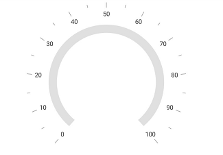
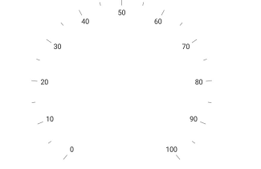

---

layout: post
title: Rim in Syncfusion SfCircularGauge control for Xamarin.Forms
description: Learn how to access rim and customize the rim in Syncfusion CircularGauge control for Xamarin.Forms Platform
platform: xamarin
control: SfCircularGauge
documentation: ug

---

# Rim in SfCircularGauge

Scale determines the structure of a circular gauge by using the circular rim. By setting the [`StartAngle`](https://help.syncfusion.com/cr/cref_files/xamarin/Syncfusion.SfGauge.XForms~Syncfusion.SfGauge.XForms.Scale~StartAngle.html) and [`SweepAngle`](https://help.syncfusion.com/cr/cref_files/xamarin/Syncfusion.SfGauge.XForms~Syncfusion.SfGauge.XForms.Scale~SweepAngle.html) properties, you can change the shape of the circular gauge into a full circular gauge, half circular gauge, or quarter circular gauge.

The [`StartValue`](https://help.syncfusion.com/cr/cref_files/xamarin/Syncfusion.SfGauge.XForms~Syncfusion.SfGauge.XForms.Scale~StartValue.html) and [`EndValue`](https://help.syncfusion.com/cr/cref_files/xamarin/Syncfusion.SfGauge.XForms~Syncfusion.SfGauge.XForms.Scale~EndValue.html) properties will determine the overall range of the circular rim.





     <gauge:SfCircularGauge>
    
        <gauge:SfCircularGauge.Scales>
             <gauge:Scale StartAngle="270" SweepAngle="360" StartValue="0" EndValue="360" Interval="20" MinorTicksPerInterval="0" ShowFirstLabel="False"/>
         </gauge:SfCircularGauge.Scales>	
   
     </gauge:SfCircularGauge>





    SfCircularGauge circularGauge = new SfCircularGauge();
    ObservableCollection<Scale> scales = new ObservableCollection<Scale>();
    Scale scale = new Scale();
    scale.StartAngle = 270;
    scale.SweepAngle = 360;
    scale.StartValue = 0;
    scale.EndValue = 360;
    scale.Interval = 20;
    scale.MinorTicksPerInterval = 0;
    scale.ShowFirstLabel = false;
    scales.Add(scale);
    circularGauge.Scales = scales;  





## Rim customization

The color and thickness of rim can be set by using the [`RimColor`](https://help.syncfusion.com/cr/cref_files/xamarin/Syncfusion.SfGauge.XForms~Syncfusion.SfGauge.XForms.Scale~RimColor.html) and [`RimThickness`](https://help.syncfusion.com/cr/cref_files/xamarin/Syncfusion.SfGauge.XForms~Syncfusion.SfGauge.XForms.Scale~RimThickness.html) properties. To increase the [`RimThickness`](https://help.syncfusion.com/cr/cref_files/xamarin/Syncfusion.SfGauge.XForms~Syncfusion.SfGauge.XForms.Scale~RimThickness.html), set the [`RadiusFactor`](https://help.syncfusion.com/cr/cref_files/xamarin/Syncfusion.SfGauge.XForms~Syncfusion.SfGauge.XForms.Scale~RadiusFactor.html).





     <gauge:SfCircularGauge>
     
        <gauge:SfCircularGauge.Scales>
             <gauge:Scale RadiusFactor="1" RimThickness="40" RimColor="SkyBlue" LabelOffset = "0.6">
			 
                 <gauge:Scale.MajorTickSettings>
                        <gauge:TickSettings Offset = “0.75”/>
                 </gauge:Scale.MajorTickSettings>
					
                 <gauge:Scale.MinorTickSettings>
                        <gauge:TickSettings Offset = “0.75”/>
                 </gauge:Scale.MinorTickSettings>
					
					</gauge:Scale>

         </gauge:SfCircularGauge.Scales>	
    
     </gauge:SfCircularGauge>





    SfCircularGauge circularGauge = new SfCircularGauge();
    ObservableCollection<Scale> scales = new ObservableCollection<Scale>();
    Scale scale = new Scale();
    scale.RadiusFactor = 1;
    scale.RimThickness = 40;
    scale.LabelOffset = 0.6;
    scale.MajorTickSettings.Offset = 0.75;
    scale.MinorTickSettings.Offset = 0.75;
    scale.RimColor = Color.SkyBlue;
    scales.Add(scale);
    circularGauge.Scales = scales;  





## Setting position for rim

You can customize the position and size of [`Scales`](https://help.syncfusion.com/cr/cref_files/xamarin/Syncfusion.SfGauge.XForms~Syncfusion.SfGauge.XForms.SfCircularGauge~Scales.html) rim in the following two ways:
1. [`RadiusFactor`](https://help.syncfusion.com/cr/cref_files/xamarin/Syncfusion.SfGauge.XForms~Syncfusion.SfGauge.XForms.Scale~RadiusFactor.html) with the [`RimThickness`](https://help.syncfusion.com/cr/cref_files/xamarin/Syncfusion.SfGauge.XForms~Syncfusion.SfGauge.XForms.Scale~RimThickness.html) property - To applying rim size in logical pixels. 
2. The [`ScaleStartOffset`](https://help.syncfusion.com/cr/cref_files/xamarin/Syncfusion.SfGauge.XForms~Syncfusion.SfGauge.XForms.Scale~ScaleStartOffset.html) and [`ScaleEndOffset`](https://help.syncfusion.com/cr/cref_files/xamarin/Syncfusion.SfGauge.XForms~Syncfusion.SfGauge.XForms.Scale~ScaleEndOffset.html) properties - To applying rim size in factor(0 to 1). 

### Setting radius factor for rim

This approach is used to define the rim size from its starting location in logical pixels. The [`RadiusFactor`](https://help.syncfusion.com/cr/cref_files/xamarin/Syncfusion.SfGauge.XForms~Syncfusion.SfGauge.XForms.Scale~RadiusFactor.html) property is used to define the start position of the scale rim in factor value (between 0 to 1). Rim position is determined by multiplying this factor value to the gauge circle radius size. The [`RimThickness`](https://help.syncfusion.com/cr/cref_files/xamarin/Syncfusion.SfGauge.XForms~Syncfusion.SfGauge.XForms.Scale~RimThickness.html) property is used to define the rim size in logical pixels. 





     <gauge:SfCircularGauge>
    
        <gauge:SfCircularGauge.Scales>
		
             <gauge:Scale RadiusFactor = "0.7" RimThickness = "30">
					
			</gauge:Scale>

         </gauge:SfCircularGauge.Scales>	
    
     </gauge:SfCircularGauge>





    SfCircularGauge circularGauge = new SfCircularGauge();
    ObservableCollection<Scale> scales = new ObservableCollection<Scale>();
    Scale scale = new Scale();
    scale.RadiusFactor = 0.7;
    scale.RimThickness = 30;
    scales.Add(scale);
    circularGauge.Scales = scales;  





### Setting scale start and end offsets for rim

The [`ScaleStartOffset`](https://help.syncfusion.com/cr/cref_files/xamarin/Syncfusion.SfGauge.XForms~Syncfusion.SfGauge.XForms.Scale~ScaleStartOffset.html) and [`ScaleEndOffset`](https://help.syncfusion.com/cr/cref_files/xamarin/Syncfusion.SfGauge.XForms~Syncfusion.SfGauge.XForms.Scale~ScaleEndOffset.html) properties are used to define the scale rim position and size in the factor value (between 0 and 1) for the responsive size (size will be responsive in all the layout). Rim position and size is determined by multiplying this factor value to the radius size of the gauge circle. 





     <gauge:SfCircularGauge>
    
        <gauge:SfCircularGauge.Scales>
		
             <gauge:Scale ScaleStartOffset="0.6" ScaleEndOffset = "0.7">
					
			</gauge:Scale>

         </gauge:SfCircularGauge.Scales>	
    
     </gauge:SfCircularGauge>





    SfCircularGauge circularGauge = new SfCircularGauge();
    ObservableCollection<Scale> scales = new ObservableCollection<Scale>();
    Scale scale = new Scale();
    scale.ScaleStartOffset = 0.6;
    scale.ScaleEndOffset = 0.7;
    scales.Add(scale);
    circularGauge.Scales = scales;  





## Show rim

The [`ShowRim`](https://help.syncfusion.com/cr/cref_files/xamarin/Syncfusion.SfGauge.XForms~Syncfusion.SfGauge.XForms.Scale~ShowRim.html) property is a Boolean property, which is used to enable or disable the rim in circular gauge.





        <gauge:SfCircularGauge>
		
          <gauge:SfCircularGauge.Scales>
	  	    <gauge:Scale ShowRim = "False">
                    </gauge:Scale>
	      </gauge:SfCircularGauge.Scales>	

	    </gauge:SfCircularGauge>	 





            SfCircularGauge circularGauge = new SfCircularGauge();       
            ObservableCollection<Scale> scales = new ObservableCollection<Scale>();
            Scale scale = new Scale();                
            scale.ShowRim = false;
            scales.Add(scale);
            circularGauge.Scales = scales;
    




