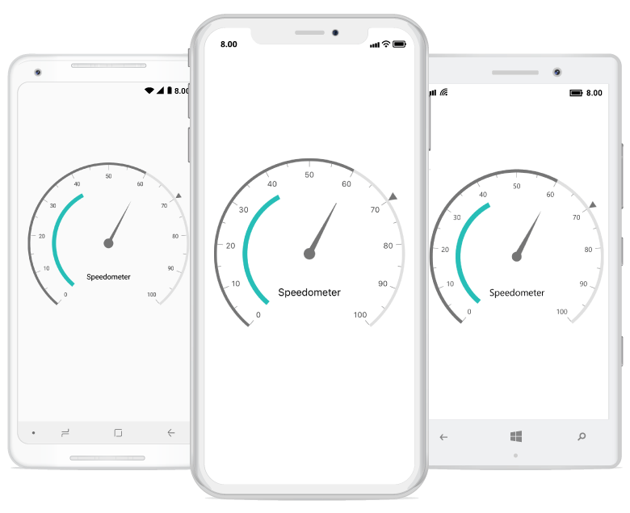

---

layout: post
title: Syncfusion SfCircularGauge control for Xamarin.Forms
description:  A quick tour to initial users on Syncfusion SfCircularGauge control for Xamarin.Forms Platform
platform: xamarin
control: SfCircularGauge
documentation: ug

---

# Getting Started

This section explains the steps required to configure the [`SfCircularGauge`](https://help.syncfusion.com/cr/cref_files/xamarin/sfgauge/Syncfusion.SfGauge.XForms~Syncfusion.SfGauge.XForms.SfCircularGauge.html), and also explains the steps required to add basic elements of [`SfCircularGauge`](https://help.syncfusion.com/cr/cref_files/xamarin/sfgauge/Syncfusion.SfGauge.XForms~Syncfusion.SfGauge.XForms.SfCircularGauge.html) through various APIs available within it.

## Adding Circular Gauge Reference

Refer this [article](https://help.syncfusion.com/xamarin/introduction/download-and-installation) to know how to obtain and reference Essential Studio components in your solution; then refer [this](https://help.syncfusion.com/xamarin/introduction/control-dependencies#sfcirculargauge) link to know about the assemblies required for adding CircularGauge to your project.

I> After adding the reference, currently, an additional step is required for iOS and UWP projects. We need to create an instance of the `SfGaugeRenderer` in iOS and UWP projects as shown in this [KB article.](https://www.syncfusion.com/kb/8271)

I> For UWP alone, one more additional step is required if the project is built in release mode with .NET Native tool chain enabled. You can refer the [KB article](https://www.syncfusion.com/kb/8272) for more details.
 
### Adding namespace for the assemblies




 
     xmlns:gauge="clr-namespace:Syncfusion.SfGauge.XForms;assembly=Syncfusion.SfGauge.XForms"





    using Syncfusion.SfGauge.XForms;





## Initialize Gauge 

You can initialize the the [`SfCircularGauge`](https://help.syncfusion.com/cr/cref_files/xamarin/sfgauge/Syncfusion.SfGauge.XForms~Syncfusion.SfGauge.XForms.SfCircularGauge.html) control with a required optimal name by using the included namespace.




 
     <gauge:SfCircularGauge/> 





    SfCircularGauge circular = new SfCircularGauge ();
    this.Content = circular;





## Adding Header

You can assign a unique header to [`SfCircularGauge`](https://help.syncfusion.com/cr/cref_files/xamarin/sfgauge/Syncfusion.SfGauge.XForms~Syncfusion.SfGauge.XForms.SfCircularGauge.html) by making use of [`Header`](https://help.syncfusion.com/cr/cref_files/xamarin/sfgauge/Syncfusion.SfGauge.XForms~Syncfusion.SfGauge.XForms.SfCircularGauge~Headers.html) property, and you can position it wherever you want by using [`Position`](https://help.syncfusion.com/cr/cref_files/xamarin/sfgauge/Syncfusion.SfGauge.XForms~Syncfusion.SfGauge.XForms.Header~Position.html) property.





    <gauge:SfCircularGauge>
	...

         <gauge:SfCircularGauge.Headers>
             <gauge:Header Text="Speedometer" />
         </gauge:SfCircularGauge.Headers>
    
	...
    </gauge:SfCircularGauge>
	




    SfCircularGauge circularGauge = new SfCircularGauge(); 
    Header header = new Header();
    header.Text = "Speedometer";
    circularGauge.Headers.Add(header);  
	




## Configuring Scales

You can configure the [`Scale`](https://help.syncfusion.com/cr/cref_files/xamarin/sfgauge/Syncfusion.SfGauge.XForms~Syncfusion.SfGauge.XForms.Scale.html) elements by making use of following APIs available in [`SfCircularGauge`](https://help.syncfusion.com/cr/cref_files/xamarin/sfgauge/Syncfusion.SfGauge.XForms~Syncfusion.SfGauge.XForms.SfCircularGauge.html):

They are:

* StartAngle
* SweepAngle
* StartValue
* EndValue
* Interval
* RimThickness
* RimColor





    <gauge:SfCircularGauge>
     ...

        <gauge:SfCircularGauge.Scales>
           <gauge:Scale />
        </gauge:SfCircularGauge.Scales>	
            ...
    </gauge:SfCircularGauge>
	




    ObservableCollection<Scale> scales = new ObservableCollection<Scale>();
    Scale scale = new Scale();
    scales.Add(scale);
    circular.Scales = scales;  
	




## Adding Ranges

You can add ranges to [`SfCircularGauge`](https://help.syncfusion.com/cr/cref_files/xamarin/sfgauge/Syncfusion.SfGauge.XForms~Syncfusion.SfGauge.XForms.SfCircularGauge.html) by creating ranges collection by using [`Range`](https://help.syncfusion.com/cr/cref_files/xamarin/sfgauge/Syncfusion.SfGauge.XForms~Syncfusion.SfGauge.XForms.Range.html) property.



  
          
    <gauge:SfCircularGauge>
     ...
	 
         <gauge:Scale.Ranges>
             <gauge:Range StartValue="0" EndValue="40"/>
         </gauge:Scale.Ranges>
   
      ...
    </gauge:SfCircularGauge>
	




    ObservableCollection<Scale> scales = new ObservableCollection<Scale>();
    Scale scale = new Scale();
    Range range = new Range();
    range.StartValue = 0;
    range.EndValue = 40;
    scale.Ranges.Add(range);
    circularGauge.Scales = scale; 
	




## Adding a Needle Pointer

You can create a [`NeedlePointer`](https://help.syncfusion.com/cr/cref_files/xamarin/sfgauge/Syncfusion.SfGauge.XForms~Syncfusion.SfGauge.XForms.NeedlePointer.html), and associate it with a scale to be displayed the current value.





    <gauge:SfCircularGauge>
     ...
	 
        <gauge:Scale.Pointers>      
            <gauge:NeedlePointer  Value="60" />  
        </gauge:Scale.Pointers> 
        
     ...
    </gauge:SfCircularGauge>
	




    ObservableCollection<Scale> scales = new ObservableCollection<Scale>();
    Scale scale = new Scale();
    NeedlePointer needlePointer = new NeedlePointer();
    needlePointer.Value = 60;
    scale.Pointers.Add(needlePointer);
    circularGauge.Scales = scale;
	




## Adding a Range Pointer

A [`RangePointer`](https://help.syncfusion.com/cr/cref_files/xamarin/sfgauge/Syncfusion.SfGauge.XForms~Syncfusion.SfGauge.XForms.RangePointer.html) provides an alternative way of indicating the current value.



 

    <gauge:SfCircularGauge>
     ...
	 
         <gauge:Scale.Pointers>
             <gauge:RangePointer Value="60" />
         </gauge:Scale.Pointers>
		 
     ...
     </gauge:SfCircularGauge>
	 


    

    ObservableCollection<Scale> scales = new ObservableCollection<Scale>();
    Scale scale = new Scale();
    RangePointer rangePointer = new RangePointer();
    rangePointer.Value = 60;
    scale.Pointers.Add(rangePointer);
    scales.Add(scale);
    circularGauge.Scales = scale;
	

       


## Adding a Marker Pointer

A [`MarkerPointer`](https://help.syncfusion.com/cr/cref_files/xamarin/sfgauge/Syncfusion.SfGauge.XForms~Syncfusion.SfGauge.XForms.MarkerPointer.html) points the current value in scale.



 

    <gauge:SfCircularGauge>
     ...
	 
         <gauge:Scale.Pointers>
             <gauge:MarkerPointer Value="70" />
         </gauge:Scale.Pointers>
		 
     ...
     </gauge:SfCircularGauge>
	 


  
   
    ObservableCollection<Scale> scales = new ObservableCollection<Scale>();
    Scale scale=new Scale();
    MarkerPointer markerPointer = new MarkerPointer();
    markerPointer.Value = 70;
    scale.Pointers.Add(markerPointer);
    scales.Add(scale);
	circular.Scales = scales;
	

       

 
