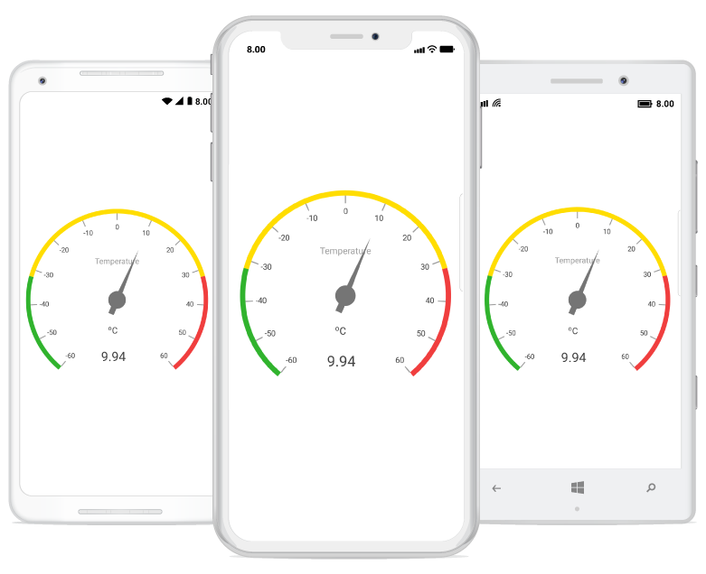

---

layout: post
title: Overview of Syncfusion SfCircularGauge control for Xamarin.Forms
description: Overview of SfCircularGauge control
platform: Xamarin.Forms
control: SfCircularGauge
documentation: ug

---

# OVERVIEW

Essential Gauge for Xamarin.Forms lets you visualize numeric values over a circular scale. The appearance of the gauge is fully customized to faultlessly integrate with your applications.

## KEY FEATURES

A **SfCircularGauge** is composed of a Scales that will be an integrated UI part of the SfCircularGauge.

SfCircularGauge is composite UI element with following subparts:

1. Scales
2. Ranges
3. Pointers
4. Headers

The Circular Gauge control is a highly customizable control with a variety of simple APIs to modify the basic look and feel of the SfCircularGauge. You can position the ranges, ticks, labels and range pointers as needed.

* **Scales** - The circular gauge scale contains labels, tick marks and a rim to specify the basic look and feel of the circular gauge. It defines the start angle, sweep direction and sweep angle, overall minimum and maximum values, and the frequency of labels and tick marks.
* **Ranges** - A range is a visual element which depicts the start and end values of inner divisions within the scale’s range. Each scale is capable of displaying one or more ranges, and each range can depict different zones or regions of same metrics, such as high, low, and average temperatures.
* **Pointers** - A pointer is an element that points out a value of the bound property on a scale. A circular scale can have one or more pointers that can be used to measure different values. Each pointer has a value property which visually informs the user of the current value.
* **Headers** - The Header can be used to set a unique header for the circular gauge. The user can add text as the header in a circular gauge.

