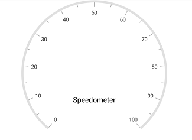

---

layout: post
title: Accessing Header in Syncfusion SfCircularGauge control for Xamarin.Forms
description:  Learn how to set header in Syncfusion SfCircularGauge control
platform: xamarin
control: SfCircularGauge
documentation: ug

---

# HEADER

`Header` support allows you to show text, an image, or any UI content inside the Gauge control. A circular gauge can be made self-descriptive about the data it is measuring through the use of a header.

## Adding Header in Circular Gauge

###  Header

The `Header` can be used to set a unique header for the Circular Gauge. You can add text as headers in a circular gauge,multiple headers can be added in a circular gauge.

####  Position

This property places the header in a circular gauge. The value for `Position` should be specified in offset value. By default, it is placed at (0.5, 0.7).




 
    <gauge:SfCircularGauge.Headers>
      <gauge:Header Text="Speedmeter" Position="0.5,0.5" TextSize="20" ForegroundColor="Gray"/>
    </gauge:SfCircularGauge.Headers>





    SfCircularGauge circularGauge = new SfCircularGauge(); 
    Header header = new Header();
    header.Text = "Speedmeter";
    header.TextSize = 20;
    header.Position = Device.OnPlatform(iOS: new Point(.3, .7), Android:new Point(0.38, 0.7), WinPhone: new Point(0.38, 0.7));
    header.ForegroundColor = Color.Gray;
    circularGauge.Headers.Add(header); 
    this.content = circularGauge;
    




