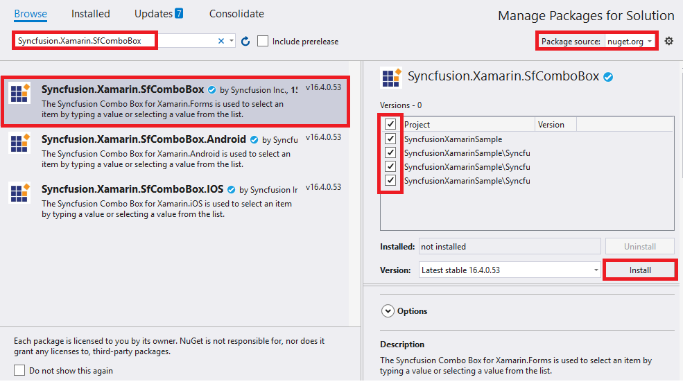

# Getting started with SfComboBox

This section explains the steps required to create the combo box control, populate it with data and filter the suggestions. This section covers only the minimal features that are needed to get started with the control.

## Adding SfComboBox reference

You can add SfComboBox reference using one of the following methods:

**Method 1: Adding SfComboBox reference from nuget.org**

Syncfusion Xamarin components are available in [nuget.org](https://www.nuget.org/). To add SfComboBox to your project, open the NuGet package manager in Visual Studio, search for [Syncfusion.Xamarin.SfComboBox](https://www.nuget.org/packages/Syncfusion.Xamarin.SfComboBox), and then install it.

N> Install the same version of SfComboBox NuGet in all the projects.

**Method 2: Adding SfComboBox reference from toolbox**

Syncfusion also provides Xamarin Toolbox. Using this toolbox, you can drag the SfComboBox control to the XAML page. It will automatically install the required NuGet packages and add the namespace to the page. To install Syncfusion Xamarin Toolbox, refer to [Toolbox](https://help.syncfusion.com/xamarin/utility#toolbox).

**Method 3: Adding SfComboBox assemblies manually from the installed location**

If you prefer to manually reference the assemblies instead referencing from NuGet, add the following assemblies in respective projects.

Location: {Installed location}/{version}/Xamarin/lib

<table>
<tr>
<td>PCL</td>
<td>Syncfusion.SfComboBox.XForms.dll Syncfusion.Core.XForms.dll Syncfusion.Licensing.dll </td>
</tr>
<tr>
<td>Android</td>
<td>Syncfusion.SfComboBox.XForms.dll Syncfusion.SfComboBox.XForms.Android.dll Syncfusion.Core.XForms.dll Syncfusion.Core.XForms.Android.dll Syncfusion.Licensing.dll </td>
</tr>
<tr>
<td>iOS</td>
<td>Syncfusion.SfComboBox.XForms.dll Syncfusion.SfComboBox.XForms.iOS.dll Syncfusion.Core.XForms.dll Syncfusion.Core.XForms.iOS.dll Syncfusion.Licensing.dll </td>
</tr>
<tr>
<td>UWP</td>
<td>Syncfusion.SfComboBox.XForms.dll Syncfusion.SfComboBox.XForms.UWP.dll Syncfusion.Core.XForms.dll Syncfusion.Core.XForms.UWP.dll Syncfusion.Licensing.dll </td>
</tr>
</table>

N> To know more about obtaining our components, refer to these links for [Mac](https://help.syncfusion.com/xamarin/introduction/download-and-installation/mac/) and [Windows](https://help.syncfusion.com/xamarin/introduction/download-and-installation/windows/).

I> Starting with v16.2.0.x, if you reference Syncfusion assemblies from the trial setup or from the NuGet feed, you also have to include a license key in your projects. Please refer to [Syncfusion license key](https://help.syncfusion.com/common/essential-studio/licensing/license-key/) to know about registering Syncfusion license key in your Xamarin application to use our components.

N> If you are adding the references from toolbox, this step is not needed.

### Additional Step for iOS

To launch the SfComboBox in iOS, call the `SfComboBoxRenderer.Init()` in the `FinishedLaunching` overridden method of the AppDelegate class after the Xamarin.Forms Framework has been initialized and before the LoadApplication is called, as demonstrated in the following code example.


public override bool FinishedLaunching(UIApplication app, NSDictionary options)
{
    …
    global::Xamarin.Forms.Forms.Init ();
    Syncfusion.XForms.iOS.ComboBox.SfComboBoxRenderer.Init();
    LoadApplication (new App ());
    …
}


### Additional step for UWP

This step is required only if the application is deployed in release mode with .NET native tool chain enabled. This is for resolving the known Framework issue “Custom controls not rendering in Release mode” in UWP platform. Initializing the SfComboBox assembly at OnLaunched overridden method of the App class in UWP project is the suggested workaround. The following code example show to resolve this issue.



protected override void OnLaunched(LaunchActivatedEventArgs e)
{
#if DEBUG
if (System.Diagnostics.Debugger.IsAttached)
{
	this.DebugSettings.EnableFrameRateCounter = true;
}
#endif

Frame rootFrame = Window.Current.Content as Frame; 
if (rootFrame == null)
{
	rootFrame = new Frame();
	rootFrame.NavigationFailed += OnNavigationFailed;                
	List<System.Reflection.Assembly> assembliesToInclude = new List<System.Reflection.Assembly>();
	// Add all the renderer assemblies your app uses 
	assembliesToInclude.Add(typeof(Syncfusion.XForms.UWP.ComboBox.SfComboBoxRenderer).GetTypeInfo().Assembly);
	// Replace the Xamarin.Forms.Forms.Init(e);        
	Xamarin.Forms.Forms.Init(e, assembliesToInclude);
	if (e.PreviousExecutionState == ApplicationExecutionState.Terminated)
	{
		//TODO: Load state from previously suspended application
	}
	// Place the frame in the current Window
	Window.Current.Content = rootFrame;
}
if (rootFrame.Content == null)
{
	// When the navigation stack isn't restored navigate to the first page,
	// configuring the new page by passing required information as a navigation
	// parameter
	rootFrame.Navigate(typeof(MainPage), e.Arguments);
}
// Ensure the current window is active
Window.Current.Activate();
}



## Initializing ComboBox 

Import the SfComboBox namespace in respective page as shown in the following code.





xmlns:combobox="clr-namespace:Syncfusion.XForms.ComboBox;assembly=Syncfusion.SfComboBox.XForms"





using Syncfusion.XForms.ComboBox;





Then initialize an empty combobox as shown in the following code,





<ContentPage xmlns="http://xamarin.com/schemas/2014/forms" 
             xmlns:x="http://schemas.microsoft.com/winfx/2009/xaml" 
             xmlns:combobox="clr-namespace:Syncfusion.XForms.ComboBox;assembly=Syncfusion.SfComboBox.XForms"
             xmlns:local="clr-namespace:NamespaceName"            
             x:Class="NamespaceName.ClassName">
	<StackLayout VerticalOptions="Start" HorizontalOptions="Start" Padding="30">
		<combobox:SfComboBox HeightRequest="40" x:Name="comboBox"/>
	</StackLayout> 
</ContentPage>
	




StackLayout layout = new StackLayout()
{ 
    VerticalOptions = LayoutOptions.Start, 
    HorizontalOptions = LayoutOptions.Start,
    Padding = new Thickness(30) 
};
SfComboBox comboBox = new SfComboBox();
comboBox.HeightRequest = 40;

layout.Children.Add(comboBox);
Content = layout;





## Populating ComboBox with data

Now, a list of string with resolution list is created and added to the SfComboBox data source property. This list is populated as suggestion list by setting the [`DataSource`](https://help.syncfusion.com/cr/xamarin/Syncfusion.XForms.ComboBox.SfComboBox.html#Syncfusion_XForms_ComboBox_SfComboBox_DataSourceProperty) property based on text entry. You can customize the drop-down height using the `MaximumDropDownHeight` property. Add the DataSource for the SfComboBox as shown in the following code.





<ContentPage xmlns="http://xamarin.com/schemas/2014/forms" 
             xmlns:x="http://schemas.microsoft.com/winfx/2009/xaml" 
             xmlns:ListCollection="clr-namespace:System.Collections.Generic;assembly=netstandard"
             xmlns:combobox="clr-namespace:Syncfusion.XForms.ComboBox;assembly=Syncfusion.SfComboBox.XForms"
             xmlns:local="clr-namespace:NamespaceName"            
             x:Class="NamespaceName.ClassName">
	<StackLayout VerticalOptions="Start" HorizontalOptions="Start" Padding="30">
            <combobox:SfComboBox HeightRequest="40" x:Name="comboBox">
                <combobox:SfComboBox.ComboBoxSource>
                    <ListCollection:List x:TypeArguments="x:String">
                	<x:String> 1920 x 1080 </x:String>
                	<x:String> 1680 x 1050 </x:String>
                	<x:String> 1600 x 900 </x:String>
                	<x:String> 1440 x 900 </x:String>
                	<x:String> 1400 x 1050 </x:String>
                    <x:String> 1366 x 768 </x:String>
                	<x:String> 1360 x 768 </x:String>
                	<x:String> 1280 x 1024 </x:String>
                    <x:String> 1280 x 960 </x:String>
                	<x:String> 1280 x 720 </x:String>
                	<x:String> 854 x 480 </x:String>
                    <x:String> 800 x 480 </x:String>
                	<x:String> 480 X 640 </x:String>
                	<x:String> 480 x 320 </x:String>
                    <x:String> 432 x 240 </x:String>
                    <x:String> 360 X 640 </x:String>
                    <x:String> 320 x 240 </x:String>
            	</ListCollection:List>
            </combobox:SfComboBox.ComboBoxSource>
        </combobox:SfComboBox>              
    </StackLayout> 
</ContentPage>
	




StackLayout layout = new StackLayout() 
{ 
    VerticalOptions = LayoutOptions.Start, 
    HorizontalOptions = LayoutOptions.Start, 
    Padding = new Thickness(30) 
};	    
List<String> resolutionList = new List<String>();
resolutionList.Add("1920 x 1080");
resolutionList.Add("1680 x 1050");
resolutionList.Add("1600 x 900");
resolutionList.Add("1440 x 900");
resolutionList.Add("1400 x 1050");
resolutionList.Add("1366 x 768");
resolutionList.Add("1360 x 768");
resolutionList.Add("1280 x 1024");
resolutionList.Add("1280 x 960");
resolutionList.Add("1280 x 720");
resolutionList.Add("854 x 480");
resolutionList.Add("800 x 480");
resolutionList.Add("480 X 640");
resolutionList.Add("480 x 320");
resolutionList.Add("432 x 240");
resolutionList.Add("360 X 640");
resolutionList.Add("320 x 240");

SfComboBox comboBox = new SfComboBox();
comboBox.HeightRequest = 40;
comboBox.ComboBoxSource = resolutionList;

layout.Children.Add(comboBox); 
Content = layout;





Refer to [`this`](https://help.syncfusion.com/xamarin/sfcombobox/populating-data) link, for more information to learn more about the options available in SfComboBox to populate data.

## ComboBox modes

The combo box control supports both editable and non-editable text boxes to choose selected items in given data source. You can select an item from the suggestion list. Refer to this [`link`](https://help.syncfusion.com/xamarin/combobox/editable-modes) for more information.

N> The default value of the IsEditableMode property is false. 

## Retrieving selected values

When selecting an item from the drop-down list, the selection changed event will be called and you can retrieving a selected item using the [`SelectionChangedEventArgs`](https://help.syncfusion.com/cr/xamarin/Syncfusion.XForms.ComboBox.SfComboBox.SelectionChangedEventHandler.html) arguments. Using the following code snippet, a dialogue box will be displayed when a new item is selected from the suggestion box.





	<StackLayout VerticalOptions="Start" HorizontalOptions="Start" Padding="30">
        <combobox:SfComboBox HeightRequest="40" x:Name="comboBox" MaximumDropDownHeight="200" IsEditableMode="true" SelectionChanged="ComboBox_SelectionChanged">
            <combobox:SfComboBox.ComboBoxSource>
                <ListCollection:List x:TypeArguments="x:String">
                    <x:String> 1920 x 1080 </x:String>
                    <x:String> 1680 x 1050 </x:String>
                    <x:String> 1600 x 900 </x:String>
                    <x:String> 1440 x 900 </x:String>
                    <x:String> 1400 x 1050 </x:String>
                    <x:String> 1366 x 768 </x:String>
                    <x:String> 1360 x 768 </x:String>
                    <x:String> 1280 x 1024 </x:String>
                    <x:String> 1280 x 960 </x:String>
                    <x:String> 1280 x 720 </x:String>
                    <x:String> 854 x 480 </x:String>
                    <x:String> 800 x 480 </x:String>
                    <x:String> 480 X 640 </x:String>
                    <x:String> 480 x 320 </x:String>
                    <x:String> 432 x 240 </x:String>
                    <x:String> 360 X 640 </x:String>
                    <x:String> 320 x 240 </x:String>
                </ListCollection:List>
            </combobox:SfComboBox.ComboBoxSource>
        </combobox:SfComboBox>              
	</StackLayout> 
	




StackLayout layout = new StackLayout() 
{ 
    VerticalOptions = LayoutOptions.Start, 
    HorizontalOptions = LayoutOptions.Start, 
    Padding = new Thickness(30) 
};	    

List<String> resolutionList = new List<String>();
resolutionList.Add("1920 x 1080");
resolutionList.Add("1680 x 1050");
resolutionList.Add("1600 x 900");
resolutionList.Add("1440 x 900");
resolutionList.Add("1400 x 1050");
resolutionList.Add("1366 x 768");
resolutionList.Add("1360 x 768");
resolutionList.Add("1280 x 1024");
resolutionList.Add("1280 x 960");
resolutionList.Add("1280 x 720");
resolutionList.Add("854 x 480");
resolutionList.Add("800 x 480");
resolutionList.Add("480 X 640");
resolutionList.Add("480 x 320");
resolutionList.Add("432 x 240");
resolutionList.Add("360 X 640");
resolutionList.Add("320 x 240");

SfComboBox comboBox = new SfComboBox();
comboBox.HeightRequest = 40;
comboBox.MaximumDropDownHeight = 200;
comboBox.IsEditableMode = true;
comboBox.ComboBoxSource = resolutionList;
comboBox.SelectionChanged += ComboBox_SelectionChanged; 
layout.Children.Add(comboBox); 
Content = layout;
}

private void ComboBox_SelectionChanged(object sender, Syncfusion.XForms.ComboBox.SelectionChangedEventArgs e)
{
    Xamarin.Forms.Application.Current.MainPage.DisplayAlert("Resolution", "Resolution was changed", "OK");  
}





The complete Getting Started sample is available in [this](http://www.syncfusion.com/downloads/support/directtrac/general/ze/ComboBoxSample10986657571610417339.zip) link.
