# Column Types 

The SfDataGrid contains different types of columns. The functionalities of the column can be implied by its name. Based on the requirements any column can be used. 

The following table describes the types of columns and its usage:

<table>
<tr>
<th>Column Type</th>
<th>Renderer</th>
<th>Description</th>
</tr>
<tr>
<td>{{'[GridTextColumn](https://help.syncfusion.com/cr/cref_files/xamarin/Syncfusion.SfDataGrid.XForms~Syncfusion.SfDataGrid.XForms.GridTextColumn.html)'| markdownify }}</td>
<td>{{'[GridCellTextViewRenderer](https://help.syncfusion.com/cr/cref_files/xamarin/Syncfusion.SfDataGrid.XForms~Syncfusion.SfDataGrid.XForms.GridCellTextViewRenderer.html)'| markdownify }}</td>
<td>To display string or numbers in each row.</td>
</tr>
<tr>
<td>{{'[GridSwitchColumn](https://help.syncfusion.com/cr/cref_files/xamarin/Syncfusion.SfDataGrid.XForms~Syncfusion.SfDataGrid.XForms.GridSwitchColumn.html)'| markdownify }}</td>
<td>{{'[GridCellSwitchRenderer](https://help.syncfusion.com/cr/cref_files/xamarin/Syncfusion.SfDataGrid.XForms~Syncfusion.SfDataGrid.XForms.GridCellSwitchRenderer.html)'| markdownify }}</td>
<td>To display switch in each row.</td>
</tr>
<tr>
<td>{{'[GridImageColumn](https://help.syncfusion.com/cr/cref_files/xamarin/Syncfusion.SfDataGrid.XForms~Syncfusion.SfDataGrid.XForms.GridImageColumn.html)'| markdownify }}</td>
<td>{{'[GridImageCellRenderer](https://help.syncfusion.com/cr/cref_files/xamarin/Syncfusion.SfDataGrid.XForms~Syncfusion.SfDataGrid.XForms.GridImageCellRenderer.html)'| markdownify }}</td>
<td>To display an image in each row.</td>
</tr>
<tr>
<td>{{'[GridTemplateColumn](https://help.syncfusion.com/cr/cref_files/xamarin/Syncfusion.SfDataGrid.XForms~Syncfusion.SfDataGrid.XForms.GridTemplateColumn.html)'| markdownify }}</td>
<td>{{'[GridCellTemplateRenderer](https://help.syncfusion.com/cr/cref_files/xamarin/Syncfusion.SfDataGrid.XForms~Syncfusion.SfDataGrid.XForms.GridCellTemplateRenderer.html)'| markdownify }}</td>
<td>To customize the column based on the requirements.</td>
</tr>
<tr>
<td>{{'[GridNumericColumn](http://help.syncfusion.com/cr/cref_files/xamarin/Syncfusion.SfDataGrid.XForms~Syncfusion.SfDataGrid.XForms.GridNumericColumn.html)'| markdownify }}</td>
<td>{{'[GridCellNumericRenderer](http://help.syncfusion.com/cr/cref_files/xamarin/Syncfusion.SfDataGrid.XForms~Syncfusion.SfDataGrid.XForms.Renderers.GridCellNumericRenderer.html)'| markdownify }}</td>
<td>To display a numeric data.</td>
</tr>
<tr>
<td>{{'[GridPickerColumn](https://help.syncfusion.com/cr/cref_files/xamarin/Syncfusion.SfDataGrid.XForms~Syncfusion.SfDataGrid.XForms.GridPickerColumn.html)'| markdownify }}</td>
<td>{{'[GridCellPickerRenderer](http://help.syncfusion.com/cr/cref_files/xamarin/Syncfusion.SfDataGrid.XForms~Syncfusion.SfDataGrid.XForms.Renderers.GridCellPickerRenderer.html)'| markdownify }}</td>
<td>To display the IEnumerable data using Picker.</td>
</tr>
<tr>
<td>{{'[GridComboBoxColumn](https://help.syncfusion.com/cr/cref_files/xamarin/Syncfusion.SfDataGrid.XForms~Syncfusion.SfDataGrid.XForms.GridComboBoxColumn.html)'| markdownify }}</td>
<td>{{'[GridCellComboBoxRenderer](https://help.syncfusion.com/cr/cref_files/xamarin/Syncfusion.SfDataGrid.XForms~Syncfusion.SfDataGrid.XForms.GridCellComboBoxRenderer.html)'| markdownify }}</td>
<td>To display the IEnumerable data using Picker.</td>
</tr>
<tr>
<td>{{'[GridDateTimeColumn](https://help.syncfusion.com/cr/cref_files/xamarin/Syncfusion.SfDataGrid.XForms~Syncfusion.SfDataGrid.XForms.GridDateTimeColumn.html)'| markdownify }}</td>
<td>{{'[GridDateTimeColumn](http://help.syncfusion.com/cr/cref_files/xamarin/Syncfusion.SfDataGrid.XForms~Syncfusion.SfDataGrid.XForms.Renderers.GridCellDateTimeRenderer.html)'| markdownify }}</td>
<td>To display the date and time value.</td>
</tr>
<tr>
<td>{{'[GridUnboundColumn](https://help.syncfusion.com/cr/cref_files/xamarin/Syncfusion.SfDataGrid.XForms~Syncfusion.SfDataGrid.XForms.GridUnboundColumn.html)'| markdownify }}</td>
<td>{{'[GridUnboundCellTextBoxRenderer](https://help.syncfusion.com/cr/cref_files/xamarin/Syncfusion.SfDataGrid.XForms~Syncfusion.SfDataGrid.XForms.GridUnboundCellTextBoxRenderer.html)'| markdownify }}</td>
<td>To add additional columns that are not bound with data object from the underlying data source.</td>
</tr>
</table>

## GridColumn

The [GridColumn](https://help.syncfusion.com/cr/cref_files/xamarin/Syncfusion.SfDataGrid.XForms~Syncfusion.SfDataGrid.XForms.GridColumn.html) is the base column types of all columns. Hence its properties are used by all the columns. The following sub-sections explain the properties and customizations of GridColumn:

### Binding options

Display content of the GridColumn is determined from the [GridColumn.DisplayBinding](http://help.syncfusion.com/cr/cref_files/xamarin/Syncfusion.SfDataGrid.XForms~Syncfusion.SfDataGrid.XForms.GridColumn~DisplayBinding.html) property. It gets or sets display binding that associates the GridColumn with a property in the data source. 

The actual bound value of the GridColumn is determined from [GridColumn.ValueBinding](http://help.syncfusion.com/cr/cref_files/xamarin/Syncfusion.SfDataGrid.XForms~Syncfusion.SfDataGrid.XForms.GridColumn~ValueBinding.html) property. It gets or sets value binding that associates the GridColumn with a property in the data source.  

#### Mapping column to particular property

The [GridColumn.MappingName](http://help.syncfusion.com/cr/cref_files/xamarin/Syncfusion.SfDataGrid.XForms~Syncfusion.SfDataGrid.XForms.GridColumn~MappingName.html) associates the GridColumn with a property available in the underlying data source. While setting MappingName alone to the SfDataGrid, the `GridColumn.DisplayBinding` will be automatically generated based on the MappingName. Data manipulation operations like sorting, filtering, and grouping will be done based on the MappingName property.

To format cell content, use the converter of the `GridColumn.DisplayBinding` to customize the cell content. The following code example appends the text “Customer” along with the Customer ID:


<ContentPage.Resources>
    <ResourceDictionary>
        <local:DisplayBindingConverter x:Key="displayBindingConverter" />
    </ResourceDictionary>
</ContentPage.Resources> 

<syncfusion:SfDataGrid x:Name="dataGrid"
                       ItemsSource="{Binding OrdersInfo}">

    <syncfusion:SfDataGrid.Columns>
        <syncfusion:GridTextColumn MappingName="CustomerID" 
                                   DisplayBinding="{Binding CustomerID, 
                                   Converter={StaticResource displayBindingConverter}}" />
    </syncfusion:SfDataGrid.Columns>
</syncfusion:SfDataGrid> 



public class DisplayBindingConverter : IValueConverter
{
    public object Convert(object value, Type targetType, object parameter, CultureInfo culture)
    {
        if (value != null)
            return "Customer:" + value.ToString();
        return null;
    }

    public object ConvertBack(object value, Type targetType, object parameter, CultureInfo culture)
    {
        return value.ToString().Substring(9);
    }
}


### Header customizations

#### HeaderCellTextSize

The FontSize can be customized using the [GridColumn.HeaderCellTextSize](http://help.syncfusion.com/cr/cref_files/xamarin/Syncfusion.SfDataGrid.XForms~Syncfusion.SfDataGrid.XForms.GridColumn~HeaderCellTextSize.html) property. The default font size is 14.

#### HeaderFont

The FontFamily can be customized using the [GridColumn.HeaderFont](http://help.syncfusion.com/cr/cref_files/xamarin/Syncfusion.SfDataGrid.XForms~Syncfusion.SfDataGrid.XForms.GridColumn~HeaderFont.html) property. The default font value is `HelveticaNeue LT 55 Roman`.

#### HeaderFontAttribute

The FontAttribute can be customized using the [GridColumn.HeaderFontAttribute](http://help.syncfusion.com/cr/cref_files/xamarin/Syncfusion.SfDataGrid.XForms~Syncfusion.SfDataGrid.XForms.GridColumn~HeaderFontAttribute.html) property. The default value of this property is `None`. It can be customized as `Bold` or `Italic`.

#### HeaderText

To customize the display content of the header cell, use the [GridColumn.HeaderText](http://help.syncfusion.com/cr/cref_files/xamarin/Syncfusion.SfDataGrid.XForms~Syncfusion.SfDataGrid.XForms.GridColumn~HeaderText.html) property. It specifies the text displayed in the column header. If header text is not defined, then `GridColumn.MappingName` will be assigned to the header text and will be displayed as column header.

#### HeaderTextAlignment

To get or set the TextAlignment of the header cell, use the [GridColumn.HeaderTextAlignment](http://help.syncfusion.com/cr/cref_files/xamarin/Syncfusion.SfDataGrid.XForms~Syncfusion.SfDataGrid.XForms.GridColumn~HeaderTextAlignment.html) property. The default alignment is `Center`. It can be customized as `Start` or `End`.

#### HeaderTemplate

Based on the requirement, the header cell can be customized using the [GridColumn.HeaderTemplate](http://help.syncfusion.com/cr/cref_files/xamarin/Syncfusion.SfDataGrid.XForms~Syncfusion.SfDataGrid.XForms.GridColumn~HeaderTemplate.html) property. To customize header cell by loading a template in the header cell, follow the code example:


<syncfusion:SfDataGrid.Columns>
    <syncfusion:GridTextColumn MappingName="OrderID">
        <syncfusion:GridTextColumn.HeaderTemplate>
            <DataTemplate>
                <Label x:Name="OrderID" Text="OrderID" TextColor="Black" 
                       BackgroundColor="Yellow" YAlign="Center" />
            </DataTemplate>
        </syncfusion:GridTextColumn.HeaderTemplate>
    </syncfusion:GridTextColumn>
</syncfusion:SfDataGrid.Columns> 


### Setting manual column width

SfDataGrid allows you to customize the width of each GridColumn in the [SfDataGrid.Columns](http://help.syncfusion.com/cr/cref_files/xamarin/Syncfusion.SfDataGrid.XForms~Syncfusion.SfDataGrid.XForms.SfDataGrid~Columns.html) collection. To customize column width, use the [GridColumn.Width](http://help.syncfusion.com/cr/cref_files/xamarin/Syncfusion.SfDataGrid.XForms~Syncfusion.SfDataGrid.XForms.GridColumn~Width.html) property. By default, this property will not be assigned any value. The GridColumn renders in view based on the value of the [DefaultColumnWidth](http://help.syncfusion.com/cr/cref_files/xamarin/Syncfusion.SfDataGrid.XForms~Syncfusion.SfDataGrid.XForms.SfDataGrid~DefaultColumnWidth.html) property.

N> Set the `IsHidden` property to `True` instead of setting column width as `0` to hide a column.

Customize the width for auto generated columns in both XAML and code as follows:



<sfgrid:SfDataGrid x:Name="dataGrid"
                   AutoGenerateColumns="false"
    <sfgrid:SfDataGrid.Columns x:TypeArguments="sfgrid:Columns">
      <sfgrid:GridTextColumn MappingName="OrderID"
                             Width="100"/>
      </sfgrid:SfDataGrid.Columns > 
  </sfgrid:SfDataGrid>
  


// AutoGenerated Column

dataGrid.AutoGeneratingColumn += DataGrid_AutoGeneratingColumn;

void dataGrid_AutoGeneratingColumn(object sender, AutoGeneratingColumnArgs e){
if (e.Column.MappingName == "OrderID") {
    e.Column.Width = 100;
    }
}

// Manually generated column

dataGrid.Columns.Add(new GridTextColumn() { MappingName = "OrderID" ,Width = 100 });




### Hiding a column 

To hide a particular column, use the [GridColumn.IsHidden](http://help.syncfusion.com/cr/cref_files/xamarin/Syncfusion.SfDataGrid.XForms~Syncfusion.SfDataGrid.XForms.GridColumn~IsHidden.html) property. The default value of the `IsHidden` property is `False`. 

N> Set the `IsHidden` property to `True` instead of setting column width as `0` to hide a column.

To hide column using the `IsHidden` property, follow the code example:


    
    <syncfusion:GridTextColumn MappingName="OrderID" IsHidden = "True"/>


// AutoGenerate Column

dataGrid.AutoGeneratingColumn += DataGrid_AutoGeneratingColumn;

void dataGrid_AutoGeneratingColumn(object sender, AutoGeneratingColumnArgs e){
if (e.Column.MappingName == "OrderID") {
    e.Column.IsHidden = true;
    }
}

// Manually generated column

dataGrid.Columns.Add(new GridTextColumn() { MappingName = "OrderID", IsHidden = true});



### LoadUIView

The [GridColumn.LoadUIView](http://help.syncfusion.com/cr/cref_files/xamarin/Syncfusion.SfDataGrid.XForms~Syncfusion.SfDataGrid.XForms.GridColumn~LoadUIView.html) property indicates whether to load `UIElement` inside the `GridCell` or to draw cell value directly in the `canvas` of the `GridCell` in Android platform. 

 * When `LoadUIView` is set to `false`, cell value of the column is directly drawn in the `canvas` of the grid cells to improve performance. 
 * While setting the `LoadUIView` to `true`, a `UIElement` ([SfLabel](http://help.syncfusion.com/cr/cref_files/xamarin/Syncfusion.SfDataGrid.XForms~Syncfusion.SfDataGrid.XForms.SfLabel.html)) is loaded in the `GridCells`.  

The default value of the `LoadUIView` is `false` for Xamarin.Forms.Android, and `true` for other platforms in Xamarin.Forms. 



GridTextColumn customerID = new GridTextColumn();
customerID.MappingName = "Description";
customerID.LoadUIView = true;



### Padding

SfDataGrid allows the users to set padding for the cells in both display and edit mode by using the property GridColumn.Padding [GridColumn.Padding](http://help.syncfusion.com/cr/cref_files/xamarin/Syncfusion.SfDataGrid.XForms~Syncfusion.SfDataGrid.XForms.GridColumn~Padding.html). 


    
    <syncfusion:GridTextColumn MappingName="OrderID" TextAlignment="Start" Padding="10,0,0,0"/>




GridTextColumn orderID = new GridTextColumn();
orderID.MappingName = "OrderID";
orderID.TextAlignment = TextAlignment.Start;
orderID.Padding = new Thickness(10, 0, 0, 0);




N> `GridTemplateColumn` ignores the `GridTemplateColumn.Padding` values set in the sample since it takes default padding values based on the [DataGridStyle.GetGridLinesVisibility](http://help.syncfusion.com/cr/cref_files/xamarin/Syncfusion.SfDataGrid.XForms~Syncfusion.SfDataGrid.XForms.DataGridStyle~GetGridLinesVisibility.html), so that the borders are visible. Hence to set custom padding values, set margin for the base view of your DataTemplate.

## GridTextColumn

GridTextColumn inherits all the properties of GridColumn. It is used to host the textual content in the record cells. Each of the record cell displays text based on the `MappingName` that associates the column with a property in the data source.

The following code example creates GridTextColumn:



<syncfusion:GridTextColumn MappingName="OrderID" /> 


dataGrid.Columns.Add(new GridTextColumn() { MappingName = "OrderID" });



The following topics explain the customizations done in the GridTextColumn:

### Formatting

To format values displayed in the GridColumn, use the [GridColumn.Format](http://help.syncfusion.com/cr/cref_files/xamarin/Syncfusion.SfDataGrid.XForms~Syncfusion.SfDataGrid.XForms.GridColumn~Format.html) property.

#### Format column using StringFormat

Assign the format of string to the `GridColumn.Format` property based on the bound data type of the property, the GridColumn is associated to format the value. You can use different [StringFormats](http://msdn.microsoft.com/en-us/library/fbxft59x(v=vs.90).aspx) to customize values displayed in the record cells.

To apply formatting for a GridTextColumn, follow the code example:



<syncfusion:SfDataGrid.Columns>
    <syncfusion:GridTextColumn MappingName="Freight" Format="C" />
    <syncfusion:GridTextColumn MappingName="ShippingDate" Format="dd/MM/yyyy" />
</syncfusion:SfDataGrid.Columns> 


dataGrid.Columns.Add (new GridTextColumn () { 
    MappingName = "Freight",
    Format = "C"
});

dataGrid.Columns.Add (new GridTextColumn () { 
    MappingName = "ShippingDate",
    Format = "dd/MM/yyyy"
});



#### Format column using converter

Using converter, set the format of the column.

To set the format using converter, follow the code example:

 
 <sfgrid:SfDataGrid.Columns>
    <sfgrid:GridTextColumn MappingName="Salary" DisplayBinding="{Binding Salary, Converter={StaticResource SummaryConverter}}" />
</sfgrid:SfDataGrid.Columns>  
 

 

public object Convert(object value, Type targetType, object parameter, CultureInfo culture)
{
        var formattedString = string.Format("$ {0}", value);
        return formattedString;
}

 

N> For AutoGenerated columns formatting can be applied by handling the [SfDataGrid.AutoGeneratingColumn](http://help.syncfusion.com/cr/cref_files/xamarin/Syncfusion.SfDataGrid.XForms~Syncfusion.SfDataGrid.XForms.SfDataGrid~AutoGeneratingColumn_EV.html) event.

#### Formatting GridTextColumn with different culture

To apply different [CultureInfo](https://developer.xamarin.com/api/type/System.Globalization.CultureInfo/) for GridColumns, use the [GridColumn.CultureInfo](http://help.syncfusion.com/cr/cref_files/xamarin/Syncfusion.SfDataGrid.XForms~Syncfusion.SfDataGrid.XForms.GridColumn~CultureInfo.html) property. Assign format of the string to this property. Based on the type of the property the column is associated to format the value. You can use different `StringFormats` to customize values displayed in the record cells.

To apply different cultures for the GridColumns, follow the code example:


dataGrid.Columns.Add (new GridTextColumn () { 
    MappingName = "Freight",
    Format = "C",
    CultureInfo = new CultureInfo("en-US")
});

dataGrid.Columns.Add (new GridTextColumn () { 
    MappingName = "OrderID",
    Format = "C",
    CultureInfo = new CultureInfo("en-GB")
}); 


For auto generated columns, this is achievable by handling the [SfDataGrid.AutoGeneratingColumn](https://help.syncfusion.com/cr/cref_files/xamarin/Syncfusion.SfDataGrid.XForms~Syncfusion.SfDataGrid.XForms.SfDataGrid~AutoGeneratingColumn_EV.html) event. To apply different cultures for auto generated GridColumns, follow the code example:


void GridAutoGeneratingColumns(object sender, AutoGeneratingColumnArgs e)
{
    if (e.Column.MappingName == "Freight") {
        e.Column.Format = "C";
        e.Column.CultureInfo = new CultureInfo ("en-US");
    } else if (e.Column.MappingName == "OrderID") {
        e.Column.Format = "C";
        e.Column.CultureInfo = new CultureInfo ("en-GB");
    }
} 


### Font and alignment options

#### CellTextSize

The FontSize for the content of record cells can be customized using the [GridColumn.CellTextSize](http://help.syncfusion.com/cr/cref_files/xamarin/Syncfusion.SfDataGrid.XForms~Syncfusion.SfDataGrid.XForms.GridColumn~CellTextSize.html) property. The default font size of the record cells is 14.

#### RecordFont

The FontFamily for the content of record cell can be customized using the [GridColumn.RecordFont](http://help.syncfusion.com/cr/cref_files/xamarin/Syncfusion.SfDataGrid.XForms~Syncfusion.SfDataGrid.XForms.GridColumn~RecordFont.html) property. The default font value is `Helvetica Neue`.

#### FontAttribute

The FontAttribute for the content of record cells can be customized using the `[GridColumn.FontAttribute]`. The record cells text can be customized as `Bold`, or `Italic`, or `None`. The default value of this property is `None`.

To set font attribute for a column, follow the code example:
    



  <sfgrid:SfDataGrid x:Name="dataGrid" ItemsSource="{Binding OrdersInfo}">
     <sfgrid:SfDataGrid.Columns>
      <sfgrid:GridTextColumn MappingName="Freight" FontAttribute="Bold" />
      </sfgrid:SfDataGrid.Columns>
   </sfgrid:SfDataGrid>




         dataGrid.Columns.Add (new GridTextColumn ()
        { 
            MappingName = "Freight",
            FontAttribute = FontAttribute.Bold,

        });




Run the application to render the following output:
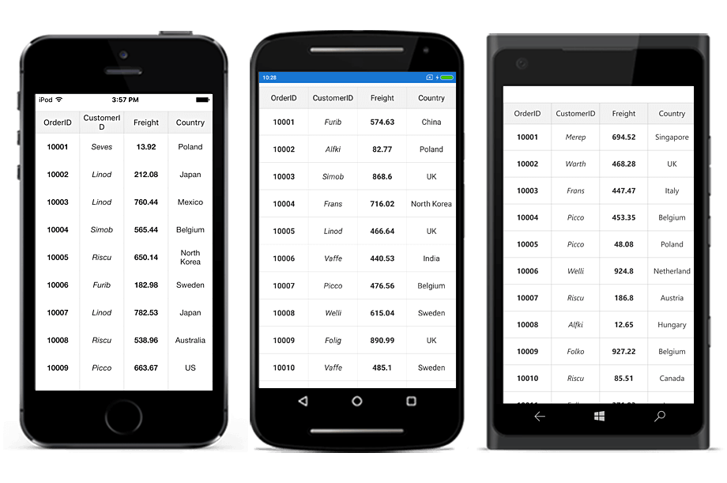

#### TextAlignment

To get or set TextAlignment of the header cell, use the [GridColumn.TextAlignment](http://help.syncfusion.com/cr/cref_files/xamarin/Syncfusion.SfDataGrid.XForms~Syncfusion.SfDataGrid.XForms.GridColumn~TextAlignment.html) property. The default alignment of the record cell is `Center`. It can be customized as `Start` or `End`.

#### LineBreakMode

When the text for the record cells exceeds the content area, wrap the record cell by setting the [GridColumn.LineBreakMode](http://help.syncfusion.com/cr/cref_files/xamarin/Syncfusion.SfDataGrid.XForms~Syncfusion.SfDataGrid.XForms.GridColumn~LineBreakMode.html) as `LineBreakMode.WordWrap`. 

To use LineBreakMode, follow the code example:
 


dataGrid.Columns[0].LineBreakMode=LineBreakMode.WordWrap; 



## GridSwitchColumn

GridSwitchColumn inherits all the properties of GridColumn. It loads a switch as the content of record cells in the column and responds to value changes in it. The underlying data source can be changed that it toggles the values shown in the switch. The SfDataGrid automatically generates GridSwitchColumn if the property in the underlying collection of type set to bool.

To use GridSwitchColumn, follow the code example:
 

<ContentPage.BindingContext>
    <local:ViewModel />
</ContentPage.BindingContext>

<sfGrid:SfDataGrid x:Name="dataGrid"
                   AutoGenerateColumns="True"
                   ItemsSource="{Binding OrdersInfo}">
    <sfGrid:SfDataGrid.Columns>
        <sfGrid:GridSwitchColumn MappingName="IsClosed" />
    </sfGrid:SfDataGrid.Columns>
</sfGrid:SfDataGrid> 



// Model class
public class Model
{
    private bool _isClosed;

    public bool IsClosed
    {
        get { return _isClosed; }
        set
        {
            this._isClosed = value;
        }
    }
}

// ViewModel class
public class ViewModel
{
    public ViewModel()
    {
        GetOrderDetails(50);
    }

    #region ItemsSource

    private ObservableCollection<OrderInfo> ordersInfo;

    public ObservableCollection<OrderInfo> OrdersInfo
    {
        get { return ordersInfo; }
        set { this.ordersInfo = value; }
    }

    #endregion

    #region ItemSource Generator

    public void GetOrderDetails(int count)
    {
        var orderDetails = new ObservableCollection<OrderInfo>();
        for (int i = 1; i <= count; i++)
        {
            var order = new OrderInfo()
            {
                IsClosed = (i % 2) == 0 ? true : false
            };
            orderDetails.Add(order);
        }
        ordersInfo = orderDetails;
    }

    #endregion
} 


### Editing for switch column

To edit the switch column, set the [AllowEditing](http://help.syncfusion.com/cr/cref_files/xamarin/Syncfusion.SfDataGrid.XForms~Syncfusion.SfDataGrid.XForms.SfDataGrid~AllowEditingProperty.html) property to `true`. By default, `AllowEditing` is `true`. If `AllowEditing` is set to `false`, you cannot check or uncheck the Switch column.

To set the `AllowEditing` property, follow the code example:



 <sfgrid:GridSwitchColumn MappingName="IsClosed" AllowEditing="true"/>


GridSwitchColumn column = new GridSwitchColumn();
column.MappingName = "IsClosed";
column.AllowEditing = true;



## GridImageColumn

GridImageColumn is derived from GridColumn. Hence, it inherits all the properties of GridColumn. It displays image as cell content of a column. To create GridImageColumn, the property corresponding to the column in the underlying collection must be `ImageSource` type.

In GridImageColumn, it is possible to load images in any of the following four ways:

 * **FromFile**: Required to specify the path of the file.
 * **FromResource**: Required to set image as embedded resource.
 * **FromStream**: Required to load image from byte[] array.
 * **FromURI**: Required to set image from a web service or website.

To load image (embedded resource) in GridImageColumn, follow the code example:
 

<ContentPage.BindingContext>
    <local:ViewModel />
</ContentPage.BindingContext>

<sfGrid:SfDataGrid x:Name="dataGrid"
                   AutoGenerateColumns="True"
                   ItemsSource="{Binding OrdersInfo}">
    <sfGrid:SfDataGrid.Columns>
        <sfGrid:GridImageColumn MappingName="DealerImage" />
    </sfGrid:SfDataGrid.Columns>
</sfGrid:SfDataGrid>



// Model class
public class Model
{
    private ImageSource _dealer;

    public ImageSource DealerImage
    {
        get { return _dealer; }
        set
        {
            this._dealer = value;
        }
    }
}

// ViewModel class
public class ViewModel
{
    public ViewModel()
    {
        GetOrderDetails(50);
    }

    #region ItemsSource

    private ObservableCollection<OrderInfo> ordersInfo;

    public ObservableCollection<OrderInfo> OrdersInfo
    {
        get { return ordersInfo; }
        set { this.ordersInfo = value; }
    }

    #endregion

    #region ItemSource Generator

    public void GetOrderDetails(int count)
    {
        var orderDetails = new ObservableCollection<OrderInfo>();
        for (int i = 1; i <= count; i++)
        {
            var order = new OrderInfo()
            {
                DealerImage = ImageSource.FromResource("DataGridDemo.Buchanan.png") // Need to give the image path properly. Here, DataGridDemo denotes the project name and Buchanan denotes the image name.
            };
            orderDetails.Add(order);
        }
        ordersInfo = orderDetails;
    }

    #endregion
}


### Aspect

SfDataGrid allows you to set the `Aspect` to size the loaded images within the bounds of the grid cell (whether to stretch, crop or letterbox) using the [GridImageColumn.Aspect](https://docs.microsoft.com/en-us/dotnet/api/xamarin.forms.image.aspect?view=xamarin-forms#Xamarin_Forms_Image_Aspect) property. The supported aspects are described below, the default value is AspectFit.

AspectFill: Clips the image so that it fills the display area while preserving the aspect (no distortion).

AspectFit:  Letterboxes the image (if required) so that the entire image fits into the display area, with blank space added to the top/bottom or sides depending on whether the image is wide or tall.

Fill: Stretches the image to completely and exactly fill the display area. This may result in the image being distorted.

To set `Aspect` to images loaded inside `GridImageColumn`, refer the below code snippet.


<ContentPage.BindingContext>
    <local:ViewModel />
</ContentPage.BindingContext>

<sfGrid:SfDataGrid x:Name="dataGrid"
                   AutoGenerateColumns="True"
                   ItemsSource="{Binding OrdersInfo}">
    <sfGrid:SfDataGrid.Columns>
        <sfGrid:GridImageColumn MappingName="DealerImage" Aspect="AspectFit"/>
    </sfGrid:SfDataGrid.Columns>
</sfGrid:SfDataGrid>


## GridTemplateColumn

The GridTemplateColumn is derived from GridColumn. Hence, it inherits all the properties of GridColumn. It allows you to extend the functionality of GridColumn with own view by creating the `CellTemplate` or `CellTemplateSelector`.

The following table provides the list of properties in GridTemplateColumn:

<table>
<tr>
<th>Property</th>
<th>Type</th>
<th>Description</th>
<th>Default Value</th>
</tr>
<tr>
<td>CellTemplate</td>
<td>DataTemplate</td>
<td>Gets or sets the template that is used to display the contents of the record cells.</td>
<td>Null</td>
</tr>
<tr>
<td>EditTemplate</td>
<td>DataTemplate</td>
<td>Gets or sets the template that is used to edit the contents of the record cells.</td>
<td>Null</td>
</tr>
<tr>
<td>CellTemplateSelector</td>
<td>DataTemplateSelector</td>
<td>Gets or sets the template selector that is used to display the contents of the record cells.</td>
<td>Null</td>
</tr>
</table>

### Cell template

Underlying records will be the BindingContext for the `CellTemplate`. The following code example shows templating of GridTemplateColumn:



<syncfusion:GridTemplateColumn MappingName="CustomerID">
    <syncfusion:GridTemplateColumn.CellTemplate>
        <DataTemplate>
            <Label Text="{Binding CustomerID}" TextColor="Blue" 
                   XAlign="Center" YAlign="Center" />
        </DataTemplate>
    </syncfusion:GridTemplateColumn.CellTemplate>
</syncfusion:GridTemplateColumn> 


GridTemplateColumn templateColumn = new GridTemplateColumn()
{
    MappingName = "CustomerID",
    Width = 50,
};
var dataTemplate = new DataTemplate(() =>
{
var label = new Label()
{
    TextColor = Color.Blue,
    VerticalOptions = LayoutOptions.Center,
    HorizontalOptions = LayoutOptions.Center
};
label.SetBinding(Label.TextProperty, "CustomerID");
return label;
});
templateColumn.CellTemplate = dataTemplate;



The following code example illustrates how template column can be used to load a stock cell inside it:


<ContentPage.Resources>
    <ResourceDictionary>
        <local:ImageConverter x:Key="imageConverter" /> 
    </ResourceDictionary>
</ContentPage.Resources>

<ContentPage.ContentView>
    <syncfusion:SfDataGrid x:Name="dataGrid"
                           ColumnSizer="Star">

        <syncfusion:SfDataGrid.Columns>
            <syncfusion:GridTemplateColumn HeaderText="Stock Change"
                                           MappingName="StockChange">
                <syncfusion:GridTemplateColumn.CellTemplate>
                    <DataTemplate>
                        <Grid>
                            <Grid.ColumnDefinitions>
                                <ColumnDefinition Width="Auto" />
                                <ColumnDefinition Width="*" />
                            </Grid.ColumnDefinitions>
                            <Image Grid.Column="0"
                                   Source="{Binding StockChange,
                                   Converter={StaticResource imageConverter}}" />
                            <Label x:Name="changeValue" Grid.Column="1"
                                   Text="{Binding StockChange}" TextColor="Black"
                                   XAlign="Center" YAlign="Center">
                            </Label>
                        </Grid>
                    </DataTemplate>
                </syncfusion:GridTemplateColumn.CellTemplate>
            </syncfusion:GridTemplateColumn>
        </syncfusion:SfDataGrid.Columns>
    </syncfusion:SfDataGrid>
</ContentPage.ContentView>


In order to get the above code example working, write a converter to load images inside the [GridCell](http://help.syncfusion.com/cr/cref_files/xamarin/Syncfusion.SfDataGrid.XForms~Syncfusion.SfDataGrid.XForms.GridCell.html) based on the CellValue. The images that have to be loaded in the `GridCell` must be added as EmbeddedResource.

The converter code for loading images in a template column is shown in the following code:


public class ImageConverter:IValueConverter
{
    public object Convert (object value, Type targetType, object parameter, CultureInfo culture)
    {
        var data = value as double?;
        if (data != null && data > 0)
            return ImageSource.FromResource("DataGridSample.Icons.Green.png");
        else
            return ImageSource.FromResource("DataGridSample.Icons.Red.png");
    }

    public object ConvertBack (object value, Type targetType, object parameter, CultureInfo culture)
    {
        throw new NotImplementedException ();
    }
} 


The following screenshot shows the different types of columns in the SfDataGrid:

### Edit template

The `SfDataGrid` allows you to load any custom view in edit mode using the [EditTemplate](https://help.syncfusion.com/cr/cref_files/xamarin/Syncfusion.SfDataGrid.XForms~Syncfusion.SfDataGrid.XForms.GridTemplateColumn~EditTemplate.html) property.


<ContentPage.Resources>
    <ResourceDictionary>
        <local:ImageConverter x:Key="imageConverter" /> 
    </ResourceDictionary>
</ContentPage.Resources>

<ContentPage.ContentView>
    <syncfusion:SfDataGrid x:Name="dataGrid"
                           ColumnSizer="Star">

        <syncfusion:SfDataGrid.Columns>
            <syncfusion:GridTemplateColumn HeaderText="Stock Change"
                                           MappingName="StockChange">
                <syncfusion:GridTemplateColumn.CellTemplate>
                    <DataTemplate>
                        <Grid>
                            <Grid.ColumnDefinitions>
                                <ColumnDefinition Width="Auto" />
                                <ColumnDefinition Width="*" />
                            </Grid.ColumnDefinitions>
                            <Image Grid.Column="0"
                                   Source="{Binding StockChange,
                                   Converter={StaticResource imageConverter}}" />
                            <Label x:Name="changeValue" Grid.Column="1"
                                   Text="{Binding StockChange}" TextColor="Black"
                                   XAlign="Center" YAlign="Center">
                            </Label>
                        </Grid>
                    </DataTemplate>
                </syncfusion:GridTemplateColumn.CellTemplate>
                <syncfusion:GridTemplateColumn.EditTemplate>
                    <DataTemplate>
                        <Grid>
                            <Grid.ColumnDefinitions>
                                <ColumnDefinition Width="Auto" />
                                <ColumnDefinition Width="*" />
                            </Grid.ColumnDefinitions>
                            <Image Grid.Column="0"
                                   Source="{Binding StockChange,
                                   Converter={StaticResource imageConverter}}" />
                            <Entry Grid.Column="1"
                                   Text="{Binding StockChange}">
                            </Label>
                        </Grid>
                    </DataTemplate>
                </syncfusion:GridTemplateColumn.EditTemplate>
            </syncfusion:GridTemplateColumn>
        </syncfusion:SfDataGrid.Columns>
    </syncfusion:SfDataGrid>
</ContentPage.ContentView>


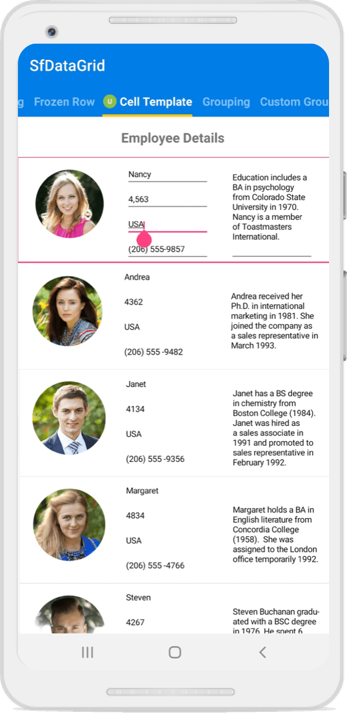

## CellTemplateSelector

Underlying records will be the BindingContext for the `CellTemplateSelector`. The following code example shows templating of the GridTemplateColumn using the `CellTemplateSelector` property:


<ContentPage.Resources>
    <ResourceDictionary>
        <DataTemplate x:Key="low" >
            <Label Text="{Binding Freight}"
                   TextColor="White" 
                   BackgroundColor="Red" 
                   HorizontalTextAlignment="Center" 
                   VerticalTextAlignment="Center" />
        </DataTemplate>
        <DataTemplate x:Key="average" >
            <Label Text="{Binding Freight}"
                   TextColor="Black" 
                   BackgroundColor="Yellow" 
                   HorizontalTextAlignment="Center" 
                   VerticalTextAlignment="Center" />
        </DataTemplate>
        <DataTemplate x:Key="high" >
            <Label Text="{Binding Freight}" 
                   TextColor="White" 
                   BackgroundColor="Green" 
                   HorizontalTextAlignment="Center" 
                   VerticalTextAlignment="Center" />
        </DataTemplate>
    </ResourceDictionary>
</ContentPage.Resources>

<sfgrid:GridTemplateColumn MappingName="Freight" >
    <sfgrid:GridTemplateColumn.CellTemplateSelector>
        <local:FreightTemplateSelector High="{StaticResource high}"
                                       Average="{StaticResource average}"
                                       Low="{StaticResource low}"/>
    </sfgrid:GridTemplateColumn.CellTemplateSelector>
</sfgrid:GridTemplateColumn>



// FreightTemplateSelector implementation
public class FreightTemplateSelector : DataTemplateSelector
{
    public DataTemplate Low { get; set; }

    public DataTemplate Average { get; set; }

    public DataTemplate High { get; set; }

    protected override DataTemplate OnSelectTemplate(object item, BindableObject container)
    {
        var value = double.Parse((item as OrderInfo).Freight);
        if (value > 750)
            return High;
        else if (value > 500)
            return Average;
        else
            return Low;
    }
}


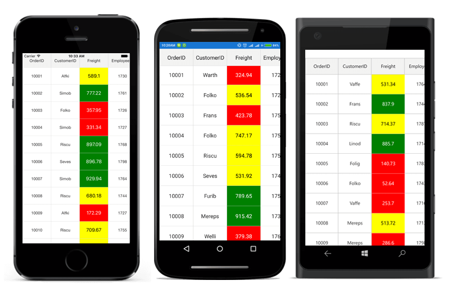

### Getting row index of a row in GridTemplateColumn

The SfDataGrid provides various resolving methods to resolve the row index of grid rows based on certain criteria. The actual row index of a row can be resolved by using the `ResolveToRowIndex(recordRowIndex)` method. 

The row index of a grid row can be obtained in GridTemplateColumn by retrieving the record index of the row using the bound data from its `BindingContext` and by resolving the recordRowIndex using the `SfDataGrid.ResolveToRowIndex(recordRowIndex)` method.


// MainPage.Xaml
<sfgrid:GridTemplateColumn HeaderText="ShipCity" MappingName="ShipCity">
  <sfgrid:GridTemplateColumn.CellTemplate>
    <DataTemplate>
      <Button Clicked="button_Clicked" WidthRequest="120" Text="{Binding ShipCity}"/>
    </DataTemplate>
  </sfgrid:GridTemplateColumn.CellTemplate>
</sfgrid:GridTemplateColumn>



// MainPage.cs 
public partial class MainPage : ContentPage
{
     public MainPage()
     {
         InitializeComponent();
     }
     private void button_Clicked(object sender, EventArgs e)
     {
          var button = sender as Button;
          var record = button.BindingContext as OrderInfo;
          var recordRowIndex = viewModel.OrderInfoCollection.IndexOf(record);
          var rowIndex = sfGrid.ResolveToRowIndex(recordRowIndex);
     }
}


N> The row index of the row can also be retrieved by using the [GridTapped](https://help.syncfusion.com/cr/cref_files/xamarin/Syncfusion.SfDataGrid.XForms~Syncfusion.SfDataGrid.XForms.SfDataGrid~GridTapped_EV.html), [GridDoubleTapped](https://help.syncfusion.com/cr/cref_files/xamarin/Syncfusion.SfDataGrid.XForms~Syncfusion.SfDataGrid.XForms.SfDataGrid~GridDoubleTapped_EV.html), and [GridLongPressed events](https://help.syncfusion.com/cr/cref_files/xamarin/Syncfusion.SfDataGrid.XForms~Syncfusion.SfDataGrid.XForms.SfDataGrid~GridLongPressed_EV.html). When using complex layout in a `DataTemplate`, set the `InputTransparent` property of the views loaded in the `DataTemplate` of the GridTemplateColumn to `True`.

### Loading DatePicker and TimePicker together

Currently Xamarin.Forms does not provide a view that combines both the [DatePicker](https://developer.xamarin.com/api/type/Xamarin.Forms.DatePicker/) and the [TimePicker](https://developer.xamarin.com/api/type/Xamarin.Forms.TimePicker/) as one control. However, the two controls are available individually. 

The SfDataGrid supports `DatePicker` and `TimePicker` in the same column. It can be achieved by loading the `DatePicker` and `TimePicker` in [StackLayout](https://docs.microsoft.com/en-us/dotnet/api/Xamarin.Forms.StackLayout?view=xamarin-forms) in the `GridTemplateColumn`.

To load `DatePicker` and `TimePicker` together, follow the code example:


<sfgrid:GridTemplateColumn MappingName="ShippingDate">
    <sfgrid:GridTemplateColumn.CellTemplate>
        <DataTemplate>
           <StackLayout Orientation="Horizontal">
              <DatePicker Date="{Binding ShippingDate}" TextColor="Black"/>
              <TimePicker Time="{Binding ShippingTime}" TextColor="Black"/>
           </StackLayout>
      </DataTemplate>
   </sfgrid:GridTemplateColumn.CellTemplate>
</sfgrid:GridTemplateColumn>


The following screenshot shows that how `DatePicker` and `TimePicker` are viewed together:

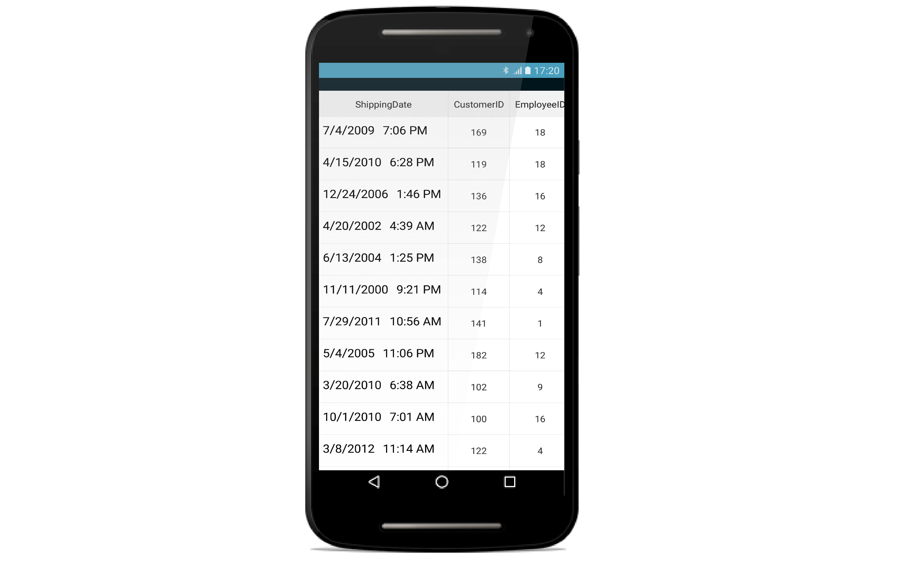

## GridDateTimeColumn

The [SfDataGrid.GridDateTimeColumn](https://help.syncfusion.com/cr/cref_files/xamarin/Syncfusion.SfDataGrid.XForms~Syncfusion.SfDataGrid.XForms.GridDateTimeColumn.html) inherits all the properties of the [SfDataGrid.GridColumn](http://help.syncfusion.com/cr/cref_files/xamarin/Syncfusion.SfDataGrid.XForms~Syncfusion.SfDataGrid.XForms.GridColumn.html). It displays the date information as the content of a column. To create the `SfDataGrid.GridDateTimeColumn`, the property corresponding to the column in the underlying collection must be of type DateTime. To enable or disable editing for the particular column, set the [GridColumn.AllowEditing](https://help.syncfusion.com/cr/cref_files/xamarin/Syncfusion.SfDataGrid.XForms~Syncfusion.SfDataGrid.XForms.GridColumn~AllowEditing.html) property to true or false. In the editing mode it displays a customized `DatePicker` element which is derived from the [Xamarin.Forms.DatePicker](https://developer.xamarin.com/api/type/Xamarin.Forms.DatePicker/). The `SfDatePicker` enables to scroll through a list of dates between the [GridDateTimeColumn.MinimumDate](https://help.syncfusion.com/cr/cref_files/xamarin/Syncfusion.SfDataGrid.XForms~Syncfusion.SfDataGrid.XForms.GridDateTimeColumn~MinimumDate.html) and [GridDateTimeColumn.MaximumDate](https://help.syncfusion.com/cr/cref_files/xamarin/Syncfusion.SfDataGrid.XForms~Syncfusion.SfDataGrid.XForms.GridDateTimeColumn~MaximumDate.html) and selects one from it.



<ContentPage.BindingContext>
    <local:ViewModel x:Name ="viewModel"/>
</ContentPage.BindingContext>

<sfGrid:SfDataGrid x:Name="dataGrid"                   
                   ItemsSource="{Binding OrdersInfo}">
    <sfGrid:SfDataGrid.Columns>
        <sfgrid:GridDateTimeColumn Format="d"
                                   HeaderText="Shipped Date"
                                   MappingName="ShippedDate" />
    </sfGrid:SfDataGrid.Columns>
</sfGrid:SfDataGrid>



dataGrid = new SfDataGrid();
GridDateTimeColumn dateColumn = new GridDateTimeColumn()
{
    MappingName = "ShippedDate",
    HeaderText = "Shipped Date",
    Format = "d"
};
dataGrid.Columns.Add(dateColumn);




// Model class
public class Model
{
    private DateTime shippedDate;

    public DateTime ShippedDate
    {
        get { return shippedDate; }
        set
        {
            shippedDate = value;
            RaisePropertyChanged("ShippedDate");
        }
    }
}

// ViewModel class
public class ViewModel
{
    private List<DateTime> OrderedDates;

    public ViewModel()
    {
        GetOrderDetails(50);
    }

    #region ItemsSource

    private ObservableCollection<OrderInfo> ordersInfo;

    public ObservableCollection<OrderInfo> OrdersInfo
    {
        get { return ordersInfo; }
        set { this.ordersInfo = value; }
    }

    #endregion

    #region ItemSource Generator

     private List<DateTime> GetDateBetween(int startYear, int endYear, int count)
     {
        List<DateTime> date = new List<DateTime>();
        Random d = new Random(1);
        Random m = new Random(2);
        Random y = new Random(startYear);
        for (int i = 0; i < count; i++)
        {
            int year = y.Next(startYear, endYear);
            int month = m.Next(3, 13);
            int day = d.Next(1, 31);

            date.Add(new DateTime(year, month, day));
        }
        return date;
     }

    public void GetOrderDetails(int count)
    {
        var orderDetails= new ObservableCollection<OrderInfo>();
        this.OrderedDates = GetDateBetween(2000, 2014, count);
        for (int i = 1; i <= count; i++)
        {
            var order = new OrderInfo()
            {
                ShippedDate = this.OrderedDates[i - 1],
            };
            orderDetails.Add(order);
        }
        ordersInfo = orderDetails;
    }

    #endregion
}


## GridPickerColumn

The [GridPickerColumn](https://help.syncfusion.com/cr/cref_files/xamarin/Syncfusion.SfDataGrid.XForms~Syncfusion.SfDataGrid.XForms.GridPickerColumn.html) inherits all the properties of the `SfDataGrid.GridColumn`. It displays a list of items in the form of a picker as the content of a column. To enable or disable editing for the particular column, set the GridColumn.AllowEditing property to true or false. In the editing mode it displays a customized `Picker` element which is derived from the [Xamarin.Forms.Picker](https://developer.xamarin.com/api/type/Xamarin.Forms.Picker/). The data source to `Picker` can be set by using the [GridPickerColumn.ItemsSource](https://help.syncfusion.com/cr/cref_files/xamarin/Syncfusion.SfDataGrid.XForms~Syncfusion.SfDataGrid.XForms.GridPickerColumn~ItemsSource.html) property. The picker column can be populated with data by the following ways:

 * Collection of primitive types
 * Collection of user-defined types (Custom objects)

### Collection of primitive types

To display the collection of items in the picker drop down, create a `GridPickerColumn` and set its `ItemsSource` property to a simple collection. 

To load the `GridPickerColumn` with a simple string collection, follow the code example:



<ContentPage.BindingContext>
    <local:ViewModel x:Name="viewModel"/>
</ContentPage.BindingContext>

<sfGrid:SfDataGrid x:Name="dataGrid"                   
                   ItemsSource="{Binding OrdersInfo}">
    <sfGrid:SfDataGrid.Columns>
        <sfgrid:GridPickerColumn BindingContext="{x:Reference viewModel}"
                                 HeaderText="Dealer Name"                                 
                                 ItemsSource="{Binding CustomerNames}"                                 
                                 MappingName="DealerName"/>
    </sfGrid:SfDataGrid.Columns>
</sfGrid:SfDataGrid>



dataGrid = new SfDataGrid();
GridPickerColumn pickerColumn = new GridPickerColumn()
{
    BindingContext = viewModel,
    MappingName = "DealerName",
    ItemsSource = viewModel.CustomerNames,
    HeaderText = "Dealer Name"

};
dataGrid.Columns.Add(pickerColumn);




// ViewModel class
public class ViewModel
{
    public ObservableCollection<string> CustomerNames { get; set; }

    public ViewModel()
    {
        this.CustomerNames = Customers.ToObservableCollection();
    }

    internal string[] Customers = new string[] {"Adams","Crowley","Ellis","Gable","Irvine","Keefe","Mendoza","Owens","Rooney","Wadded",};
    
}


### Collection of user-defined types

To display a list of user-defined items in the picker drop down, create a `SfDataGrid.GridPickerColumn` and set its `ItemsSource` property to a user-defined collection. Initially, the picker column will be displayed with the values from the [GridColumn.MappingName](https://help.syncfusion.com/cr/cref_files/xamarin/Syncfusion.SfDataGrid.XForms~Syncfusion.SfDataGrid.XForms.GridColumn~MappingName.html) property of the column if the [DisplayMemberPath](https://help.syncfusion.com/cr/cref_files/xamarin/Syncfusion.SfDataGrid.XForms~Syncfusion.SfDataGrid.XForms.GridPickerColumn~DisplayMemberPath.html) and [ValueMemberPath](https://help.syncfusion.com/cr/cref_files/xamarin/Syncfusion.SfDataGrid.XForms~Syncfusion.SfDataGrid.XForms.GridPickerColumn~ValueMemberPath.html) are not set.

#### DisplayMemberPath
 
Displays a value by comparing values of the properties set as `GridColumn.MappingName` and `ValueMemberPath` in their respective underlying collections. If the values of `ValueMemberPath` property contains the current value of `MappingName` property, its corresponding value of `DisplayMemberPath` property is displayed in the `GridCell`. Or else the `GridCell` appears blank. However, in edit mode the values of the `DisplayMemberPath` property are displayed as picker items.
 
#### ValueMemberPath
 
Once editing completed, the column having the `MappingName` equal to the `ValueMemberPath` has its data changed to the corresponding `ValueMemberPath` value for the selected `DisplayMemberPath` value in the picker. 

### Customization of picker dropdown values

To customize the picker data using `DisplayMemberPath` and `ValueMemberPath`, follow the code example:



<ContentPage.BindingContext>
    <local:ViewModel x:Name="viewModel"/>
</ContentPage.BindingContext>

<sfGrid:SfDataGrid x:Name="dataGrid"                   
                   ItemsSource="{Binding OrdersInfo}">
    <sfGrid:SfDataGrid.Columns>

        <sfgrid:GridTextColumn   HeaderText="Order ID"                                 
                                 MappingName="OrderID"/>

        <sfgrid:GridPickerColumn BindingContext="{x:Reference viewModel}"
                                 HeaderText="Picker Column"
                                 DisplayMemberPath="EmployeeID"
                                 ValueMemberPath="OrderID"                         
                                 ItemsSource="{Binding PickerInfo}"                                 
                                 MappingName="OrderID"/>
    </sfGrid:SfDataGrid.Columns>
</sfGrid:SfDataGrid>




sfGrid = new SfDataGrid();
viewModel = new ViewModel();
sfGrid.ItemsSource = viewModel.OrdersInfo;

GridTextColumn orderIDColumn = new GridTextColumn();
orderIDColumn.MappingName = "OrderID";
orderIDColumn.HeaderText = "Order ID";

GridPickerColumn pickerColumn = new GridPickerColumn();
pickerColumn.MappingName = "OrderID";
pickerColumn.HeaderText = "Picker Column";
pickerColumn.DisplayMemberPath = "EmployeeID";
pickerColumn.ValueMemberPath = "OrderID";
pickerColumn.ItemsSource = viewModel.PickerInfo;

sfGrid.Columns.Add(orderIDColumn);
sfGrid.Columns.Add(pickerColumn);

// ViewModel class
public class ViewModel
{
    public class ViewModel :INotifyPropertyChanged
	{
		public ViewModel ()
		{
			SetRowsToGenerate (100);
            this.PickerInfo = OrdersInfo.ToList();
		}

		#region ItemsSource

        private OrderInfoRepository order;

		private ObservableCollection<OrderInfo> ordersInfo;

		public ObservableCollection<OrderInfo> OrdersInfo 
        {
			get { return ordersInfo; }
			set { this.ordersInfo = value; RaisePropertyChanged("OrdersInfo"); }
		}

        public List<OrderInfo> PickerInfo 
        {
			get;
			set;
		}

		#endregion

		#region ItemSource Generator

		public void SetRowsToGenerate (int count)
		{
			order = new OrderInfoRepository ();
			ordersInfo = order.GetOrderDetails (count);
		}

		#endregion

        public ObservableCollection<OrderInfo> GetOrderDetails(int count)
		{
            ObservableCollection<OrderInfo> orderDetails = new ObservableCollection<OrderInfo> ();

			for (int i = 1; i <= count; i++)
			{
				var order = new OrderInfo ()
				{
					OrderID = i,
                    EmployeeID = i+5,
				};
				orderDetails.Add (order);
			}
			return orderDetails;
		}

        #region INotifyPropertyChanged implementation

        public event PropertyChangedEventHandler PropertyChanged;

        private void RaisePropertyChanged(String name)
        {
            if (PropertyChanged != null)
                this.PropertyChanged(this, new PropertyChangedEventArgs(name));
        }

        #endregion
    }
}



The following screenshots explain the above code and show the working of the `PickerColumn` with `ValueMemberPath` and `DisplayMemberPath` properties set:

In the above code example underlying collection has two properties (OrderID,EmployeeID). A `GridPickerColumn` has been created with MappingName = OrderID, DisplayMemberPath = EmployeeID, ValueMemberPath = OrderID. EmployeeId has the values 6,7,8,9,10.... and OrderID has the values 1,2,3,4,5.... . Initially, the GridCells of the `PickerColumn` will be displayed with the values 6,7,8,9,10.... in row wise order based on the `DisplayMemberPath`.

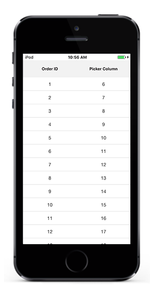

Upon entering the edit mode at RowColumnIndex(1,1), the Picker pop up opens with the picker items as 6,7,8,9,10.... again based on the `DisplayMemberPath`.

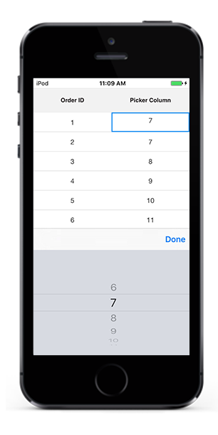

When edit mode is exited by selecting a value(9) from the Picker pop up, the `GridCell` at RowColumn index(0,1) displays the corresponding OrderID value for the selected EmployeeID value which is 4.

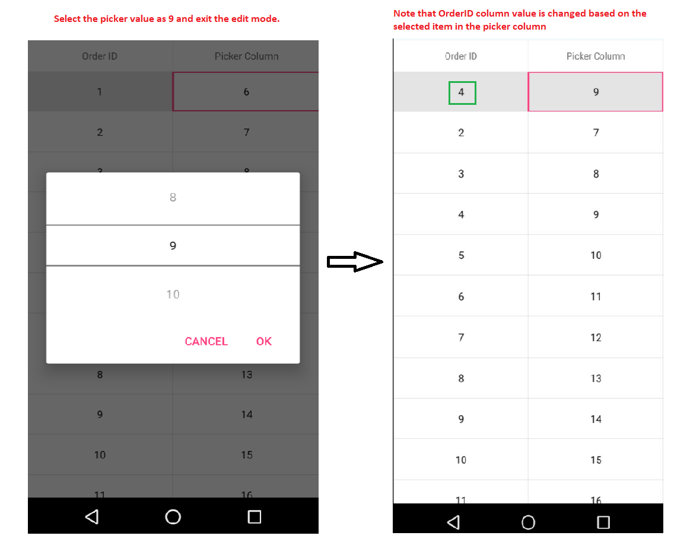

### Loading Different ItemSource for each row of GridPickerColumn

You can load the different ItemsSource to each row of GridPickerColumn by setting [GridPickerColumn.ItemsSourceSelector](https://help.syncfusion.com/cr/cref_files/xamarin/Syncfusion.SfDataGrid.XForms~Syncfusion.SfDataGrid.XForms.GridPickerColumn~ItemsSourceSelector.html) property.

### Implementing IItemsSourceSelector

[GridPickerColumn.ItemsSourceSelector](https://help.syncfusion.com/cr/cref_files/xamarin/Syncfusion.SfDataGrid.XForms~Syncfusion.SfDataGrid.XForms.GridPickerColumn~ItemsSourceSelector.html) needs to implement IItemsSourceSelector interface which requires you to implement GetItemsSource method which receives the below parameters,

* Record – data object associated with row.
* Data Context – Binding context of data grid.

In the below code, ItemsSource for ShipCity column returned based on ShipCountry column value using the record and Binding context of data grid passed to GetItemsSource method.



<ContentPage.Resources>
    <ResourceDictionary>
        <local:ItemSourceSelector x:Key="converter"/>
    </ResourceDictionary>
</ContentPage.Resources>

<sfgrid:SfDataGrid x:Name="dataGrid"
					ItemsSource="{Binding DealerInformation}"
					AllowEditing="True"
					AutoGenerateColumns="false"
					NavigationMode="Cell"
					EditTapAction="OnDoubleTap"
					SelectionMode="Single">
    <sfgrid:SfDataGrid.Columns>
        <sfgrid:GridPickerColumn BindingContext="{x:Reference viewModel}"
									ItemsSource="{Binding CountryList}"
									MappingName="ShipCountry"
									LoadUIView="True">
        </sfgrid:GridPickerColumn>

        <sfgrid:GridPickerColumn ItemsSourceSelector="{StaticResource converter}"
									MappingName="ShipCity"
									LoadUIView="True">
        </sfgrid:GridPickerColumn>
    </sfgrid:SfDataGrid.Columns>
</sfgrid:SfDataGrid>



public class ItemSourceSelector : IItemsSourceSelector
{
    public IEnumerable GetItemsSource(object record, object dataContext)
    {
        if (record == null)
        {
            return null;
        }

        var orderinfo = record as DealerInfo;
        var countryName = orderinfo.ShipCountry;
        var viewModel = dataContext as EditingViewModel;

        // Returns ShipCity collection based on ShipCountry.
        if (viewModel.ShipCities.ContainsKey(countryName))
        {
            string[] shipcities = null;
            viewModel.ShipCities.TryGetValue(countryName, out shipcities);
            return shipcities.ToList();
        }

        return null;
    }
}



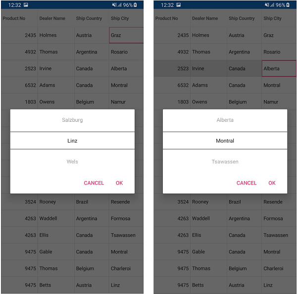

## GridComboBoxColumn

The [GridComboBoxColumn](https://help.syncfusion.com/cr/cref_files/xamarin/Syncfusion.SfDataGrid.XForms~Syncfusion.SfDataGrid.XForms.GridComboBoxColumn.html) inherits all the properties of the [SfDataGrid.GridColumn](https://help.syncfusion.com/cr/cref_files/xamarin/Syncfusion.SfDataGrid.XForms~Syncfusion.SfDataGrid.XForms.GridColumn.html). It displays a list of items in the form of a `SfComboBox` as the content of a column. To enable or disable editing for the particular column, set the [GridColumn.AllowEditing](https://help.syncfusion.com/cr/cref_files/xamarin/Syncfusion.SfDataGrid.XForms~Syncfusion.SfDataGrid.XForms.GridColumn~AllowEditing.html) property to true or false. In the editing mode it displays a [SfComboBox](https://help.syncfusion.com/cr/cref_files/xamarin/Syncfusion.SfComboBox.XForms~Syncfusion.XForms.ComboBox_namespace.html) element. The data source to SfComboBox can be set by using the [GridColumn.AllowEditing](https://help.syncfusion.com/cr/cref_files/xamarin/Syncfusion.SfDataGrid.XForms~Syncfusion.SfDataGrid.XForms.GridColumn~AllowEditing.html) property to true or false. In the editing mode it displays a [SfComboBox](https://help.syncfusion.com/cr/cref_files/xamarin/Syncfusion.SfComboBox.XForms~Syncfusion.XForms.ComboBox_namespace.html)  element. The data source to SfComboBox can be set by using the [GridComboBoxColumn.ItemsSource](https://help.syncfusion.com/cr/cref_files/xamarin/Syncfusion.SfDataGrid.XForms~Syncfusion.SfDataGrid.XForms.GridComboBoxColumn~ItemsSource.html) property. The combobox column can be populated with data by the following ways:

* Collection of primitive types
* Collection of user-defined types (Custom objects)

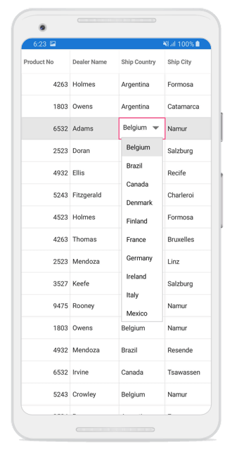

### Collection of primitive types

To display the collection of items in the comboBox drop down, create a [GridComboBoxColumn](https://help.syncfusion.com/cr/cref_files/xamarin/Syncfusion.SfDataGrid.XForms~Syncfusion.SfDataGrid.XForms.GridComboBoxColumn.html) and set its [GridComboBoxColumn.ItemsSource](https://help.syncfusion.com/cr/cref_files/xamarin/Syncfusion.SfDataGrid.XForms~Syncfusion.SfDataGrid.XForms.GridComboBoxColumn~ItemsSource.html) property to a simple collection. 

To load the `GridComboBoxColumn` with a simple string collection, follow the code example:



<ContentPage.BindingContext>
    <local:ViewModel x:Name="viewModel"/>
</ContentPage.BindingContext>

<sfGrid:SfDataGrid x:Name="dataGrid"                   
                   ItemsSource="{Binding OrdersInfo}">
    <sfGrid:SfDataGrid.Columns>
        <sfgrid:GridComboBoxColumn BindingContext="{x:Reference viewModel}"
                                 HeaderText="Dealer Name"                                 
                                 ItemsSource="{Binding CustomerNames}"                                 
                                 MappingName="DealerName"/>
    </sfGrid:SfDataGrid.Columns>
</sfGrid:SfDataGrid>



dataGrid = new SfDataGrid();
GridComboBoxColumn comboBoxColumn = new GridComboBoxColumn()
{
    BindingContext = viewModel,
    MappingName = "DealerName",
    ItemsSource = viewModel.CustomerNames,
    HeaderText = "Dealer Name"

};
dataGrid.Columns.Add(comboBoxColumn);




// ViewModel class
public class ViewModel
{
    public ObservableCollection<string> CustomerNames { get; set; }

    public ViewModel()
    {
        this.CustomerNames = Customers.ToObservableCollection();
    }

    internal string[] Customers = new string[] {"Adams","Crowley","Ellis","Gable","Irvine","Keefe","Mendoza","Owens","Rooney","Wadded",};
    
}


### Collection of user-defined types

To display a list of user-defined items in the combo-box drop down, create a [GridComboBoxColumn](https://help.syncfusion.com/cr/cref_files/xamarin/Syncfusion.SfDataGrid.XForms~Syncfusion.SfDataGrid.XForms.GridComboBoxColumn.html) and set its [GridComboBoxColumn.ItemsSource](https://help.syncfusion.com/cr/cref_files/xamarin/Syncfusion.SfDataGrid.XForms~Syncfusion.SfDataGrid.XForms.GridComboBoxColumn~ItemsSource.html) property to a user-defined collection. Initially, the combo-box column will be displayed with the values from the [GridColumn.MappingName](https://help.syncfusion.com/cr/cref_files/xamarin/Syncfusion.SfDataGrid.XForms~Syncfusion.SfDataGrid.XForms.GridColumn~MappingName.html) property of the column if the [DisplayMemberPath](https://help.syncfusion.com/cr/cref_files/xamarin/Syncfusion.SfDataGrid.XForms~Syncfusion.SfDataGrid.XForms.GridComboBoxColumn~DisplayMemberPath.html) and [ValueMemberPath](https://help.syncfusion.com/cr/cref_files/xamarin/Syncfusion.SfDataGrid.XForms~Syncfusion.SfDataGrid.XForms.GridComboBoxColumn~ValueMemberPath.html) are not set.

For more details about the DisplayMemberPath and ValueMemberPath, Please refer [here](https://help.syncfusion.com/xamarin/sfdatagrid/column-types#collection-of-user-defined-types).

### Customizing GridComboBoxColumn

Editable element of the [GridComboBoxColumn](https://help.syncfusion.com/cr/cref_files/xamarin/Syncfusion.SfDataGrid.XForms~Syncfusion.SfDataGrid.XForms.GridComboBoxColumn.html) can be Customizing by using the custom [GridCellComboBoxRenderer](https://help.syncfusion.com/cr/cref_files/xamarin/Syncfusion.SfDataGrid.XForms~Syncfusion.SfDataGrid.XForms.GridCellComboBoxRenderer.html).

Replace the default renderer with custom renderer in the SfDataGrid.CellRenderers collection.


this.dataGrid.CellRenderers.Remove("ComboBox");
this.dataGrid.CellRenderers.Add("ComboBox", new CustomComboBoxRenderer());

public class CustomComboBoxRenderer : GridCellComboBoxRenderer
{
    public override void OnInitializeEditView(DataColumnBase dataColumn, GridComboBox view)
    {
        base.OnInitializeEditView(dataColumn, view);
        view.DropDownBackgroundColor = Color.LightBlue;
        view.DropDownBorderColor = Color.Blue;
        view.TextColor = Color.Brown;
    }
}


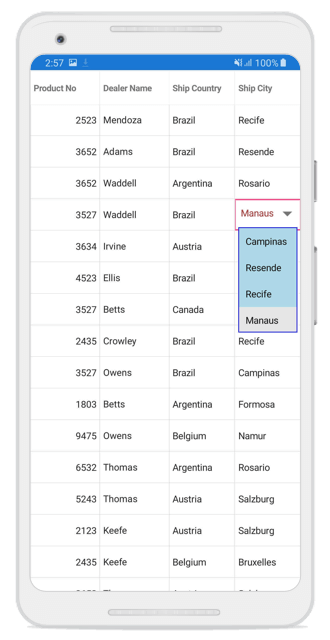

### Loading Different ItemSource for each row of GridComboBoxColumn

You can load the different ItemsSource to each row of GridComboBoxColumn by setting [GridComboBoxColumn.ItemsSourceSelector](https://help.syncfusion.com/cr/cref_files/xamarin/Syncfusion.SfDataGrid.XForms~Syncfusion.SfDataGrid.XForms.GridComboBoxColumn~ItemsSourceSelector.html) property.

### Implementing IItemsSourceSelector

[GridComboBoxColumn.ItemsSourceSelector](https://help.syncfusion.com/cr/cref_files/xamarin/Syncfusion.SfDataGrid.XForms~Syncfusion.SfDataGrid.XForms.GridComboBoxColumn~ItemsSourceSelector.html) needs to implement IItemsSourceSelector interface which requires you to implement GetItemsSource method which receives the below parameters,

* Record – data object associated with row.
* Data Context – Binding context of data grid.

In the below code, ItemsSource for ShipCity column returned based on ShipCountry column value using the record and Binding context of data grid passed to GetItemsSource method.



<ContentPage.Resources>
    <ResourceDictionary>
        <local:ItemSourceSelector x:Key="converter"/>
    </ResourceDictionary>
</ContentPage.Resources>

<sfgrid:SfDataGrid x:Name="dataGrid"
					ItemsSource="{Binding DealerInformation}"
					AllowEditing="True"
					AutoGenerateColumns="false"
					NavigationMode="Cell"
					EditTapAction="OnDoubleTap"
					SelectionMode="Single">
    <sfgrid:SfDataGrid.Columns>
        <sfgrid:GridComboBoxColumn BindingContext="{x:Reference viewModel}"
									ItemsSource="{Binding CountryList}"
									MappingName="ShipCountry"
									LoadUIView="True">
        </sfgrid:GridComboBoxColumn>

        <sfgrid:GridComboBoxColumn ItemsSourceSelector="{StaticResource converter}"
									MappingName="ShipCity"
									LoadUIView="True">
        </sfgrid:GridComboBoxColumn>
    </sfgrid:SfDataGrid.Columns>
</sfgrid:SfDataGrid>



public class ItemSourceSelector : IItemsSourceSelector
{
    public IEnumerable GetItemsSource(object record, object dataContext)
    {
        if (record == null)
        {
            return null;
        }

        var orderinfo = record as DealerInfo;
        var countryName = orderinfo.ShipCountry;
        var viewModel = dataContext as EditingViewModel;

        // Returns ShipCity collection based on ShipCountry.
        if (viewModel.ShipCities.ContainsKey(countryName))
        {
            string[] shipcities = null;
            viewModel.ShipCities.TryGetValue(countryName, out shipcities);
            return shipcities.ToList();
        }

        return null;
    }
}



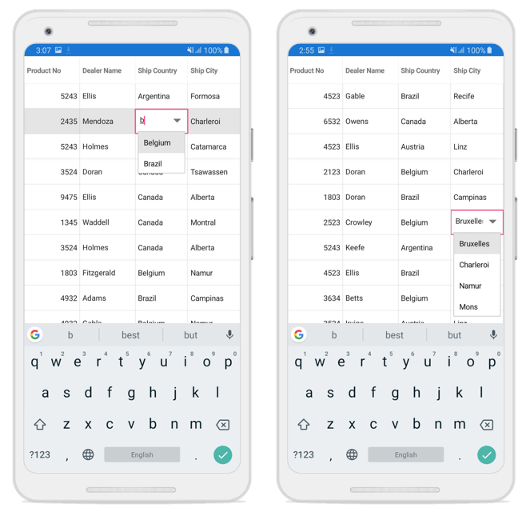

### Editing the combo box
The [GridComboBoxColumn](https://help.syncfusion.com/cr/cref_files/xamarin/Syncfusion.SfDataGrid.XForms~Syncfusion.SfDataGrid.XForms.GridComboBoxColumn.html) supports both editable and non-editable text box to choose selected items in given data source. Users can select one item from the suggestion list.

[IsEditableMode](https://help.syncfusion.com/cr/cref_files/xamarin/Syncfusion.SfDataGrid.XForms~Syncfusion.SfDataGrid.XForms.GridComboBoxColumn~IsEditableMode.html) property is used to enable the user input in [GridComboBoxColumn](https://help.syncfusion.com/cr/cref_files/xamarin/Syncfusion.SfDataGrid.XForms~Syncfusion.SfDataGrid.XForms.GridComboBoxColumn.html). The default value is `false`.



<ContentPage.BindingContext>
    <local:ViewModel x:Name="viewModel"/>
</ContentPage.BindingContext>

<sfGrid:SfDataGrid x:Name="dataGrid"                   
                   ItemsSource="{Binding OrdersInfo}">
    <sfGrid:SfDataGrid.Columns>
        <sfgrid:GridComboBoxColumn BindingContext="{x:Reference viewModel}"
                                 HeaderText="Dealer Name"  
                                 IsEditableMode="True"                               
                                 ItemsSource="{Binding CustomerNames}"                                 
                                 MappingName="DealerName"/>
    </sfGrid:SfDataGrid.Columns>
</sfGrid:SfDataGrid>



dataGrid = new SfDataGrid();
GridComboBoxColumn comboBoxColumn = new GridComboBoxColumn()
{
    BindingContext = viewModel,
    MappingName = "DealerName",
    ItemsSource = viewModel.CustomerNames,
    IsEditableMode = True,
    HeaderText = "Dealer Name"

};
dataGrid.Columns.Add(comboBoxColumn);



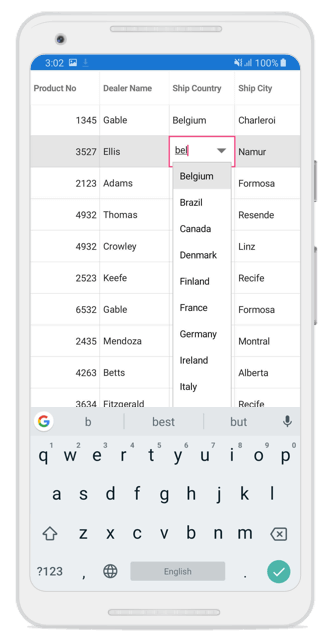

### Auto completing on edit mode

The auto completion on the edit mode can be enabled by using the [GridComboBoxColumn.AutoCompleteMode](https://help.syncfusion.com/cr/cref_files/xamarin/Syncfusion.SfDataGrid.XForms~Syncfusion.SfDataGrid.XForms.GridComboBoxColumn~AutoCompleteMode.html) property. Default value is Suggest. Following types of auto complete modes are available,

* Append
* Suggest
* SuggestAppend



<ContentPage.BindingContext>
    <local:ViewModel x:Name="viewModel"/>
</ContentPage.BindingContext>

<sfGrid:SfDataGrid x:Name="dataGrid"                   
                   ItemsSource="{Binding OrdersInfo}">
    <sfGrid:SfDataGrid.Columns>
        <sfgrid:GridComboBoxColumn BindingContext="{x:Reference viewModel}"
                                 HeaderText="Dealer Name"  
                                 IsEditableMode="True"
                                 AutoCompleteMode="Suggest"                               
                                 ItemsSource="{Binding CustomerNames}"                                 
                                 MappingName="DealerName"/>
    </sfGrid:SfDataGrid.Columns>
</sfGrid:SfDataGrid>



dataGrid = new SfDataGrid();
GridComboBoxColumn comboBoxColumn = new GridComboBoxColumn()
{
    BindingContext = viewModel,
    MappingName = "DealerName",
    ItemsSource = viewModel.CustomerNames,
    IsEditableMode = True,
    AutoCompleteMode = ComboBoxMode.Suggest,
    HeaderText = "Dealer Name"

};
dataGrid.Columns.Add(comboBoxColumn);



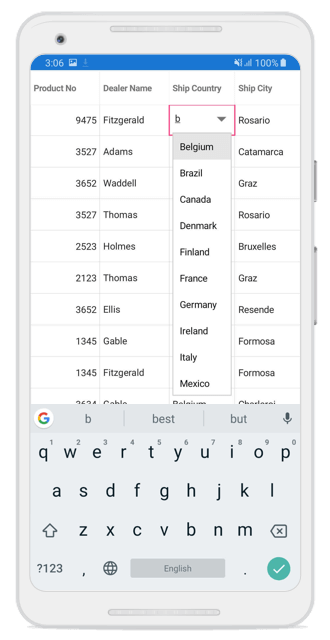

### Auto suggesting on edit mode

By default, auto suggestion in the dropdown will display the value based on the [StartsWith](https://help.syncfusion.com/cr/cref_files/xamarin/Syncfusion.SfComboBox.XForms~Syncfusion.XForms.ComboBox.SuggestionMode.html) filter condition. This can be changed to retrieve the matches with the Contains condition by using the [SuggestionMode](https://help.syncfusion.com/cr/cref_files/xamarin/Syncfusion.SfDataGrid.XForms~Syncfusion.SfDataGrid.XForms.GridComboBoxColumn~SuggestionMode.html) property.



<ContentPage.BindingContext>
    <local:ViewModel x:Name="viewModel"/>
</ContentPage.BindingContext>

<sfGrid:SfDataGrid x:Name="dataGrid"                   
                   ItemsSource="{Binding OrdersInfo}">
    <sfGrid:SfDataGrid.Columns>
        <sfgrid:GridComboBoxColumn BindingContext="{x:Reference viewModel}"
                                 HeaderText="Dealer Name"  
                                 IsEditableMode="True"
                                 CanFilterSuggestions="True"
                                 AutoCompleteMode="Suggest"
                                 SuggestionMode="Contains"                               
                                 ItemsSource="{Binding CustomerNames}"                                 
                                 MappingName="DealerName"/>
    </sfGrid:SfDataGrid.Columns>
</sfGrid:SfDataGrid>



dataGrid = new SfDataGrid();
GridComboBoxColumn comboBoxColumn = new GridComboBoxColumn()
{
    BindingContext = viewModel,
    MappingName = "DealerName",
    ItemsSource = viewModel.CustomerNames,
    IsEditableMode = True,
    CanFilterSuggestions = true;
    AutoCompleteMode = ComboBoxMode.Suggest,
    SuggestionMode = SuggestionMode.Contains,
    HeaderText = "Dealer Name"

};
dataGrid.Columns.Add(comboBoxColumn);



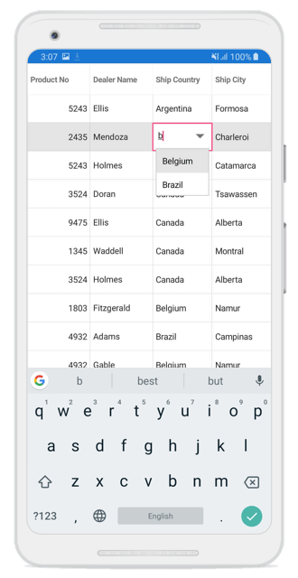

## GridNumericColumn

The [GridNumericColumn](https://help.syncfusion.com/cr/cref_files/xamarin/Syncfusion.SfDataGrid.XForms~Syncfusion.SfDataGrid.XForms.GridNumericColumn.html) inherits all the properties of `GridColumn`. It is used to display numeric data. To create `GridNumericColumn`, the property corresponding to the column in the underlying collection must be a numeric type(int, double, float, etc.). To enable or disable editing a particular column, set the [GridColumn.AllowEditing](http://help.syncfusion.com/cr/cref_files/xamarin/Syncfusion.SfDataGrid.XForms~Syncfusion.SfDataGrid.XForms.SfDataGrid~AllowEditingProperty.html) property to true or false. In the editing mode it displays the [SfNumericTextBox](https://help.syncfusion.com/cr/xamarin/sfnumerictextbox) element from the [View](https://developer.xamarin.com/api/type/Xamarin.Forms.View/). To create a `GridNumericColumn`, follow the code example:



<ContentPage.BindingContext>
    <local:ViewModel  x:Name ="viewModel"/>
</ContentPage.BindingContext>

<sfGrid:SfDataGrid x:Name="dataGrid"                   
                   ItemsSource="{Binding OrdersInfo}">
    <sfGrid:SfDataGrid.Columns>
        <sfgrid:GridNumericColumn NumberDecimalDigits="0"
                                  HeaderText="Product No"
                                  MappingName="ProductNo"/>
    </sfGrid:SfDataGrid.Columns>
</sfGrid:SfDataGrid>



dataGrid = new SfDataGrid();
            
GridNumericColumn numericColumn = new GridNumericColumn()
{
    MappingName = "ProductNo",
    HeaderText = "Product No",
    NumberDecimalDigits =0
};
dataGrid.Columns.Add(numericColumn);



### Number formatting

The`GridNumericColumn` allows formatting the numeric data with culture-specific information.

* [NumberDecimalDigits](https://help.syncfusion.com/cr/cref_files/xamarin/Syncfusion.SfDataGrid.XForms~Syncfusion.SfDataGrid.XForms.GridNumericColumn~NumberDecimalDigits.html): To change the number of decimal digits to be displayed after the decimal point, use the `GridNumericColumn.NumberDecimalDigits` property.
* [NumberDecimalSeparator](https://help.syncfusion.com/cr/cref_files/xamarin/Syncfusion.SfDataGrid.XForms~Syncfusion.SfDataGrid.XForms.GridNumericColumn~NumberDecimalSeparator.html): By default, the dot(.) operator separates the decimal part of numeric value. Any operator can be used as decimal separator using the `GridNumericColumn.NumberDecimalSeparator` property.
* [NumberGroupSeparator](https://help.syncfusion.com/cr/cref_files/xamarin/Syncfusion.SfDataGrid.XForms~Syncfusion.SfDataGrid.XForms.GridNumericColumn~NumberGroupSeparator.html): By default, the comma(,) separates group of digits before the decimal point. Any operator can be used as group separator using the `GridNumericColumn.NumberGroupSeparator` property.
* [NumberGroupSizes](https://help.syncfusion.com/cr/cref_files/xamarin/Syncfusion.SfDataGrid.XForms~Syncfusion.SfDataGrid.XForms.GridNumericColumn~NumberGroupSizes.html): To change the number of digits in each group before the decimal point on numeric values, use the `GridNumericColumn.NumberGroupSizes` property.
* [NumberNegativePattern](https://help.syncfusion.com/cr/cref_files/xamarin/Syncfusion.SfDataGrid.XForms~Syncfusion.SfDataGrid.XForms.GridNumericColumn~NumberNegativePattern.html): To format the pattern of negative numeric values, use `GridNumericColumn.NumberNegativePattern`.
* [MinValue](https://help.syncfusion.com/cr/cref_files/xamarin/Syncfusion.SfDataGrid.XForms~Syncfusion.SfDataGrid.XForms.GridEditorColumn~MinValue.html): To set the minimum value for the numeric column, use the `GridNumericColumn.MinValue` property.
* [MaxValue](https://help.syncfusion.com/cr/cref_files/xamarin/Syncfusion.SfDataGrid.XForms~Syncfusion.SfDataGrid.XForms.GridEditorColumn~MaxValue.html): To set the maximum value for the numeric column, use the `GridNumericColumn.MaxValue` property.

## Row header 

Row header is a special column placed as first cell of each row, and it will be always frozen. To enable the row header, set the [SfDataGrid.ShowRowHeader](http://help.syncfusion.com/cr/cref_files/xamarin/Syncfusion.SfDataGrid.XForms~Syncfusion.SfDataGrid.XForms.SfDataGrid~ShowRowHeader.html) to `true`.

Further, the SfDataGrid allows customizing the row header width using the [SfDataGrid.RowHeaderWidthProperty](http://help.syncfusion.com/cr/cref_files/xamarin/Syncfusion.SfDataGrid.XForms~Syncfusion.SfDataGrid.XForms.SfDataGrid~RowHeaderWidthProperty.html). The default value of `SfDataGrid.RowHeaderWidth` is 20.

To enable and customize the row header, follow the code example:




<sfgrid:SfDataGrid x:Name="dataGrid"
                   ColumnSizer="Star"
                   ShowRowHeader="True"
                   RowHeaderWidth="50"
                   ItemsSource="{Binding OrdersInfo}">
</sfgrid:SfDataGrid>




dataGrid.ShowRowHeader = true;
dataGrid.RowHeaderWidth = 50;




## Bind a view model property inside header template?

The SfDataGrid allows binding the view model property to the [HeaderTemplate](http://help.syncfusion.com/cr/cref_files/xamarin/Syncfusion.SfDataGrid.XForms~Syncfusion.SfDataGrid.XForms.GridColumn~HeaderTemplateProperty.html) by setting the BindingContext of the the [GridColumn](http://help.syncfusion.com/cr/cref_files/xamarin/Syncfusion.SfDataGrid.XForms~Syncfusion.SfDataGrid.XForms.GridColumn.html) as `ViewModel`.

To bind a view model property inside `HeaderTemplate`, follow the code example:



<sfgrid:SfDataGrid x:Name="dataGrid" 
                    ItemsSource="{Binding OrdersInfo}" 
                    AutoGenerateColumns="False"
                    ColumnSizer="Star" 
                    SelectionMode="Single">
      <sfgrid:SfDataGrid.Columns>
        <sfgrid:GridTextColumn MappingName="OrderID">
           <sfgrid:GridColumn.HeaderTemplate>
              <DataTemplate>
               <Label BindingContext="{StaticResource viewModel}" 
                            VerticalTextAlignment ="Center"
                            HorizontalTextAlignment="Center"
                      Text="{Binding HeaderText}" TextColor="Blue" IsVisible="{Binding _Visibility}"/>
              </DataTemplate>
            </sfgrid:GridColumn.HeaderTemplate>
        </sfgrid:GridTextColumn>
        <sfgrid:GridTextColumn MappingName="EmployeeID"/>
        <sfgrid:GridTextColumn MappingName="FirstName"/>
        <sfgrid:GridTextColumn MappingName="ShipCity"/>
      </sfgrid:SfDataGrid.Columns>
 </sfgrid:SfDataGrid>



