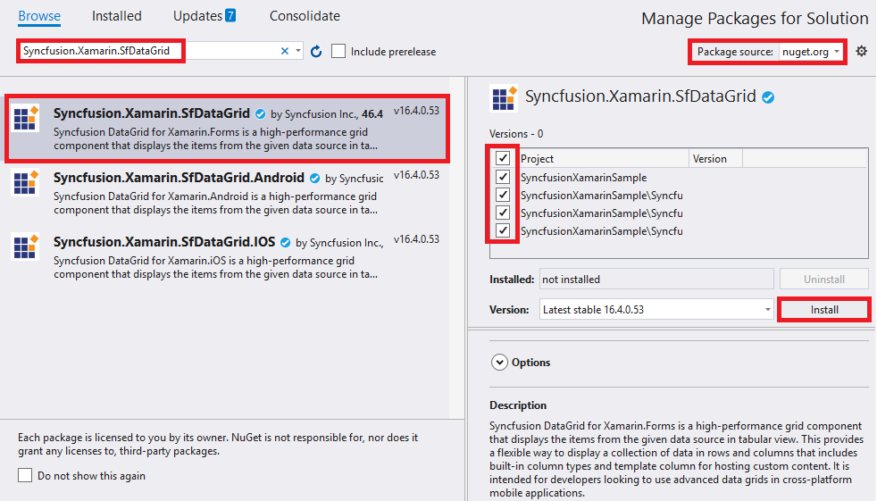
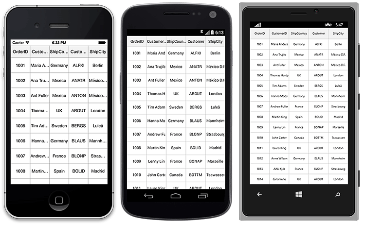
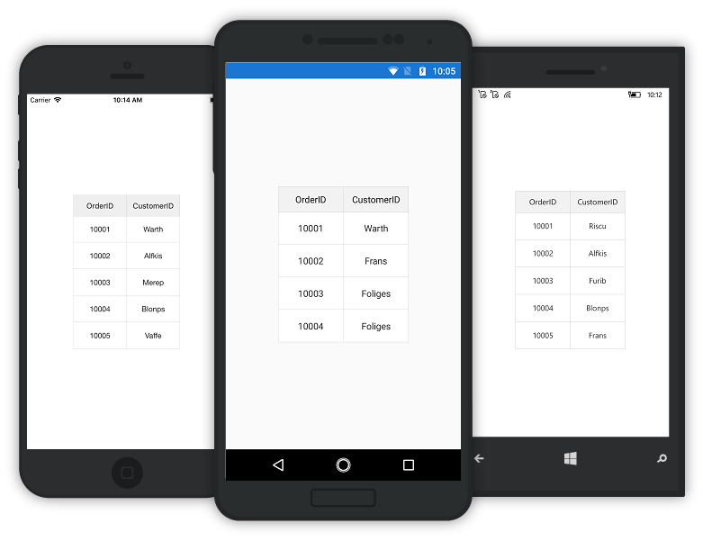

# Getting Started with Xamarin DataGrid (SfDataGrid)

This section provides a quick overview for working with the SfDataGrid for Xamarin.Forms. Walk through the entire process of creating a real world of this control.

To get start quickly with Xamarin.Forms DataGrid, you can check on this video:

<iframe id='XamarinDataGridVideoTutorial' src='https://www.youtube.com/embed/rdPStxCSy5w'></iframe>

## Assembly deployment

After installing Essential Studio for Xamarin, find all the required assemblies in the installation folders {Syncfusion Essential Studio Installed location}\Essential Studio\{{ site.releaseversion }}\Xamarin\lib.

Eg: C:\Program Files (x86)\Syncfusion\Essential Studio\{{ site.releaseversion }}\Xamarin\lib.

N> Assemblies can be found in an unzipped package location in Mac.

## NuGet configuration

To install the required NuGet for the SfDataGrid control in the application, configure the NuGet packages of the Syncfusion components.

Refer to the following KB to configure the NuGet packages of the Syncfusion components:

[How to configure package source and install Syncfusion NuGet packages in an existing project?](https://www.syncfusion.com/kb/7441/how-to-configure-package-source-and-install-syncfusion-nuget-packages-in-an-existing-project)

The following NuGet package should be installed to use the SfDataGrid control in the application.

<table>
<tr>
<th> Project </th>
<th> Required package </th>
</tr>
<tr>
<td> Xamarin.Forms </td>
<td> Syncfusion.Xamarin.SfDataGrid</td>
</tr>
</table>

## Adding SfDataGrid reference

You can add SfDataGrid reference using one of the following methods:

**Method 1: Adding SfDataGrid reference from nuget.org**

Syncfusion Xamarin components are available in [nuget.org](https://www.nuget.org/). To add SfDataGrid to your project, open the NuGet package manager in Visual Studio, search for [Syncfusion.Xamarin.SfDataGrid](https://www.nuget.org/packages/Syncfusion.Xamarin.SfDataGrid), and then install it.

N> Install the same version of SfDataGrid NuGet in all the projects.

**Method 2: Adding SfDataGrid reference from toolbox**

Syncfusion also provides Xamarin Toolbox. Using this toolbox, you can drag the SfDataGrid control to the XAML page. It will automatically install the required NuGet packages and add the namespace to the page. To install Syncfusion Xamarin Toolbox, refer to [Toolbox](https://help.syncfusion.com/xamarin/utility#toolbox).

**Method 3: Adding SfDataGrid assemblies manually from the installed location**

If you prefer to manually reference the assemblies instead referencing from NuGet, add the following assemblies in respective projects.

Location: {Installed location}/{version}/Xamarin/lib

<table>
<tr>
<td>PCL</td>
<td>Syncfusion.Core.XForms.dll Syncfusion.Data.Portable.dll Syncfusion.GridCommon.Portable.dll Syncfusion.SfDataGrid.XForms.dll Syncfusion.SfNumericTextBox.XForms.dll Syncfusion.Licensing.dll Syncfusion.SfComboBox.XForms.dll </td>
</tr>
<tr>
<td>Android</td>
<td>Syncfusion.Data.Portable.dll Syncfusion.GridCommon.Portable.dll Syncfusion.SfDataGrid.XForms.dll Syncfusion.SfDataGrid.XForms.Android.dll Syncfusion.SfNumericTextBox.Android.dll Syncfusion.SfNumericTextBox.XForms.Android.dll Syncfusion.SfNumericTextBox.XForms.dll Syncfusion.Core.XForms.dll Syncfusion.Core.XForms.Android.dll Syncfusion.Licensing.dll Syncfusion.SfComboBox.XForms.dll Syncfusion.SfComboBox.XForms.Android.dll </td>
</tr>
<tr>
<td>iOS</td>
<td>Syncfusion.Data.Portable.dll Syncfusion.GridCommon.Portable.dll Syncfusion.SfDataGrid.XForms.dll Syncfusion.SfDataGrid.XForms.iOS.dll Syncfusion.SfNumericTextBox.iOS.dll Syncfusion.SfNumericTextBox.XForms.iOS.dll Syncfusion.SfNumericTextBox.XForms.dll Syncfusion.Core.XForms.dll Syncfusion.Core.XForms.iOS.dll Syncfusion.Licensing.dll Syncfusion.SfComboBox.XForms.dll Syncfusion.SfComboBox.XForms.iOS.dll </td>
</tr>
<tr>
<td>UWP</td>
<td>Syncfusion.Data.Portable.dll Syncfusion.GridCommon.Portable.dll Syncfusion.SfDataGrid.XForms.dll Syncfusion.SfDataGrid.XForms.UWP.dll Syncfusion.SfInput.UWP.dll Syncfusion.SfShared.UWP.dll Syncfusion.SfNumericTextBox.XForms.UWP.dll Syncfusion.SfNumericTextBox.XForms.dll Syncfusion.Core.XForms.dll Syncfusion.Core.XForms.UWP.dll Syncfusion.Licensing.dll Syncfusion.SfComboBox.XForms.dll Syncfusion.SfComboBox.XForms.UWP.dll </td>
</tr>
<tr>
<td>WPF</td>
<td>Syncfusion.Data.Portable.dll Syncfusion.GridCommon.Portable.dll Syncfusion.SfDataGrid.XForms.dll Syncfusion.SfDataGrid.XForms.WPF.dll Syncfusion.Core.XForms.dll Syncfusion.Core.XForms.WPF.dll Syncfusion.Licensing.dll </td>
</tr>
<tr>
<td>macOS</td>
<td>Syncfusion.Data.Portable.dll Syncfusion.GridCommon.Portable.dll Syncfusion.SfDataGrid.XForms.dll Syncfusion.SfDataGrid.XForms.macOS.dll Syncfusion.Core.XForms.dll Syncfusion.Core.XForms.macOS.dll Syncfusion.Licensing.dll </td>
</tr>
</table>

N> To know more about obtaining our components, refer to these links for [Mac](https://help.syncfusion.com/xamarin/introduction/download-and-installation/mac/) and [Windows](https://help.syncfusion.com/xamarin/introduction/download-and-installation/windows/).

I> Starting with v16.2.0.x, if you reference Syncfusion assemblies from the trial setup or from the NuGet feed, you also have to include a license key in your projects. Please refer to [Syncfusion license key](https://help.syncfusion.com/common/essential-studio/licensing/license-key/) to know about registering Syncfusion license key in your Xamarin application to use our components.

## Launching the SfDataGrid on each platform

To use the SfDataGrid inside an application, each platform application must initialize the SfDataGrid renderer. This initialization step varies from platform to platform and is discussed in the following sections:

### Android

The Android launches the SfDataGrid without any initialization and is enough to only initialize the Xamarin.Forms Framework to launch the application.

N> If you are adding the references from toolbox, this step is not needed.

### iOS

To launch the SfDataGrid in iOS, call the `SfDataGridRenderer.Init()` in the `FinishedLaunching` overridden method of the AppDelegate class after the Xamarin.Forms Framework initialization and before the LoadApplication is called as demonstrated in the following code example:


public override bool FinishedLaunching(UIApplication app, NSDictionary options)
{
    …
    global::Xamarin.Forms.Forms.Init ();
    Syncfusion.SfDataGrid.XForms.iOS.SfDataGridRenderer.Init();
    LoadApplication (new App ());
    …
}
 

### Universal Windows Platform (UWP)

To launch the SfDataGrid in UWP, call the `SfDataGridRenderer.Init()` in the `MainPage` constructor before the LoadApplication is called as demonstrated in the following code example.


public MainPage()
{
    …
    Syncfusion.SfDataGrid.XForms.UWP.SfDataGridRenderer.Init();
    LoadApplication (new App ());
    …
}


### Windows Presentation Platform (WPF)

To launch the SfDataGrid in WPF, call the `SfDataGridRenderer.Init()` in the `MainWindow` constructor before the LoadApplication is called as demonstrated in the following code example.


public MainWindow()
{
    …
    Syncfusion.SfDataGrid.XForms.WPF.SfDataGridRenderer.Init();
    LoadApplication (new App ());
    …
}


### Release mode issue in UWP platform

The known Framework issue in UWP platform is the custom controls will not render when deployed the application in `Release Mode` or [.Net Native compilation](https://docs.microsoft.com/en-US/dotnet/framework/net-native/). It can be resolved by initializing the SfDataGrid assemblies in `App.xaml.cs` in UWP project as in the following code snippet.


// In App.xaml.cs

protected override void OnLaunched(LaunchActivatedEventArgs e)
{
    …

    rootFrame.NavigationFailed += OnNavigationFailed;
        
    // you should add `using System.Reflection;`
    List<Assembly> assembliesToInclude = new List<Assembly>();

    //Now, add all the assemblies your app uses
    assembliesToInclude.Add(typeof(Syncfusion.SfDataGrid.XForms.UWP.SfDataGridRenderer).GetTypeInfo().Assembly);
    assembliesToInclude.Add(typeof(Syncfusion.SfNumericTextBox.XForms.UWP.SfNumericTextBoxRenderer).GetTypeInfo().Assembly);
	assembliesToInclude.Add(typeof(Syncfusion.XForms.UWP.ComboBox.SfComboBoxRenderer).GetTypeInfo().Assembly);

    // replaces Xamarin.Forms.Forms.Init(e);        
    Xamarin.Forms.Forms.Init(e, assembliesToInclude);
        
    …     
}


## Create a simple SfDataGrid 

This section explains how to create a SfDataGrid and configure it. The SfDataGrid control can be configured entirely in C# code or using XAML markup. This is how the final output will look like on iOS, Android, and Windows Phone devices.
 

N> You can download the complete project of this demo from [GitHub](https://github.com/SyncfusionExamples/DataGrid-GettingStarted-in-Xamarin-Forms).

In this walk through, a new application can be created that contains the SfDataGrid which includes the following topics:

 * [Creating the project](#creating-the-project) 
 * [Adding SfDataGrid in Xamarin.Forms](#adding-sfdatagrid-in-xamarinforms)     
 * [Create data model](#create-datamodel-for-the-sfdatagrid)  
 * [Binding data](#binding-data-to-sfdatagrid) 
 * [Defining columns](#defining-columns) 
 * [Sorting](#sorting) 
 * [Grouping](#grouping) 
 * [Selection](#selection)
 * [Editing](https://help.syncfusion.com/xamarin/datagrid/editing)

## Creating the project

Create a new BlankApp (Xamarin.Forms.Portable) application in Xamarin Studio or Visual Studio for Xamarin.Forms.

## Adding SfDataGrid in Xamarin.Forms 

1. Add the required assembly references to the pcl and renderer projects as discussed in the [Assembly deployment](#assembly-deployment) section.

2. Import the SfDataGrid control namespace as `xmlns:syncfusion="clr-namespace:Syncfusion.SfDataGrid.XForms;assembly=Syncfusion.SfDataGrid.XForms` in XAML Page.

3. Set the SfDataGrid control as content to the ContentPage.



<?xml version="1.0" encoding="utf-8" ?>
<ContentPage xmlns="http://xamarin.com/schemas/2014/forms"
             xmlns:x="http://schemas.microsoft.com/winfx/2009/xaml"
             xmlns:local="clr-namespace:GettingStarted;assembly=GettingStarted"
             xmlns:syncfusion="clr-namespace:Syncfusion.SfDataGrid.XForms;assembly=Syncfusion.SfDataGrid.XForms" 
             x:Class="GettingStarted.Sample">

    <ContentPage.Content>
        <syncfusion:SfDataGrid x:Name="dataGrid" />
    </ContentPage.Content>
</ContentPage> 


using Syncfusion.SfDataGrid.XForms;
using Xamarin.Forms;

namespace GettingStarted
{
    public class App : Application
    {
        SfDataGrid dataGrid;
        public App()
        {
            dataGrid = new SfDataGrid();
            MainPage = new ContentPage { Content = dataGrid };
        }
    }
} 



## Create DataModel for the SfDataGrid

The SfDataGrid is a data-bound control. Hence, a data model should be created to bind it to the control. 

Create a simple data source as shown in the following code example in a new class file. Save it as OrderInfo.cs file:


public class OrderInfo
{
    private int orderID;
    private string customerID;
    private string customer;
    private string shipCity;
    private string shipCountry;

    public int OrderID {
        get { return orderID; }
        set { this.orderID = value; }
    }

    public string CustomerID {
        get { return customerID; }
        set { this.customerID = value; }
    }

    public string ShipCountry {
        get { return shipCountry; }
        set { this.shipCountry = value; }
    }

    public string Customer {
        get { return this.customer; }
        set { this.customer = value; }
    }

    public string ShipCity {
        get { return shipCity; }
        set { this.shipCity = value; }
    }

    public OrderInfo (int orderId, string customerId, string country, string customer, string shipCity)
    {
        this.OrderID = orderId;
        this.CustomerID = customerId;
        this.Customer = customer;
        this.ShipCountry = country;
        this.ShipCity = shipCity;
    }
} 


N> If you want your data model to respond to property changes, implement `INotifyPropertyChanged` interface in your model class.

Create a model repository class with OrderInfo collection property initialized with required number of data objects in a new class file as shown in the following code example and save it as OrderInfoRepository.cs file:


public class OrderInfoRepository
{
    private ObservableCollection<OrderInfo> orderInfo;
    public ObservableCollection<OrderInfo> OrderInfoCollection {
        get { return orderInfo; }
        set { this.orderInfo = value; }
    }

    public OrderInfoRepository ()
    {
        orderInfo = new ObservableCollection<OrderInfo> ();
        this.GenerateOrders ();
    }

    private void GenerateOrders ()
    {
        orderInfo.Add (new OrderInfo (1001, "Maria Anders", "Germany", "ALFKI", "Berlin"));
        orderInfo.Add (new OrderInfo (1002, "Ana Trujillo", "Mexico", "ANATR", "Mexico D.F."));
        orderInfo.Add (new OrderInfo (1003, "Ant Fuller", "Mexico", "ANTON", "Mexico D.F."));
        orderInfo.Add (new OrderInfo (1004, "Thomas Hardy", "UK", "AROUT", "London"));
        orderInfo.Add (new OrderInfo (1005, "Tim Adams", "Sweden", "BERGS", "London"));
        orderInfo.Add (new OrderInfo (1006, "Hanna Moos", "Germany", "BLAUS", "Mannheim"));
        orderInfo.Add (new OrderInfo (1007, "Andrew Fuller", "France", "BLONP", "Strasbourg"));
        orderInfo.Add (new OrderInfo (1008, "Martin King", "Spain", "BOLID", "Madrid"));
        orderInfo.Add (new OrderInfo (1009, "Lenny Lin", "France", "BONAP", "Marsiella"));
        orderInfo.Add (new OrderInfo (1010, "John Carter", "Canada", "BOTTM", "Lenny Lin"));
        orderInfo.Add (new OrderInfo (1011, "Laura King", "UK", "AROUT", "London"));
        orderInfo.Add (new OrderInfo (1012, "Anne Wilson", "Germany", "BLAUS", "Mannheim"));
        orderInfo.Add (new OrderInfo (1013, "Martin King", "France", "BLONP", "Strasbourg"));
        orderInfo.Add (new OrderInfo (1014, "Gina Irene", "UK", "AROUT", "London"));
    }
}


## Binding data to the SfDataGrid

To bind the data source to the SfDataGrid, set the [SfDataGrid.ItemsSource](http://help.syncfusion.com/cr/cref_files/xamarin/Syncfusion.SfDataGrid.XForms~Syncfusion.SfDataGrid.XForms.SfDataGrid~ItemsSource.html) property as follows. You can bind the data source of the SfDataGrid either from XAML or in code. 

The following code example binds the collection created in previous step to `SfDataGrid.ItemsSource` property.



<?xml version="1.0" encoding="utf-8" ?>
<ContentPage xmlns="http://xamarin.com/schemas/2014/forms"
             xmlns:x="http://schemas.microsoft.com/winfx/2009/xaml"
             xmlns:local="clr-namespace:GettingStarted;assembly=GettingStarted"
             xmlns:syncfusion="clr-namespace:Syncfusion.SfDataGrid.XForms;assembly=Syncfusion.SfDataGrid.XForms" 
             x:Class="GettingStarted.Sample">

    <ContentPage.BindingContext>
        <local:OrderInfoRepository x:Name="viewModel" />
    </ContentPage.BindingContext>

    <ContentPage.Content>
        <syncfusion:SfDataGrid x:Name="dataGrid"
                               ItemsSource="{Binding OrderInfoCollection}">
        </syncfusion:SfDataGrid>
    </ContentPage.Content>
</ContentPage> 


OrderInfoRepository viewModel = new OrderInfoRepository ();
dataGrid.ItemsSource = viewModel.OrderInfoCollection; 



Run the application to render the following output.

## Defining columns

By default, the SfDataGrid automatically creates columns for all the properties in the data source. The type of the column generated depends on the type of data in the column. When the columns are auto-generated, handle the [SfDataGrid.AutoGeneratingColumn](http://help.syncfusion.com/cr/cref_files/xamarin/Syncfusion.SfDataGrid.XForms~Syncfusion.SfDataGrid.XForms.SfDataGrid~AutoGeneratingColumn_EV.html) event to customize or cancel the columns before they are added to the columns collection in the SfDataGrid.
 
The columns can be manually defined by setting the [SfDataGrid.AutoGenerateColumns](http://help.syncfusion.com/cr/cref_files/xamarin/Syncfusion.SfDataGrid.XForms~Syncfusion.SfDataGrid.XForms.SfDataGrid~AutoGenerateColumns.html) property to false and by adding the [GridColumn](http://help.syncfusion.com/cr/cref_files/xamarin/Syncfusion.SfDataGrid.XForms~Syncfusion.SfDataGrid.XForms.GridColumn.html) objects to the [SfDataGrid.Columns](http://help.syncfusion.com/cr/cref_files/xamarin/Syncfusion.SfDataGrid.XForms~Syncfusion.SfDataGrid.XForms.SfDataGrid~Columns.html) collection. It can be done from both XAML and code. The following code example illustrates this:



<syncfusion:SfDataGrid x:Name="dataGrid"
            ColumnSizer="Star"
            AutoGenerateColumns="False"
            ItemsSource="{Binding OrderInfoCollection}">

    <syncfusion:SfDataGrid.Columns x:TypeArguments="syncfusion:Columns">
        <syncfusion:GridTextColumn HeaderText="Order ID" 
                                   MappingName="OrderID" />
        <syncfusion:GridTextColumn HeaderText="Customer ID"
                                   MappingName="CustomerID" />
        <syncfusion:GridTextColumn MappingName="Customer" />
        <syncfusion:GridTextColumn HeaderText="Ship Country"
                                   MappingName="ShipCountry" />
    </syncfusion:SfDataGrid.Columns>
</syncfusion:SfDataGrid>


dataGrid.AutoGenerateColumns = false;

GridTextColumn orderIdColumn = new GridTextColumn ();
orderIdColumn.MappingName = "OrderID";
orderIdColumn.HeaderText = "Order ID";

GridTextColumn customerIdColumn = new GridTextColumn ();
customerIdColumn.MappingName = "CustomerID";
customerIdColumn.HeaderText = "Customer ID";

GridTextColumn customerColumn = new GridTextColumn ();
customerColumn.MappingName = "Customer";
customerColumn.HeaderText = "Customer";

GridTextColumn countryColumn = new GridTextColumn ();
countryColumn.MappingName = "ShipCountry";
countryColumn.HeaderText = "Ship Country";

dataGrid.Columns.Add (orderIdColumn);
dataGrid.Columns.Add (customerIdColumn);
dataGrid.Columns.Add (customerColumn);
dataGrid.Columns.Add (countryColumn); 



## Sorting

The SfDataGrid allows sorting on its data by setting the [SfDataGrid.AllowSorting](http://help.syncfusion.com/cr/cref_files/xamarin/Syncfusion.SfDataGrid.XForms~Syncfusion.SfDataGrid.XForms.SfDataGrid~AllowSorting.html) property to true.
 


<syncfusion:SfDataGrid AllowSorting="True" />


dataGrid.AllowSorting = true; 



Run the application and touch the header cell to sort the data and the following output will be displayed.
 

Sorting can also be configured by adding the column to the [SfDataGrid.SortColumnDescriptions](http://help.syncfusion.com/cr/cref_files/xamarin/Syncfusion.SfDataGrid.XForms~Syncfusion.SfDataGrid.XForms.SfDataGrid~SortColumnDescriptions.html) collection as follows.



<syncfusion:SfDataGrid.SortColumnDescriptions>
    <syncfusion:SortColumnDescription ColumnName="CustomerID" />
</syncfusion:SfDataGrid.SortColumnDescriptions> 


dataGrid.SortColumnDescriptions.Add (new SortColumnDescription () { ColumnName = "CustomerID" });



## Grouping

The SfDataGrid allows grouping a column by adding the column to the [SfDataGrid.GroupColumnDescriptions](http://help.syncfusion.com/cr/cref_files/xamarin/Syncfusion.SfDataGrid.XForms~Syncfusion.SfDataGrid.XForms.SfDataGrid~GroupColumnDescriptions.html) collection as follows.



<syncfusion:SfDataGrid.GroupColumnDescriptions>
    <syncfusion:GroupColumnDescription ColumnName="ShipCountry" />
</syncfusion:SfDataGrid.GroupColumnDescriptions> 


dataGrid.GroupColumnDescriptions.Add (new GroupColumnDescription () { ColumnName = "ShipCountry" });



Run the application to render the following output.

## Selection

The SfDataGrid allows selecting the row or rows by setting the [SfDataGrid.SelectionMode](http://help.syncfusion.com/cr/cref_files/xamarin/Syncfusion.SfDataGrid.XForms~Syncfusion.SfDataGrid.XForms.SfDataGrid~SelectionMode.html) property. You can set the `SfDataGrid.SelectionMode` property to single, multiple, single deselect, or none. Information about the row or rows selected can be tracked using the [SfDataGrid.SelectedItem](http://help.syncfusion.com/cr/cref_files/xamarin/Syncfusion.SfDataGrid.XForms~Syncfusion.SfDataGrid.XForms.SfDataGrid~SelectedItem.html) and [SfDataGrid.SelectedItems](http://help.syncfusion.com/cr/cref_files/xamarin/Syncfusion.SfDataGrid.XForms~Syncfusion.SfDataGrid.XForms.SfDataGrid~SelectedItems.html) properties.

The selection operations can be handled with the help of the [SelectionChanging](http://help.syncfusion.com/cr/cref_files/xamarin/Syncfusion.SfDataGrid.XForms~Syncfusion.SfDataGrid.XForms.SfDataGrid~SelectionChanging_EV.html) and [SelectionChanged](http://help.syncfusion.com/cr/cref_files/xamarin/Syncfusion.SfDataGrid.XForms~Syncfusion.SfDataGrid.XForms.SfDataGrid~SelectionChanged_EV.html) events of the SfDataGrid.

## Launching the SfDataGrid inside a StackLayout

The StackLayout positions the child element one after the other. They are adding either horizontally or vertically. Space of the [StackLayout](https://docs.microsoft.com/en-us/dotnet/api/Xamarin.Forms.StackLayout?view=xamarin-forms) depends on the HorizontalOptions and VerticalOptions properties are set. But by default, the `StackLayout` will try to use the entire screen.

The SfDataGrid control can be loaded inside any layout such as [Grid](https://docs.microsoft.com/en-us/dotnet/api/Xamarin.Forms.Grid?view=xamarin-forms), `StackLayout`, etc., When loading SfDataGrid inside a `StackLayout`, set the Horizontal and/or VerticalOptions of the SfDataGrid and its parent to “LayoutOptions.FillAndExpand” based on the orientation of the container in which the SfDataGrid is loaded.

Refer to the following code example to load the SfDataGrid control inside a `StackLayout`. The VerticalOptions of the `StackLayout` and the SfDataGrid alone is set as “FillAndExpand” as the default orientation of the `StackLayout` is vertical.



<ContentPage xmlns="http://xamarin.com/schemas/2014/forms"
             xmlns:x="http://schemas.microsoft.com/winfx/2009/xaml"
             xmlns:local="clr-namespace:GridInForms"
             xmlns:sfgrid="clr-namespace:Syncfusion.SfDataGrid.XForms;assembly=Syncfusion.SfDataGrid.XForms"
             x:Class="GridInForms.MainPage">
  <ContentPage.BindingContext>
    <local:ViewModel x:Name="viewModel"/>
  </ContentPage.BindingContext>
  <ContentPage.Content>
    <StackLayout VerticalOptions="FillAndExpand">
        <SearchBar Placeholder="UserName" TextChanged="searchBar_TextChanged" />
        <sfgrid:SfDataGrid x:Name="dataGrid"
                       ColumnSizer="Star"
                       ItemsSource="{Binding OrderInfoCollection}"
                       VerticalOptions="FillAndExpand" />
    </StackLayout>
  </ContentPage.Content>
</ContentPage>


namespace GettingStarted
{
    public partial class MainPage : ContentPage
    {
        private StackLayout stackLayout;
        private SfDataGrid dataGrid;
        private ViewModel viewModel;
        private SearchBar searchBar;
        public MainPage()
        {
            InitializeComponent();
            stackLayout = new StackLayout();
            dataGrid = new SfDataGrid();
            viewModel = new ViewModel();
            searchBar = new SearchBar();
            searchBar.Placeholder = "UserName";
            dataGrid.ItemsSource = viewModel.OrdersInfo;
            dataGrid.ColumnSizer = ColumnSizer.Star;
            stackLayout.VerticalOptions = LayoutOptions.FillAndExpand;
            stackLayout.HorizontalOptions = LayoutOptions.FillAndExpand;
            stackLayout.Children.Add(searchBar);
            stackLayout.Children.Add(dataGrid);
            this.Content = stackLayout;
        }
    }
}



Refer to the following screenshot for the outcome.

N> In case, if the orientation of the `StackLayout` is horizontal, set the HorizontalOptions instead. In some cases, set both the “VerticalOptions” and “HorizontalOptions” of the SfDataGrid based on its parent.

## Loading the SfDataGrid with customized height and width

The SfDataGrid can be load with specific height and width inside different layouts using the [SfDataGrid.HeightRequest](http://help.syncfusion.com/cr/cref_files/xamarin/Syncfusion.SfDataGrid.XForms~Syncfusion.SfDataGrid.XForms.SfDataGrid~HeightRequest.html) and [SfDataGrid.WidthRequest](http://help.syncfusion.com/cr/cref_files/xamarin/Syncfusion.SfDataGrid.XForms~Syncfusion.SfDataGrid.XForms.SfDataGrid~WidthRequest.html) properties. 

The following code example illustrates how this can be done.



<ContentPage xmlns="http://xamarin.com/schemas/2014/forms"
             xmlns:x="http://schemas.microsoft.com/winfx/2009/xaml"
             xmlns:local="clr-namespace:GridInForms"
             x:Class="GridInForms.MainPage"
             xmlns:sfgrid="clr-namespace:Syncfusion.SfDataGrid.XForms;assembly=Syncfusion.SfDataGrid.XForms" >

    <ContentPage.BindingContext>
        <local:ViewModel x:Name="viewModel"/>
    </ContentPage.BindingContext>
    
        <sfgrid:SfDataGrid x:Name="dataGrid"
                           ItemsSource="{Binding OrdersInfo}"
                           HeightRequest="290"
                           WidthRequest="200"
                           VerticalOptions="CenterAndExpand"
                           HorizontalOptions="Center"/>
    
</ContentPage>


public MainPage()
{
    InitializeComponent();
    viewModel = new ViewModel();
    dataGrid = new SfDataGrid();
    dataGrid.ItemsSource = viewModel.OrdersInfo;
    dataGrid.HeightRequest = 290;
    dataGrid.WidthRequest = 200;
    dataGrid.VerticalOptions = LayoutOptions.CenterAndExpand;
    dataGrid.HorizontalOptions = LayoutOptions.Center;
    this.Content = dataGrid;
}



The following screenshot shows how the SfDataGrid is loaded with specific height and width with VerticalOptions and HorizontalOptions.

N> Set [HorizontalOptions](http://help.syncfusion.com/cr/cref_files/xamarin/Syncfusion.SfDataGrid.XForms~Syncfusion.SfDataGrid.XForms.SfDataGrid~HorizontalOptions.html) and [VerticalOptions](http://help.syncfusion.com/cr/cref_files/xamarin/Syncfusion.SfDataGrid.XForms~Syncfusion.SfDataGrid.XForms.SfDataGrid~VerticalOptions.html) to grid accordingly. When the `SfDataGrid` doesn't obtain finite size from its parent to layout in the View, the predefined `MinimumHeightRequest` and `MinimumWidthRequest`, which is 300, will be acquired.

## Linker issue in Xamarin.Forms.iOS

There are some known Framework issues in Xamarin.Forms.iOS platform.

When creating the SfDataGrid in `Xamarin.Forms` with `Linker behavior` in iOS renderer project as “Link Framework SDKs only”, sometimes `System.MethodMissingException` or `No method Count exists on type System.Linq.Queryable` exception will be thrown.

The above exceptions can be resolved by using the following workaround: 

**Workaround:**

The above exceptions can be resolved in two ways.
 
 1.	By setting LinkerBehavior as “Do not Link”.
 2.	By setting custom linker argument in iOS renderer project as in the following screenshot.

