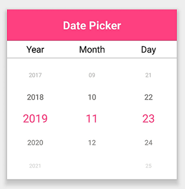

# Date Format in Syncfusion DatePicker 

Format is a way to represent the value of the date in a different string format.

By default, the DatePicker’s format is "DateFormat.M_d_yyyy".

The different types of Formats are.

M_d_yyyy - Represents the month day year in m/d/yyyy format.

MM_dd_yyyy - Represents the month day year in mm/dd/yyyy format.

yyyy_MM_dd - Represents the year month day in yyyy/mm/dd format.

dd_MMM_yyyy - Represents the day month year in dd/mmm/yyyy format.

dd_MM_yyyy - Represents the day month year in dd/MM/yyyy format.

The following example demonstrates the DatePicker with the custom format DateFormat.yyyy-MM-dd.





<?xml version="1.0" encoding="utf-8" ?>
<ContentPage xmlns="http://xamarin.com/schemas/2014/forms"
             xmlns:x="http://schemas.microsoft.com/winfx/2009/xaml"
             xmlns:local="clr-namespace:DatePickerSample"
             xmlns:syncfusion="clr-namespace:Syncfusion.XForms.Pickers;assembly=Syncfusion.SfPicker.XForms"
             x:Class="DatePickerSample.MainPage">
    <ContentPage.Content>
        <syncfusion:SfDatePicker x:Name="datepicker"
                                 Format="yyyy_MM_dd"/>
    </ContentPage.Content>
</ContentPage>



  

using Syncfusion.XForms.Pickers;
using Xamarin.Forms;

namespace DatePickerSample
{
    public partial class MainPage : ContentPage
    {
        public MainPage()
        {
            InitializeComponent();
            SfDatePicker datePicker = new SfDatePicker()
            {
                Format = DateFormat.yyyy_MM_dd
            };

            this.Content = datePicker;
        }
    }
}





