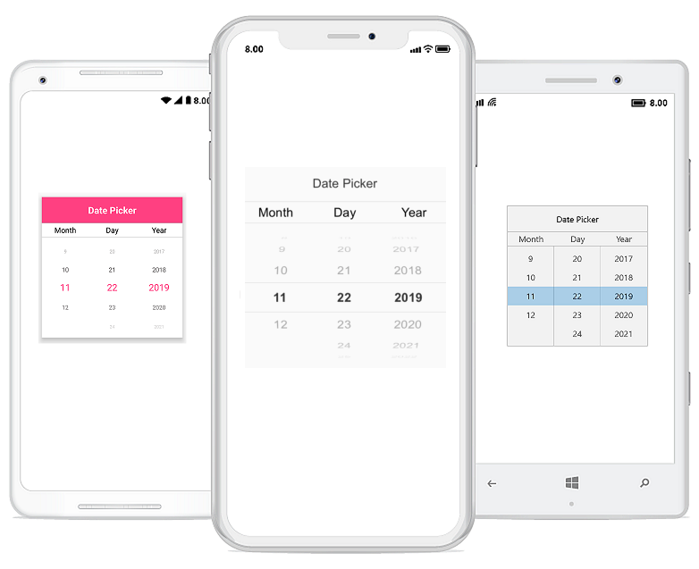

# Overview

The DatePicker control allows you to select a date among a list of dates. This control can be opened as dialog. Its rich feature set includes functionalities such as date range, date format, header, footer, and default validation buttons.

## Key features of SfDatePicker

* MinimumDate — This is the lowest date selectable for this DatePicker. The default value of the MinimumDate is the first day of 25 years prior to the current year.
* MaximumDate — This is the highest date selectable for this DatePicker. The default value of the MaximumDate is the first day of 25 years above the current year.
* Date — This is a selected date. The default value of the Date is the current date.
* Format — The format of the date to display to the user. It is standard or custom. The default date format is "DateFormat.M_d_yyyy".
* SelectedItemTextColor — The color used to display the selected date.
* SelectedItemFontAttribute — The user can apply different font attributes to the selected date using this property. The default value of the SelectedItemFontAttribute is "None".
* SelectedItemFontFamily — The user can apply different font family to the selected date using this property. The default value of the SelectedItemFontFamily is "null".
* SelectedItemFontSize — The user can apply different font sizes to the selected date using this property. The default value of the SelectedItemFontSize for android is "20.0d", with other platforms being "18.0d".
* SelectionBackgroundColor — The user can apply different background colors to the selected item using this property.
* UnselectedItemTextColor — The color used to display the unselected dates.
* UnselectedItemFontAttribute — The user can apply different font attributes to the unselected dates using this property. The default value of the UnselectedItemFontAttribute is "None".
* UnselectedItemFontFamily — The user can apply different font family to the unselected dates using this property. The default value of the UnselectedItemFontFamily is "null".
* UnselectedItemFontSize — The user can apply different font sizes to the unselected dates using this property. The default value of the UnselectedItemFontSize for android is "16.0d", with other platforms being "18.0d".
* Header customization — Complete customization options for the header such as background color, text color, font size, font attribute, and font family.
* Footer customization — Complete customization options for the footer's OK and Cancel buttons such as background color, and text color.
* Column header customization — Complete customization options for the column header such as background color, text color, font size, font attribute, and font family.
* PickerMode — DatePicker can be rendered as a dialog. Default value of the PickerMode property is "Default".

The following screenshot illustrates picker’s color selection. 

