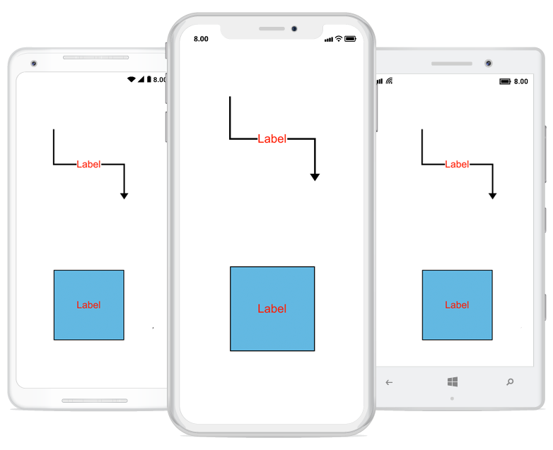
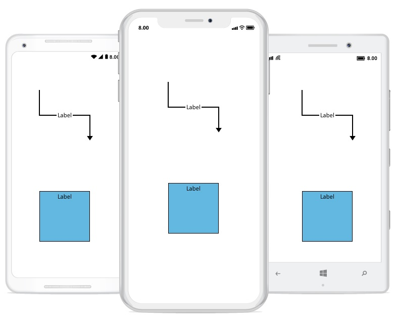

# Annotation in Xamarin Diagram (SfDiagram)
Annotation is a block of text that can be displayed over a Node or Connector. Annotation is used to textually represent an object with a string that can be edited at run time. 
You can add Multiple Labels to a Node/Connector.

## Create annotation
You can add an Annotation to a Node/Connector by defining the Annotation and adding that to the Annotations property of Node/Connector. The Content property of Annotation defines the object to be displayed. The following code illustrates how to create an Annotation.


<!-- To Add Annotation for Node -->
<control:SfDiagram x:Name="diagram">
        <control:SfDiagram.Nodes>
          <control:Node OffsetX="100" OffsetY="300" Width="100" Height="100">
             <control:Node.Annotations>
              <control:AnnotationCollection>
                <control:Annotation Content="Lable"/>
              </control:AnnotationCollection>
             </control:Node.Annotations>
          </control:Node>
        </control:SfDiagram.Nodes>

<!-- To Add Annotation for Connector-->
      <control:SfDiagram.Connectors>
          <control:Connector SourcePoint="100,100" TargetPoint="200,200" SegmentType="OrthoSegment">
             <control:Connector.Annotations>
              <control:AnnotationCollection>
                <control:Annotation Content="Lable"/>
              </control:AnnotationCollection>
             </control:Connector.Annotations>
          </control:Connector>
        </control:SfDiagram.Connectors>
      </control:SfDiagram>


//To Add Annotation for Node
Node node1 = new Node(100, 300, 100, 100);
node1.Annotations.Add(new Annotation() { Content = "Label" });
diagram.AddNode(node1);

// To Add Annotation for Connector
Connector Connector1 = new Connector();
Connector1.SourcePoint = new Point(100, 100);
Connector1.TargetPoint = new Point(200, 200);
Connector1.Annotations.Add(new Annotation() { Content = "Label" });diagram.AddConnector(Connector1);




## Accessing an annotation form node and connector instance
User can able to access the node or connector annotation using annotation name. The following code illustrates how to access an Annotation.


// Accessing Annotation 

Connector Connector1 = new Connector();
Connector1.SourcePoint = new Point(100, 100);
Connector1.TargetPoint = new Point(300, 300);
var label = new Annotation() { Content = "Label" };
Connector1.Annotations.Add(label);
diagram.AddConnector(Connector1);
Connector1.Annotations.Remove(label);




## Remove an annotation
User can able to remove the annotation using index value. The following code illustrates how to remove an Annotation.


//Remove Annotation using Index

Connector Connector1 = new Connector();
Connector1.SourcePoint = new Point(100, 100);
Connector1.TargetPoint = new Point(300, 300);
var label = new Annotation() { Content = "Label" };
Connector1.Annotations.Add(label);
diagram.AddConnector(Connector1);
Connector1.Annotations.RemoveAt(0);




## Annotation customization
User can able to customize the annotation using properties. The following code illustrates how to remove an Annotation.


<!-- Annotation customization for node -->
<control:SfDiagram.Nodes>
          <control:Node OffsetX="100" OffsetY="300"  Width="100" Height="100>
             <control:Node.Annotations>
              <control:AnnotationCollection>
               <control:Annotation Content="Lable" FontFamily="Arial" FontSize="14"/>
              </control:AnnotationCollection>
             </control:Node.Annotations>
          </control:Node>
        </control:SfDiagram.Nodes>
<!-- Annotation customization for connector -->
      <control:SfDiagram.Connectors>
          <control:Connector SourcePoint="100,100" TargetPoint="200,200" SegmentType="OrthoSegment">
             <control:Connector.Annotations>
               <control:AnnotationCollection>
                <control:Annotation Content="Lable" FontFamily="Arial" FontSize="14"/>
               </ontrol:AnnotationCollection>
             </control:Connector.Annotations>
          </control:Connector>
        </control:SfDiagram.Connectors>



// Annotation customization for node 
Node node1 = new Node(100,300,100,100);
var label = new Annotation()
{
  Content = "Label",
  FontFamily = "Arial",
  FontSize = 14,
  TextBrush = new SolidBrush(Color.Red)
} ;
node1.Annotations.Add(label);
diagram.AddNode(node1);

// Annotation customization for connector 
Connector Connector1 = new Connector();
Connector1.SourcePoint = new Point(100, 100);
Connector1.TargetPoint = new Point(200, 200);
var label = new Annotation()	
{
  Content = "Label",
  FontFamily = "Arial",
  FontSize = 14,
  TextBrush = new SolidBrush(Color.Red)
} ;
Connector1.Annotations.Add(label);
diagram.AddConnector(Connector1);



The following output is displayed as result of the above code example.

## Alignment
Annotation can be aligned relative to the Node boundaries. It has Horizontal and Vertical Alignment settings. It is quite tricky when all four alignments are used together but gives you more control over alignment.


<!--Annotation alignment for Node-->
<control:SfDiagram x:Name="diagram">
        <control:SfDiagram.Nodes>
          <control:Node OffsetX="100" OffsetY="300"  Width="100" Height="100">
             <control:Node.Annotations>
              <control:AnnotationCollection>
               <control:Annotation Content="Lable" HorizontalAlignment="Center" VerticalAlignment="Top"/>
              </control:AnnotationCollection>
             </control:Node.Annotations>
          </control:Node>
        </control:SfDiagram.Nodes>

<!--Annotation alignment for connector --> 
      <control:SfDiagram.Connectors>
          <control:Connector SourcePoint="100,100" TargetPoint="200,200" SegmentType="OrthoSegment">
             <control:Connector.Annotations>
              <control:AnnotationCollection>
               <control:Annotation Content="Lable" HorizontalAlignment="Center" VerticalAlignment="Center"/>
              </control:AnnotationCollection>
             </control:Connector.Annotations>
          </control:Connector>
        </control:SfDiagram.Connectors>
      </control:SfDiagram>


// Annotation alignment for Node
Node node1 = new Node(100,300,100,100);
Annotation label = new Annotation()
{
       Content = "Label",
       HorizontalAlignment = HorizontalAlignment.Center,
      VerticalAlignment = VerticalAlignment.Top
} ;
node1.Annotations.Add(label);
diagram.AddNode(node1);

//Annotation alignment for Connector

Connector Connector1 = new Connector();
Connector1.SourcePoint = new Point(100, 100);
Connector1.TargetPoint = new Point(200, 200);
Connector1.Annotations.Add(new Annotation() { Content = "Label", HorizontalAlignment = HorizontalAlignment.Center,
      VerticalAlignment = VerticalAlignment.Center
 });
diagram.AddConnector(Connector1);



The following output is displayed as result of the above code example.

## TextChanged
The ['TextChangedEvent'](https://help.syncfusion.com/cr/xamarin/Syncfusion.SfDiagram.XForms.TextChangedEventArgs.html) will triggers when changing the annotation content of the node or connector. The following code example explains how to create a TextChangedEvent trigger. 


diagram.TextChanged += Diagram_TextChanged; 

private void Diagram_TextChanged(object sender, Syncfusion.SfDiagram.XForms.TextChangedEventArgs args)
        {
            var content = args.Item;
        }



N> You can refer to our [Xamarin Diagram](https://www.syncfusion.com/xamarin-ui-controls/xamarin-diagram) feature tour page for its groundbreaking feature representations.You can also explore our [Xamarin Diagram example](https://github.com/syncfusion/xamarin-demos/tree/master/Forms/Diagram) to understand how to present and manipulate data.
