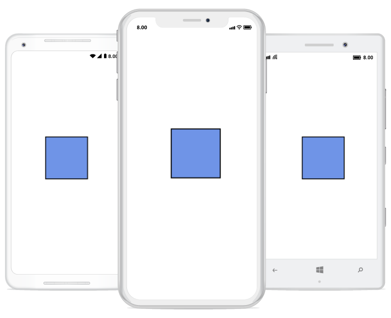

# Node in Xamarin Diagram (SfDiagram)
Nodes are graphical objects used to visually represent the geometrical information, process flow, internal business procedure or any other kind of data and it represents the functions of a complete system in regards to how it interacts with external entities.

## Create node
A Node can be created and added to the Diagram, either programmatically or interactively. Nodes are stacked on the Diagram area from bottom to top in the order they are added.
The following code snippet illustrates how to create the node.


<!--Initialize SfDiagram-->
<syncfusion:SfDiagram  x:Name="diagram">
    <!--Initialize NodeCollection-->
    <syncfusion:SfDiagram.Nodes>
        <syncfusion:NodeCollection>
            <!--Initialize Node-->
            <syncfusion:Node Width="100" Height="100" OffsetX="200" OffsetY="200">
            </syncfusion:Node>
        </syncfusion:NodeCollection>
    </syncfusion:SfDiagram.Nodes>
</syncfusion:SfDiagram>


//Initialize Node
Node n = new Node() { Width = 120, Height = 40, OffsetX = 300,OffsetY = 60, ShapeType = ShapeType.Ellipse };
//Adds the node to the SfDiagram
diagram.AddNode(n);



## Create a node with custom path/shape
Node can be created with different custom shapes and path using SfGraphics.
The following code snippet is used to create the Node with custom shape/path.


//Initialize Node
Node node = new Node(){ Width = 120, Height = 80, OffsetX = 200, OffsetY = 200 };
//Initialize SfGraphics
SfGraphics graphics = new SfGraphics();
Pen pen = new Pen();
pen.StrokeBrush = new SolidBrush(Color.Red);
pen.StrokeWidth = 2;
SolidBrush brush = new SolidBrush(Color.Yellow);
brush.FillColor = Color.Yellow;
pen.Brush = brush;
graphics.DrawRectangle(pen, new Rectangle(0, 0, 50, 50));
//Update the SfGraphics to the node
node.UpdateSfGraphics(graphics);



## Accessing a node from the diagram instance
We can access the Node from the diagram instance using the following code snippet.


//Access the node from the diagram instance.
Node node = diagram.Nodes[0];



## Remove a node
The following code snippet is used to remove the node from the diagram.


//Remove the node from the diagram.
Node node = new Node();
diagram.RemoveNode(node);



## Customization:
We can Customize the entire node with our own customized design using Template property.


<!--Initialize the DataTemplate-->
<DataTemplate x:Key="template">
  <Grid WidthRequest="80" HeightRequest="80">
    <Image Source="diagram.png"/>
  </Grid>
</DataTemplate>
<!--Initialize node-->
<diagram:Node OffsetX="300" OffsetY="300" Width="60" Height="70" Template="{StaticResource template}" />


//Initialize the template
var template = new DataTemplate(() =>
{
    Grid grid = new Grid();
    grid.WidthRequest = 80;
    grid.HeightRequest = 80;
    Image image = new Image();
    image.Source = "employee.png";
    grid.Children.Add(image);
    return grid;
});
//Initialize node with template.
Node node = new Node() { Width = 120, Height = 40, OffsetX = 300, OffsetY = 60, Template = template};



## Constraints
The Node Constraints allow you to enable or disable the following behaviors of Node.
•EnableDrag
•EnableResize
•EnableRotate
•EnableTextEditing
•IsLocked.
Example
The following code illustrates how to disable node dragging.


<!--Initialize the node with constraints-->
<syncfusion:Node OffsetX="300" OffsetY="60" Width="120" Height="40" ShapeType="Ellipse" EnableDrag=”False”>


//Initialize the node with constraints
Node node = new Node() {EnableDrag = false;, Width = 50, Height = 50, OffsetX = 100, OffsetY = 100};



## RotateEnd
The ['RotateEndEvent'](https://help.syncfusion.com/cr/xamarin/Syncfusion.SfDiagram.XForms.RotateEndEventArgs.html) will be triggered while rotating the node. The following code example explains how to create a RotateEndEvent trigger. 
 


<diagram:SfDiagram x:Name="diagram" VerticalOptions="FillAndExpand" RotateEnd="Diagram_RotateEnd" />


SfDiagram diagram = new SfDiagram();
diagram.RotateEnd += Diagram_RotateEnd; 
this.Content = diagram;

private void Diagram_RotateEnd(object sender, RotateEndEventArgs args)
{
    Node node = (Node)args.Item;
}



N> You can refer to our [Xamarin Diagram](https://www.syncfusion.com/xamarin-ui-controls/xamarin-diagram) feature tour page for its groundbreaking feature representations.You can also explore our [Xamarin Diagram example](https://github.com/syncfusion/xamarin-demos/tree/master/Forms/Diagram) to understand how to present and manipulate data.