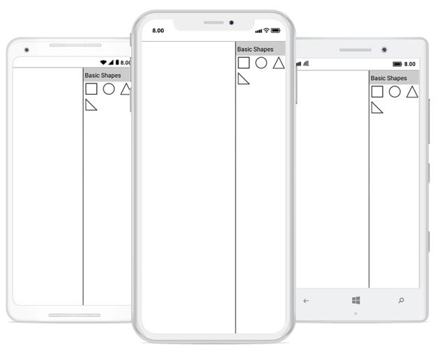
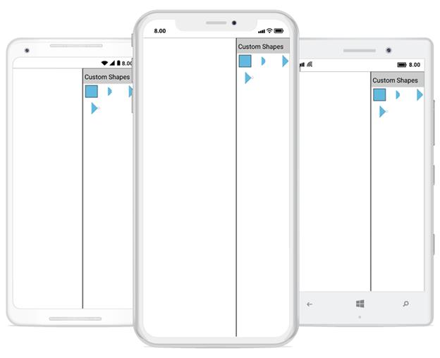

# Stencil in Xamarin Diagram (SfDiagram)
Stencil has a collection of Symbols. Stencil is used to clone the desired symbol by dragging it from the Stencil and dropping it into the SfDiagram. Each symbol can be grouped together by using the SymbolGroup .


<!-- Add namespace in xaml page -->
xmlns:sfDiagram="clr-namespace:Syncfusion.SfDiagram.XForms;assembly=Syncfusion.SfDiagram.XForms"



## Add default shapes into stencil
The following example illustrates how to add the Symbol into a Collection:


<ContentPage.Resources>
  <ResourceDictionary>
<!-- Add Symbols into SymbolCollection -->
      <control:SymbolCollection x:Key="collection">
        <control:Node Height="50" Width="50" ShapeType="Rectangle" >
            <control:Node.Style>
                <control:Style>
                    <control:Style.Brush>
                        <control:SolidBrush FillColor="White" />
                    </control:Style.Brush>
                </control:Style>
            </control:Node.Style>
        </control:Node>
        <control:Node Height="50" Width="50" ShapeType="Ellipse" >
            <control:Node.Style>
                <control:Style>
                    <control:Style.Brush>
                        <control:SolidBrush FillColor="White" />
                    </control:Style.Brush>
                </control:Style>
            </control:Node.Style>
        </control:Node>
        <control:Node Height="50" Width="50" ShapeType="Triangle" >
            <control:Node.Style>
                <control:Style>
                    <control:Style.Brush>
                        <control:SolidBrush FillColor="White" />
                    </control:Style.Brush>
                </control:Style>
            </control:Node.Style>
        </control:Node>
        <control:Node Height="50" Width="50" ShapeType="RightAngleTriangle" >
            <control:Node.Style>
                <control:Style>
                    <control:Style.Brush>
                        <control:SolidBrush FillColor="White" />
                    </control:Style.Brush>
                </control:Style>
            </control:Node.Style>
        </control:Node>
      </control:SymbolCollection>
<!-- Add collection into SymbolGroup -->
      <control:SymbolGroups x:Key="groups">
       <control:SymbolGroup SymbolSource="{StaticResource collection}" HeaderName="BasicShapes" />
      </control:SymbolGroups>
    </ResourceDictionary>
  </ContentPage.Resources> 
  <ContentPage.Content>
    <Grid x:Name="grid">
      <Grid.ColumnDefinitions>
        <ColumnDefinition Width="2*"/>
        <ColumnDefinition Width="150"/>
        </Grid.ColumnDefinitions>
<!-- Add SfDiagram and stencil in xaml page -->
      <control:SfDiagram x:Name="diagram">
      </control:SfDiagram>
      <control:Stencil x:Name="stencil" SymbolGroups="{StaticResource groups}" Grid.Column="1" >
      </control:Stencil>
      </Grid>
</ContentPage.Content>


//Add Symbols into SymbolCollection
SymbolCollection Collection = new SymbolCollection();
Collection.Add(new Node() { Width = 50, Height = 50, ShapeType = ShapeType.Rectangle, Style = new Syncfusion.SfDiagram.XForms.Style() { Brush = new SolidBrush(Color.White) } });
Collection.Add(new Node() { Width = 50, Height = 50, ShapeType = ShapeType.Ellipse, Style = new Syncfusion.SfDiagram.XForms.Style() { Brush = new SolidBrush(Color.White) } });
Collection.Add(new Node() { Width = 50, Height = 50, ShapeType = ShapeType.Triangle, Style = new Syncfusion.SfDiagram.XForms.Style() { Brush = new SolidBrush(Color.White) } });
Collection.Add(new Node() { Width = 50, Height = 50, ShapeType = ShapeType.RightAngleTriangle, Style = new Syncfusion.SfDiagram.XForms.Style() { Brush = new SolidBrush(Color.White) } });
//Add collection into SymbolGroup
stencil.SymbolGroups.Add(new SymbolGroup() { SymbolSource = Collection, HeaderName = "BasicShapes" });


This Collection will be the SymbolSource to the Stencil. Based on the SymbolSource, the Stencil will populate the Symbols.

## Add custom shapes into stencil
The following example illustrates how to add the custom shapes into a Collection:


//Custom shapes 
            Pen pen = new Pen();
            pen.StrokeBrush = new SolidBrush(Color.Red);
            pen.StrokeWidth = 2;
            SolidBrush brush = new SolidBrush(Color.Yellow);
            pen.Brush = brush;
            Pen pen1 = new Pen();
            pen1.StrokeBrush = new SolidBrush(Color.Gray);
            pen1.StrokeWidth = 2;
            SolidBrush brush1 = new SolidBrush(Color.Blue);
            brush1.FillColor = Color.Blue;
            pen1.Brush = brush1;
            Node custom = new Node();
            SfGraphics graphics = new SfGraphics();
            Pen pen2 = new Pen();
            pen2.StrokeBrush = new SolidBrush(Color.Blue);
            pen2.StrokeWidth = 2;
            SolidBrush brush2 = new SolidBrush(Color.FromRgb(99, 184, 225));
            brush2.FillColor = Color.FromRgb(99, 184, 225);
            pen2.Brush = brush2;
            graphics.DrawRectangle(pen2, new Xamarin.Forms.Rectangle(0, 0, 50, 50));
            custom.UpdateSfGraphics(graphics);
            Node custom1 = new Node();
            SfGraphics grap4 = new SfGraphics();
            SfGraphicsPath sfpath4 = new SfGraphicsPath();
            Pen pen14 = new Pen();
            pen14.StrokeBrush = new SolidBrush(Color.Blue);
            pen14.StrokeWidth = 2;
            SolidBrush brush14 = new SolidBrush(Color.Transparent);
            brush14.FillColor = Color.Transparent;
            pen14.Brush = brush14;
            List<Point> coll4 = new List<Point>();
            coll4.Add(new Point(0, 12));
            coll4.Add(new Point(12, 12));
            coll4.Add(new Point(12, 6));
            coll4.Add(new Point(12, 42));
            coll4.Add(new Point(12, 30));
            coll4.Add(new Point(0, 30));
            grap4.DrawLines(pen14, coll4.ToArray());
            sfpath4.MoveTo(12, 6);
            sfpath4.CubicTo(12, 6, 38, 20, 12, 36);
            grap4.DrawPath(sfpath4);
            custom1.UpdateSfGraphics(grap4);
            Node custom2 = new Node();
            SfGraphics grap5 = new SfGraphics();
            SfGraphicsPath sfpath5 = new SfGraphicsPath();
            List<Point> pointscol5 = new List<Point>();
            pointscol5.Add(new Point(0, 15));
            pointscol5.Add(new Point(15, 15));
            pointscol5.Add(new Point(15, 0));
            pointscol5.Add(new Point(30, 15));
            pointscol5.Add(new Point(15, 30));
            pointscol5.Add(new Point(15, 15));
            sfpath5.AddLines(pointscol5.ToArray());
            grap5.DrawPath(sfpath5);
            custom2.UpdateSfGraphics(grap5);
            Node custom3 = new Node();
            Pen pen4 = new Pen();
            pen4.StrokeBrush = new SolidBrush(Color.Blue);
            pen4.StrokeWidth = 2;
            SolidBrush brush4 = new SolidBrush(Color.White);
            brush4.FillColor = Color.White;
            pen4.Brush = brush4;
            SfGraphics grap6 = new SfGraphics();
            SfGraphicsPath sfpath6 = new SfGraphicsPath();
            List<Point> pointscol6 = new List<Point>();
            pointscol6.Add(new Point(0, 15));
            pointscol6.Add(new Point(15, 15));
            pointscol6.Add(new Point(15, 0));
            pointscol6.Add(new Point(30, 15));
            pointscol6.Add(new Point(15, 30));
            pointscol6.Add(new Point(15, 15));
            sfpath6.AddLines(pointscol5.ToArray());
            grap6.DrawPath(sfpath6);
            grap6.DrawEllipse(pen4, new Xamarin.Forms.Rectangle(30, 12, 5, 5));
            custom3.UpdateSfGraphics(grap6);
            SymbolCollection CustomShapeCollection = new SymbolCollection();
            CustomShapeCollection.Add(custom);
            CustomShapeCollection.Add(custom1);
            CustomShapeCollection.Add(custom2);
            CustomShapeCollection.Add(custom3);
//Add custom shapes into group
stencil.SymbolGroups.Add(new SymbolGroup() { SymbolSource = CustomShapeCollection , HeaderName = "Custom Shapes" });



## Add category heading text
We can able to add category of symbol group heading in stencil. The following example illustrates how to add category heading text in stencil.


<ResourceDictionary>
<!--SymbolCollection1-->
      <control:SymbolCollection x:Key="BasicShapescollection">
        <control:Node Height="50" Width="50" ShapeType="Rectangle" >
            <control:Node.Style>
                <control:Style>
                    <control:Style.Brush>
                        <control:SolidBrush FillColor="White" />
                    </control:Style.Brush>
                </control:Style>
            </control:Node.Style>
        </control:Node>
        <control:Node Height="50" Width="50" ShapeType="Ellipse" >
            control:Node.Style>
                <control:Style>
                    <control:Style.Brush>
                        <control:SolidBrush FillColor="White" />
                    </control:Style.Brush>
                </control:Style>
            </control:Node.Style>
        </control:Node>
        <control:Node Height="50" Width="50" ShapeType="Triangle" >
            <control:Node.Style>
                <control:Style>
                    <control:Style.Brush>
                        <control:SolidBrush FillColor="White" />
                    </control:Style.Brush>
                </control:Style>
            </control:Node.Style>
        </control:Node>
        <control:Node Height="50" Width="50" ShapeType="RightAngleTriangle" >
            <control:Node.Style>
                <control:Style>
                    <control:Style.Brush>
                        <control:SolidBrush FillColor="White" />
                    </control:Style.Brush>
                </control:Style>
            </control:Node.Style>
        </control:Node>
      </control:SymbolCollection>
<!--SymbolCollection2-->
      <control:SymbolCollection x:Key="FlowChartcollection">
        <control:Node Height="50" Width="50" ShapeType="RoundedRectangle" >
            <control:Node.Style>
                <control:Style>
                    <control:Style.Brush>
                        <control:SolidBrush FillColor="White" />
                    </control:Style.Brush>
                </control:Style>
            </control:Node.Style>
        </control:Node>
        <control:Node Height="50" Width="50" ShapeType="Rectangle" >
            <control:Node.Style>
                <control:Style>
                    <control:Style.Brush>
                        <control:SolidBrush FillColor="White" />
                    </control:Style.Brush>
                </control:Style>
            </control:Node.Style>
        </control:Node>
        <control:Node Height="50" Width="50" ShapeType="Diamond" >
            <control:Node.Style>
                <control:Style>
                    <control:Style.Brush>
                        <control:SolidBrush FillColor="White" />
                    </control:Style.Brush>
                </control:Style>
            </control:Node.Style>
        </control:Node>
        <control:Node Height="50" Width="50" ShapeType="Parallelogram" >
            <control:Node.Style>
                <control:Style>
                    <control:Style.Brush>
                        <control:SolidBrush FillColor="White" />
                    </control:Style.Brush>
                </control:Style>
            </control:Node.Style>
        </control:Node>
      </control:SymbolCollection>
<!--SymbolCollection3-->
      <control:SymbolCollection x:Key="Connectorscollection">
        <control:Connector SourcePoint="0,0" TargetPoint="50,50" SegmentType="OrthoSegment" />
        <control:Connector SourcePoint="0,0" TargetPoint="50,50" SegmentType="StraightSegment" />
      </control:SymbolCollection>
<!--Add category of symbolgroup with heading text -->
      <control:SymbolGroups x:Key="groups">
       <control:SymbolGroup SymbolSource="{StaticResource BasicShapescollection}" HeaderName="BasicShapes" />
        <control:SymbolGroup SymbolSource="{StaticResource FlowChartcollection}" HeaderName="Flow Chart" />
        <control:SymbolGroup SymbolSource="{StaticResource Connectorscollection}" HeaderName="Connectors" />
      </control:SymbolGroups>
    </ResourceDictionary>


//SymbolCollection1 
SymbolCollection BasicShapescollection = new SymbolCollection();
BasicShapescollection.Add(new Node() { Width = 50, Height = 50, ShapeType = ShapeType.Rectangle, Style = new Syncfusion.SfDiagram.XForms.Style() { Brush = new SolidBrush(Color.White) } });
BasicShapescollection.Add(new Node() { Width = 50, Height = 50, ShapeType = ShapeType.Ellipse, Style = new Syncfusion.SfDiagram.XForms.Style() { Brush = new SolidBrush(Color.White) } });
BasicShapescollection.Add(new Node() { Width = 50, Height = 50, ShapeType = ShapeType.Triangle, Style = new Syncfusion.SfDiagram.XForms.Style() { Brush = new SolidBrush(Color.White) } });
BasicShapescollection.Add(new Node() { Width = 50, Height = 50, ShapeType = ShapeType.RightAngleTriangle, Style = new Syncfusion.SfDiagram.XForms.Style() { Brush = new SolidBrush(Color.White) } });
//SymbolCollection2 
SymbolCollection FlowChartcollection = new SymbolCollection();
FlowChartcollection.Add(new Node() { Width = 50, Height = 50, ShapeType = ShapeType.RoundedRectangle, Style = new Syncfusion.SfDiagram.XForms.Style() { Brush = new SolidBrush(Color.White) } });
FlowChartcollection.Add(new Node() { Width = 50, Height = 50, ShapeType = ShapeType.Rectangle, Style = new Syncfusion.SfDiagram.XForms.Style() { Brush = new SolidBrush(Color.White) } });
FlowChartcollection.Add(new Node() { Width = 50, Height = 50, ShapeType = ShapeType.Diamond, Style = new Syncfusion.SfDiagram.XForms.Style() { Brush = new SolidBrush(Color.White) } });
FlowChartcollection.Add(new Node() { Width = 50, Height = 50, ShapeType = ShapeType.Parallelogram, Style = new Syncfusion.SfDiagram.XForms.Style() { Brush = new SolidBrush(Color.White) } });
//SymbolCollection3
SymbolCollection Connectorscollection = new SymbolCollection();
Connectorscollection.Add(new Connector() { SegmentType = SegmentType.OrthoSegment, SourcePoint = new Point(0, 0), TargetPoint = new Point(50, 50) });
Connectorscollection.Add(new Connector() { SegmentType = SegmentType.StraightSegment, SourcePoint = new Point(0, 0), TargetPoint = new Point(50, 50) });
//Add category of symbol group with heading text
stencil.SymbolGroups.Add(new SymbolGroup() { SymbolSource = BasicShapescollection, HeaderName = "BasicShapes" });
stencil.SymbolGroups.Add(new SymbolGroup() { SymbolSource = FlowChartcollection, HeaderName = "Flow Chart" });
stencil.SymbolGroups.Add(new SymbolGroup() { SymbolSource = Connectorscollection, HeaderName = "Connectors" });
diagram.Stencil=stencil;



N> You can refer to the [Xamarin Diagram](https://www.syncfusion.com/xamarin-ui-controls/xamarin-diagram) feature tour page for its groundbreaking feature representations. You can also explore the [Xamarin Diagram example](https://github.com/syncfusion/xamarin-demos/tree/master/Forms/Diagram) to understand how to present and manipulate data.

## Add Annotation into stencil
Stencil is able to load the symbols like connectors and nodes (all shapes), custom shapes with annotation into the SfDiagram. Each symbol can be grouped together by using the SymbolGroup.
The following example explains how to add the Annotation into a stencil:


<ContentPage.Resources>
  <ResourceDictionary>
    <diagram:SymbolCollection x:Key="SmallDataBox">
      <diagram:Node                     
        Width="150"
        Height="150"
        EnableDrag="True"
        EnableResize="True"
        ShapeType="Rectangle">
        <diagram:Node.Annotations>
          <diagram:Annotation
              HorizontalAlignment="Center"
              VerticalAlignment="Center"
              Content="Node"
              FontSize="36">
              <diagram:Annotation.TextBrush>
                <diagram:SolidBrush FillColor="Red" />
                  </diagram:Annotation.TextBrush>
          </diagram:Annotation>
        </diagram:Node.Annotations>
      </diagram:Node>
      <diagram:Node                     
          Width="150"
          Height="150"
          EnableDrag="True"
          EnableResize="True"
          ShapeType="Circle">
          <diagram:Node.Annotations>
            <diagram:Annotation
                HorizontalAlignment="Center"
                VerticalAlignment="Center"
                Content="Node"
                FontSize="30">
                <diagram:Annotation.TextBrush>
                  <diagram:SolidBrush FillColor="Blue" />
                </diagram:Annotation.TextBrush>
            </diagram:Annotation>
          </diagram:Node.Annotations>
      </diagram:Node>
      <diagram:Node                     
        Width="150"
        Height="150"
        EnableDrag="True"
        EnableResize="True"
        ShapeType="Diamond">
        <diagram:Node.Annotations>
          <diagram:Annotation
            HorizontalAlignment="Center"
            VerticalAlignment="Center"
            Content="Node"
            FontSize="30">
            <diagram:Annotation.TextBrush>
              <diagram:SolidBrush FillColor="Green" />
            </diagram:Annotation.TextBrush>
          </diagram:Annotation>
        </diagram:Node.Annotations>
      </diagram:Node>
    </diagram:SymbolCollection>
    <diagram:SymbolGroups x:Key="groups">
      <diagram:SymbolGroup  HeaderName="Small Data Box" SymbolSource="{StaticResource SmallDataBox}"/>
    </diagram:SymbolGroups>
  </ResourceDictionary>
</ContentPage.Resources>
<ContentPage.Content>
  <Grid>
    <Grid.ColumnDefinitions>
      <ColumnDefinition Width="2*" />
      <ColumnDefinition Width="150" />
    </Grid.ColumnDefinitions>
    <diagram:SfDiagram
      x:Name="diagram"
      Grid.Column="0"
      BackgroundColor="Transparent"
      HeightRequest="1280"
      WidthRequest="720">
      <diagram:SfDiagram.PageSettings>
        <diagram:PageSettings
          GridColor="LightGray"
          PageBackGround="Transparent"
          ShowGrid="False"
          SnapToGrid="False" />
      </diagram:SfDiagram.PageSettings>
    </diagram:SfDiagram>
    <diagram:Stencil Grid.Column="1" SymbolGroups="{StaticResource groups}" >
      <diagram:Stencil.SymbolStyle>
        <diagram:SymbolStyle Width="150" Height="150"/>
      </diagram:Stencil.SymbolStyle>
    </diagram:Stencil>
  </Grid>
</ContentPage.Content>


Grid grid = new Grid();
var column = new ColumnDefinition() { Width = new GridLength(2, GridUnitType.Star) };
var column1 = new ColumnDefinition() { Width = new GridLength(150) };
grid.ColumnDefinitions.Add(column);
grid.ColumnDefinitions.Add(column1);

SfDiagram diagram = new SfDiagram();
diagram.HeightRequest = 1280;
diagram.WidthRequest = 720;
diagram.BackgroundColor = Color.Transparent;
diagram.PageSettings.GridColor = Color.LightGray;
diagram.PageSettings.PageBackGround = Color.Transparent;
diagram.PageSettings.ShowGrid = false;
diagram.PageSettings.SnapToGrid = false;

Stencil stencil = new Stencil();
SymbolCollection SmallDataBox = new SymbolCollection();
SmallDataBox.Add(new Node()
{
    Width = 150,
    Height = 150,
    EnableDrag = true,
    EnableResize = true,
    ShapeType = ShapeType.Rectangle,
    Annotations = { new Annotation() { Content = "Node", FontSize = 36, TextBrush = new SolidBrush(Color.Red), HorizontalAlignment = HorizontalAlignment.Center, VerticalAlignment = VerticalAlignment.Center } }
});
SmallDataBox.Add(new Node()
{
    Width = 150,
    Height = 150,
    EnableDrag = true,
    EnableResize = true,
    ShapeType = ShapeType.Circle,
    Annotations = { new Annotation() { Content = "Node", FontSize = 30, TextBrush = new SolidBrush(Color.Blue), HorizontalAlignment = HorizontalAlignment.Center, VerticalAlignment = VerticalAlignment.Center } }
});
SmallDataBox.Add(new Node()
{
    Width = 150,
    Height = 150,
    EnableDrag = true,
    EnableResize = true,
    ShapeType = ShapeType.Diamond,
    Annotations = { new Annotation() { Content = "Node", FontSize = 30, TextBrush = new SolidBrush(Color.Green), HorizontalAlignment = HorizontalAlignment.Center, VerticalAlignment = VerticalAlignment.Center } }
});

//Add a category of symbol group with a heading text
stencil.SymbolGroups.Add(new SymbolGroup() { SymbolSource = SmallDataBox, HeaderName = "Small Data Box" });
stencil.SymbolStyle.Width = 150;
stencil.SymbolStyle.Height = 150;
grid.Children.Add(diagram, 0, 0);
grid.Children.Add(stencil, 1, 0);
this.Content = grid;



## DiagramObjectDropped
The ['DiagramObjectDroppedEvent'](https://help.syncfusion.com/cr/xamarin/Syncfusion.SfDiagram.XForms.DiagramObjectDroppedEventArgs.html) will be triggered when the node or connector is dragged and dropped from the ['Stencil'](https://help.syncfusion.com/cr/xamarin/Syncfusion.SfDiagram.XForms.Stencil.html) to the [diagram](https://help.syncfusion.com/cr/xamarin/Syncfusion.SfDiagram.XForms.html) page. The following code example explains how to create a DiagramObjectDroppedEvent trigger.  



<diagram:SfDiagram x:Name="diagram" VerticalOptions="FillAndExpand" DiagramObjectDropped="Diagram_DiagramObjectDropped" />


SfDiagram diagram = new SfDiagram();
diagram.DiagramObjectDropped += Diagram_DiagramObjectDropped;
this.Content = diagram;

private void Diagram_DiagramObjectDropped(object sender, Syncfusion.SfDiagram.XForms.DiagramObjectDroppedEventArgs args)
{
    Node node = (Node)args.Item;
}

 

## SymbolGroupExpandCollapse
The ['SymbolGroupExpandCollapseEvent'](https://help.syncfusion.com/cr/xamarin/Syncfusion.SfDiagram.XForms.SymbolGroupExpandCollapseEventArgs.html) will be triggered when the Symbol Group is expand or collapse in ['Stencil'](https://help.syncfusion.com/cr/xamarin/Syncfusion.SfDiagram.XForms.Stencil.html).The following code example explains how to create a SymbolGroupExpandCollapseEvent trigger.



<diagram:SfDiagram x:Name="diagram" VerticalOptions="FillAndExpand" SymbolGroupExpandCollapse="Diagram_SymbolGroupExpandCollapse" />


SfDiagram diagram = new SfDiagram();
diagram.SymbolGroupExpandCollapse += Diagram_SymbolGroupExpandCollapse; 
this.Content = diagram;

private void Diagram_SymbolGroupExpandCollapse(object sender, SymbolGroupExpandCollapseEventArgs args)
{
    SymbolGroup symbolgroup = args.SymbolGroup;
}

 