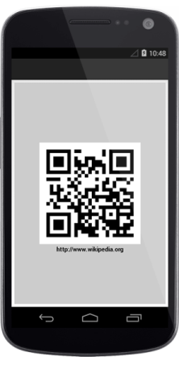

# Create your first Barcode in Xamarin.Android

This section explains how to configure a Barcode for Xamarin.Android application by using C#. To get started with the Essential Barcode, refer to the following steps and in result, you get the output on Android devices as follows.

## Reference Essential Studio components in your solution

After installing the Essential Studio for Xamarin, you can find all the required assemblies in the installation folders,

{Syncfusion Installed location}\Essential Studio\12.4.0.24\lib

_Note: Assemblies are available__in unzipped package location in Mac_

Add the following assembly references to the Android project,

[android\Syncfusion.SfBarcode.Andriod.dll]

## Configure the Barcode control

The following steps explain how to create and configure a Barcode.

1. Add reference to the SfBarcode as follows.

   ~~~ cs

        [C#]

            using Com.Syncfusion.Barcode
	
   ~~~
   {:.pretty-print }

2. Create a SfBarcode instance in Main Activity and set the sfBarcode as a ContentView in onCreate() overridden method.

   ~~~ cs

        [C#]

            public class MainActivity : Activity

            {

            protected override void OnCreate(Bundle bundle)

            {

                base.OnCreate(bundle);

                SfBarcode sfBarcode = new SfBarcode(this);

                SetContentView(sfBarcode);

            }
	
   ~~~
   {:.pretty-print }

3. Then you can set the text that you want to encode.

   ~~~ cs

        [C#]

            sfBarcode.Text = "http://www.wikipedia.org";
	
   ~~~
   {:.pretty-print }

4. Set the required symbology to encode the given text. By default, the given text is encoded by using the Code 39 symbology.

   ~~~ cs

        [C#]

            sfBarcode.Symbology = BarcodeSymbolType.QRBarcode;
	
   ~~~
   {:.pretty-print }

5. To customize the Barcode, initialize the settings of the corresponding Barcode symbology.

   ~~~ cs

        [C#]

            QRBarcodeSettings setting = new QRBarcodeSettings();

            setting.XDimension = 15;

            sfBarcode.SymbologySettings = setting;
	
   ~~~
   {:.pretty-print }

6. Finally, the Barcode is generated as shown in the screenshot for the following code example.

   ~~~ cs

        [C#]

            public class MainActivity : Activity

            {

            protected override void OnCreate(Bundle bundle)

            {

                base.OnCreate(bundle);

                SfBarcode sfBarcode = new SfBarcode(this);

                sfBarcode.Text = "http://www.wikipedia.org";

                sfBarcode.Symbology = BarcodeSymbolType.QRBarcode;

                QRBarcodeSettings setting = new QRBarcodeSettings();

                setting.XDimension = 15;

                sfBarcode.SymbologySettings = setting;

                SetContentView(sfBarcode);

            }

            }
	
   ~~~
   {:.pretty-print }

   

