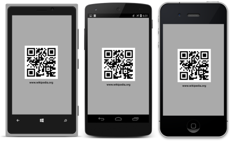

### Getting Started

This section explains how to configure a Barcode for Xamarin Forms application. The following screenshot illustrates the final output of barcode on iOS, Android and Windows Phone devices. You can also download the entire source code of this demo [here](http://files2.syncfusion.com/Installs/v12.2.0.40/Samples/Xamarin/BarcodeGettingStarted.zip).

{:.image }

To get started with Essential Barcode, go through the following steps.

Referencing Essential Studio components in your solution

When you acquire Essential Studio components through the Xamarin Component Store interface from your IDE, after adding the components to your Xamarin.iOS, Xamarin.Android and WindowsPhone projects through the Component Manager, you have to manually reference the PCL (Portable Class Library) assemblies in the Xamarin.Forms PCL Project in your solution. You can do this manually by adding the relevant PCL assembly references to your PCL project contained in the following path inside your solution folder: 

_Components/syncfusionessentialstudio-version/lib/pcl/_

Alternatively, when you download Essential Studio from Syncfusion.com or through the Xamarin Store web interface, add all the assembly references manually.  

After installing Essential Studio for Xamarin, you can find all the required assemblies in the installation folders, typically:

_{Syncfusion Installed location}\Essential Studio\12.2.0.40\lib_

_Example: C:\Program Files (x86)\Syncfusion\Essential Studio\12.2.0.40\lib_

Otherwise, after downloading through the Xamarin Store web interface, you can find all the required assemblies in the following folder:

_{download location}\syncfusionessentialstudio-version\lib_

Then, you can add the assembly references to the respective projects as follows.

PCL project

XForms\Syncfusion.SfBarcode.XForms.dll  

Android project

Android\Syncfusion.SfBarcode.Andriod.dll

Android\Syncfusion.SfBarcode.XForms.Andriod.dll 

iOS project

iOS\Syncfusion.SfBarcode.iOS.dll   

iOS\Syncfusion.SfBarcode.XForms.iOS.dll

Windows Phone project

WinPhone\Syncfusion.SfBarcode.WP8.dll

WinPhone\Syncfusion.SfBarcode.XForms.WinPhone.dll

> 
{:.image }
_Note: Essential Barcode for Xamarin is compatible with Xamarin. Forms 1.3.4.6332._

Currently an additional step is required for Windows Phone and iOS projects. Create an instance of the Barcode custom renderer as mentioned.

Create an instance of SfBarcodeRenderer in MainPage constructor in Windows Phone project as follows.

[C#]

public MainPage()

{

    new SfBarcodeRenderer();

    InitializeComponent();

}

Similarly, create an instance of SfBarcodeRenderer in FinishedLaunching overridden method of AppDelegate class in iOS Project as follows.

[C#]

public override bool FinishedLaunching(UIApplication app, NSDictionary options)

{

     new SfBarcodeRenderer ();

     return base.FinishedLaunching (app, options);

}

Configure the Barcode control

You can configure the Barcode control entirely in C# code or by using the XAML markup.

Here, the following steps illustrates how to create and configure a barcode.

1. Add reference to SFBarcode such as follows.

[XAML]

xmlns:syncfusion="clr-namespace:Syncfusion.SfBarcode.XForms;assembly=Syncfusion.SfBarcode.XForms"

[C#]

using Syncfusion.SfBarcode.XForms;

2. Create an instance of SfBarcode in XAML or code-behind using the reference of SfBarcode.

[XAML]

&lt;syncfusion:SfBarcode/&gt;

[C#]

SfBarcode barcode = new SfBarcode();

3. Then, you can assign the text that you want to encode.

[XAML]

&lt;syncfusion:SfBarcode Text="www.wikipedia.org"/&gt;

[C#]

barcode.Text = "www.wikipedia.org";

4. Specify the required symbology to encode the given text. By default, the given text is encoded using Code 39 symbology.

[XAML]

&lt;syncfusion:SfBarcode Text="www.wikipedia.org" Symbology="QRCode"/&gt;

[C#]

barcode.Symbology = BarcodeSymbolType.QRCode;

5. For customizing the barcode, initialize the settings of corresponding barcode symbology.

[XAML]

&lt;syncfusion:SfBarcode Text="www.wikipedia.org" Symbology="QRCode"&gt;

    &lt;syncfusion:SfBarcode.SymbologySettings&gt;

      &lt;syncfusion:SfQRBarcodeSettings XDimension="6"/&gt;

    &lt;/syncfusion:SfBarcode.SymbologySettings&gt;

&lt;/syncfusion:SfBarcode&gt;

[C#]

SfQRBarcodeSettings settings = new SfQRBarcodeSettings();

settings.XDimension = 6;

barcode.SymbologySettings = settings;

6. Finally, the barcode is generated as displayed in the following screenshot for the following code example.

[XAML]

<ContentPage xmlns="http://xamarin.com/schemas/2014/forms"

             xmlns:x="http://schemas.microsoft.com/winfx/2009/xaml"

             xmlns:syncfusion="clr-namespace:Syncfusion.SfBarcode.XForms;assembly=Syncfusion.SfBarcode.XForms"

             x:Class="BarcodeGettingStarted.SamplePage">

  &lt;syncfusion:SfBarcode BackgroundColor="Gray" Text="www.wikipedia.org" Symbology="QRCode"&gt;

    &lt;syncfusion:SfBarcode.SymbologySettings&gt;

      &lt;syncfusion:SfQRBarcodeSettings XDimension="6"/&gt;

    &lt;/syncfusion:SfBarcode.SymbologySettings&gt;

  &lt;/syncfusion:SfBarcode&gt;

&lt;/ContentPage&gt;

[C#]

public SamplePage()

{

      InitializeComponent();

      SfBarcode barcode = new SfBarcode();

      barcode.BackgroundColor = Color.Gray;

      barcode.Text = "www.wikipedia.org";

      barcode.Symbology = BarcodeSymbolType.QRCode;

      SfQRBarcodeSettings settings = new SfQRBarcodeSettings();

      settings.XDimension = 6;

      barcode.SymbologySettings = settings;

      this.Content = barcode;

}

{:.image }

