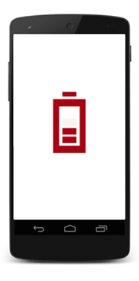

#### Create your first BusyIndicator in Xamarin.Android

This section provides a quick overview to work with the BusyIndicator in the Xamarin Studio. You can also set the requiredAnimationType to BusyIndicator and customize it according to your requirements. This example explains how to create theBusyIndicator with different AnimationTypes.

{:.image }

Reference Essential Studio components in your solution

After installing Essential Studio for Xamarin, you can find all the required assemblies in the installation folders,

{Syncfusion Installed location}\Essential Studio\13.1.0.21\lib

> 
{:.image }
_Note: Assemblies are available in unzipped package location in Mac_

Add the following assembly references to the Xamarin project.

 android\Syncfusion.SfBusyIndicator.Andriod.dll

To develop an application with the Xamarin BusyIndicator is simple. The following steps explain how to create and configure its properties.

Create an instance for the SfBusyIndicator in the constructor and set that BusyIndicator as content view of Activity.

[C#]

SfBusyIndicator sfBusyIndicator = new SfBusyIndicator(this);

setContentView(sfBusyIndicator);

Set the AnimationType to BusyIndicator

You can set the AnimationType to the BusyIndicator by using the property Animationtype and choose among 13 predefined animation types.

   SfBusyIndicator busyIndicator = new SfBusyIndicato(this);

   busyIndicator.AnimationType=AnimationTypes.Battery;

Set BusyIndicator Customizations

The BusyIndicator is customized by setting the properties as explained in the following code example.

  SfBusyIndicator busyIndicator = new SfBusyIndicator (this);

  busyIndicator.AnimationType=AnimationTypes.Battery;

   busyIndicator.ViewBoxHeight=100;

   busyIndicator.ViewBoxWidth=100;

   busyIndicator.TextColor=Color.RED;

   busyIndicator.Title=“Loading”;

   setContentView(busyIndicator);

