# Getting Started

## Create your first Circular Gauge in Xamarin.Android

You can configure an Essential Gauge for Xamarin Android in simple steps. In this section, you can learn how to configure a Circular Gauge control in a real-time scenario and also provides a walk-through on some of the customization features available in Circular Gauge control.

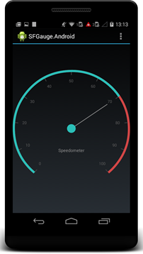

### Reference Essential Studio components in your solution

After installing Essential Studio for Xamarin, you can find all the required assemblies in the installation folders,

{< Installed location}\Essential Studio\12.4.0.24\lib

N> Assemblies are available in unzipped package location in Mac

Add the following assembly references to the Android project,

 [android\<.SfGauge.Andriod.dll]

### Add and configure the Gauge

Create a Circular Gauge instance in Main Activity and set Circular Gauge as a ContentView in onCreate() overridden method.


 
   

    public class MainActivity : Activity

    {

        protected override void OnCreate(Bundle bundle)

        {

            base.OnCreate(bundle);

            // creating new instance for circular Gauge

            SfCircularGauge circularGauge = new SfCircularGauge(this);

            SetContentView(circularGauge); 

        }

     }

 

   

### Insert a Scale to the Gauge

Now, add the scale to the Circular Gauge.


 
   

     // creating new instance for circular Gauge

            SfCircularGauge circularGauge = new SfCircularGauge(this);

            List<CircularScale> _circularScales = new List<CircularScale>();

            // adding  new CircularScale

            CircularScale circularScale = new CircularScale();

            circularScale.StartValue = 0;

            circularScale.EndValue = 100;

            circularScale.StartAngle =130;

            circularScale.SweepAngle =280 ;

            circularScale.RimWidth =10;

            circularScale.RimColor = Color.ParseColor("#D14646");

            circularScale.MinorTicksPerInterval = 2;

            circularScale.LabelOffset = 0.1;

            circularScale.Labe<extSize = 18;

            _circularScales.Add(circularScale);

            circularGauge.CircularScales =_circularScales;

            SetContentView(circularGauge); 

 

           

The following screenshot illustrates the output of the above code.

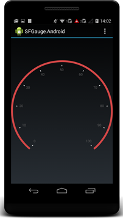

### Customize the ticks

You can customize the major and minor ticks using the Tick settings, as illustrated in the following code example.


 
   

    // creating new instance for circular Gauge

            SfCircularGauge circularGauge = new SfCircularGauge(this);

            List<CircularScale> _circularScales = new List<CircularScale>();

            // adding  new CircularScale

            CircularScale circularScale = new CircularScale();

            circularScale.StartValue = 0;

            circularScale.EndValue = 100;

            circularScale.StartAngle =130;

            circularScale.SweepAngle =280 ;

            circularScale.RimWidth =10;

            circularScale.RimColor = Color.ParseColor("#D14646");

            circularScale.MinorTicksPerInterval = 2;

            circularScale.LabelOffset = 0.1;

            circularScale.Labe<extSize = 18;

            //adding major ticks

            TickSetting majorTicksSettings = new TickSetting();

            majorTicksSettings.Color = Color.ParseColor("#444444");

            majorTicksSettings.Size = 15;

            majorTicksSettings.Offset = 0.04;

            circularScale.MajorTickSettings = majorTicksSettings ;

            //adding minor ticks

            TickSetting minorTicksSettings = new TickSetting();

            minorTicksSettings.Color = Color.Gray;

            circularScale.MinorTickSettings = minorTicksSettings ;

            _circularScales.Add(circularScale);

            circularGauge.CircularScales =_circularScales;

            SetContentView(circularGauge); 

 

            

 The following screenshot illustrates the output of the above code example.

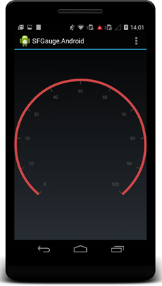

### Add Pointers to the Scale

Add needle and range pointers and associate them with a scale.


 
   

     // creating new instance for circular Gauge

            SfCircularGauge circularGauge = new SfCircularGauge(this);

            List<CircularScale> _circularScales = new List<CircularScale>();

            List<CircularPointer> _circularPointers = new List<CircularPointer>();

            // adding  new CircularScale

            CircularScale circularScale = new CircularScale();

            circularScale.StartValue = 0;

            circularScale.EndValue = 100;

            circularScale.StartAngle =130;

            circularScale.SweepAngle =280 ;

            circularScale.RimWidth =10;

            circularScale.RimColor = Color.ParseColor("#D14646");

            circularScale.MinorTicksPerInterval = 2;

            circularScale.LabelOffset = 0.1;

            circularScale.Labe<extSize = 18;

            //adding major ticks

            TickSetting majorTicksSettings = new TickSetting();

            majorTicksSettings.Color = Color.ParseColor("#444444");

            majorTicksSettings.Size = 15;

            majorTicksSettings.Offset = 0.04;

            circularScale.MajorTickSettings = majorTicksSettings ;

            //adding minor ticks

            TickSetting minorTicksSettings = new TickSetting();

            minorTicksSettings.Color = Color.Gray;

            circularScale.MinorTickSettings = minorTicksSettings ;

            // adding needle Pointer

            NeedlePointer needlePointer = new NeedlePointer();

            needlePointer.Value = 70;

            needlePointer.KnobColor = Color.ParseColor("#2BBFB8");

            needlePointer.KnobRadius =20;

            needlePointer.Type = NeedleType.Bar;

            needlePointer.LengthFactor = 0.8 ;

            needlePointer.Width = 3;

            needlePointer.Color = Color.Gray;

            _circularPointers.Add(needlePointer);

            // adding range Pointer

            RangePointer rangePointer = new RangePointer();

            rangePointer.Value = 70;

            rangePointer.Color = Color.ParseColor("#2BBFB8");

            rangePointer.Width = 10;

            _circularPointers.Add(rangePointer);

            circularScale.CircularPointers = _circularPointers;

            _circularScales.Add(circularScale);

            circularGauge.CircularScales =_circularScales; 

            SetContentView(circularGauge);

 

            

 The following screenshot illustrates the output of the above code example.

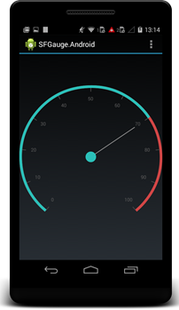

### Add Header to the Gauge

You can add custom labels in the gauge and position it.


 
   

    // creating new instance for circular Gauge

            SfCircularGauge circularGauge = new SfCircularGauge(this);

            List<CircularScale> _circularScales = new List<CircularScale>();

            List<CircularPointer> _circularPointers = new List<CircularPointer>();

            List<Header> _gaugeHeaders = new List<Header>();

            // adding  new CircularScale

            CircularScale circularScale = new CircularScale();

            circularScale.StartValue = 0;

            circularScale.EndValue = 100;

            circularScale.StartAngle =130;

            circularScale.SweepAngle =280 ;

            circularScale.RimWidth =10;

            circularScale.RimColor = Color.ParseColor("#D14646");

            circularScale.MinorTicksPerInterval = 2;

            circularScale.LabelOffset = 0.1;

            circularScale.Labe<extSize = 18;

            //adding major ticks

            TickSetting majorTicksSettings = new TickSetting();

            majorTicksSettings.Color = Color.ParseColor("#444444");

            majorTicksSettings.Size = 15;

            majorTicksSettings.Offset = 0.04;

            circularScale.MajorTickSettings = majorTicksSettings ;

            //adding minor ticks

            TickSetting minorTicksSettings = new TickSetting();

            minorTicksSettings.Color = Color.Gray;

            circularScale.MinorTickSettings = minorTicksSettings ;

            // adding needle Pointer

            NeedlePointer needlePointer = new NeedlePointer();

            needlePointer.Value = 70;

            needlePointer.KnobColor = Color.ParseColor("#2BBFB8");

            needlePointer.KnobRadius =20;

            needlePointer.Type = NeedleType.Bar;

            needlePointer.LengthFactor = 0.8 ;

            needlePointer.Width = 3;

            needlePointer.Color = Color.Gray;

            _circularPointers.Add(needlePointer);

            // adding range Pointer

            RangePointer rangePointer = new RangePointer();

            rangePointer.Value = 70;

            rangePointer.Color = Color.ParseColor("#2BBFB8");

            rangePointer.Width = 10;

            _circularPointers.Add(rangePointer);

            circularScale.CircularPointers = _circularPointers;

            _circularScales.Add(circularScale);

            circularGauge.CircularScales =_circularScales;

            //adding header

            Header circularGaugeHeader = new Header();

            circularGaugeHeader.Text = "Speedometer";

            circularGaugeHeader.TextColor = Color.Gray;

            circularGaugeHeader.Position = new PointF((float)0.4, (float)0.7);         

            circularGaugeHeader.TextSize = 20;

            _gaugeHeaders.Add(circularGaugeHeader);

            circularGauge.Headers = _gaugeHeaders;

            SetContentView(circularGauge); 

 

            

The following screenshot illustrates the output of the above code example.

## Create your first Circular Gauge in Xamarin.Forms

This section provides a quick overview for working with Essential Gauge for Xamarin.Forms and takes you on a walk-through along the entire process of creating a real world gauge.

You can also download the entire source code of this demo from the following link: [http://files2.syncfusion.com/Installs/v12.2.0.40/Samples/Xamarin/Gauge_GettingStarted.zip]([http://files2.syncfusion.com/Installs/v12.2.0.40/Samples/Xamarin/Gauge_GettingStarted.zip])

### Reference Essential Studio Components in your solution

When you acquire Essential Studio components through the Xamarin Component Store interface from your IDE, then after adding the components to your Xamarin.iOS, Xamarin.Android and WindowsPhone projects through the Component Manager, you need to manually reference the PCL (Portable Class Library) assemblies in the Xamarin.Forms PCL Project in your solution. You can do this by manually adding the relevant PCL assembly references to your PCL project contained in the following path inside your solution folder: 

Components/syncfusionessentialstudio-version/lib/pcl/

Alternatively when you download Essential Studio from Syncfusion.com or through the Xamarin Store web interface then all the assembly references need to be added manually.  

After installing Essential Studio for Xamarin, all the required assemblies can be found in the installation folders, typically:

{Syncfusion Installed location}\Essential Studio\12.2.0.40\lib

Example: C:\Program Files (x86)\Syncfusion\Essential Studio\12.2.0.40\lib

Otherwise, after downloading through the Xamarin Store web interface, all the required assemblies can be found in the following folder:

{download location}\syncfusionessentialstudio-version\lib

You can then add the assembly references to the respective projects as follows.

#### PCL project

XForms\Syncfusion. SfGauge.XForms.dll  

#### Android project

 Android\Syncfusion. SfGauge.Andriod.dll

Android\Syncfusion. SfGauge. XForms.Andriod.dll 

#### iOS project

iOS\Syncfusion. SfGauge.iOS.dll   

iOS\Syncfusion. SfGauge.XForms.iOS.dll

#### Windows Phone project

WinPhone\Syncfusion. SfGauge.WP8.dll

WinPhone\Syncfusion SfGauge.XForms.WinPhone.dll

N> Essential Gauge for Xamarin is compatible with Xamarin.Forms 1.2.3.6257.

Currently an additional step is required for Windows Phone and iOS projects. You need to create an instance of the Gauge custom renderer as mentioned as follows.

Create an instance of the SfGaugeRenderer in MainPage constructor in Windows Phone project as follows.


 
   

    public MainPage()

       	 {

           		 new SfGaugeRenderer ();

        		    ...    

     	}

 

  	 

Create an instance of the SfGaugeRenderer in FinishedLaunching overridden method of AppDelegate class in iOS Project as follows.

public override bool FinishedLaunching(UIApplication app, NSDictionary options)


 
   

    {

         		  ...

         		  new SfGaugeRenderer ();

        		   ...

       	 }	

 

        	

### Add and configure the gauge

The gauge control is configured entirely in C# code or using XAML markup.

Create an instance of SfCircularGauge.


 
  

    SfCircularGauge circularGauge = new SfCircularGauge();

 


 
   

<?xml version="1.0" encoding="UTF-8"?>
<ContentPage xmlns="http://xamarin.com/schemas/2014/forms"xmlns:gauge="clr-namespace:Syncfusion.SfGauge.XForms;assembly=Syncfusion.SfGauge.XForms"  xmlns:x="http://schemas.microsoft.com/winfx/2009/xaml" x:Class="GaugeGettingStarted.Sample">

<ContentPage.Content>
<gauge:SfCircularGauge>

  </gauge:SfCircularGauge>

</ContentPage.Content>
</ContentPage>

 

### Insert a Scale

The next step is to add one of more scales.


 
   

SfCircularGauge circularGauge = new SfCircularGauge();

// to add a scale

Scale scale = new Scale();

scale.StartValue = 0;

scale.EndValue = 100;

scale.Interval = 10;

scale.StartAngle = 135;

scale.SweepAngle = 270;

scale.RimThickness = 10;

scale.RimColor = Color.FromHex("#FB0101");

scale.MinorTicksPerInterval = 3;

scales.Add(scale);

 


 
    

<gauge:SfCircularGauge>

    <gauge:SfCircularGauge.Scales>

       <gauge:Scale StartValue="0"

                 EndValue="100" Interval="10"

                 StartAngle="135" SweepAngle="230" 

                 RimColor="#FFFB0101" RimThickness="10"  />

    </gauge:SfCircularGauge.Scales>

  </gauge:SfCircularGauge>

 

### Specify Ranges

You can improve the readability of data by including ranges that quickly show when values fall within specific ranges.


 
   

…

Range range = new Range();

range.StartValue = 0;

range.EndValue = 80;

range.Color = Color.FromHex("#FF777777");

range.Thickness = 10;

scale.Ranges.Add(range);

…

 


 
    

<gauge:SfCircularGauge>

    <gauge:SfCircularGauge.Scales>

      <gauge:Scale StartValue="0" EndValue="100"

                   Interval="10" StartAngle="135"

                   SweepAngle="230" RimColor="#FFFB0101"

                   RimThickness="10" >

        <gauge:Scale.Ranges>

             <gauge:Range StartValue="0" EndValue="80" Color="#FF777777" Thickness="15" />    

        </gauge:Scale.Ranges>

      </gauge:Scale>

    </gauge:SfCircularGauge.Scales>

  </gauge:SfCircularGauge>

 

### Add a Needle Pointer

You can create a needle pointer and associate it with a scale to display the current value.


 
   

…

NeedlePointer needlePointer = new NeedlePointer();

needlePointer.Value = 60;

needlePointer.Color = Color.White;

needlePointer.KnobColor = Color.White; 

needlePointer.Thickness = 5;

needlePointer.KnobRadius = 20;

needlePointer.LengthFactor = 0.8;

scale.Pointers.Add(needlePointer);  

…

 


 
    

  <gauge:SfCircularGauge>

    <gauge:SfCircularGauge.Scales>

      <gauge:Scale StartValue="0" EndValue="100"

                   Interval="10" StartAngle="135"

                   SweepAngle="230" RimColor="#FFFB0101"

                   RimThickness="10" >

        <gauge:Scale.Ranges>

             <gauge:Range StartValue="0" EndValue="80" Color="#FF777777" Thickness="15" />    

        </gauge:Scale.Ranges>

        <gauge:Scale.Pointers>

          <gauge:NeedlePointer Value="60" LengthFactor="0.8"

                               Color="White" Thickness="5" 

                               KnobColor="White" KnobRadius="20"  />

        </gauge:Scale.Pointers>

      </gauge:Scale>

    </gauge:SfCircularGauge.Scales>

  </gauge:SfCircularGauge>

 

### Add a Range Pointer

A range pointer provides an alternative way of indicating the current value.


 
  

...

RangePointer rangePointer = new RangePointer();

rangePointer.Value = 60;

rangePointer.Color = Color.FromHex("#FFA9A9A9");

rangePointer.Thickness = 10;

scale.Pointers.Add(rangePointer);

...

 


 
   

<gauge:SfCircularGauge>

    <gauge:SfCircularGauge.Scales>

      <gauge:Scale StartValue="0" EndValue="100"

                   Interval="10" StartAngle="135"

                   SweepAngle="230" RimColor="#FFFB0101"

                   RimThickness="10" >

        <gauge:Scale.Ranges>

             <gauge:Range StartValue="0" EndValue="80" Color="#FF777777" Thickness="15" />    

        </gauge:Scale.Ranges>

        <gauge:Scale.Pointers>

          <gauge:NeedlePointer Value="60" LengthFactor="0.8"

                               Color="White" Thickness="5" 

                               KnobColor="White" KnobRadius="20"  />

          <gauge:RangePointer Value="60" Color="White" 

                              Thickness="10" />

        </gauge:Scale.Pointers>

      </gauge:Scale>

    </gauge:SfCircularGauge.Scales>

  </gauge:SfCircularGauge>

 

<table>
<tr>
<td>
{{' 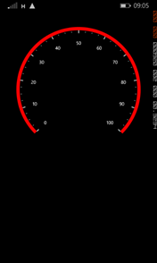' | markdownify }}
</td><td>
{{' 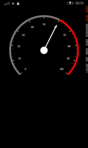' | markdownify }}
</td><td>
{{' 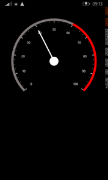' | markdownify }}
</td><td>
{{' 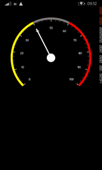' | markdownify }}
</td></tr>
</table>

## Create your first Circular Gauge in Xamarin.iOS

Essential Gauge for Xamarin iOS allows you to visualize numeric values over a circular scale. You can fully customize the appearance of the gauge to seamlessly integrate with your applications.

This section provides a quick overview for working with Essential Gauge for Xamarin iOS. It walks through the entire process of creating a real world gauge.

### Reference Essential Studio Components in your Solution

After installing Essential Studio for Xamarin, you can find all the required assemblies in the installation folders, typically:

{Syncfusion Installed location}\Essential Studio\{version number}\lib

N> You can find assemblies in unzipped package location in Mac.

You have to add the following assembly references to the Xamarin.iOS project.

 [iOS\Syncfusion.SfGauge.iOS.dll]

### Initialize the CircularGauge

Create a CircularGauge object in the UIViewController and add CircularGauge as SubView in ViewDidLoad override method.

You can create a CircularGauge object by using the following code example.


 
   

    public override void ViewDidLoad ()

{

base.ViewDidLoad ();

            // creating new instance for circular Gauge  

            SFCircularGauge _circularGauge = new SFCircularGauge();

            View.AddSubview(_circularGauge);

View.BackgroundColor = UIColor.Black;

}

 

### Insert a Scale to the Gauge

Next, add one of more scales.


 
   

    // creating new instance for circular Gauge  

            SFCircularGauge _circularGauge = new SFCircularGauge();

            //adding new Scale

            NSMutableArray scales = new NSMutableArray();

            SFCircularScale scale = new SFCircularScale();

            scale.StartValue = 0;

            scale.EndValue = 100;

            scale.StartAngle = 40;

            scale.SweepAngle = 320;

            scale.RimWidth = 6;

            scale.Interval = 10;

            scale.ShowTicks = true;

            scale.RimColor = UIColor.FromRGBA(0.82f, 0.275f, 0.275f, 1f);/*#d14646*/

            scale.MinorTicksPerInterval = 0;

            scale.LabelOffset = 0.1f;

            _circularGauge.Scales.Add(scale);

            View.AddSubview(_circularGauge);

        	View.BackgroundColor = UIColor.Black;

 

            

 The following screenshot illustrates the output of the above code.

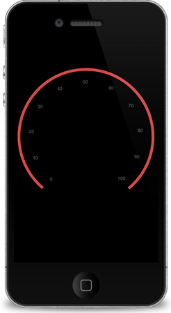

### Customize the ticks

You can customize the major and minor ticks using the Tick settings as follows.


 
   

    // creating new instance for circular Gauge  

            SFCircularGauge _circularGauge = new SFCircularGauge();

            //adding new Scale

            NSMutableArray scales = new NSMutableArray();

            SFCircularScale scale = new SFCircularScale();

            scale.StartValue = 0;

            scale.EndValue = 100;

            scale.StartAngle = 40;

            scale.SweepAngle = 320;

            scale.RimWidth = 6;

            scale.Interval = 10;

            scale.ShowTicks = true;

            scale.RimColor = UIColor.FromRGBA(0.82f, 0.275f, 0.275f, 1f);/*#d14646*/

            scale.MinorTicksPerInterval = 0;

            scale.LabelOffset = 0.1f;

            //adding major ticks

            SFTickSettings majorTickSettings = new SFTickSettings();

            majorTickSettings.Color = UIColor.FromRGBA(0.267f, 0.267f, 0.267f, 1f); /*#444444*/;

            majorTickSettings.Size = 7;

            majorTickSettings.Offset = 0.041f;

            majorTickSettings.Width = 1.5f;

            scale.MajorTickSettings = majorTickSettings;

            //adding minor ticks

            SFTickSettings minorTicksSettings = new SFTickSettings();

            minorTicksSettings.Color = UIColor.FromRGBA(0.267f, 0.267f, 0.267f, 1); /*#444444*/

            minorTicksSettings.Size = 8;

            minorTicksSettings.Offset = 0.5f;

            scale.MinorTickSettings = minorTicksSettings;

            _circularGauge.Scales.Add(scale);

            View.AddSubview(_circularGauge);

       	View.BackgroundColor = UIColor.Black;

 

            

 The following screenshot illustrates the output of the above code.

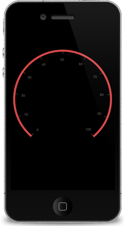

### Add Pointers to the Scale

Now, add needle pointer and range pointer and associate it with a scale.


 
   

          // creating new instance for circular Gauge  

            SFCircularGauge _circularGauge = new SFCircularGauge();

            //adding new Scale

            NSMutableArray scales = new NSMutableArray();

            SFCircularScale scale = new SFCircularScale();

            scale.StartValue = 0;

            scale.EndValue = 100;

            scale.StartAngle = 40;

            scale.SweepAngle = 320;

            scale.RimWidth = 6;

            scale.Interval = 10;

            scale.ShowTicks = true;

            scale.RimColor = UIColor.FromRGBA(0.82f, 0.275f, 0.275f, 1f);/*#d14646*/

            scale.MinorTicksPerInterval = 0;

            scale.LabelOffset = 0.1f;

            //adding major ticks

            SFTickSettings majorTickSettings = new SFTickSettings();

            majorTickSettings.Color = UIColor.FromRGBA(0.267f, 0.267f, 0.267f, 1f); /*#444444*/;

            majorTickSettings.Size = 7;

            majorTickSettings.Offset = 0.041f;

            majorTickSettings.Width = 1.5f;

            scale.MajorTickSettings = majorTickSettings;

            //adding minor ticks

            SFTickSettings minorTicksSettings = new SFTickSettings();

            minorTicksSettings.Color = UIColor.FromRGBA(0.267f, 0.267f, 0.267f, 1); /*#444444*/

            minorTicksSettings.Size = 8;

            minorTicksSettings.Offset = 0.5f;

            scale.MinorTickSettings = minorTicksSettings;

            //adding needle pointer

            SFNeedlePointer needlePointer = new SFNeedlePointer();

            needlePointer.Value = 70;

            needlePointer.KnobColor = UIColor.FromRGBA(0.169f, 0.749f, 0.722f, 1f); /*#2bbfb8*/;

            needlePointer.KnobRadius = 12;

            needlePointer.PointerType = PointerType.Bar;

            needlePointer.Width = 2;

            needlePointer.LengthFactor = 0.7f;

            needlePointer.Color = UIColor.Gray;

            scale.Pointers.Add(needlePointer);

            //adding range pointer

            SFRangePointer rangePointer = new SFRangePointer();

            rangePointer.Value = 70;

            rangePointer.Width = 6;

            rangePointer.Color = UIColor.FromRGBA(0.169f, 0.749f, 0.722f, 1); /*#2bbfb8*/;

            scale.Pointers.Add(rangePointer);

            _circularGauge.Scales.Add(scale);

            View.AddSubview(_circularGauge);

View.BackgroundColor = UIColor.Black;

 

                      

 The following screenshot illustrates the output of the above code.

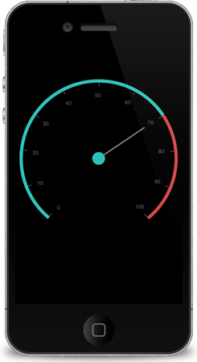

### Add Header to the Gauge

You can add custom labels in the gauge and position it.


 
   

     // creating new instance for circular Gauge  

            SFCircularGauge _circularGauge = new SFCircularGauge();

            //adding new Scale

            NSMutableArray scales = new NSMutableArray();

            SFCircularScale scale = new SFCircularScale();

            scale.StartValue = 0;

            scale.EndValue = 100;

            scale.StartAngle = 40;

            scale.SweepAngle = 320;

            scale.RimWidth = 6;

            scale.Interval = 10;

            scale.ShowTicks = true;

            scale.RimColor = UIColor.FromRGBA(0.82f, 0.275f, 0.275f, 1f);/*#d14646*/

            scale.MinorTicksPerInterval = 0;

            scale.LabelOffset = 0.1f;

            //adding major ticks

            SFTickSettings majorTickSettings = new SFTickSettings();

            majorTickSettings.Color = UIColor.FromRGBA(0.267f, 0.267f, 0.267f, 1f); /*#444444*/;

            majorTickSettings.Size = 7;

            majorTickSettings.Offset = 0.041f;

            majorTickSettings.Width = 1.5f;

            scale.MajorTickSettings = majorTickSettings;

            //adding minor ticks

            SFTickSettings minorTicksSettings = new SFTickSettings();

            minorTicksSettings.Color = UIColor.FromRGBA(0.267f, 0.267f, 0.267f, 1); /*#444444*/

            minorTicksSettings.Size = 8;

            minorTicksSettings.Offset = 0.5f;

            scale.MinorTickSettings = minorTicksSettings;

            //adding needle pointer

            SFNeedlePointer needlePointer = new SFNeedlePointer();

            needlePointer.Value = 70;

            needlePointer.KnobColor = UIColor.FromRGBA(0.169f, 0.749f, 0.722f, 1f); /*#2bbfb8*/;

            needlePointer.KnobRadius = 12;

            needlePointer.PointerType = PointerType.Bar;

            needlePointer.Width = 2;

            needlePointer.LengthFactor = 0.7f;

            needlePointer.Color = UIColor.Gray;

            scale.Pointers.Add(needlePointer);

            //adding range pointer

            SFRangePointer rangePointer = new SFRangePointer();

            rangePointer.Value = 70;

            rangePointer.Width = 6;

            rangePointer.Color = UIColor.FromRGBA(0.169f, 0.749f, 0.722f, 1); /*#2bbfb8*/;

            scale.Pointers.Add(rangePointer);

            _circularGauge.Scales.Add(scale);

            //adding  new header

            SFGaugeHeader header = new SFGaugeHeader();

            header.Text = (NSString)"Speedometer";

            header.TextColor = UIColor.Gray;

            header.Position = new CGPoint(140, 250);

            _circularGauge.Headers.Add(header);

            View.AddSubview(_circularGauge);

View.BackgroundColor = UIColor.Black;

 

           

 The following screenshot illustrates the output of the above code.

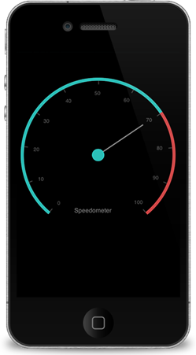

