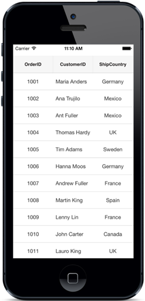
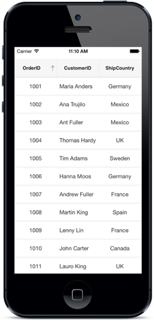
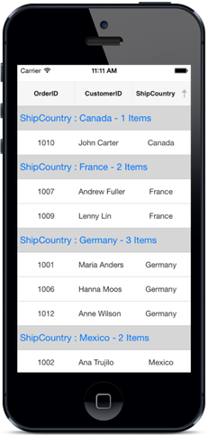

# Create you first DataGrid in Xamarin.iOS

This section explains how to create a DataGrid and configure it.

1. Create new iOS application in XamarinStudio.
2. Now, create a simple data source as shown in the following code example. Add the following code example in a newly created class file and save it as OrderInfo.cs file.

   ~~~ cs

        [C#]

            public class OrderInfo
            {
                private int orderID;
                private string customerID;
                private string customer;
                private string shipCity;
                private string shipCountry;

                public int OrderID {
                get { return orderID; }
                set { this.orderID = value; }
                }

                public string CustomerID {
                get { return customerID; }
                set { this.customerID = value; }
                }

                public string ShipCountry {
                get { return shipCountry; }
				set { this.shipCountry = value; }
				}
				
				public string Customer {
				get { return this.customer; }
				set { this.customer = value; }
				}
				
				public string ShipCity {
				get { return shipCity; }
				set { this.shipCity = value; }
				}
				
				public OrderInfo (int orderId, string customerId, string country, string customer, string shipCity)
				{
				    this.OrderID = orderId;
				    this.CustomerID = customerId;
					this.Customer = customer;
					this.ShipCountry = country;
					this.ShipCity = shipCity;
				}	  
            } 
	
   ~~~
   {:.pretty-print }

3. Add the following code example in a newly created class file and save it as OrderInfoRepositiory.cs file.

   ~~~ cs

        [C#]

            public class OrderInfoRepository
			{
			    private ObservableCollection<OrderInfo> orderInfo;
				public ObservableCollection<OrderInfo> OrderInfoCollection {
				get { return orderInfo; }
				set { this.orderInfo = value; }
			}
			public OrderInfoRepository ()
			{
			    orderInfo = new ObservableCollection<OrderInfo> ();
				this.GenerateOrders ();
			}
			private void GenerateOrders ()
			{
			    orderInfo.Add (new OrderInfo (1001, "Maria Anders", "Germany", "ALFKI", "Berlin"));
				orderInfo.Add (new OrderInfo (1002, "Ana Trujilo", "Mexico", "ANATR", "México D.F."));
				orderInfo.Add (new OrderInfo (1003, "Ant Fuller", "Mexico", "ANTON", "México D.F."));
				orderInfo.Add (new OrderInfo (1004, "Thomas Hardy", "UK", "AROUT", "London"));
				orderInfo.Add (new OrderInfo (1005, "Tim Adams", "Sweden", "BERGS", "Luleå"));
				orderInfo.Add (new OrderInfo (1006, "Hanna Moos", "Germany", "BLAUS", "Mannheim"));
				orderInfo.Add (new OrderInfo (1007, "Andrew Fuller", "France", "BLONP", "Strasbourg"));
				orderInfo.Add (new OrderInfo (1008, "Martin King", "Spain", "BOLID", "Madrid"));
				orderInfo.Add (new OrderInfo (1009, "Lenny Lin", "France", "BONAP", "Marseille"));
				orderInfo.Add (new OrderInfo (1010, "John Carter", "Canada", "BOTTM", "Tsawassen"));
				orderInfo.Add (new OrderInfo (1011, "Lauro King", "UK", "AROUT", "London"));
				orderInfo.Add (new OrderInfo (1012, "Anne Wilson", "Germany", "BLAUS", "Mannheim"));
			}
			} 
	
   ~~~
   {:.pretty-print }

4. You can set the data source of the DataGrid by using the SfDataGrid.ItemsSource property as follows.

   ~~~ cs

        [C#]

            public partial class GettingStartedViewController : UIViewController
			{
			    SfDataGrid sfGrid;
				
				static bool UserInterfaceIdiomIsPhone {
				    get { return UIDevice.CurrentDevice.UserInterfaceIdiom == UIUserInterfaceIdiom.Phone; }
				}
				
				public GettingStartedViewController ()
				    : base (UserInterfaceIdiomIsPhone ? "GettingStartedViewController_iPhone" : "GettingStartedViewController_iPad", null)
				{
				    sfGrid = new SfDataGrid ();
					sfGrid.ItemsSource = (new OrderInfoRepository ().OrderInfoCollection);
					sfGrid.HeaderRowHeight = 45;
					sfGrid.RowHeight = 45;
				}
				
				public override void ViewDidLoad ()
				{
				    base.ViewDidLoad ();
					sfGrid.Frame = new CGRect (0, 30, View.Frame.Width, View.Frame.Height);
					View.AddSubview (sfGrid);
				}
			} 
	
   ~~~
   {:.pretty-print }

5. By default, the Essential DataGrid for iOS automatically creates columns for all the properties in the data source. 
6. Run the application to render the following output.

   

7. You can also define the columns manually by setting the SfDataGrid.AutoGenerateColumns property to false and add the GridColumn objects to the SfDataGrid.Columns collection. The following code example illustrates this. 

   ~~~ cs

        [C#]

            sfGrid.AutoGenerateColumns = false;
			
			GridTextColumn orderIdColumn = new GridTextColumn ();
			orderIdColumn.MappingName = "OrderID";
			orderIdColumn.HeaderText = "Order ID";
			
			GridTextColumn customerIdColumn = new GridTextColumn ();
			customerIdColumn.MappingName = "CustomerID";
			customerIdColumn.HeaderText = "Customer ID";
			
			GridTextColumn customerColumn = new GridTextColumn ();
			customerColumn.MappingName = "Customer";
			customerColumn.HeaderText = "Customer";
			
			GridTextColumn countryColumn = new GridTextColumn ();
			countryColumn.MappingName = "ShipCountry";
			countryColumn.HeaderText = "Ship Country";
			
			sfGrid.Columns.Add (orderIdColumn);
			sfGrid.Columns.Add (customerIdColumn);
			sfGrid.Columns.Add (customerColumn);
			sfGrid.Columns.Add (countryColumn); 
	
   ~~~
   {:.pretty-print }

8. Essential DataGrid for iOS allows you to apply sorting on its data by setting AllowSorting to true. The following code illustrates this.

   ~~~ cs

        [C#]

            sfGrid.AllowSorting = true; 
   ~~~
   {:.pretty-print }

9. Run the application and touch the header cell to sort the data and the following output is displayed. 

   

10. You can also specify the column to be sorted from the code behind by adding the column to the SfDataGrid.SortColumnDescriptions collection. The following code illustrates this.

    ~~~ cs

        [C#]

            sfGrid.SortColumnDescriptions.Add (new SortColumnDescription () { ColumnName = "OrderID" });
	
	~~~
    {:.pretty-print }

11. Essential DataGrid for iOS allows you to group a column by adding the column to the SfDataGrid.GroupColumnDescriptions collection. Following code example illustrates this.

    ~~~ cs

        [C#]

            sfGrid.GroupColumnDescriptions.Add (new GroupColumnDescription (){ ColumnName = "ShipCountry" }); 
	
	~~~
    {:.pretty-print }

12. Run the application to render the following output.

    

13. Essential DataGrid for iOS allows you to filter the records in the view by using the SfDataGrid.View.Filter property. You have to call SfDataGrid.View.RefreshFilter() method after assigning the Filter property for the records to get filtered in view. The following code example illustrates this.

    ~~~ cs

        [C#]

            _//Create an EditText in the layout and assign its text to a property. When the property gets changed, run the below code for filtering the view._

            if (sfGrid.View != null) {
			this.sfGrid.View.Filter = viewModel.FilerRecords;
			this.sfGrid.View.RefreshFilter ();
			}
			
			_//create a method FilterRecords in the viewModel_
			public bool FilerRecords (object orderInfo)
			{
			
			_//your code_
			
			_//For Example_
			
			var order = orderInfo as OrderInfo;
			if (order.CustomerID.Contains ("An"))
			return true;
			false;
			} 
	
    ~~~
    {:.pretty-print }

