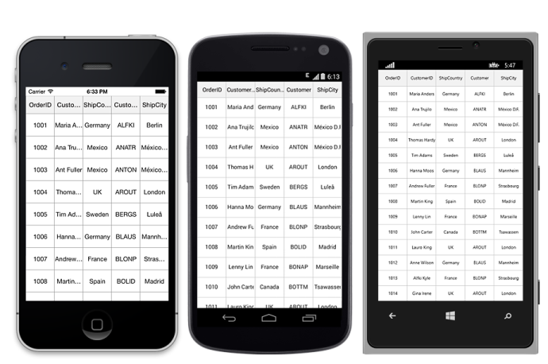
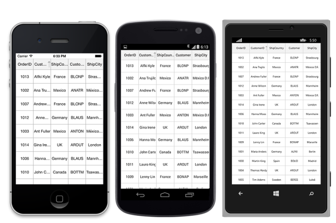
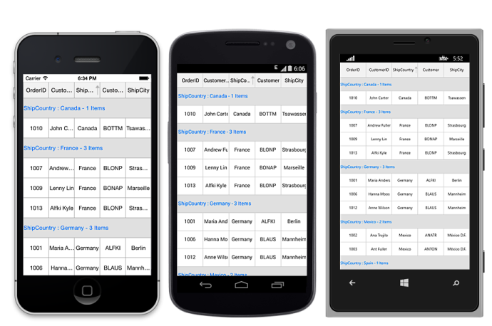

#### Create your first DataGrid in Xamarin.Forms

This section explains how to create a DataGrid and configure it. The DataGrid control can be configured entirely in C# code or by using XAML markup.

1. Create a new BlankApp (Xamarin.Forms.Portable) application in XamarinStudio or Visual Studio.
2. Now, create a simple DataSource as shown in the following code example. Add the following code example in a newly created class file and save it as OrderInfo.cs file.



public class OrderInfo
{
    private int orderID;
    private string customerID;
    private string customer;
    private string shipCity;
    private string shipCountry;

    public int OrderID {
        get { return orderID; }
        set { this.orderID = value; }
    }

    public string CustomerID {
        get { return customerID; }
        set { this.customerID = value; }
    }

    public string ShipCountry {
        get { return shipCountry; }
        set { this.shipCountry = value; }
    }

    public string Customer {
        get { return this.customer; }
        set { this.customer = value; }
    }

    public string ShipCity {
        get { return shipCity; }
        set { this.shipCity = value; }
    }

    public OrderInfo (int orderId, string customerId, string country, string customer, string shipCity)
    {
        this.OrderID = orderId;
        this.CustomerID = customerId;
        this.Customer = customer;
        this.ShipCountry = country;
        this.ShipCity = shipCity;
    }
} 



3. Add the following code example in the newly created class file and save it as OrderInfoRepositiory.cs file.



public class OrderInfoRepository
{
    private ObservableCollection<OrderInfo> orderInfo;
    public ObservableCollection<OrderInfo> OrderInfoCollection {
        get { return orderInfo; }
        set { this.orderInfo = value; }
    }
    public OrderInfoRepository ()
    {
        orderInfo = new ObservableCollection<OrderInfo> ();
        this.GenerateOrders ();
    }
    private void GenerateOrders ()
    {
        orderInfo.Add (new OrderInfo (1001, "Maria Anders", "Germany", "ALFKI", "Berlin"));
        orderInfo.Add (new OrderInfo (1002, "Ana Trujilo", "Mexico", "ANATR", "México D.F."));
        orderInfo.Add (new OrderInfo (1003, "Ant Fuller", "Mexico", "ANTON", "México D.F."));
        orderInfo.Add (new OrderInfo (1004, "Thomas Hardy", "UK", "AROUT", "London"));
        orderInfo.Add (new OrderInfo (1005, "Tim Adams", "Sweden", "BERGS", "Luleå"));
        orderInfo.Add (new OrderInfo (1006, "Hanna Moos", "Germany", "BLAUS", "Mannheim"));
        orderInfo.Add (new OrderInfo (1007, "Andrew Fuller", "France", "BLONP", "Strasbourg"));
        orderInfo.Add (new OrderInfo (1008, "Martin King", "Spain", "BOLID", "Madrid"));
        orderInfo.Add (new OrderInfo (1009, "Lenny Lin", "France", "BONAP", "Marseille"));
        orderInfo.Add (new OrderInfo (1010, "John Carter", "Canada", "BOTTM", "Tsawassen"));
        orderInfo.Add (new OrderInfo (1011, "Lauro King", "UK", "AROUT", "London"));
        orderInfo.Add (new OrderInfo (1012, "Anne Wilson", "Germany", "BLAUS", "Mannheim"));

        orderInfo.Add (new OrderInfo (1013, "Alfki Kyle", "France", "BLONP", "Strasbourg"));
        orderInfo.Add (new OrderInfo (1014, "Gina Irene", "UK", "AROUT", "London"));
    }
} 



4. You can set the Data Source of the DataGrid by using the SfDataGrid.ItemsSource property as follows.



[C#]

public class App : Application

{

    SfDataGrid sfGrid;

    public App()

    {

        sfGrid = new SfDataGrid();

        sfGrid.ItemsSource = new OrderInfoRepository().OrderInfoCollection;

        MainPage = new ContentPage { Content = sfGrid; };

    }

}





[XAML]

xmlns:sfgrid="clr-namespace:Syncfusion.SfDataGrid.XForms;assembly=Syncfusion.SfDataGrid.XForms"

<sfgrid:SfDataGrid x:Name="dataGrid"
                   ItemsSource="{Binding OrderInfoCollection}" /> 



5. By default, the Essential DataGrid for Xamarin.Forms automatically creates columns for all the properties in the DataSource. 
6. Run the application to render the following output.

{:.image }

7. You can also define the columns manually by setting the SfDataGrid.AutoGenerateColumns property to false and by adding the GridColumn objects to the SfDataGrid.Columns collection. The following code example illustrates this. 



[C#]

sfGrid.AutoGenerateColumns = false;

GridTextColumn orderIdColumn = new GridTextColumn ();
orderIdColumn.MappingName = "OrderID";
orderIdColumn.HeaderText = "Order ID";

GridTextColumn customerIdColumn = new GridTextColumn ();
customerIdColumn.MappingName = "CustomerID";
customerIdColumn.HeaderText = "Customer ID";

GridTextColumn customerColumn = new GridTextColumn ();
customerColumn.MappingName = "Customer";
customerColumn.HeaderText = "Customer";

GridTextColumn countryColumn = new GridTextColumn ();
countryColumn.MappingName = "ShipCountry";
countryColumn.HeaderText = "Ship Country";

sfGrid.Columns.Add (orderIdColumn);
sfGrid.Columns.Add (customerIdColumn);
sfGrid.Columns.Add (customerColumn);
sfGrid.Columns.Add (countryColumn); 





[XAML]

<sfgrid:SfDataGrid.Columns x:TypeArguments="sfgrid:Columns">

    <sfgrid:GridTextColumn HeaderText="Order ID" MappingName="OrderID" />
    <sfgrid:GridTextColumn HeaderText="Customer ID" MappingName="CustomerID" />
    <sfgrid:GridTextColumn MappingName="Customer" />
    <sfgrid:GridTextColumn HeaderText="Ship Country" MappingName="ShipCountry" />

</sfgrid:SfDataGrid.Columns> 



8. Essential DataGrid for Xamarin.Forms allows you to sort its data by setting AllowSorting to true. The following code illustrates this.



[C#]

sfGrid.AllowSorting = true; 





[XAML]

<sfgrid:SfDataGrid AllowSorting="True" />



9. Run the application and touch the header cell to sort the data and the following output is displayed. 

{:.image }

10. You can also specify the column to be sorted from the code behind by adding the column to the SfDataGrid.SortColumnDescriptions collection. The following code illustrates this.



[C#]

sfGrid.SortColumnDescriptions.Add (new SortColumnDescription () { ColumnName = "CustomerID" });





[XAML]

<sfgrid:SfDataGrid.SortColumnDescriptions>
    <sfgrid:SortColumnDescription ColumnName="CustomerID" />
</sfgrid:SfDataGrid.SortColumnDescriptions> 



11. Essential DataGrid for Xamarin.Forms allows you to group a column by adding the column to the SfDataGrid.GroupColumnDescriptions collection. The following code example illustrates this.



[C#]

sfGrid.GroupColumnDescriptions.Add (new GroupColumnDescription () { ColumnName = "ShipCountry" });





[XAML]

<sfgrid:SfDataGrid.GroupColumnDescriptions>
    <sfgrid:GroupColumnDescription ColumnName="ShipCountry" />
</sfgrid:SfDataGrid.GroupColumnDescriptions> 



12. Run the application to render the following output.

{:.image }

13. Essential DataGrid for Xamarin.Forms allows you to filter the records in the view by using the SfDataGrid.View.Filter property. You have to call the SfDataGrid.View.RefreshFilter() method after assigning the Filter property for the records to get filtered in view. The following code example illustrates this.



//Create a SearchBar in the layout and assign its text to a property. When the property gets changed, run the following code for filtering the view. 

if (sfGrid.View != null) {
    this.sfGrid.View.Filter = viewModel.FilerRecords;
    this.sfGrid.View.RefreshFilter ();
} 

//Create a method FilterRecords in the viewModel.

public bool FilerRecords (object orderInfo)
{
    //Your code.

    //For Example.
    var order = orderInfo as OrderInfo;
    if (order.CustomerID.Contains ("An"))
        return true;
    false;
} 



