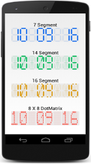

#### Create your first Digital Gauge in Xamarin.Android

This section provides a quick overview for working with the Essential Digital Gauge for Xamarin Android. It guides you to the entire process of creating a real-world chart. You can how to create a Digital Gauge to display the time similar to a digital clock with different Character Types.

{:.image }

Reference Essential Studio components in your solution

When the Essential Studio for Xamarin is installed, all the required assemblies can be found in the installation folders: {Syncfusion Installed location}\Essential Studio\13.1.0.21\lib

> 
{:.image }
_Note: Assemblies are available in unzipped package location in Mac._

Add the following assembly references to the Android project.

 android\Syncfusion.SfDigitalGauge.Andriod.dll

Create a Digital Gauge

To develop an application with the XamarinAndroid Digital Gauge is simple. 

Create an instance for the SfDigitalGauge in the constructor and set the Digital Gauge as the content view of Activity.

SfDigitalGauge digitalGauge1 = new SfDigitalGauge(this);

SetContentView (digitalGauge1);

Add values to display

You can set the value for the gauge by using the setValue() in the Digital Gauge. It can be Alphabet, Numbers, or Special Characters.

 SimpleDateFormat sdf = new SimpleDateFormat("HH mm ss");
string currentDateandTime = sdf.Format(new Date()); 

//Sets the gauge value.

digitalGauge1.Value = currentDateandTime;

 The above code example explains how the values are assigned to the Digital Gauge. You can obtain the Time by using the SimpleDateFormat and that is assigned to the Digital Gauge. 

Set Digital Gauge customizations

The Digital Gauge is customized by setting the properties as explained in the following code example.

//Sets the character stroke color.

digitalGauge1. CharacterStroke = Color.Rgb(20,108,237);

//Sets the character height.

digitalGauge1. CharacterHeight = 25 ;

//Sets the character spacing.

digitalGauge1. CharactersSpacing = 2;

//Sets the character width.

digitalGauge1. CharacterWidth = 12;

//Sets the segment stroke width.

digitalGauge1. SegmentStrokeWidth = 2;

//Sets the character type to be displayed.

digitalGauge1. CharacterType = CharacterTypes.SegmentSeven; 

To add multiple Digital Gauges

You can add Multiple Gauges in the preferred layout. The following code example explains how Multiple Gauges are added by using the LinearLayout.

LinearLayout layout = new LinearLayout(this);

layout. Orientation = Orientation.Vertical;

layout.AddView(digitalGauge1);

layout.AddView(digitalGauge1);

layout.AddView(digitalGauge1);

layout.AddView(digitalGauge1);

layout. SetGravity(GravityFlags.Center);

{:.image }

