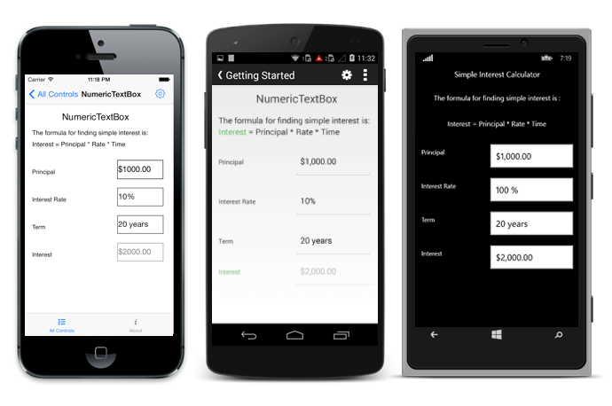

#### Create your first NumericTextBox in Xamarin.Forms

This section provides a quick overview for working with the Essential NumericTextBox for Xamarin.Forms.

Add Syncfusion assembly reference

Add the required Syncfusionassembly references to the respective projects as follows. Refer to the following installed location for the required assemblies:

{Syncfusion Installed location}\Essential Studio\(version)\lib

Example: C:\Program Files (x86)\Syncfusion\Essential Studio\(version)\lib

PCL project

XForms\Syncfusion.SfNumericTextBox.XForms.dll 

Android project

Android\Syncfusion.SfNumericTextBox.Andriod.dll

Android\Syncfusion.SfNumericTextBox.XForms.Andriod.dll

iOS project

iOS\Syncfusion.SfNumericTextBox.iOS.dll  

iOS\Syncfusion.SfNumericTextBox.XForms.iOS.dll

Windows Phone project

WinPhone\Syncfusion. SfInput.WP8.dll

WinPhone\Syncfusion.SfNumericTextBox.XForms.WinPhone.dll

WinPhone\Syncfusion. SfShared.WP8.dll

{:.image }
_Note: Essential_ NumericTextBox _for Xamarin is compatible with Xamarin Forms 1.3._

An additional step is required for Windows Phone and iOS projects. Create an instance of the SfNumericTextBoxRenderer in the MainPage constructor in Windows Phone project as follows.

public MainPage()

       	 {

           		 new SfNumericTextBoxRenderer ();

        		    ...    

     	}

Create an instance of the SfNumericTextBoxRenderer in the FinishedLaunching overridden method of the AppDelegate class in the iOS Project as follows.

public override bool FinishedLaunching(UIApplication app, NSDictionary options)

        	{

         		  ...

         		  new SfNumericTextBoxRenderer ();

        		   ...

       	 }

Create a NumericTextBox

The NumericTextBox control is configured entirely in the C# code or by using the XAML markup.

Create an instance of the SfNumericTextBox.

[C#]

// Update App.cs source in this file.

using Syncfusion.XForms.SfNumericTextBox;

…

…

public class App : Application
    {
        public App()
        {
            MainPage = new NumericTextBoxPage ();
        }

    }

public class NumericTextBoxPage : ContentPage

{
        SfNumericTextBox sfnumerictextbox;
        public NumericTextBoxPage ()
        {
            sfnumerictextbox = new SfNumericTextBox();

        }

}

[XAML]

Use this in App.CS source.

&lt;?xml version="1.0" encoding="UTF-8"?&gt;
&lt;ContentPage xmlns="http://xamarin.com/schemas/2014/forms" BackgroundColor="White" xmlns:x="http://schemas.microsoft.com/winfx/2009/xaml" x:Class="NumericTextBoxGettingStarted.NumericTextBoxPage" xmlns:syncfusion="clr-namespace:Syncfusion.SfNumericTextBox.XForms;assembly=Syncfusion.SfNumericTextBox.XForms"&gt;
    &lt;ContentPage.Content&gt;
            &lt;syncfusion:SfNumericTextBox /&gt;
    &lt;/ContentPage.Content&gt;
&lt;/ContentPage&gt; &lt;/ContentPage.Content&gt;
&lt;/ContentPage&gt;

Configure the NumericTextBox

Add the NumericTextBox properties in your application.

[C#]

SfNumericTextBox sfnumerictextbox = new SfNumericTextBox();
sfnumerictextbox.Value= 1000;
sfnumerictextbox.FormatString= “c”;

sfnumerictextbox.AllowNull= true;
sfnumerictextbox.MaximumNumberDecimalDigits= 2;

[XAML]

&lt;syncfusion:SfNumericTextBox HeightRequest="100"  Value="1000"  Orientation="Horizontal" WidthRequest="200" FormatString=”C” AllowNull=”true” MaximumNumberDecimalDigits=”2”&gt;
        &lt;/syncfusion:SfNumericTextBox&gt;

The following screenshot shows the NumericTextBox in cross platforms.

{:.image }

