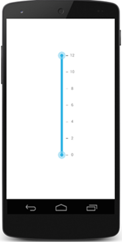

## Create your first RangeSlider in Xamarin

This section encompasses how to create the RangeSlider that lets you to choose values over a high interactive way. In this instance, how to create a RangeSlider and to use its several features are demonstrated.

### Reference Essential Studio components in your solution

After installing Essential StudioforXamarin, you can find all the required assemblies in the following installated folders,

{Syncfusion Installed location}\Essential Studio\13.1.0.21\lib

>
_Note: Assemblies are available in unzipped package location in Mac_

Add the following assembly references to the Xamarin project,

android\Syncfusion.SfRangeSlider.Andriod.dll

#### Create a Rangeslider

To develop an application with the Xamarin RangeSlider is simple. The following steps explain how to create and configure its properties.

1. Create an instance for the SfRangeslider in the constructor and set that SfRangeslider as content view of Activity.



SfRangeslider range = new SfRangeSlider (this); 
setContentView(range);

 

### Add values and scale

You can set the minimum and maximum values for the slider by using the Minimum and Maximum properties in the RangeSlider. It can be Numerical values.



        range.Minimum=0;

        range.Maximum=24;       

        range.RangeEnd=20;

        range.RangeStart=4;

        range.ShowRange=true;

        range.Orientation=Orientation.Horizontal;

 

The above code example illustrates the minimum and maximum values for the slider. Similarly, RangeStart and RangeEnd is used to set the start range and end range values when you use dual thumb. The ShowRange property is used to switch between a single thumb and double thumb. The orientation property sets the type of orientation.

Add Ticks and Labels for the RangeSlider

The ticks can be set by setting the TickFrequency and TickPlacement. Similarly, value labels is set by setting the ShowValueLabel property to true. The position of label can be varied by the LabelPlacement property.



     range.TickFrequency=4;

     range.ShowValueLabel=true;  

     range.ValuePlacement=ValuePlacement.TopLeft;

     range.TickPlacement=TickPlacement.BottomRight;

 

The above code example illustrates on setting the Tick and LabelPlacements. The TickFrequency determines the interval between the ticks.

Add Snapping type for RangeSlider

The movement of the thumb can be varied in different ways. This is achieved by setting the SnapsTo property.



range.SnapsTo=SnapsTo.Ticks;

range.StepFrequency=6;

 

The movement of the thumb is based on the Ticks / StepFrequency / none. When it is set to Tick, the Thumb is moved to next / nearby tick and on setting to none,Thumb is moved independently.

