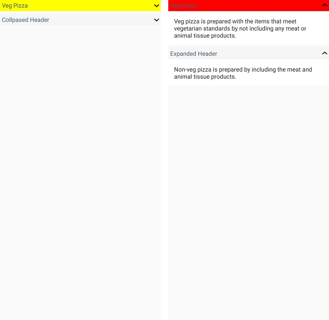

# Appearance

The Expander allows customizing appearance of the Icon, and provides various functionalities to the end-user.

## Header icon position 

The [SfExpander](https://help.syncfusion.com/cr/cref_files/xamarin/Syncfusion.Expander.XForms~Syncfusion.XForms.Expander.SfExpander.html) allows to customize the position of the header icon by using [HeaderIconPosition](https://help.syncfusion.com/cr/cref_files/xamarin/Syncfusion.Expander.XForms~Syncfusion.XForms.Expander.SfExpander~HeaderIconPosition.html) property. By default, the header icon position is `Start`. 



    <syncfusion:SfExpander x:Name="expander" HeaderIconPosition="End" />       


    expander.HeaderIconPosition = Syncfusion.XForms.Expander.IconPosition.End;



## Header background color customization

The [SfExpander](https://help.syncfusion.com/cr/cref_files/xamarin/Syncfusion.Expander.XForms~Syncfusion.XForms.Expander.SfExpander.html) allows to customize the background color of the expander header by using [HeaderBackgroundColor](https://help.syncfusion.com/cr/cref_files/xamarin/Syncfusion.Expander.XForms~Syncfusion.XForms.Expander.SfExpander~HeaderBackgroundColor.html) property.



    <syncfusion:SfExpander x:Name="expander" HeaderBackgroundColor="Pink"/>


    expander.HeaderBackgroundColor = Color.Pink;



## Icon color customization

The [SfExpander](https://help.syncfusion.com/cr/cref_files/xamarin/Syncfusion.Expander.XForms~Syncfusion.XForms.Expander.SfExpander.html) allows to customize the color of the expander icon by using [IconColor](https://help.syncfusion.com/cr/cref_files/xamarin/Syncfusion.Expander.XForms~Syncfusion.XForms.Expander.SfExpander~IconColor.html) property. By default, `IconColor` is black.



    <syncfusion:SfExpander x:Name="expander" IconColor="Accent"/>


    expander.IconColor = Color.Accent;



## Visual State Manager

The appearance of the [SfExpander](https://help.syncfusion.com/cr/cref_files/xamarin/Syncfusion.Expander.XForms~Syncfusion.XForms.Expander.SfExpander.html) can be customized using the following two `VisualStates`:

* Expanded
* Collapsed



<syncfusion:SfExpander x:Name="expander">
    <syncfusion:SfExpander.Header>
        <Label  Text="Veg Pizza" VerticalTextAlignment="Center"/>
    </syncfusion:SfExpander.Header>
    <syncfusion:SfExpander.Content>
        <Label HeightRequest="50" Text="Veg pizza is prepared with the items that meet vegetarian standards by not including any meat or animal tissue products." VerticalTextAlignment="Center"/>
    </syncfusion:SfExpander.Content>
    <VisualStateManager.VisualStateGroups>
        <VisualStateGroupList>
            <VisualStateGroup>
                <VisualState Name="Expanded">
                    <VisualState.Setters>
                        <Setter Property="HeaderBackgroundColor" Value="Red"/>
                    </VisualState.Setters>
                </VisualState>
                <VisualState Name="Collapsed">
                    <VisualState.Setters>
                        <Setter Property="HeaderBackgroundColor" Value="Green"/>
                    </VisualState.Setters>
                </VisualState>
            </VisualStateGroup>
        </VisualStateGroupList>
    </VisualStateManager.VisualStateGroups>
</syncfusion:SfExpander>


SfExpander expander = new SfExpander();
expander.Header = new Label() 
{
    Text="Veg Pizza" 
};
expander.Content = new Label() 
{ 
    Text="Veg pizza is prepared with the items that meet vegetarian standards by not including any meat or animal tissue products."
};
    
VisualStateGroupList visualStateGroupList = new VisualStateGroupList();
VisualStateGroup commonStateGroup = new VisualStateGroup();

VisualState expanded = new VisualState
{
    Name = "Expanded"
};
expanded.Setters.Add(new Setter { Property = SfExpander.HeaderBackgroundColorProperty, Value = Color.Red });
expanded.Setters.Add(new Setter { Property = SfExpander.HeaderBackgroundColorProperty, Value = Color.Red });

VisualState collapsed = new VisualState
{
    Name = "Collapsed"
};
collapsed.Setters.Add(new Setter { Property = SfExpander.HeaderBackgroundColorProperty, Value = Color.Green });
collapsed.Setters.Add(new Setter { Property = SfExpander.HeaderBackgroundColorProperty, Value = Color.Green });
    
commonStateGroup.States.Add(expanded);
commonStateGroup.States.Add(collapsed);

visualStateGroupList.Add(commonStateGroup);
VisualStateManager.SetVisualStateGroups(expander, visualStateGroupList);
this.Content = expander;



You can download the entire source of this demo from [here](https://github.com/SyncfusionExamples/Xamarin-Expander-VisualStateManager).