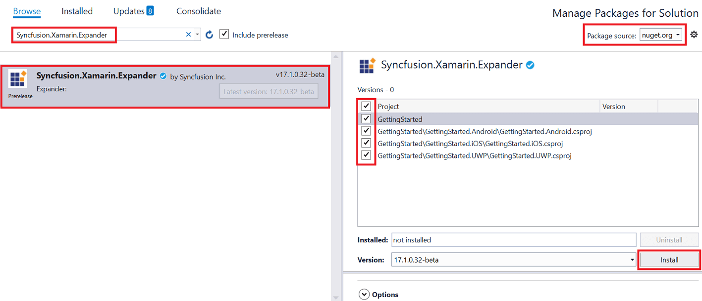
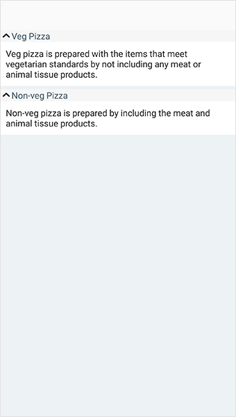

# Getting Started with Xamarin Expander (SfExpander)

The Expander control provides a way to expand and collapse when tapping a header. This section provides a quick overview for working with the `SfExpander` for Xamarin.Forms. This section covers the minimal features that you need to know to get started with the Expander. 

## Assembly deployment

After installing Essential Studio for Xamarin, you can find all the required assemblies in the installation folders, {Syncfusion Essential Studio Installed location} \Essential Studio\16.x.x.x\Xamarin\lib 

Eg: C:\Program Files (x86) \Syncfusion\Essential Studio\16.1.0.24\Xamarin\lib 

N> Assemblies can be found in unzipped package location in Mac.  

## Adding SfExpander reference  

You can add SfExpander reference using one of the following methods: 

**Method 1: Adding SfExpander reference from nuget.org**

Syncfusion Xamarin components are available in [nuget.org](https://www.nuget.org/). To add SfExpander to your project, open the NuGet package manager in Visual Studio, search for [Syncfusion.Xamarin.Expander](https://www.nuget.org/packages/Syncfusion.Xamarin.Expander), and then install it. 

N> Install the same version of Expander NuGet in all the projects.  

**Method 2: Adding SfExpander reference from toolbox**

Syncfusion also provides Xamarin Toolbox. Using this toolbox, you can drag the SfExpander control to the XAML page. It will automatically install the required NuGet packages and add the namespace to the page. To install Syncfusion Xamarin Toolbox, refer to [Toolbox](https://help.syncfusion.com/xamarin/utility#toolbox). 

**Method 3: Adding SfExpander assemblies manually from the installed location**

If you prefer to manually reference the assemblies instead referencing from NuGet, add the following assemblies in respective projects. 

Location: {Installed location}/{version}/Xamarin/lib 

<table>
<tr>
<td>PCL</td>
<td>
Syncfusion.Expander.XForms.dll 
Syncfusion.Core.XForms.dll 
Syncfusion.Licensing.dll </td>
</tr>
<tr>
<td>Android</td>
<td>
Syncfusion.Expander.XForms.dll 
Syncfusion.Expander.XForms.Android.dll 
Syncfusion.Core.XForms.dll 
Syncfusion.Core.XForms.Android.dll 
Syncfusion.Licensing.dll 
</td>
</tr>
<tr>
<td>iOS</td>
<td>
Syncfusion.Expander.XForms.dll 
Syncfusion.Expander.XForms.iOS.dll 
Syncfusion.Core.XForms.dll 
Syncfusion.Core.XForms.iOS.dll 
Syncfusion.Licensing.dll 
</td>
</tr>
<tr>
<td>UWP</td>
<td>
Syncfusion.Expander.XForms.dll 
Syncfusion.Expander.XForms.UWP.dll 
Syncfusion.Core.XForms.dll 
Syncfusion.Core.XForms.UWP.dll 
Syncfusion.Licensing.dll 
</td>
</tr>
</table>

N> To learn more about obtaining Syncfusion components, refer to these links for [Mac](https://help.syncfusion.com/xamarin/introduction/download-and-installation/mac/) and [Windows](https://help.syncfusion.com/xamarin/introduction/download-and-installation/windows/).

I> Starting with v16.2.0.x, if you reference Syncfusion assemblies from the trial setup or from the NuGet feed, you also have to include a license key in your projects. Refer to [Syncfusion license key](https://help.syncfusion.com/common/essential-studio/licensing/license-key/) to learn about registering Syncfusion license key in your Xamarin application to use Syncfusion components.

## Launching the expander on each platform

To use the expander in an application, each platform application must initialize the expander renderer. This initialization step varies from platform to platform and is discussed in the following sections: 

### Android

The Android launches the expander without any initialization and is enough to only initialize the Xamarin.Forms Framework to launch the application. 

N> If you are adding the references from toolbox, this step is not needed. 

### iOS

To launch the expander in iOS, call the `SfExpanderRenderer.Init()` in the `FinishedLaunching` overridden method of the AppDelegate class after the Xamarin.Forms Framework initialization and before the LoadApplication is called as demonstrated in the following code example. 



public override bool FinishedLaunching(UIApplication app, NSDictionary options)
{
    …
    global::Xamarin.Forms.Forms.Init ();
    Syncfusion.XForms.iOS.Expander.SfExpanderRenderer.Init(); 
    LoadApplication (new App ());
    …
}
 


### Universal Windows Platform (UWP)

The UWP launches the expander without any initialization and is enough to only initialize the Xamarin.Forms Framework to launch the application. 

### ReleaseMode issue in UWP platform

The known Framework issue in UWP platform is that the custom controls will not render when deployed the application in `Release Mode`. 

The previous problem can be resolved by initializing the expander assemblies in `App.xaml.cs` file in UWP project as in the following code snippet. 



// In App.xaml.cs

protected override void OnLaunched(LaunchActivatedEventArgs e)
{
    …
    
    rootFrame.NavigationFailed += OnNavigationFailed;
        
    // you'll need to add `using System.Reflection;`
    List<Assembly> assembliesToInclude = new List<Assembly>();

    //Now, add all the assemblies your app uses 
	assembliesToInclude.Add(typeof(Syncfusion.XForms.UWP.Expander.SfExpanderRenderer).GetTypeInfo().Assembly); 

    // replaces Xamarin.Forms.Forms.Init(e);        
    Xamarin.Forms.Forms.Init(e, assembliesToInclude);
        
    …     
}



## Creating the expander 
This section explains how to create a simple Xamarin.Forms application with [SfExpander](https://help.syncfusion.com/cr/cref_files/xamarin/Syncfusion.Expander.XForms~Syncfusion.XForms.Expander.SfExpander.html). The control should be configured entirely in C# code or by using XAML markup. 

* Creating the project.
* Adding expander in Xamarin.Forms. 
* Defining expander.

### Creating the project

Create a new blank (.Net Standard) application in Xamarin Studio or Visual Studio for Xamarin.Forms. 

### Adding expander to Xamarin.Forms 

To add the expander to your application, follow these steps: 

1. Add required assemblies as discussed in assembly deployment section. 
2. Import the control namespace as `xmlns:syncfusion ="clr-namespace:Syncfusion.XForms. Expander;assembly=Syncfusion.Expander.XForms` in XAML Page. 
3. Create an instance of expander control and add as content.  




<?xml version="1.0" encoding="utf-8" ?>
<ContentPage xmlns="http://xamarin.com/schemas/2014/forms"
             xmlns:x="http://schemas.microsoft.com/winfx/2009/xaml"
             xmlns:local="clr-namespace:GettingStarted"
             x:Class="GettingStarted.MainPage"
             xmlns:syncfusion="clr-namespace:Syncfusion.XForms.Expander;assembly=Syncfusion.Expander.XForms">
             <ContentPage.Content> 
                <syncfusion:SfExpander x:Name="expander"/> 
             </ContentPage.Content>
</ContentPage>



using Syncfusion.XForms.Expander;
using Xamarin.Forms;

namespace GettingStarted
{
    public partial class MainPage : ContentPage
    {
        SfExpander expander;
        public MainPage()
        {            
            InitializeComponent();
            expander = new SfExpander();
        }
    }
}




### Defining expander 

`SfExpander` is a layout control comprise of Header and Content. You can load any View in [Header](https://help.syncfusion.com/cr/cref_files/xamarin/Syncfusion.Expander.XForms~Syncfusion.XForms.Expander.SfExpander~Header.html) and [Content](https://help.syncfusion.com/cr/cref_files/xamarin/Syncfusion.Expander.XForms~Syncfusion.XForms.Expander.SfExpander~Content.html). Content visibility of expander can be set by using the `IsExpanded` property of Expander. Users can expand or collapse the Content view by tapping Header.

Here, Grid with Labels are loaded in Header and Content of expander. 

N> When loading Label as direct children of Header or Content of Expander, then it will lead to exception in Forms 4.0 and above version. So, load Label inside Grid to overcome the crash.




<?xml version="1.0" encoding="utf-8" ?>
<ContentPage xmlns="http://xamarin.com/schemas/2014/forms"
             xmlns:x="http://schemas.microsoft.com/winfx/2009/xaml"
             xmlns:local="clr-namespace:GettingStarted"
             x:Class="GettingStarted.MainPage"
             xmlns:syncfusion="clr-namespace:Syncfusion.XForms.Expander;assembly=Syncfusion.Expander.XForms">
             <ContentPage.Content> 
                <ScrollView BackgroundColor="#EDF2F5" Grid.Row="1"> 
                    <StackLayout> 
                        <syncfusion:SfExpander> 
                            <syncfusion:SfExpander.Header> 
                                <Grid>
                                    <Label TextColor="#495F6E" Text="Veg Pizza" VerticalTextAlignment="Center" /> 
                                </Grid>
                            </syncfusion:SfExpander.Header> 
                            <syncfusion:SfExpander.Content> 
                                <Grid Padding="10,10,10,10" BackgroundColor="#FFFFFF"> 
                                    <Label TextColor="#303030" Text="Veg pizza is prepared with the items that meet vegetarian standards by not including any meat or animal tissue products." HeightRequest="50" VerticalTextAlignment="Center"/> 
                                </Grid> 
                            </syncfusion:SfExpander.Content> 
                        </syncfusion:SfExpander> 
                        <syncfusion:SfExpander> 
                            <syncfusion:SfExpander.Header> 
                                <Grid>
                                    <Label TextColor="#495F6E" Text="Non-veg Pizza" VerticalTextAlignment="Center" /> 
                                </Grid>
                            </syncfusion:SfExpander.Header> 
                            <syncfusion:SfExpander.Content> 
                                <Grid Padding="10,10,10,10" BackgroundColor="#FFFFFF"> 
                                    <Label TextColor="#303030" Text="Non-veg pizza is prepared by including the meat and animal tissue products." HeightRequest="50" VerticalTextAlignment="Center"/> 
                                </Grid> 
                            </syncfusion:SfExpander.Content> 
                        </syncfusion:SfExpander> 
                    </StackLayout> 
                </ScrollView> 
            </ContentPage.Content>    
</ContentPage>




Now, run the application to render the following output.

You can download expander sample for Xamarin.Forms here [ExpanderGettingStarted](https://github.com/SyncfusionExamples/xamarin_expander_getting_started).

## Animation duration

`SfExpander` allows you to customize the expanding and collapsing duration by using the [AnimationDuration](https://help.syncfusion.com/cr/cref_files/xamarin/Syncfusion.Expander.XForms~Syncfusion.XForms.Expander.SfExpander~AnimationDuration.html) property. By default, the animation duration is 150 milliseconds. 



    <syncfusion:SfExpander x:Name="expander" AnimationDuration="250"/>


    expander.AnimationDuration = 250;



## Animation easing

`SfExpander` allows you to customize the rate of change of parameter over time or animation style by using the [AnimationEasing](https://help.syncfusion.com/cr/cref_files/xamarin/Syncfusion.Expander.XForms~Syncfusion.XForms.Expander.SfExpander~AnimationEasing.html) property. By default, the animation easing is `Linear`. 



         <syncfusion:SfExpander x:Name="expander" AnimationEasing="SinOut"/>       


    expander.AnimationEasing = Syncfusion.XForms.Expander.AnimationEasing.SinOut;



## Expand and Collapse 

`SfExpander` allows you to programmatically expand and collapse by using the [IsExpanded](https://help.syncfusion.com/cr/cref_files/xamarin/Syncfusion.Expander.XForms~Syncfusion.XForms.Expander.SfExpander~IsExpanded.html) property of SfExpander.  Also, expand & collapse interaction by user can be control by handling `Expanding` and `Collapsing` events.  



    <syncfusion:SfExpander x:Name="expander" IsExpanded="True"/>        


    expander.IsExpanded = true;


