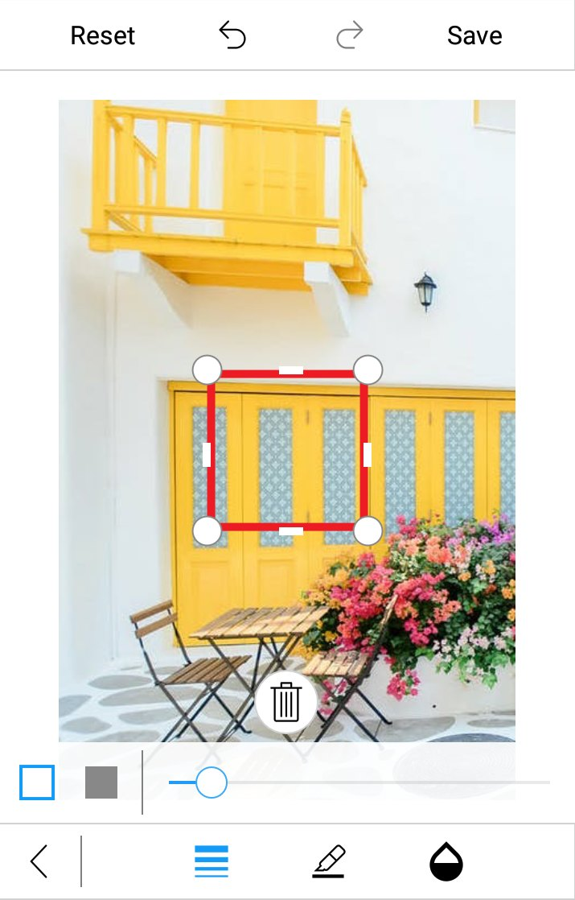
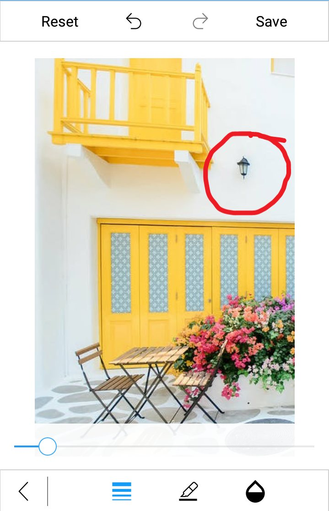

# Shapes in SfImageEditor

You can annotate any shapes over an image using the [`AddShape`](https://help.syncfusion.com/cr/xamarin/Syncfusion.SfImageEditor.XForms.SfImageEditor.html#Syncfusion_SfImageEditor_XForms_SfImageEditor_AddShape_Syncfusion_SfImageEditor_XForms_ShapeType_Syncfusion_SfImageEditor_XForms_PenSettings_) method. The following shapes are available in image editor:

* Circle
* Rectangle
* Arrow
* Path

### Selecting a shape type

The [`ShapeType`](https://help.syncfusion.com/cr/xamarin/Syncfusion.SfImageEditor.XForms.ShapeType.html) is an enum property with values `Rectangle`, `Circle`, `Arrow`, and `Path`. You can give the desired shape type as an argument to the [`AddShape`](https://help.syncfusion.com/cr/xamarin/Syncfusion.SfImageEditor.XForms.SfImageEditor.html#Syncfusion_SfImageEditor_XForms_SfImageEditor_AddShape_Syncfusion_SfImageEditor_XForms_ShapeType_Syncfusion_SfImageEditor_XForms_PenSettings_) method.



      editor.AddShape(ShapeType.Circle);



N> If you add the shape when the SfImageEditor loaded in a view without image, you need to call the [`AddShape`](https://help.syncfusion.com/cr/xamarin/Syncfusion.SfImageEditor.XForms.SfImageEditor.html#Syncfusion_SfImageEditor_XForms_SfImageEditor_AddShape_Syncfusion_SfImageEditor_XForms_ShapeType_Syncfusion_SfImageEditor_XForms_PenSettings_) method after some time delay. If you add the shape when the SfImageEditor loaded in a view without image then you need to call the [`AddShape`](https://help.syncfusion.com/cr/xamarin/Syncfusion.SfImageEditor.XForms.SfImageEditor.html#Syncfusion_SfImageEditor_XForms_SfImageEditor_AddShape_Syncfusion_SfImageEditor_XForms_ShapeType_Syncfusion_SfImageEditor_XForms_PenSettings_) method in the [`ImageLoaded`](https://help.syncfusion.com/cr/xamarin/Syncfusion.SfImageEditor.XForms.SfImageEditor.html#Syncfusion_SfImageEditor_XForms_SfImageEditor_ImageLoaded) event as like in the below code sample.



        editor.ImageLoaded += (Object sender, ImageLoadedEventArgs args) =>
            {
                  editor.AddShape(ShapeType.Circle);
            };



## Customizing a shape with pen settings

You can customize the appearance of each shape using the [`PenSettings`](https://help.syncfusion.com/cr/xamarin/Syncfusion.SfImageEditor.XForms.PenSettings.html) property:

## PenSettings

The [`PenSettings`](https://help.syncfusion.com/cr/xamarin/Syncfusion.SfImageEditor.XForms.PenSettings.html) property consists of the following properties:

* [`Color`](https://help.syncfusion.com/cr/xamarin/Syncfusion.SfImageEditor.XForms.PenSettings.html#Syncfusion_SfImageEditor_XForms_PenSettings_Color): Specifies the desired stroke color to a shape.
* [`FillColor`](https://help.syncfusion.com/cr/xamarin/Syncfusion.SfImageEditor.XForms.PenSettings.html#Syncfusion_SfImageEditor_XForms_PenSettings_FillColor): Specifies the desired fill color to a shape.
* [`StrokeWidth`](https://help.syncfusion.com/cr/xamarin/Syncfusion.SfImageEditor.XForms.PenSettings.html#Syncfusion_SfImageEditor_XForms_PenSettings_StrokeWidth): Allows to denote the stroke width for the desired shape.
* [`Mode`](https://help.syncfusion.com/cr/xamarin/Syncfusion.SfImageEditor.XForms.PenSettings.html#Syncfusion_SfImageEditor_XForms_PenSettings_Mode): Determines whether the shape color mode is `Fill` or `Stroke`. It is an enum value.
* [`Opacity`](https://help.syncfusion.com/cr/xamarin/Syncfusion.SfImageEditor.XForms.PenSettings.html#Syncfusion_SfImageEditor_XForms_PenSettings_Opacity): Denotes opacity for the desired shapes.
* [`Bounds`](https://help.syncfusion.com/cr/xamarin/Syncfusion.SfImageEditor.XForms.PenSettings.html#Syncfusion_SfImageEditor_XForms_PenSettings_Bounds): Allows to set frame for the newly added shapes (rectangle and circle). You can position the shapes wherever you want on the image.In percentage, the value of the shape frame should fall between 0 and 100.

N> The [`FillColor`](https://help.syncfusion.com/cr/xamarin/Syncfusion.SfImageEditor.XForms.PenSettings.html#Syncfusion_SfImageEditor_XForms_PenSettings_FillColor) property is applicable only if the ShapeType is `Rectangle` or `Circle`.

* To add a rectangle, circle, or arrow over an image, specify the [`ShapeType`](https://help.syncfusion.com/cr/xamarin/Syncfusion.SfImageEditor.XForms.ShapeType.html) and the desired [`PenSettings`](https://help.syncfusion.com/cr/xamarin/Syncfusion.SfImageEditor.XForms.PenSettings.html) as shown in the following code snippet.





      editor.AddShape(ShapeType.Circle, new PenSettings() {Color = Color.Red, Mode= Mode.Stroke, Opacity=1f, Bounds = new Rectangle(20,20,35,35)});





* You can annotate any path on an image using free hand drawing as shown in the following code snippet.





      editor.AddShape(ShapeType.Path, new PenSettings() { StrokeWidth = 10 });





## Deleting a shape or text from view

You can delete the selected shape by using the [`Delete`](https://help.syncfusion.com/cr/xamarin/Syncfusion.SfImageEditor.XForms.SfImageEditor.html#Syncfusion_SfImageEditor_XForms_SfImageEditor_Delete) method as shown in the following code snippet.





    editor.Delete();





N> You cannot delete the path.

## Restricting the shape resize

You can restrict the shape resizing using the [`IsResizable`](https://help.syncfusion.com/cr/xamarin/Syncfusion.SfImageEditor.XForms.PenSettings.html#Syncfusion_SfImageEditor_XForms_PenSettings_IsResizable) property. By default, the value of the IsResizable property is true, so you can resize the shape added on an image. When disable the IsResizable property, shape added on an image will not be resized and you can only drag the shape over an image as per in the below code sample.



 editor.AddShape(ShapeType.Circle, new PenSettings() { IsResizable=false });



## See also

[How to add shapes to the image editor on initial loading](https://www.syncfusion.com/kb/11273/how-to-add-shapes-to-the-xamarin-forms-image-editor-on-initial-loading)

[How to add custom toolbar to add shapes or text dynamically in Xamarin.Forms SfImageEditor](https://www.syncfusion.com/kb/10621/how-to-add-custom-toolbar-to-add-shapes-or-text-dynamically-in-xamarin-forms-sfimageeditor)

[How to show dimension of shapes while resizing](https://www.syncfusion.com/kb/8880/how-to-show-dimension-of-shapes-while-resizing)

[How to update the color, stroke thickness for selected shape programmatically](https://www.syncfusion.com/kb/8870/how-to-update-the-color-stroke-thickness-for-selected-shape-programmatically)

[How to load shapes with custom bounds](https://www.syncfusion.com/kb/8857/how-to-load-shapes-with-custom-bounds)
