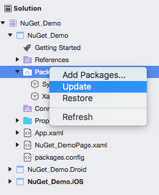

# Mac

## Install NuGet from NuGet Package Manager

### Configuring and Installing Syncfusion NuGet Packages in Visual Studio
The Syncfusion Xamarin NuGet packages are published in public [NuGet.org](https://www.nuget.org/) from v15.4.0.17. So, no need any additional configurations required to utilize the Syncfusion Xamarin NuGet packages from v15.4.0.17. If you required to utilize the Syncfusion Xamarin NuGet packages from Syncfusion private NuGet server instead of NuGet.org, follow the below topics to configure and install the Syncfusion Xamarin NuGet packages.

N> If you wish to use the Xamarin NuGet packages then Essential Studio or Xamarin platform installation not required to implement with Syncfusion Xamarin controls. 

Following are the step by step instructions for configuring Syncfusion NuGet packages within Visual Studio,

1. Right click on the Packages folder in the project and then select Add Packages…

   

2. Next, in the drop-down that appears in the left corner of Add Packages window, select Configure Sources.

   

3. Next, click on the Add button in the window that appears now. Enter the following details in the Add Package Source dialog.

    *	**Name** – enter the name (For Ex., Syncfusion Xamarin Packages)
    *	**Location** – enter the following URL - http://nuget.syncfusion.com/nuget_xamarin/nuget/getsyncfusionpackages/xamarin/

    Now click Add Source and then click OK.

    N> If you have already downloaded the NuGet package from Syncfusion website, enter the local path in the **Location** field.

    

4. Next, open Add Packages window by following step 1, then select Syncfusion Xamarin Packages (The package name specified in Step 3) as the source from the drop-down that appears at the top-left corner of the window.  You can now select from the list of Syncfusion’s components displayed in the window.

5. You need to do this in all the projects such as PCL, XForms.Droid, XForms.iOS.

    

### Updating a NuGet Package

Right click on the Packages folder in the individual projects, then select Update. This will update the NuGet package to the available latest version. You can double click Add Packages and choose the specific version for the package for which you want to update. You need to do this in all the projects such as PCL, XForms.Droid, XForms.iOS.

## Download directly from website

You can also download the complete Xamarin.Forms component from [here](https://www.syncfusion.com/downloads/latest-version).

**MAC Installer (pkg)**

The following procedure illustrates how to install the installer of Syncfusion Xamarin components in Mac.

1. Double-click the Syncfusion Essential Studio for Xamarin Setup file. The Self-Extractor wizard opens, click continue.
2. After reading the terms in Software License Agreement, click continue.
3. Click Agree in the dialog box that appears to continue the installation.
4. Select a destination to install the software and click continue.
5. Choose the installation location and samples installation.
6. To install it in the displayed default location, click Install.
7. Click Close. The NuGet and samples locations are launched automatically.

### Explore the libraries package

You can find the Syncfusion libraries, samples and NuGet when extracting the downloaded zip package or from the installed location in Mac.

{Essential Studio installed location}\Syncfusion\Essential Studio\15.3.0.29\Xamarin

* **"lib"** folder - e.g., /Users/labuser/Documents/Syncfusion/15.3.0.29/Xamarin/lib

   It contains all the required libraries for Xamarin.iOS, Xamarin.Android, and Xamarin.Forms projects.

* **"nuget"** folder - e.g., /Users/labuser/Documents/Syncfusion/15.3.0.29/nuget

   It contains the above libraries as NuGet packages. The same NuGet packages also can be configured from online [nuget.org](https://api.nuget.org/v3/index.json).

* **"sample"** folder - e.g., /Users/labuser/Documents/Syncfusion/15.3.0.29/sample

   It contains the sample applications for our controls in Xamarin.iOS, Xamarin.Android, and Xamarin.Forms platforms in iOS, Android, and Forms folders, respectively.

The "Forms" directory includes,

* Individual control sample folders: It contains the samples for individual controls such as SfChart, SfDataGrid, etc. Since they represent the individual controls, these samples are light-weighted. You can check the samples for your required controls alone faster with minimum deployment time.
 
* “nuget” folder: It contains the compiled assemblies of the above samples as NuGet package. It is referred in the common sample browser as explained in the next step.

* “SampleBrowser” folder: It contains common sample browser, which refers the individual control's samples as NuGet package. Run this to see the demo samples of all the controls in single application.

* It also contains showcase samples such as Patient Monitor, Server Monitor, and Invoice.

### Add reference to the project

You can then add the assembly references to the respective projects such as PCL, XForms.Droid, XForms.iOS. You can find the dependencies for each control from this [link](https://help.syncfusion.com/xamarin/introduction/control-dependencies).

I> After adding the reference, currently, an additional step is required for iOS and UWP projects. For example, if we are using SfKanban, we need to call the Init method of SfKanbanRenderer as shown in this [KB article](https://www.syncfusion.com/kb/7171).

## Install NuGet from command line

### NuGet Configuration

1. Download the latest NuGet executable from [here](https://dist.nuget.org/win-x86-commandline/latest/nuget.exe).

2. Open the downloaded executable location in command window and run the following command,

   mono nuget.exe Sources Add –Name [Source name] –Source [source location]

   Ex: mono nuget.exe Sources Add –Name “Syncfusion Xamarin Packages” -Source “http://nuget.syncfusion.com/nuget_xamarin/nuget/getsyncfusionpackages/xamarin/”

3. Once the Source gets added successfully the confirmation message will be shown like below.

    

### NuGet Installation

Once the NuGet source has been added, then install the NuGet package which is available in that source by using following command.

mono nuget.exe install [Package name]

For Ex: mono nuget.exe install “Syncfusion.Xamarin.Calculate” 

