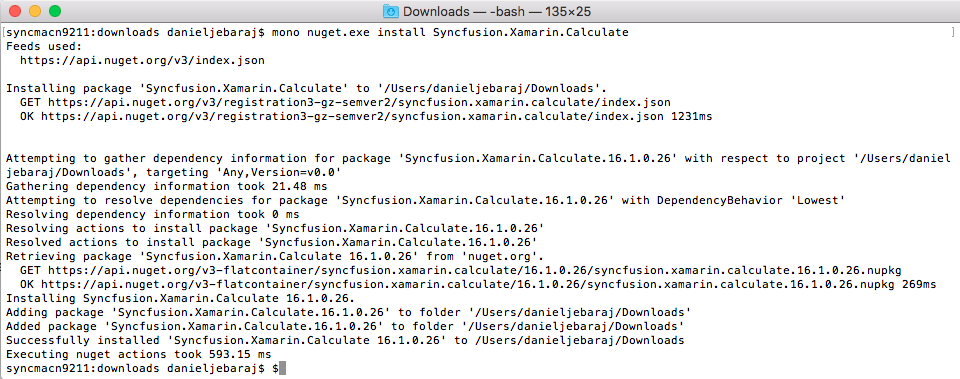

# Mac

## Install NuGet from NuGet Package Manager

### Configuring and Installing Syncfusion NuGet Packages in Visual Studio

Syncfusion Xamarin components are available in [NuGet.org](https://www.nuget.org/). To add our NuGet package, open the NuGet package manager in Visual Studio and search for “syncfusion.xamarin”. This will result in listing of all our Xamarin components. You can now select from the list of Syncfusion’s components displayed in the window and then install it. You need to do this in all the projects such as PCL, Android, iOS in the Xamarin.Forms application.

### Updating a NuGet Package

Right click on the Packages folder in the individual projects, then select Update. This will update the NuGet package to the available latest version. You can double click Add Packages and choose the specific version for the package for which you want to update. You need to do this in all the projects such as PCL, XForms.Droid, XForms.iOS.

N> If you wish to use Syncfusion Xamarin NuGet packages, then it is not needed to install [Essential Studio for Xamarin installer](https://help.syncfusion.com/xamarin/introduction/download-and-installation/mac#download-directly-from-website) to work with Syncfusion Xamarin controls.

## Download directly from website

You can also download the complete Xamarin.Forms component from [here](https://www.syncfusion.com/downloads/latest-version).

**MAC Installer (pkg)**

The following procedure illustrates how to install the installer of Syncfusion Xamarin components in Mac.

1. Double-click the Syncfusion Essential Studio for Xamarin Setup file. The Self-Extractor wizard opens, click continue.
2. After reading the terms in Software License Agreement, click continue.
3. Click Agree in the dialog box that appears to continue the installation.
4. Select a destination to install the software and click continue.
5. Choose the installation location and samples installation.
6. To install it in the displayed default location, click Install.
7. Click Close. The NuGet and samples locations are launched automatically.

### Explore the libraries package

You can find the Syncfusion libraries, samples and NuGet when extracting the downloaded zip package or from the installed location in Mac.

{Essential Studio installed location}\Syncfusion\Essential Studio\15.3.0.29\Xamarin

* **"lib"** folder - e.g., /Users/labuser/Documents/Syncfusion/15.3.0.29/Xamarin/lib

   It contains all the required libraries for Xamarin.iOS, Xamarin.Android, and Xamarin.Forms projects.

* **"nuget"** folder - e.g., /Users/labuser/Documents/Syncfusion/15.3.0.29/nuget

   It contains the above libraries as NuGet packages. The same NuGet packages also can be configured from online [nuget.org](https://api.nuget.org/v3/index.json).

* **"sample"** folder - e.g., /Users/labuser/Documents/Syncfusion/15.3.0.29/sample

   It contains the sample applications for our controls in Xamarin.iOS, Xamarin.Android, and Xamarin.Forms platforms in iOS, Android, and Forms folders, respectively.

The "Forms" directory includes,

* Individual control sample folders: It contains the samples for individual controls such as SfChart, SfDataGrid, etc. Since they represent the individual controls, these samples are light-weighted. You can check the samples for your required controls alone faster with minimum deployment time.
 
* “nuget” folder: It contains the compiled assemblies of the above samples as NuGet package. It is referred in the common sample browser as explained in the next step.

* “SampleBrowser” folder: It contains common sample browser, which refers the individual control's samples as NuGet package. Run this to see the demo samples of all the controls in single application.

* It also contains showcase samples such as Patient Monitor, Server Monitor, and Invoice.

### Add reference to the project

You can then add the assembly references to the respective projects such as PCL, XForms.Droid, XForms.iOS. You can find the dependencies for each control from this [link](https://help.syncfusion.com/xamarin/introduction/control-dependencies).

I> After adding the reference, currently, an additional step is required for iOS and UWP projects. For example, if we are using SfKanban, we need to call the Init method of SfKanbanRenderer as shown in this [KB article](https://www.syncfusion.com/kb/7171).

## Install NuGet from command line

You can use the below command to install the specific NuGet. You can get the nuget.exe from [here](https://dist.nuget.org/win-x86-commandline/latest/nuget.exe).

mono nuget.exe install [Package name]

For Ex: mono nuget.exe install “Syncfusion.Xamarin.Calculate” 

