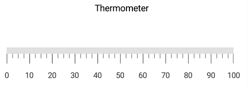

---

layout: post
title: Header in Syncfusion SfLinearGauge control for Xamarin.Forms
description:  This section describes how to set the header and customize the header in SfLinearGauge control for Xamarin.Forms platform
platform: Xamarin
control: LinearGauge
documentation: ug

---

# Header in SfLinearGauge

You can add a title to gauge using the [`LinearHeader`](https://help.syncfusion.com/cr/cref_files/xamarin/Syncfusion.SfGauge.XForms~Syncfusion.SfGauge.XForms.LinearHeader.html) option to provide information to users about the data that is being plotted in the linear gauge.

## Adding header to linear gauge





        <gauge:SfLinearGauge>
            <gauge:SfLinearGauge.Header >
                <gauge:LinearHeader Text="Thermometer"/>
            </gauge:SfLinearGauge.Header>

            <gauge:SfLinearGauge.Scales>
                <gauge:LinearScale ScaleBarColor="#e0e0e0" LabelColor="#424242" ScaleBarLength ="350">
                    <gauge:LinearScale.MajorTickSettings>
                        <gauge:LinearTickSettings Thickness="1"  Color="Gray" Length="15"/>
                    </gauge:LinearScale.MajorTickSettings>
                    <gauge:LinearScale.MinorTickSettings>
                        <gauge:LinearTickSettings Thickness="1"  Color="Gray" Length="7"/>
                    </gauge:LinearScale.MinorTickSettings>
                </gauge:LinearScale>
            </gauge:SfLinearGauge.Scales>

        </gauge:SfLinearGauge>





    SfLinearGauge linearGauge = new SfLinearGauge();
    linearGauge.Orientation = Orientation.OrientationVertical;
    LinearHeader linearHeader = new LinearHeader();
    linearHeader.Text = "Thermometer";
    linearGauge.Header = linearHeader;
	
    LinearScale linearScale = new LinearScale();
    linearScale.Interval = 10;
    linearScale.ScaleBarColor = Color.FromHex("#e0e0e0");
    linearScale.MajorTickSettings.Thickness = 1;
    linearScale.MajorTickSettings.Length = 15;
    linearScale.MajorTickSettings.Color = Color.Gray;
    linearScale.MinorTickSettings.Color = Color.Gray;
    linearScale.MinorTickSettings.Length = 7;
    linearScale.MinorTickSettings.Thickness = 1;
    linearScale.ScaleBarLength = 350;
    linearScale.LabelColor = Color.FromHex("#424242");
    linearGauge.Scales.Add(linearScale);





##  Positioning the header

To change the position of header, use the [`Offset`](https://help.syncfusion.com/cr/cref_files/xamarin/Syncfusion.SfGauge.XForms~Syncfusion.SfGauge.XForms.LinearHeader~Offset.html)  property in the linear header. It ranges from 0 to 1. By default, the header will be positioned on the top of linear gauge.




 
       <gauge:SfLinearGauge>
             <gauge:SfLinearGauge.Header >
                <gauge:LinearHeader Text="Thermometer" Offset="0.4,0.4"/>
            </gauge:SfLinearGauge.Header>

            <gauge:SfLinearGauge.Scales>
                <gauge:LinearScale ScaleBarColor="#e0e0e0" LabelColor="#424242" ScaleBarLength ="350">
                    <gauge:LinearScale.MajorTickSettings>
                        <gauge:LinearTickSettings Thickness="1"  Color="Gray" Length="15"/>
                    </gauge:LinearScale.MajorTickSettings>
                    <gauge:LinearScale.MinorTickSettings>
                        <gauge:LinearTickSettings Thickness="1"  Color="Gray" Length="7"/>
                    </gauge:LinearScale.MinorTickSettings>
                </gauge:LinearScale>
            </gauge:SfLinearGauge.Scales>

        </gauge:SfLinearGauge>





       SfLinearGauge linearGauge = new SfLinearGauge();
       LinearHeader linearHeader = new LinearHeader();
       linearHeader.Text = "Thermometer";
       linearHeader.Offset = new Point(0.4, 0.4);
       linearGauge.Header = linearHeader;
       LinearScale linearScale = new LinearScale();
	   linearScale.MajorTickSettings.Thickness = 1;
       linearScale.MajorTickSettings.Length = 15;
       linearScale.MajorTickSettings.Color = Color.Gray;
       linearScale.MinorTickSettings.Color = Color.Gray;
       linearScale.MinorTickSettings.Length = 7;
       linearScale.MinorTickSettings.Thickness = 1;
       linearScale.ScaleBarColor = Color.FromHex("#e0e0e0");
       linearScale.LabelColor = Color.FromHex("#424242");
       linearGauge.Scales.Add(linearScale);
    




##  Customizing header text

You can customize the text of [`LinearHeader`](https://help.syncfusion.com/cr/cref_files/xamarin/Syncfusion.SfGauge.XForms~Syncfusion.SfGauge.XForms.LinearHeader.html) by using the [`FontFamily`](https://help.syncfusion.com/cr/cref_files/xamarin/Syncfusion.SfGauge.XForms~Syncfusion.SfGauge.XForms.LinearHeader~FontFamily.html), [`FontAttribute`](https://help.syncfusion.com/cr/cref_files/xamarin/Syncfusion.SfGauge.XForms~Syncfusion.SfGauge.XForms.LinearHeader~FontAttributes.html), [`TextSize`](https://help.syncfusion.com/cr/cref_files/xamarin/Syncfusion.SfGauge.XForms~Syncfusion.SfGauge.XForms.LinearHeader~TextSize.html), and [`ForegroundColor`](https://help.syncfusion.com/cr/cref_files/xamarin/Syncfusion.SfGauge.XForms~Syncfusion.SfGauge.XForms.LinearHeader~ForegroundColor.html) properties as shown in the following code snippet.




 
      <gauge:SfLinearGauge>
              <gauge:SfLinearGauge.Header >
                <gauge:LinearHeader Text="Thermometer" TextSize="18" ForegroundColor="DarkCyan" FontAttributes="Bold" Offset="0.35,0.4">
                    <gauge:LinearHeader.FontFamily>
                        <OnPlatform x:TypeArguments="x:String" iOS="Chalkduster" Android="algerian.ttf" WinPhone="Chiller" />
                    </gauge:LinearHeader.FontFamily>
                </gauge:LinearHeader>
            </gauge:SfLinearGauge.Header>

            <gauge:SfLinearGauge.Scales>
                <gauge:LinearScale ScaleBarColor="#e0e0e0" LabelColor="#424242">
                </gauge:LinearScale>
            </gauge:SfLinearGauge.Scales>

      </gauge:SfLinearGauge>





     SfLinearGauge linearGauge = new SfLinearGauge();
     LinearHeader linearHeader = new LinearHeader();
     linearHeader.Text = "Thermometer";
     linearHeader.ForegroundColor = Color.DarkCyan;
     linearHeader.FontFamily = Device.RuntimePlatform == Device.iOS ? "Chalkduster" : Device.RuntimePlatform == Device.Android ? "algerian.ttf" : "Chiller";
     linearHeader.FontAttributes = FontAttributes.Bold;
     linearHeader.TextSize = 18;
     linearHeader.Offset = new Point(0.35, 0.4);
     linearGauge.Header = linearHeader;
     LinearScale linearScale = new LinearScale();
     linearScale.ScaleBarColor = Color.FromHex("#e0e0e0");
     linearScale.LabelColor = Color.FromHex("#424242");
     linearGauge.Scales.Add(linearScale);
 




