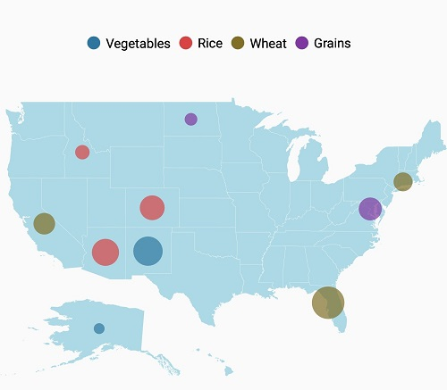
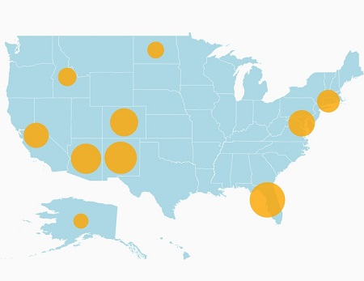
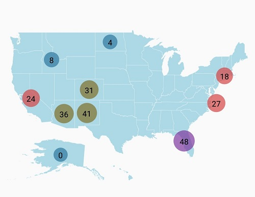

# Bubble Marker

Bubbles in the maps control represent the underlying data values of the maps. Bubbles are scattered throughout the map shapes that contain bound values.

## Bubble data

Bubbles are included when the data binding and [`BubbleMarkerSettings`](https://help.syncfusion.com/cr/cref_files/xamarin/Syncfusion.SfMaps.XForms~Syncfusion.SfMaps.XForms.ShapeFileLayer~BubbleMarkerSettings.html# ) are set to the shape layers.

The following code sample explains data binding provided for bubble.





     <maps:ShapeFileLayer  Uri="usa_state.shp"  ShapeIDPath="Name"  ShapeIDTableField="STATE_NAME" 

          ItemsSource="{Binding DataSource}" />





        ShapeFileLayer layer = new ShapeFileLayer();

        layer.Uri = "usa_state.shp";

        layer.ItemsSource = viewModel.DataSource;

        layer.ShapeIDTableField = "STATE_NAME";

        layer.ShapeIDPath = "Name";

        map.Layers.Add(layer);





## Adding bubbles

To add bubbles to maps, the bubble marker setting should be added to the shape file layer. The [`ShowBubbles`](https://help.syncfusion.com/cr/cref_files/xamarin/Syncfusion.SfMaps.XForms~Syncfusion.SfMaps.XForms.BubbleMarkerSetting~ShowBubbles.html#) property should be enabled for making the bubbles visible.

The [`ValuePath`](https://help.syncfusion.com/cr/cref_files/xamarin/Syncfusion.SfMaps.XForms~Syncfusion.SfMaps.XForms.BubbleMarkerSetting~ValuePath.html#) represents the field value to be fetched from the data for each bubble.





            <maps:ShapeFileLayer.BubbleMarkerSettings>

            <maps:BubbleMarkerSetting ShowBubbles="True"  ValuePath="index" />

            </maps:ShapeFileLayer.BubbleMarkerSettings>





            BubbleMarkerSetting bubbleSetting = new BubbleMarkerSetting();

            bubbleSetting.ShowBubbles = true;

            bubbleSetting.ValuePath = "index";

            layer.BubbleMarkerSettings = bubbleSetting;





## Customizing bubble marker

### Customizing fill color

The fill color and opacity of the bubbles can be customized using the [`Fill`](https://help.syncfusion.com/cr/cref_files/xamarin/Syncfusion.SfMaps.XForms~Syncfusion.SfMaps.XForms.BubbleMarkerSetting~Fill.html#) and [`Opacity`](https://help.syncfusion.com/cr/cref_files/xamarin/Syncfusion.SfMaps.XForms~Syncfusion.SfMaps.XForms.BubbleMarkerSetting~Opacity.html#) properties.





        <maps:ShapeFileLayer.BubbleMarkerSettings>

        <maps:BubbleMarkerSetting ShowBubbles="True" ValuePath="index"  Fill="Orange" Opacity="0.8" />

        </maps:ShapeFileLayer.BubbleMarkerSettings>





        BubbleMarkerSetting bubbleSetting = new BubbleMarkerSetting();

        bubbleSetting.ShowBubbles = true;

        bubbleSetting.ValuePath = "index";      

        bubbleSetting.Fill = Color.Orange;

        bubbleSetting.Opacity = 0.8;

        layer.BubbleMarkerSettings = bubbleSetting;





Bubble color can be customized using the [`ColorMappings`](https://help.syncfusion.com/cr/cref_files/xamarin/Syncfusion.SfMaps.XForms~Syncfusion.SfMaps.XForms.BubbleMarkerSetting~ColorMappingsProperty.html) property.

Maps provide the following two types of color mapping to bubble marker:

 * Equal color mapping
 * Range color mapping

### Range color mapping

It is used to differentiate the bubble fill based on its under-bound value and color ranges.
The [`From`](https://help.syncfusion.com/cr/cref_files/xamarin/Syncfusion.SfMaps.XForms~Syncfusion.SfMaps.XForms.RangeColorMapping~FromProperty.html) and [`To`](https://help.syncfusion.com/cr/cref_files/xamarin/Syncfusion.SfMaps.XForms~Syncfusion.SfMaps.XForms.RangeColorMapping~ToProperty.html) properties are used to define the color range and color for the range that can be specified using the Color property.





                   <maps:ShapeFileLayer.BubbleMarkerSettings>
                        <maps:BubbleMarkerSetting  ValuePath="index" ColorValuePath="index" >
                            <maps:BubbleMarkerSetting.ColorMappings>
                                <maps:RangeColorMapping Color="#2E769F" From="0" To="15" />
                                <maps:RangeColorMapping Color="#D84444" To="30" From="15" />
                                <maps:RangeColorMapping Color="#816F28" To="45" From="30" />
                                <maps:RangeColorMapping Color="#7F38A0" To="50" From="45" />
                            </maps:BubbleMarkerSetting.ColorMappings>
                        </maps:BubbleMarkerSetting>
                    </maps:ShapeFileLayer.BubbleMarkerSettings>





            BubbleMarkerSetting bubbleSetting = new BubbleMarkerSetting();

            bubbleSetting.ValuePath = "index";

            bubbleSetting.ColorValuePath = "index";
          

            RangeColorMapping colorMapping1 = new RangeColorMapping() { Color = Color.FromHex("#2E769F"), From = 0, To = 15 };
            RangeColorMapping colorMapping2 = new RangeColorMapping() { Color = Color.FromHex("#D84444"), From = 15, To = 30 };
            RangeColorMapping colorMapping3 = new RangeColorMapping() { Color = Color.FromHex("#816F28"), From = 30, To = 45 };
            RangeColorMapping colorMapping4 = new RangeColorMapping() { Color = Color.FromHex("#7F38A0"), From = 45, To = 50 };

            bubbleSetting.ColorMappings.Add(colorMapping1);
            bubbleSetting.ColorMappings.Add(colorMapping2);
            bubbleSetting.ColorMappings.Add(colorMapping3);
            bubbleSetting.ColorMappings.Add(colorMapping4);

            layer.BubbleMarkerSettings = bubbleSetting;





### Equal color mapping

It is used to differentiate the bubble fill based on its underlying value and color using the [`Value`](https://help.syncfusion.com/cr/cref_files/xamarin/Syncfusion.SfMaps.XForms~Syncfusion.SfMaps.XForms.EqualColorMapping~Value.html) and [`Color`](https://help.syncfusion.com/cr/cref_files/xamarin/Syncfusion.SfMaps.XForms~Syncfusion.SfMaps.XForms.ColorMapping~Color.html) properties.





                   <maps:ShapeFileLayer.BubbleMarkerSettings>
                        <maps:BubbleMarkerSetting ValuePath="index" ColorValuePath="Type" >
                            <maps:BubbleMarkerSetting.ColorMappings>
                                <maps:EqualColorMapping Color="#2E769F" Value="Vegetables" />
                                <maps:EqualColorMapping Color="#D84444" Value="Rice" />
                                <maps:EqualColorMapping Color="#816F28" Value="Wheat" />
                                <maps:EqualColorMapping Color="#7F38A0" Value="Grains" />
                            </maps:BubbleMarkerSetting.ColorMappings>
                        </maps:BubbleMarkerSetting>
                    </maps:ShapeFileLayer.BubbleMarkerSettings>





            BubbleMarkerSetting bubbleSetting = new BubbleMarkerSetting();

            bubbleSetting.ValuePath = "index";

            bubbleSetting.ColorValuePath = "Type";

          
            EqualColorMapping colorMapping1 = new EqualColorMapping() { Color = Color.FromHex("#2E769F"), Value = "Vegetables" };
            EqualColorMapping colorMapping2 = new EqualColorMapping() { Color = Color.FromHex("#D84444"), Value = "Rice" };
            EqualColorMapping colorMapping3 = new EqualColorMapping() { Color = Color.FromHex("#816F28"), Value = "Wheat" };
            EqualColorMapping colorMapping4 = new EqualColorMapping() { Color = Color.FromHex("#7F38A0"), Value = "Grains" };

            bubbleSetting.ColorMappings.Add(colorMapping1);
            bubbleSetting.ColorMappings.Add(colorMapping2);
            bubbleSetting.ColorMappings.Add(colorMapping3);
            bubbleSetting.ColorMappings.Add(colorMapping4);

            layer.BubbleMarkerSettings = bubbleSetting;





## Customizing bubble size

The size of the bubbles depends on the data bound to the [`ValuePath`](https://help.syncfusion.com/cr/cref_files/xamarin/Syncfusion.SfMaps.XForms~Syncfusion.SfMaps.XForms.BubbleMarkerSetting~ValuePath.html#). The maximum and minimum sizes of the bubbles can be customized using [`MaxSize`](https://help.syncfusion.com/cr/cref_files/xamarin/Syncfusion.SfMaps.XForms~Syncfusion.SfMaps.XForms.BubbleMarkerSetting~MaxSize.html#) and [`MinSize`](https://help.syncfusion.com/cr/cref_files/xamarin/Syncfusion.SfMaps.XForms~Syncfusion.SfMaps.XForms.BubbleMarkerSetting~MinSize.html#) properties.

I> The [`ShowMapItems`](https://help.syncfusion.com/cr/cref_files/xamarin/Syncfusion.SfMaps.XForms~Syncfusion.SfMaps.XForms.ShapeFileLayer~ShowMapItems.html) should be enabled to display label on bubble marker.





    <maps:ShapeFileLayer.BubbleMarkerSettings>

    <maps:BubbleMarkerSetting ShowBubbles="True"  ValuePath="Electors"  Fill="Orange"
                            MaxSize="25" MinSize="20" Opacity="0.8" />

    </maps:ShapeFileLayer.BubbleMarkerSettings>





        BubbleMarkerSetting bubbleSetting = new BubbleMarkerSetting();

        bubbleSetting.ShowBubbles = true;

        bubbleSetting.ValuePath = "Electors";

        bubbleSetting.Fill = Color.Orange;

        bubbleSetting.Opacity = 0.8;

        bubbleSetting.MinSize = 20;

        bubbleSetting.MaxSize = 25;

        layer.BubbleMarkerSettings = bubbleSetting;





The following code sample demonstrates how to add bubbles to maps and customize them





    <maps:SfMaps>
            <maps:SfMaps.Layers>
                <maps:ShapeFileLayer x:Name="layer" Uri="usa_state.shp" ShapeIDPath="Name" ShapeIDTableField="STATE_NAME" 
                                        ShowMapItems="True"  ItemsSource="{Binding DataSource}">
                    <maps:ShapeFileLayer.BubbleMarkerSettings>
                        <maps:BubbleMarkerSetting ValuePath="index" ColorValuePath="index" >
                            <maps:BubbleMarkerSetting.ColorMappings>
                                <maps:RangeColorMapping Color="#2E769F" From="0" To="15" />
                                <maps:RangeColorMapping Color="#D84444" To="30" From="15" />
                                <maps:RangeColorMapping Color="#816F28" To="45" From="30" />
                                <maps:RangeColorMapping Color="#7F38A0" To="50" From="45" />
                            </maps:BubbleMarkerSetting.ColorMappings>
                        </maps:BubbleMarkerSetting>
                    </maps:ShapeFileLayer.BubbleMarkerSettings>
                    <maps:ShapeFileLayer.ShapeSettings>
                        <maps:ShapeSetting ShapeFill="LightBlue"/>
                    </maps:ShapeFileLayer.ShapeSettings>
                    <maps:ShapeFileLayer.LegendSettings>
                        <maps:MapLegendSetting LegendType="Bubbles"  ShowLegend="True"></maps:MapLegendSetting>
                    </maps:ShapeFileLayer.LegendSettings>
                </maps:ShapeFileLayer>
            </maps:SfMaps.Layers>
        </maps:SfMaps>





            ViewModel viewModel = new ViewModel();

            SfMaps map = new SfMaps();

            map.BackgroundColor = Color.White;

            ShapeFileLayer layer = new ShapeFileLayer();

            layer.Uri = "usa_state.shp";

            layer.ItemsSource = viewModel.DataSource;

            layer.ShapeIDTableField = "STATE_NAME";

            layer.ShapeIDPath = "Name";

            layer.ShowMapItems = true;               

            BubbleMarkerSetting bubbleSetting = new BubbleMarkerSetting();

            bubbleSetting.ValuePath = "index";

            bubbleSetting.ColorValuePath = "index";

            RangeColorMapping colorMapping1 = new RangeColorMapping() { Color = Color.FromHex("#2E769F"), From = 0, To = 15 };
            RangeColorMapping colorMapping2 = new RangeColorMapping() { Color = Color.FromHex("#D84444"), From = 15, To = 30 };
            RangeColorMapping colorMapping3 = new RangeColorMapping() { Color = Color.FromHex("#816F28"), From = 30, To = 45 };
            RangeColorMapping colorMapping4 = new RangeColorMapping() { Color = Color.FromHex("#7F38A0"), From = 45, To = 50 };

            bubbleSetting.ColorMappings.Add(colorMapping1);
            bubbleSetting.ColorMappings.Add(colorMapping2);
            bubbleSetting.ColorMappings.Add(colorMapping3);
            bubbleSetting.ColorMappings.Add(colorMapping4);

            layer.BubbleMarkerSettings = bubbleSetting;

            ShapeSetting shapeSetting = new ShapeSetting();

            shapeSetting.ShapeFill = Color.LightBlue;

            layer.ShapeSettings = shapeSetting;

            MapLegendSetting legendSetting = new MapLegendSetting();

            legendSetting.ShowLegend = true;

            legendSetting.LegendType = LegendType.Bubbles;

            layer.LegendSettings = legendSetting;

            map.Layers.Add(layer);

            this.Content = map;

    public class AgricultureData
    {
        public AgricultureData(string name, string type, int count)
        {
            Name = name;
            Type = type;
            index = count;
        }

        public string Name
        {
            get;
            set;
        }

        public string Type
        {
            get;
            set;
        }

        public int index
        {
            get;
            set;
        }
    }

    public class ViewModel
    {
        public ViewModel()
        {
            DataSource = new ObservableCollection<AgricultureData>();
          
            DataSource.Add(new AgricultureData("Alaska", "Vegetables", 0));
            DataSource.Add(new AgricultureData("Arizona", "Rice", 36));          
            DataSource.Add(new AgricultureData("California", "Wheat", 24));
            DataSource.Add(new AgricultureData("Colorado", "Rice", 31));
            DataSource.Add(new AgricultureData("North Dakota", "Grains", 4));
            DataSource.Add(new AgricultureData("Connecticut", "Wheat", 18));          
            DataSource.Add(new AgricultureData("District of Columbia", "Grains", 27));
            DataSource.Add(new AgricultureData("Florida", "Wheat", 48));
            DataSource.Add(new AgricultureData("New Mexico", "Vegetables", 41));        
            DataSource.Add(new AgricultureData("Idaho", "Rice", 8));
          
        }
        public ObservableCollection<AgricultureData> DataSource { get; set; }

    }

   




## Showing label on bubble marker.

To display the label on bubble marker by The [`ShowMapItems`](https://help.syncfusion.com/cr/cref_files/xamarin/Syncfusion.SfMaps.XForms~Syncfusion.SfMaps.XForms.ShapeFileLayer~ShowMapItems.html) property, which is a boolean property, displays or hides the labels. Set the [`ShapeValuePath`](https://help.syncfusion.com/cr/cref_files/xamarin/Syncfusion.SfMaps.XForms~Syncfusion.SfMaps.XForms.ShapeSetting~ShapeValuePath.html) property to get the labels.





            <maps:SfMaps>
                <maps:SfMaps.Layers>
                    <maps:ShapeFileLayer x:Name="layer" Uri="usa_state.shp" ShapeIDPath="Name" ShapeIDTableField="STATE_NAME" 
                                        ShowMapItems="True"  ItemsSource="{Binding DataSource}">
                        <maps:ShapeFileLayer.BubbleMarkerSettings>
                            <maps:BubbleMarkerSetting ValuePath="index" ColorValuePath="index"  MinSize="20" MaxSize="30">
                                <maps:BubbleMarkerSetting.ColorMappings>
                                    <maps:RangeColorMapping Color="#2E769F" From="0" To="15" />
                                    <maps:RangeColorMapping Color="#D84444" To="30" From="15" />
                                    <maps:RangeColorMapping Color="#816F28" To="45" From="30" />
                                    <maps:RangeColorMapping Color="#7F38A0" To="50" From="45" />
                                </maps:BubbleMarkerSetting.ColorMappings>
                            </maps:BubbleMarkerSetting>
                        </maps:ShapeFileLayer.BubbleMarkerSettings>
                        <maps:ShapeFileLayer.ShapeSettings>
                            <maps:ShapeSetting ShapeFill="LightBlue" ShapeValuePath="index"/>
                        </maps:ShapeFileLayer.ShapeSettings>
                    </maps:ShapeFileLayer>
                </maps:SfMaps.Layers>
            </maps:SfMaps>





            ViewModel viewModel = new ViewModel();

            SfMaps map = new SfMaps();

            map.BackgroundColor = Color.White;

            ShapeFileLayer layer = new ShapeFileLayer();

            layer.Uri = "usa_state.shp";

            layer.ItemsSource = viewModel.DataSource;

            layer.ShapeIDTableField = "STATE_NAME";

            layer.ShapeIDPath = "Name";

            layer.ShowMapItems = true;               

            BubbleMarkerSetting bubbleSetting = new BubbleMarkerSetting();

            bubbleSetting.ValuePath = "index";

            bubbleSetting.ColorValuePath = "index";

            bubbleSetting.MinSize = 20;

            bubbleSetting.MaxSize = 30;

            RangeColorMapping colorMapping1 = new RangeColorMapping() { Color = Color.FromHex("#2E769F"), From = 0, To = 15 };
            RangeColorMapping colorMapping2 = new RangeColorMapping() { Color = Color.FromHex("#D84444"), From = 15, To = 30 };
            RangeColorMapping colorMapping3 = new RangeColorMapping() { Color = Color.FromHex("#816F28"), From = 30, To = 45 };
            RangeColorMapping colorMapping4 = new RangeColorMapping() { Color = Color.FromHex("#7F38A0"), From = 45, To = 50 };

            bubbleSetting.ColorMappings.Add(colorMapping1);
            bubbleSetting.ColorMappings.Add(colorMapping2);
            bubbleSetting.ColorMappings.Add(colorMapping3);
            bubbleSetting.ColorMappings.Add(colorMapping4);

            layer.BubbleMarkerSettings = bubbleSetting;

            ShapeSetting shapeSetting = new ShapeSetting();

            shapeSetting.ShapeFill = Color.LightBlue;

            shapeSetting.ShapeValuePath = "index";

            layer.ShapeSettings = shapeSetting;

            map.Layers.Add(layer);

            this.Content = map;

    public class AgricultureData
    {
        public AgricultureData(string name, string type, int count)
        {
            Name = name;
            Type = type;
            index = count;
        }

        public string Name
        {
            get;
            set;
        }

        public string Type
        {
            get;
            set;
        }

        public int index
        {
            get;
            set;
        }
    }

    public class ViewModel
    {
        public ViewModel()
        {
            DataSource = new ObservableCollection<AgricultureData>();
          
            DataSource.Add(new AgricultureData("Alaska", "Vegetables", 0));
            DataSource.Add(new AgricultureData("Arizona", "Rice", 36));
            DataSource.Add(new AgricultureData("California", "Wheat", 24));
            DataSource.Add(new AgricultureData("Colorado", "Rice", 31));
            DataSource.Add(new AgricultureData("North Dakota", "Grains", 4));
            DataSource.Add(new AgricultureData("Connecticut", "Wheat", 18));
            DataSource.Add(new AgricultureData("District of Columbia", "Grains", 27));
            DataSource.Add(new AgricultureData("Florida", "Wheat", 48));
            DataSource.Add(new AgricultureData("New Mexico", "Vegetables", 41));
            DataSource.Add(new AgricultureData("Idaho", "Rice", 8));
          
        }
        public ObservableCollection<AgricultureData> DataSource { get; set; }

    }
   




