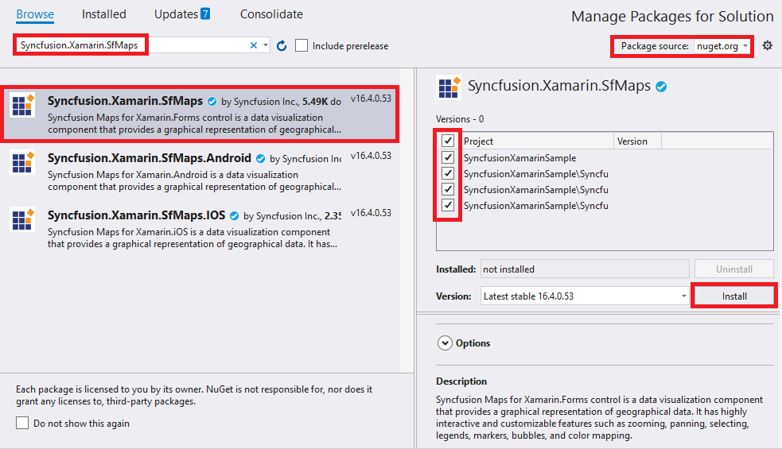
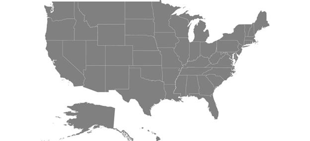

# Getting Started with Xamarin Maps (SfMaps)

This section explains the steps required to configure the maps control and customize its elements.

## Assembly deployment

After installing [Essential Studio for Xamarin](https://www.syncfusion.com/downloads/xamarin), you can find all the required assemblies in the installation folders, {Syncfusion Essential Studio Installed location} \Essential Studio\\{Version #}\Xamarin\lib.

E.g.: C:\Program Files (x86) \Syncfusion\Essential Studio\19.1.0.54\Xamarin\lib

N> Assemblies can be found in unzipped package location(Documents/Syncfusion/{Version #}/Xamarin/lib) in Mac.

## Adding SfMaps reference

You can add SfMaps reference using one of the following methods:

**Method 1: Adding SfMaps reference from nuget.org**

Syncfusion Xamarin components are available in [nuget.org](https://www.nuget.org/). To add SfMaps to your project, open the NuGet package manager in Visual Studio, search for [Syncfusion.Xamarin.SfMaps](https://www.nuget.org/packages/Syncfusion.Xamarin.SfMaps), and then install it.

N> Install the same version of SfMaps NuGet in all the projects.

**Method 2: Adding SfMaps reference from toolbox**

Syncfusion also provides Xamarin Toolbox. Using this toolbox, you can drag the SfMaps control to the XAML page. It will automatically install the required NuGet packages and add the namespace to the page. To install Syncfusion Xamarin Toolbox, refer to [Toolbox](https://help.syncfusion.com/xamarin/utility#toolbox).

**Method 3: Adding SfMaps assemblies manually from the installed location**

If you prefer to manually reference the assemblies instead referencing from NuGet, add the following assemblies in respective projects.

Location: {Installed location}/{version}/Xamarin/lib

<table>
<tr>
<td>PCL</td>
<td>Syncfusion.SfMaps.XForms.dll Syncfusion.Core.XForms.dll Syncfusion.Licensing.dll </td>
</tr>
<tr>
<td>Android</td>
<td>Syncfusion.SfMaps.Android.dll Syncfusion.SfMaps.XForms.Android.dll Syncfusion.SfMaps.XForms.dll Syncfusion.Core.XForms.dll Syncfusion.Core.XForms.Android.dll Syncfusion.Licensing.dll </td>
</tr>
<tr>
<td>iOS</td>
<td>Syncfusion.SfMaps.iOS.dll Syncfusion.SfMaps.XForms.iOS.dll Syncfusion.SfMaps.XForms.dll Syncfusion.Core.XForms.dll Syncfusion.Core.XForms.iOS.dll Syncfusion.Licensing.dll </td>
</tr>
<tr>
<td>UWP</td>
<td>Syncfusion.SfMaps.UWP.dll Syncfusion.SfMaps.XForms.UWP.dll Syncfusion.SfMaps.XForms.dll Syncfusion.Core.XForms.dll Syncfusion.Core.XForms.UWP.dll Syncfusion.Licensing.dll </td>
</tr>
</table>

N> To know more about obtaining our components, refer to these links for [Mac](https://help.syncfusion.com/xamarin/introduction/download-and-installation/mac/) and [Windows](https://help.syncfusion.com/xamarin/introduction/download-and-installation/windows/).

I> Starting with v16.2.0.x, if you reference Syncfusion assemblies from the trial setup or from the NuGet feed, you also have to include a license key in your projects. Please refer to [Syncfusion license key](https://help.syncfusion.com/common/essential-studio/licensing/license-key/) to know about registering Syncfusion license key in your Xamarin application to use our components.

## Launching an application on each platform with SfMaps.

To use the SfMaps control inside an application, each platform requires some additional configurations. The configurations vary from platform to platform and is discussed in the following sections:

N> If you are adding the references from toolbox, this step is not needed.

### iOS

To launch the SfMaps in iOS, call the `SfMapsRenderer.Init()` in the `FinishedLaunching` overridden method of the AppDelegate class after the Xamarin.Forms Framework has been initialized and before the LoadApplication is called, as demonstrated in the following code example.


public override bool FinishedLaunching(UIApplication app, NSDictionary options)
{
    …
    global::Xamarin.Forms.Forms.Init ();
    Syncfusion.SfMaps.XForms.iOS.SfMapsRenderer.Init();
    LoadApplication (new App ());
    …
}
 

### Universal Windows Platform (UWP)

You need to initialize the maps view assemblies in App.xaml.cs in UWP project as demonstrated in the following code samples. This is required to deploy the application with maps in Release mode in UWP platform.


// In App.xaml.cs

protected override void OnLaunched(LaunchActivatedEventArgs e)
    {
        …
    	    rootFrame.NavigationFailed += OnNavigationFailed;
    
        // Add `using System.Reflection;`
        List<Assembly> assembliesToInclude = new List<Assembly>();
    
        // Now, add all the assemblies your app uses                 
        assembliesToInclude.Add(typeof(Syncfusion.SfMaps.XForms.UWP.SfMapsRenderer).GetTypeInfo().Assembly);
		
        // Replaces Xamarin.Forms.Forms.Init(e);        
        Xamarin.Forms.Forms.Init(e, assembliesToInclude);	
        …     
    }



### Android

The Android platform does not require any additional configuration to render the maps.

## Adding namespace

Add the following namespace.





xmlns:maps="clr-namespace:Syncfusion.SfMaps.XForms;assembly=Syncfusion.SfMaps.XForms"





using Syncfusion.SfMaps.XForms;





## Initializing maps

Create an instance for the maps control, and add it as content.





<maps:SfMaps >
  
</maps:SfMaps>





SfMaps map = new SfMaps();
	
this.Content = map;





## Adding layers

The maps control is maintained through [`layers`](https://help.syncfusion.com/cr/xamarin/Syncfusion.SfMaps.XForms.SfMaps.html#Syncfusion_SfMaps_XForms_SfMaps_Layers). It can accommodate one or more shape file layers.





<maps:SfMaps>

<maps:SfMaps.Layers>

<maps:ShapeFileLayer/>

</maps:SfMaps.Layers>  

</maps:SfMaps>  





SfMaps map = new SfMaps();

ShapeFileLayer layer = new ShapeFileLayer();

map.Layers.Add(layer);
	
this.Content = map;





## Adding shape files

A shape file is a set of files that is stored in a non-topological geometry with the attribute information for the spatial features and records in a data set.

The maps control supports reading and loading the shape files. A shape file can be a set of files or a single file. Generally, a shape file contains the following files:

* Main file (.shp)
* dBase file (.dbf)

### Android

* Add necessary shape files to the Assets folder of ProjectFileName.Droid.
* Right-click the added shape file, and navigate to properties.
* Choose the `AndroidAsset` option under BuildAction of respective shape file.

### iOS

* Add necessary shape files to the Resources folder of ProjectFileName.iOS.
* Right-click the added shape file, and navigate to properties.
* Choose the `BundleResource` option under BuildAction of respective shape file.

### UWP

* Add necessary shapes files in a folder, and name it as `ShapeFiles`. Add this `ShapeFiles` folder into the `Assets` folder of ProjectFileName.UWP.
* Right-click the added shape file, and navigate to properties.
* Choose the `EmbeddedResource` option under BuildAction of respective shape file.

The [`Uri`](https://help.syncfusion.com/cr/xamarin/Syncfusion.SfMaps.XForms.ShapeFileLayer.html#Syncfusion_SfMaps_XForms_ShapeFileLayer_Uri) property in shape file layer is used to retrieve the location of the shape file that is added.





    <maps:SfMaps x:Name="sfmap"  BackgroundColor="White" >
                <maps:SfMaps.Layers >
                    <maps:ShapeFileLayer Uri="usa_state.shp"  >                        
                    </maps:ShapeFileLayer>
                </maps:SfMaps.Layers>
    </maps:SfMaps>     




	
SfMaps map = new SfMaps();
map.BackgroundColor = Color.White;
ShapeFileLayer layer = new ShapeFileLayer();
layer.Uri = "usa_state.shp";
map.Layers.Add(layer);
this.Content = map;


 


The following screenshot illustrates the result of adding shape files.

## GeoJSON support

The maps control supports reading and loading the GeoJSON files. The GeoJSON file contains attribute information for the spatial features and coordinates in a dataset.
 



        
 <maps:ShapeFileLayer Uri="usa_state.json">                        
 </maps:ShapeFileLayer>
					



     
 ShapeFileLayer layer = new ShapeFileLayer();
 layer.Uri = "usa_state.json";
			




## Data binding

Data can be bound to the shape file layer using the [`ItemsSource`](https://help.syncfusion.com/cr/xamarin/Syncfusion.SfMaps.XForms.ShapeFileLayer.html#Syncfusion_SfMaps_XForms_ShapeFileLayer_ItemsSource), [`ShapeIDPath`](https://help.syncfusion.com/cr/xamarin/Syncfusion.SfMaps.XForms.ShapeFileLayer.html#Syncfusion_SfMaps_XForms_ShapeFileLayer_ShapeIDPath), and [`ShapeIdTableField`](https://help.syncfusion.com/cr/xamarin/Syncfusion.SfMaps.XForms.ShapeFileLayer.html#Syncfusion_SfMaps_XForms_ShapeFileLayer_ShapeIDTableField) properties.

The [`Populate data`](https://help.syncfusion.com/xamarin/SfMaps/PopulateData) section gives the detailed explanation of data binding.





<maps:SfMaps.Layers >
<maps:ShapeFileLayer Uri="usa_state.shp" ItemsSource="{Binding Data}"
                                          ShapeIDPath="State" ShapeIDTableField="STATE_NAME" >
</maps:ShapeFileLayer>
                </maps:SfMaps.Layers>        




	
ShapeFileLayer layer = new ShapeFileLayer();
            layer.Uri = "usa_state.shp";
            layer.ItemsSource =viewModel.Data;
            layer.ShapeIDTableField = "STATE_NAME";
            layer.ShapeIDPath = "State";			
            map.Layers.Add(layer);





## Adding markers

Markers are used to identify the shapes. They can be added to the shape file layers as demonstrated in the following code sample. Markers can be customized using the [`MarkerSettings`](https://help.syncfusion.com/cr/xamarin/Syncfusion.SfMaps.XForms.MapLayer.html#Syncfusion_SfMaps_XForms_MapLayer_MarkerSettings) property in the shape file layer.

The detailed explanation of marker and its customization are provided under [`Markers`](https://help.syncfusion.com/xamarin/SfMaps/Markers) section.





 <maps:ShapeFileLayer.Markers>
              <maps:MapMarker Label = "California" Latitude = "37" Longitude = "-120">                
              </maps:MapMarker>
 </maps:ShapeFileLayer.Markers>           




	
MapMarker marker = new MapMarker();
marker.Label = "California";
marker.Latitude = "37";
marker.Longitude = "-120";
layer.Markers.Add(marker);   





## Color mapping

The color mapping support allows you customize the shape colors based on the underlying value of shape received from the bound data. Both the range color mapping and equal color mapping are supported in maps.

The detailed explanation of color mapping is provided in [`colorMapping`](https://help.syncfusion.com/xamarin/SfMaps/ColorMapping) section.





<maps:ShapeSetting.ColorMappings>
<maps:EqualColorMapping Color="#D84444" LegendLabel="Romney" Value = "Romney"></maps:EqualColorMapping>
<maps:EqualColorMapping Color="#316DB5" LegendLabel="Obama" Value="Obama"></maps:EqualColorMapping>
</maps:ShapeSetting.ColorMappings>         




	
 EqualColorMapping colorMapping = new EqualColorMapping();
            colorMapping.Color = Color.FromHex("#D84444");
            colorMapping.LegendLabel = "Romney";
            colorMapping.Value = "Romney";

            EqualColorMapping colorMapping1 = new EqualColorMapping();
            colorMapping1.Color = Color.FromHex("#316DB5");
            colorMapping1.LegendLabel = "Obama";
            colorMapping1.Value = "Obama";

            ShapeSetting shapeSetting = new ShapeSetting();           
            shapeSetting.ColorMappings.Add(colorMapping);
            shapeSetting.ColorMappings.Add(colorMapping1);




 
## Adding legends

Legends interpret what the map displays. They can be added to the shape file layer as demonstrated in the following code sample. Legends will be displayed based on the data bound to the layer, and color mapping plays a major role in enabling legends. 

The detailed explanation of legend is provided under [`Legend`](https://help.syncfusion.com/xamarin/SfMaps/Legend) section.





<maps:ShapeFileLayer.LegendSettings>
   <maps:MapLegendSetting ShowLegend="true" LegendPosition="75,90"/>
</maps:ShapeFileLayer.LegendSettings>




	
MapLegendSetting setting = new MapLegendSetting();
setting.ShowLegend = true;
setting.LegendPosition = new Point(75, 90);
layer.LegendSettings = setting;  





The following code sample gives you the complete code for map with markers and legends.





<maps:SfMaps x:Name="sfmap"  BackgroundColor="White"  >
                <maps:SfMaps.Layers >
                    <maps:ShapeFileLayer Uri="usa_state.shp" ShapeIDPath="State" 
                                         ShapeIDTableField="STATE_NAME" 
                                       ItemsSource="{Binding Data}"
                                         >
                        <maps:ShapeFileLayer.Markers>
                            <maps:MapMarker Label = "California" Latitude = "37" Longitude = "-120">
                            </maps:MapMarker>
                        </maps:ShapeFileLayer.Markers>
                        
                        <maps:ShapeFileLayer.MarkerSettings>
                            
                            <maps:MapMarkerSetting IconColor="LimeGreen" IconSize="25" 
                                                   LabelColor="White" LabelSize="20">
                            </maps:MapMarkerSetting>

                        </maps:ShapeFileLayer.MarkerSettings>

                        <maps:ShapeFileLayer.ShapeSettings>
                            <maps:ShapeSetting ShapeColorValuePath="Candidate" ShapeValuePath="Candidate"   >
                                <maps:ShapeSetting.ColorMappings>

                                    <maps:EqualColorMapping Color="#D84444" LegendLabel="Romney" Value = "Romney"></maps:EqualColorMapping>
                                    <maps:EqualColorMapping Color="#316DB5" LegendLabel="Obama" Value="Obama"></maps:EqualColorMapping>
                                </maps:ShapeSetting.ColorMappings>
                            </maps:ShapeSetting>
                        </maps:ShapeFileLayer.ShapeSettings>

                        <maps:ShapeFileLayer.LegendSettings>
                            <maps:MapLegendSetting ShowLegend="True"  
                                                   LegendPosition="30,70">
                                <maps:MapLegendSetting.IconSize>
                                    <Size Width="20" Height="20"></Size>
                                </maps:MapLegendSetting.IconSize>
                            </maps:MapLegendSetting>
                        </maps:ShapeFileLayer.LegendSettings>
                        
                    </maps:ShapeFileLayer>
                </maps:SfMaps.Layers>
            </maps:SfMaps>





SfMaps map = new SfMaps();

            map.BackgroundColor = Color.White;
            ShapeFileLayer layer = new ShapeFileLayer();
            layer.Uri = "usa_state.shp";
            layer.ItemsSource = viewModel.Data;
            layer.ShapeIDTableField = "STATE_NAME";
            layer.ShapeIDPath = "State";
            map.Layers.Add(layer);

            MapLegendSetting legendSetting = new MapLegendSetting();
            legendSetting.ShowLegend = true;
            legendSetting.LegendPosition = new Point(30, 70);
            legendSetting.IconSize = new Size(20, 20);
            layer.LegendSettings = legendSetting;

            MapMarker marker = new MapMarker();
            marker.Label = "California";
            marker.Latitude = "37";
            marker.Longitude = "-120";
            layer.Markers.Add(marker);

            MapMarkerSetting markerSetting = new MapMarkerSetting();
            markerSetting.IconColor = Color. LimeGreen;
            markerSetting.IconSize = 25;
            markerSetting.LabelColor = Color.White;
            markerSetting.LabelSize = 20;
            layer.MarkerSettings = markerSetting;

            EqualColorMapping colorMapping = new EqualColorMapping();
            colorMapping.Color = Color.FromHex("#D84444");
            colorMapping.LegendLabel = "Romney";
            colorMapping.Value = "Romney";

            EqualColorMapping colorMapping1 = new EqualColorMapping();
            colorMapping1.Color = Color.FromHex("#316DB5");
            colorMapping1.LegendLabel = "Obama";
            colorMapping1.Value = "Obama";

            ShapeSetting shapeSetting = new ShapeSetting();
            shapeSetting.ShapeValuePath = "Candidate";
            shapeSetting.ShapeColorValuePath = "Candidate";
            shapeSetting.ColorMappings.Add(colorMapping);
            shapeSetting.ColorMappings.Add(colorMapping1);
            layer.ShapeSettings = shapeSetting;

            this.Content = map;





The following screenshot illustrates the result of the above code sample.

 

You can download the complete [Getting started](https://github.com/SyncfusionExamples/Getting-Started-Xamarin-Maps) sample.

## See also

[How to make SfMaps to work in UWP in release mode when .NET Native tool chain is enabled](https://www.syncfusion.com/kb/8604/how-to-make-syncfusion-xamarin-forms-sfmaps-to-work-in-uwp-in-release-mode-when-net-native)

[How to resolve SfMaps not rendering issue in iOS and UWP](https://www.syncfusion.com/kb/8603/how-to-resolve-sfmaps-not-rendering-issue-in-ios-and-uwp)
