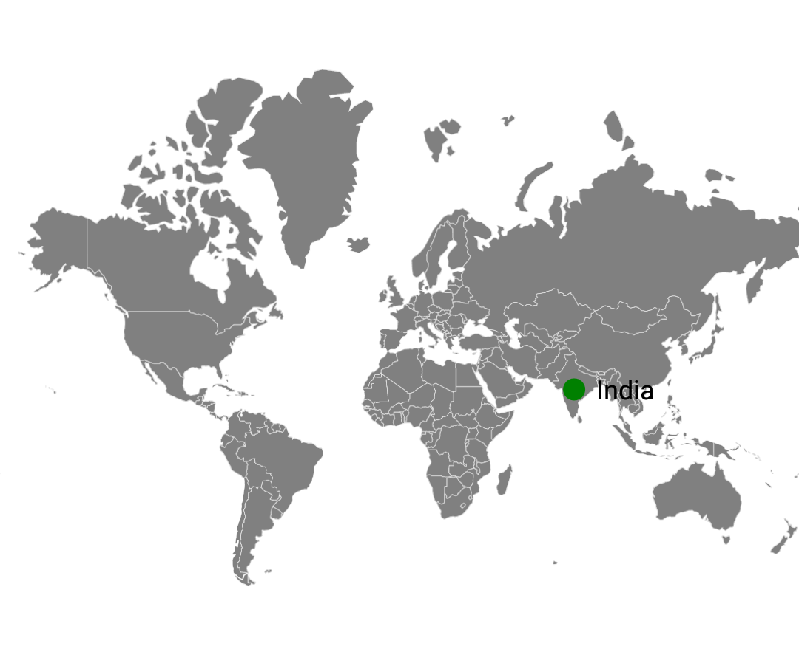

## Transform latitude and longitude value to pixel value and vice-versa

SfMaps offers two utility methods to transform the pixel values to longitude and latitude values and vice-versa. This method is used for both ShapeFileLayer and ImageryLayer.

* `GeopointToViewPoint(double latitude, double longitude)` - Converts the latitude and longitude values to screen point. Here, pass the parameters as latitude and longitude values, from that values we can get screen points x and y.
* `GetLatLonFromPoint(Point point)` - Converts the screen point to longitude and latitude values. Here, pass the parameters as screen points x and y, from that points we can get longitude(Point.X) and latitude(Point.Y) values.



    <maps:SfMaps x:Name="sfmap"  >
                <maps:SfMaps.Layers>
                    <maps:ShapeFileLayer x:Name="layer" Uri="world-map.shp">
                        <maps:ShapeFileLayer.Markers>
                            <maps:MapMarker x:Name="marker" 
                            ....
                            />
                        </maps:ShapeFileLayer.Markers>
                    </maps:ShapeFileLayer>
                </maps:SfMaps.Layers>
            </maps:SfMaps>





Point pixelPoint = layer.GeopointToViewPoint(21.00, 78.00);
Point longitudeLatitude = layer.GetLatLonFromPoint(pixelPoint);
marker.Latitude = longitudeLatitude.Y.ToString();
marker.Longitude = longitudeLatitude.X.ToString();



## ReadAsStream 

You can convert shape file into stream and load to maps using the [`ReadAsStream`](https://help.syncfusion.com/cr/xamarin/Syncfusion.SfMaps.XForms~Syncfusion.SfMaps.XForms.ShapeFileLayer~ReadAsStream.html) method instead of referring the shape files directly to maps using the Uri property.

### Load shape file as stream

A shape file is non-topological format for storing the geometric location, attribute information of geographic features like points, lines, and polygons. 

The following code snippet demonstrates the stream conversion of a shape file. The shape file added in the project is converted into stream.




        
        <maps:SfMaps>
            <maps:SfMaps.Layers>
                <maps:ShapeFileLayer x:Name="ShapeLayer"/>
            </maps:SfMaps.Layers>
        </maps:SfMaps>
					




// The following code snippet demonstrates the stream conversion of a shape file. The shape file added in the project is converted into stream.

shstream = typeof(MainPage).Assembly.GetManifestResourceStream("Maps.ShapeFiles.usa_state.shp");

// The following code snippet demonstrates how to load the converted stream into shape file layer.
ShapeLayer.ReadAsStream(shstream);
			




### Load shape file and dbf file as stream

In db file, the additional attributes are stored that can be joined to a shape files features like color mapping, Data Labels etc. 




        
        <maps:SfMaps>
            <maps:SfMaps.Layers>
                <maps:ShapeFileLayer x:Name="ShapeLayer"
                                 ShapeIDPath="State" ShowMapItems="True"
                                 ShapeIDTableField="STATE_NAME"
                                 ItemsSource="{Binding Data}">
                    <maps:ShapeFileLayer.ShapeSettings>
                        <maps:ShapeSetting ShapeValuePath="State"/>
                    </maps:ShapeFileLayer.ShapeSettings>
                </maps:ShapeFileLayer>
            </maps:SfMaps.Layers>
        </maps:SfMaps>
					




// The following code snippet demonstrates the stream conversion of a shape and db file. The shape and db file added in the project is converted into stream.

shstream = typeof(MainPage).Assembly.GetManifestResourceStream("Maps.ShapeFiles.usa_state.shp");
dbstream = typeof(MainPage).Assembly.GetManifestResourceStream("Maps.ShapeFiles.usa_state.dbf");

// The following code snippet demonstrates how to load the converted stream into shape file layer.
ShapeLayer.ReadAsStream(shstream, dbstream);
			



