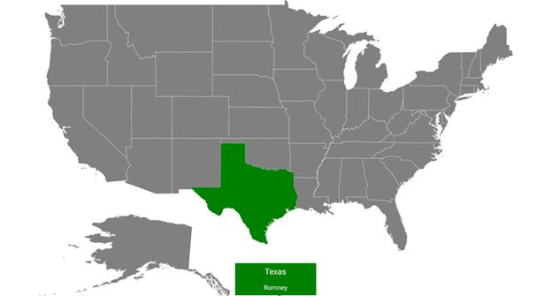

# Layers in Maps (SfMaps)

The maps control is maintained through [`Layers`](https://help.syncfusion.com/cr/cref_files/xamarin/Syncfusion.SfMaps.XForms~Syncfusion.SfMaps.XForms.SfMaps~LayersProperty.html); a map can accommodate one or more layers.

The maps control consists the following two layers:

* Imagery layer

* Shape file layer

## Imagery layer

The [`MapsProvider`](https://help.syncfusion.com/xamarin/sfmaps/mapsprovider) section explains about the imagery layer.

## Shape file layer

Using shape file layer, custom shape files can be rendered and the shapes can be customized.

### Shape settings

This section defines how to customize the shapes in a map.

You can customize a shape's fill, stroke, and stroke thickness using the [`ShapeFill`](https://help.syncfusion.com/cr/cref_files/xamarin/Syncfusion.SfMaps.XForms~Syncfusion.SfMaps.XForms.ShapeSetting~ShapeFill.html#), [`ShapeStroke`](https://help.syncfusion.com/cr/cref_files/xamarin/Syncfusion.SfMaps.XForms~Syncfusion.SfMaps.XForms.ShapeSetting~ShapeStroke.html#),[`ShapeStrokeThickness`](https://help.syncfusion.com/cr/cref_files/xamarin/Syncfusion.SfMaps.XForms~Syncfusion.SfMaps.XForms.ShapeSetting~ShapeStrokeThickness.html#) properties.

Refer to the following code sample for customizing shapes.





       <maps:SfMaps>

        <maps:SfMaps.Layers >

        <maps:ShapeFileLayer Uri="usa_state.shp" >

        <maps:ShapeFileLayer.ShapeSettings>

        <maps:ShapeSetting  ShapeFill="LightBlue" ShapeStroke="Black" ShapeStrokeThickness="2" >

        </maps:ShapeSetting>

        </maps:ShapeFileLayer.ShapeSettings>

         </maps:ShapeFileLayer>

        </maps:SfMaps.Layers>

        </maps:SfMaps>





        SfMaps maps = new SfMaps();

        ShapeFileLayer layer = new ShapeFileLayer();

        layer.Uri = "usa_state.shp";

        layer.ItemsSource = GetDataSource();

        layer.ShapeIDTableField = "STATE_NAME";

        layer.ShapeIDPath = "State";           
    
        ShapeSetting shapeSetting = new ShapeSetting();            

        shapeSetting.ShapeFill = Color.LightBlue;

        shapeSetting.ShapeStroke = Color.Black;

        shapeSetting.ShapeStrokeThickness = 2;

        layer.ShapeSettings = shapeSetting;

        maps.Layers.Add(layer);





To customize the shapes based on the bound values, use the following properties:

[`ShapeValuePath`](https://help.syncfusion.com/cr/cref_files/xamarin/Syncfusion.SfMaps.XForms~Syncfusion.SfMaps.XForms.ShapeSetting~ShapeValuePath.html#): Field value that has to be bound for each shape.

[`ShapeColorValuePath`](https://help.syncfusion.com/cr/cref_files/xamarin/Syncfusion.SfMaps.XForms~Syncfusion.SfMaps.XForms.ShapeSetting~ShapeColorValuePath.html#): Field value that has to be bound to determine the color.





       <maps:SfMaps>

        <maps:SfMaps.Layers >

        <maps:ShapeFileLayer Uri="usa_state.shp" 

        ShapeIDPath="State" ShapeIDTableField="STATE_NAME" >

        <maps:ShapeFileLayer.ShapeSettings>

        <maps:ShapeSetting ShapeColorValuePath="Candidate" ShapeValuePath="Candidate">

        <maps:ShapeSetting.ColorMappings>

        <maps:EqualColorMapping Color="#D84444" Value="Romney" LegendLabel="Romney"></maps:EqualColorMapping>

        <maps:EqualColorMapping Color="#316DB5" Value="Obama" LegendLabel="Obama"></maps:EqualColorMapping>

        </maps:ShapeSetting.ColorMappings>

        </maps:ShapeSetting>

        </maps:ShapeFileLayer.ShapeSettings>

        </maps:ShapeFileLayer>

        </maps:SfMaps.Layers>

        </maps:SfMaps>





ShapeFileLayer layer = new ShapeFileLayer();

layer.Uri = "usa_state.shp";

layer.ItemsSource = GetDataSource();

layer.ShapeIDTableField = "STATE_NAME";

layer.ShapeIDPath = "State";           

map.Layers.Add(layer);

EqualColorMapping colorMapping = new EqualColorMapping();

colorMapping.Color = Color.FromHex("#D84444");

colorMapping.LegendLabel = "Romney";

colorMapping.Value = "Romney";

EqualColorMapping colorMapping1 = new EqualColorMapping();

colorMapping1.Color = Color.FromHex("#316DB5");

colorMapping1.LegendLabel = "Obama";

colorMapping1.Value = "Obama";

ShapeSetting shapeSetting = new ShapeSetting();

shapeSetting.ShapeValuePath = "Candidate";

shapeSetting.ShapeColorValuePath = "Candidate";

shapeSetting.ColorMappings.Add(colorMapping);

shapeSetting.ColorMappings.Add(colorMapping1);

layer.ShapeSettings = shapeSetting;





### Customize selected shapes

To customize the selected shapes alone, use the following properties:

[`SelectedShapeColor`](https://help.syncfusion.com/cr/cref_files/xamarin/Syncfusion.SfMaps.XForms~Syncfusion.SfMaps.XForms.ShapeSetting~SelectedShapeColor.html#): Sets the color for selected shapes in a map.

[`SelectedShapeStroke`](https://help.syncfusion.com/cr/cref_files/xamarin/Syncfusion.SfMaps.XForms~Syncfusion.SfMaps.XForms.ShapeSetting~SelectedShapeStroke.html#): Sets the border color for selected shapes in a map.

[`SelectedShapeStrokeThickness`](https://help.syncfusion.com/cr/cref_files/xamarin/Syncfusion.SfMaps.XForms~Syncfusion.SfMaps.XForms.ShapeSetting~SelectedShapeStrokeThickness.html#): Sets the border thickness for selected shapes in a map.





<maps:ShapeFileLayer.ShapeSettings>

<maps:ShapeSetting  ShapeFill="LightBlue" ShapeStroke="Black" ShapeStrokeThickness="1" >

</maps:ShapeSetting>

</maps:ShapeFileLayer.ShapeSettings>





ShapeSetting shapeSetting = new ShapeSetting();

shapeSetting.SelectedShapeColor = Color. Green;

shapeSetting.SelectedShapeStroke = Color.Black;

shapeSetting.SelectedShapeStrokeThickness = 1;

layer.ShapeSettings = shapeSetting;





### Events

The [`ShapeSelected`](https://help.syncfusion.com/cr/cref_files/xamarin/Syncfusion.SfMaps.XForms~Syncfusion.SfMaps.XForms.ShapeFileLayer~ShapeSelected_EV.html) event will be triggered when a map shape is selected. A corresponding model data is passed as an argument. The ShapeSelected event has been deprecated.

The [`ShapeSelectionChanged`](https://help.syncfusion.com/cr/cref_files/xamarin/Syncfusion.SfMaps.XForms~Syncfusion.SfMaps.XForms.ShapeFileLayer~ShapeSelectionChanged_EV.html) event will be triggered when changing the the map shapes selection with corresponding argument as model [`Data`](https://help.syncfusion.com/cr/cref_files/xamarin/Syncfusion.SfMaps.XForms~Syncfusion.SfMaps.XForms.ShapeSelectedEventArgs~Data.html).Selection state of the shape will be changed using the  [`IsSelected`](https://help.syncfusion.com/cr/cref_files/xamarin/Syncfusion.SfMaps.XForms~Syncfusion.SfMaps.XForms.ShapeSelectedEventArgs~IsSelected.html) property





<maps:ShapeFileLayer ShapeSelectionChanged ="ShapeLayer_ShapeSelectionChanged" />





        private void ShapeLayer_ShapeSelectionChanged(object sender, ShapeSelectedEventArgs e)
        {
            AgricultureData data = e.Data as AgricultureData;
            bool IsSelected = e.IsSelected;
        }




## Sublayer

The shape layers are the core layers of the maps. Multiple layers can be added to the shape layers as sublayers within the shape layers.

### Adding multiple layers in the map

Multiple layers can be added to the maps using [`Sublayer`](https://help.syncfusion.com/xamarin/sfmaps/sublayer).

## Displaying layer in the view

The [`BaseMapIndex`](https://help.syncfusion.com/cr/cref_files/xamarin/Syncfusion.SfMaps.XForms~Syncfusion.SfMaps.XForms.SfMaps~BaseMapIndexProperty.html) property allows drill-down from main layer to another layer.

In the ShapeSelected event, the *BaseMapIndex* property has been used to change the layer when Asia shape is selected.




      
      <Grid>
        <Grid.BindingContext>
            <local:DrilldownViewModel/>
        </Grid.BindingContext>
        <maps:SfMaps x:Name="map">
            <maps:SfMaps.Layers>
                <maps:ShapeFileLayer EnableSelection="True" x:Name="layer1" Uri="world-map.shp" ItemsSource="{Binding DataSource}" ShapeIDPath="Country" ShapeIDTableField="admin" ShapeSelectionChanged="ShapeFileLayer_ShapeSelected">
                    <maps:ShapeFileLayer.ShapeSettings>
                        <maps:ShapeSetting  ShapeColorValuePath="Continent">
                            <maps:ShapeSetting.ColorMappings>
                                <maps:EqualColorMapping Color="#C13664" Value="North America" ></maps:EqualColorMapping>
                                <maps:EqualColorMapping Color="#9C3367" Value="South America"></maps:EqualColorMapping>
                                <maps:EqualColorMapping Color="#80306A" Value="Africa"></maps:EqualColorMapping>
                                <maps:EqualColorMapping Color="#622D6C" Value="Europe"></maps:EqualColorMapping>
                                <maps:EqualColorMapping Color="#462A6D" Value="Asia"></maps:EqualColorMapping>
                                <maps:EqualColorMapping Color="#2A2870" Value="Australia"></maps:EqualColorMapping>
                            </maps:ShapeSetting.ColorMappings>
                        </maps:ShapeSetting>
                    </maps:ShapeFileLayer.ShapeSettings>
                </maps:ShapeFileLayer>
                <maps:ShapeFileLayer x:Name="layer2" Uri="asia.shp">
                    <maps:ShapeFileLayer.ShapeSettings>
                        <maps:ShapeSetting ShapeFill="#462A6D"/>
                    </maps:ShapeFileLayer.ShapeSettings>
                </maps:ShapeFileLayer>
            </maps:SfMaps.Layers>
        </maps:SfMaps>
        <Label x:Name="label" Grid.Row="1" HorizontalOptions="Center" VerticalOptions="Center" HorizontalTextAlignment="Center" VerticalTextAlignment="Center" Text="Click on a Asia shape to drill down"/>
    </Grid>





        private void ShapeFileLayer_ShapeSelected(object sender, Syncfusion.SfMaps.XForms.ShapeSelectedEventArgs e)
        {
            map.BaseMapIndex = 1;
            label.IsVisible = false;
        }

    public class DrilldownViewModel
    {
        public DrilldownViewModel()
        {
            DataSource = new ObservableCollection<DrilldownModel>();
            DataSource.Add(new DrilldownModel("Afghanistan", "Asia"));
            DataSource.Add(new DrilldownModel("Angola", "Africa"));
            DataSource.Add(new DrilldownModel("Albania", "Europe"));
            DataSource.Add(new DrilldownModel("United Arab Emirates", "Asia"));
            DataSource.Add(new DrilldownModel("Argentina", "South America"));
            DataSource.Add(new DrilldownModel("Armenia", "Asia"));
            DataSource.Add(new DrilldownModel("French Southern and Antarctic Lands", "Seven seas (open ocean)"));
            DataSource.Add(new DrilldownModel("Australia", "Australia"));
            //..
		    //..
            DataSource.Add(new DrilldownModel("Zambia", "Africa"));
            DataSource.Add(new DrilldownModel("Zimbabwe", "Africa"));
        }
        public ObservableCollection<DrilldownModel> DataSource { get; set; }

    }

     public class DrilldownModel
    {
        public DrilldownModel(string country, string con)
        {
            this.Country = country;
            this.Continent = con;
        }
        public string Continent
        {
            get;
            set;
        }
        public string Country
        {
            get;
            set;
        }

    }





   

## See Also

[How to load shape files as stream in maps](https://www.syncfusion.com/kb/10555/how-to-load-shape-files-as-stream-in-maps)

[How to add sub shape file layer for ImageryLayer in Xamarin.Forms SfMaps](https://www.syncfusion.com/kb/10579/how-to-add-sub-shape-file-layer-for-imagerylayer-in-xamarin-forms-sfmaps)

[How to draw a line (route) between two terminals in SfMaps](https://www.syncfusion.com/kb/10619/how-to-draw-a-line-route-between-two-terminals-in-sfmaps)