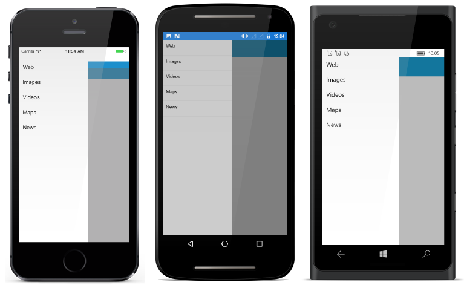
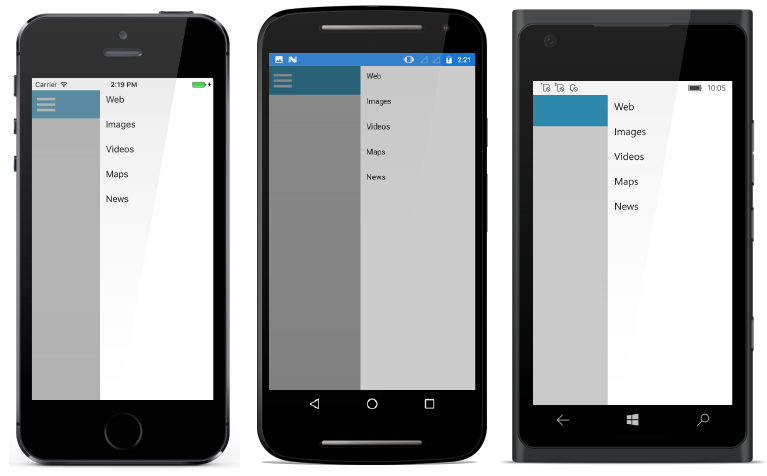
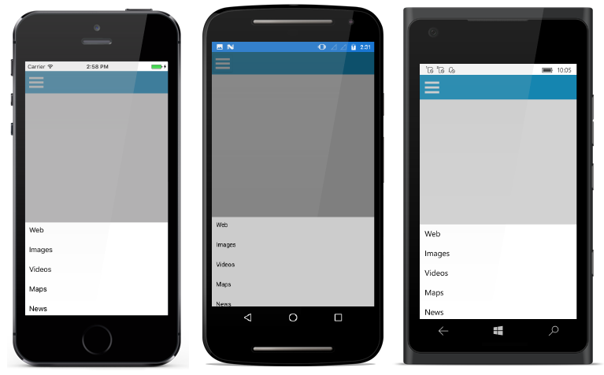

# Configuring The Drawer In Different Sides in Xamarin Navigation Drawer

The supplemental pane can be drawn in and out from all four sides. [`Position`](https://help.syncfusion.com/cr/xamarin/Syncfusion.SfNavigationDrawer.XForms.SfNavigationDrawer.html#Syncfusion_SfNavigationDrawer_XForms_SfNavigationDrawer_Position) property is used to change the side of pane and the values are

*	Left

*	Right

*	Top

*	Bottom

N> The default position is Left.

## Left

The navigation pane draws in and out from Left side. It can be set as shown below:

	



<?xml version="1.0" encoding="utf-8"?>
<ContentPage xmlns="http://xamarin.com/schemas/2014/forms" 
             xmlns:x="http://schemas.microsoft.com/winfx/2009/xaml" 
             xmlns:local="clr-namespace:NaviSample" 
             xmlns:navigationdrawer="clr-namespace:Syncfusion.SfNavigationDrawer.XForms;assembly=Syncfusion.SfNavigationDrawer.XForms"
             x:Class="NaviSample.MainPage">
    <navigationdrawer:SfNavigationDrawer x:Name="navigationDrawer" 
                                         Position="Left" 
                                         DrawerHeaderHeight="0">
        <navigationdrawer:SfNavigationDrawer.ContentView>
            <StackLayout>
                  <Grid BackgroundColor="#1aa1d6" 
                        HeightRequest="50" 
                        VerticalOptions="Start">
                    <Button x:Name="hamburgerButton" 
                            HeightRequest="50" 
                            WidthRequest="50" 
                            HorizontalOptions="Start" 
                            FontSize="20" 
                            BackgroundColor="#1aa1d6" 
                            Clicked="hamburgerButton_Clicked"/>
                </Grid>
            </StackLayout>
        </navigationdrawer:SfNavigationDrawer.ContentView>
        <navigationdrawer:SfNavigationDrawer.DrawerContentView>
            <Grid >
                <ListView x:Name="listView" 
                          ItemSelected="listView_ItemSelected" 
                          SeparatorColor="Transparent">
                    <ListView.ItemTemplate>
                        <DataTemplate>
                            <ViewCell>
                                <StackLayout HeightRequest="40">
                                    <Label Margin="10,7,0,0" 
                                           Text="{Binding}" 
                                           TextColor="Black" 
                                           FontSize="16"/>
                                </StackLayout>
                            </ViewCell>
                        </DataTemplate>
                    </ListView.ItemTemplate>
                </ListView>
            </Grid>
        </navigationdrawer:SfNavigationDrawer.DrawerContentView>
    </navigationdrawer:SfNavigationDrawer>
</ContentPage>


	


using System;
using Syncfusion.SfNavigationDrawer.XForms;
using Xamarin.Forms;

namespace NaviSample
{
    public partial class MainPage : ContentPage
    {
        public MainPage()
        {
            InitializeComponent();
            navigationDrawer.DrawerWidth = 200;
            navigationDrawer.Position = Syncfusion.SfNavigationDrawer.XForms.Position.Left;
            hamburgerButton.Image = (FileImageSource)ImageSource.FromFile("hamburger_icon.png");
            List<string> list = new List<string>();
            list.Add("Web");
            list.Add("Images");
            list.Add("Videos");
            list.Add("Maps");
            list.Add("News");
            listView.ItemsSource = list;
        }

        void hamburgerButton_Clicked(object sender, EventArgs e)
        {
            navigationDrawer.ToggleDrawer();
        }

        private void listView_ItemSelected(object sender, SelectedItemChangedEventArgs e)
        {
            //    Your codes here
            navigationDrawer.ToggleDrawer();
        }
    }
}





## Right

The navigation pane draws in and out from Right side. It can be set as shown below:

	



<?xml version="1.0" encoding="utf-8"?>
<ContentPage xmlns="http://xamarin.com/schemas/2014/forms" 
             xmlns:x="http://schemas.microsoft.com/winfx/2009/xaml" 
             xmlns:local="clr-namespace:NaviSample" 
             xmlns:navigationdrawer="clr-namespace:Syncfusion.SfNavigationDrawer.XForms;assembly=Syncfusion.SfNavigationDrawer.XForms"
             x:Class="NaviSample.MainPage">
<navigationdrawer:SfNavigationDrawer x:Name="navigationDrawer" 
                                     Position="Right" 
                                     DrawerHeaderHeight="0">
        <navigationdrawer:SfNavigationDrawer.ContentView>
            <StackLayout>
                  <Grid BackgroundColor="#1aa1d6" 
                        HeightRequest="50" 
                        VerticalOptions="Start">
                    <Button x:Name="hamburgerButton" 
                            HeightRequest="50" 
                            WidthRequest="50" 
                            HorizontalOptions="Start" 
                            FontSize="20" 
                            BackgroundColor="#1aa1d6" 
                            Clicked="hamburgerButton_Clicked"/>
                </Grid>
            </StackLayout>
        </navigationdrawer:SfNavigationDrawer.ContentView>
        <navigationdrawer:SfNavigationDrawer.DrawerContentView>
            <Grid >
                <ListView x:Name="listView" 
                          ItemSelected="listView_ItemSelected" 
                          SeparatorColor="Transparent" >
                    <ListView.ItemTemplate>
                        <DataTemplate>
                            <ViewCell>
                                <StackLayout HeightRequest="40">
                                    <Label Margin="10,7,0,0" 
                                           Text="{Binding}" 
                                           TextColor="Black" 
                                           FontSize="16"/>
                                </StackLayout>
                            </ViewCell>
                        </DataTemplate>
                    </ListView.ItemTemplate>
                </ListView>
            </Grid>
        </navigationdrawer:SfNavigationDrawer.DrawerContentView>
    </navigationdrawer:SfNavigationDrawer> 
</ContentPage>
	

	


using System;
using Syncfusion.SfNavigationDrawer.XForms;
using Xamarin.Forms;

namespace NaviSample
{
    public partial class MainPage : ContentPage
    {
        public MainPage()
        {
            InitializeComponent();
            navigationDrawer.DrawerWidth = 200;
            navigationDrawer.Position = Syncfusion.SfNavigationDrawer.XForms.Position.Right;
            hamburgerButton.Image = (FileImageSource)ImageSource.FromFile("hamburger_icon.png");
            List<string> list = new List<string>();
            list.Add("Web");
            list.Add("Images");
            list.Add("Videos");
            list.Add("Maps");
            list.Add("News");
            listView.ItemsSource = list;
        }

        void hamburgerButton_Clicked(object sender, EventArgs e)
        {
            navigationDrawer.ToggleDrawer();
        }

        private void listView_ItemSelected(object sender, SelectedItemChangedEventArgs e)
        {
            //Your codes here
            navigationDrawer.ToggleDrawer();
        }
    }
}





	
## Top

The navigation pane draws in and out from Top side. It can be set as shown below:





<?xml version="1.0" encoding="utf-8"?>
<ContentPage xmlns="http://xamarin.com/schemas/2014/forms" 
             xmlns:x="http://schemas.microsoft.com/winfx/2009/xaml" 
             xmlns:local="clr-namespace:NaviSample" 
             xmlns:navigationdrawer="clr-namespace:Syncfusion.SfNavigationDrawer.XForms;assembly=Syncfusion.SfNavigationDrawer.XForms"
             x:Class="NaviSample.MainPage">
<navigationdrawer:SfNavigationDrawer x:Name="navigationDrawer" 
                                     Position="Top" 
                                     DrawerFooterHeight="0" 
                                     DrawerHeaderHeight="0">
        <navigationdrawer:SfNavigationDrawer.ContentView>
            <StackLayout>
                  <Grid BackgroundColor="#1aa1d6" 
                        HeightRequest="50" 
                        VerticalOptions="Start">
                    <Button x:Name="hamburgerButton" 
                            HeightRequest="50" 
                            WidthRequest="50" 
                            HorizontalOptions="Start" 
                            FontSize="20" 
                            BackgroundColor="#1aa1d6" 
                            Clicked="hamburgerButton_Clicked"/>
                </Grid>
            </StackLayout>
        </navigationdrawer:SfNavigationDrawer.ContentView>
        <navigationdrawer:SfNavigationDrawer.DrawerContentView>
            <Grid >
                <ListView x:Name="listView" 
                          ItemSelected="listView_ItemSelected" 
                          SeparatorColor="Transparent" >
                    <ListView.ItemTemplate>
                        <DataTemplate>
                            <ViewCell>
                                <StackLayout HeightRequest="40">
                                    <Label Margin="10,7,0,0" 
                                           Text="{Binding}" 
                                           TextColor="Black" 
                                           FontSize="16"/>
                                </StackLayout>
                            </ViewCell>
                        </DataTemplate>
                    </ListView.ItemTemplate>
                </ListView>
            </Grid>
        </navigationdrawer:SfNavigationDrawer.DrawerContentView>
    </navigationdrawer:SfNavigationDrawer>
</ContentPage>

	
	
	

	
using System;
using Syncfusion.SfNavigationDrawer.XForms;
using Xamarin.Forms;

namespace NaviSample
{
    public partial class MainPage : ContentPage
    {
        public MainPage()
        {
            InitializeComponent();
            navigationDrawer.DrawerWidth = 200;
            navigationDrawer.Position = Syncfusion.SfNavigationDrawer.XForms.Position.Top;
            hamburgerButton.Image = (FileImageSource)ImageSource.FromFile("hamburger_icon.png");
            List<string> list = new List<string>();
            list.Add("Web");
            list.Add("Images");
            list.Add("Videos");
            list.Add("Maps");
            list.Add("News");
            listView.ItemsSource = list;
        }

        void hamburgerButton_Clicked(object sender, EventArgs e)
        {
            navigationDrawer.ToggleDrawer();
        }

        private void listView_ItemSelected(object sender, SelectedItemChangedEventArgs e)
        {
            //    Your codes here
            navigationDrawer.ToggleDrawer();
        }
    }
}





## Bottom

The navigation pane draws in and out from Bottom side. It can be set as shown below:

	



<?xml version="1.0" encoding="utf-8"?>
<ContentPage xmlns="http://xamarin.com/schemas/2014/forms" 
             xmlns:x="http://schemas.microsoft.com/winfx/2009/xaml" 
             xmlns:local="clr-namespace:NaviSample" 
             xmlns:navigationdrawer="clr-namespace:Syncfusion.SfNavigationDrawer.XForms;assembly=Syncfusion.SfNavigationDrawer.XForms"
             x:Class="NaviSample.MainPage">
<navigationdrawer:SfNavigationDrawer x:Name="navigationDrawer" 
                                     Position="Bottom" 
                                     DrawerFooterHeight="0" 
                                     DrawerHeaderHeight="0">
        <navigationdrawer:SfNavigationDrawer.ContentView>
            <StackLayout>
                  <Grid BackgroundColor="#1aa1d6" 
                        HeightRequest="50" 
                        VerticalOptions="Start">
                    <Button x:Name="hamburgerButton" 
                            HeightRequest="50" 
                            WidthRequest="50" 
                            HorizontalOptions="Start" 
                            FontSize="20" 
                            BackgroundColor="#1aa1d6" 
                            Clicked="hamburgerButton_Clicked"/>
                </Grid>
            </StackLayout>
        </navigationdrawer:SfNavigationDrawer.ContentView>
        <navigationdrawer:SfNavigationDrawer.DrawerContentView>
            <Grid >
                <ListView x:Name="listView" 
                          ItemSelected="listView_ItemSelected" 
                          SeparatorColor="Transparent" >
                    <ListView.ItemTemplate>
                        <DataTemplate>
                            <ViewCell>
                                <StackLayout HeightRequest="40">
                                    <Label Margin="10,7,0,0" 
                                           Text="{Binding}" 
                                           TextColor="Black" 
                                           FontSize="16"/>
                                </StackLayout>
                            </ViewCell>
                        </DataTemplate>
                    </ListView.ItemTemplate>
                </ListView>
            </Grid>
        </navigationdrawer:SfNavigationDrawer.DrawerContentView>
    </navigationdrawer:SfNavigationDrawer>
</ContentPage>


	


using System;
using Syncfusion.SfNavigationDrawer.XForms;
using Xamarin.Forms;

namespace NaviSample
{
    public partial class MainPage : ContentPage
    {
        public MainPage()
        {
            InitializeComponent();
            navigationDrawer.DrawerWidth = 200;
            navigationDrawer.Position = Syncfusion.SfNavigationDrawer.XForms.Position.Bottom;
            hamburgerButton.Image = (FileImageSource)ImageSource.FromFile("hamburger_icon.png");
            List<string> list = new List<string>();
            list.Add("Web");
            list.Add("Images");
            list.Add("Videos");
            list.Add("Maps");
            list.Add("News");
            listView.ItemsSource = list;
        }

        void hamburgerButton_Clicked(object sender, EventArgs e)
        {
            navigationDrawer.ToggleDrawer();
        }

        private void listView_ItemSelected(object sender, SelectedItemChangedEventArgs e)
        {
            //    Your codes here
            navigationDrawer.ToggleDrawer();
        }
    }
}





